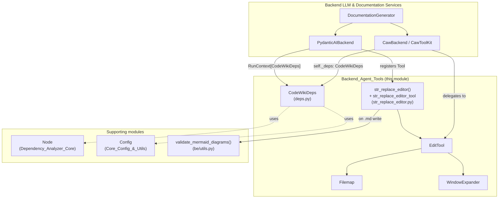
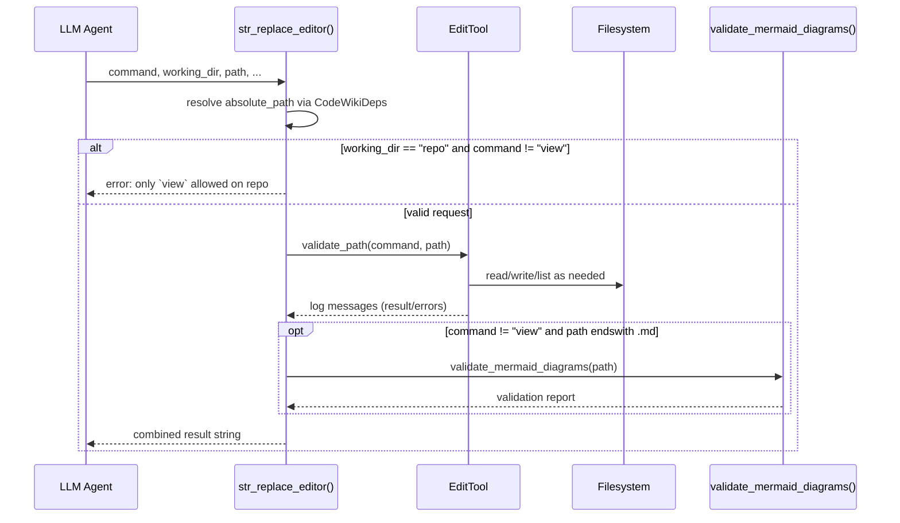
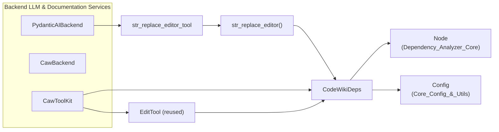

# Backend Agent Tools

## Purpose

The **Backend Agent Tools** module provides the low-level, agent-facing "hands" that CodeWiki's
LLM-driven documentation agents use to actually read code and write documentation files. It is
intentionally small and dependency-light: it does not decide *what* documentation to write (that
is the job of the orchestration layer in
[Backend LLM & Documentation Services](Backend_LLM_&_Documentation_Services.md)), it only exposes
safe, well-defined **tool functions** that an LLM agent can call, plus the **shared dependency
bag** (`CodeWikiDeps`) that carries per-run context (paths, component registry, module tree,
config, etc.) into every tool invocation.

Concretely, this module contains:

- `CodeWikiDeps` — a dataclass bundling all contextual state a tool needs to run safely for a
  given documentation-generation session/module.
- `EditTool` (+ helpers `Filemap`, `WindowExpander`) and the `str_replace_editor` tool function —
  a sandboxed file-viewing/editing tool (modeled after SWE-agent's editor) that lets an agent
  inspect repository source code (read-only) and create/edit documentation markdown files
  (read-write), with automatic Mermaid diagram validation on every markdown write.

This module is consumed by two different agent runtime backends:

- The **pydantic-ai** backend (`PydanticAIBackend` in
  [Backend LLM & Documentation Services](Backend_LLM_&_Documentation_Services.md)), which registers
  `str_replace_editor_tool` (a `pydantic_ai.Tool` wrapper around the `str_replace_editor`
  function) directly.
- The **caw** backend (`CawBackend` / `CawToolKit`, also in
  [Backend LLM & Documentation Services](Backend_LLM_&_Documentation_Services.md)), whose
  `CawToolKit.str_replace_editor` MCP tool re-uses the very same `EditTool` implementation and
  Mermaid validator from this module, adding extra path-confinement checks appropriate for an
  MCP tool-server context.

## Architecture Overview

### Two working directories, one tool

The editor tool always operates against exactly one of two root directories, selected per call via
the `working_dir` parameter:

| `working_dir` | Root path                         | Allowed commands           | Purpose                                   |
|----------------|-----------------------------------|-----------------------------|--------------------------------------------|
| `"repo"`       | `CodeWikiDeps.absolute_repo_path` | `view` only                 | Inspect the target repository's source code |
| `"docs"`       | `CodeWikiDeps.absolute_docs_path` | `view`, `create`, `str_replace`, `insert`, `undo_edit` | Read/write the generated documentation tree |

This split enforces a hard invariant: **agents can never mutate the source repository**, only the
documentation output. Any attempt to run a mutating command against `"repo"` is rejected before
the underlying `EditTool` is even invoked.

## Core Components

### `CodeWikiDeps` (`deps.py`)

A plain dataclass acting as the **dependency-injection context** passed to every tool call. It is
constructed once per module-documentation task and threaded through the agent runtime as
`RunContext[CodeWikiDeps].deps` (pydantic-ai) or `self._deps` (caw's `CawToolKit`).

| Field | Type | Description |
|---|---|---|
| `absolute_docs_path` | `str` | Root directory for generated documentation (the `"docs"` working dir root). |
| `absolute_repo_path` | `str` | Root directory of the analyzed repository (the `"repo"` working dir root). |
| `registry` | `dict` | A mutable, per-session key/value store (e.g. used by `EditTool` to persist `file_history` for `undo_edit`). |
| `components` | `dict[str, Node]` | Map of component id → `Node` (from [Dependency_Analyzer_Core](Dependency_Analyzer_Core.md)), the source-of-truth for `read_code_components`. |
| `path_to_current_module` | `list[str]` | Breadcrumb path in the module tree identifying the module currently being documented (used for recursive sub-module generation). |
| `current_module_name` | `str` | Name of the module currently being documented. |
| `module_tree` | `dict[str, any]` | The in-memory hierarchical module tree being built up as documentation is generated. |
| `max_depth` / `current_depth` | `int` | Guards recursion depth for sub-module documentation generation. |
| `config` | `Config` | LLM/runtime configuration (see [Core_Config_&_Utils](Core_Config_&_Utils.md)). |
| `custom_instructions` | `str \| None` | Optional user-supplied custom instructions injected into agent prompts. |

`CodeWikiDeps` itself contains no logic — it is intentionally inert so that both the pydantic-ai
and caw backends can share the exact same context shape.

### `str_replace_editor` tool function & `EditTool` (`str_replace_editor.py`)

This is the heart of the module: a sandboxed file editor exposing the classic
view/create/str_replace/insert/undo_edit command set (a design borrowed from
[SWE-agent's editor tool](https://github.com/SWE-agent/SWE-agent/blob/main/tools/edit_anthropic/bin/str_replace_editor)).

**Public entry points:**

- `str_replace_editor(ctx, working_dir, command, path, ...)` — the async tool function registered
  with pydantic-ai. Resolves `working_dir` + `path` into an absolute path scoped to either the repo
  or docs root, enforces the repo-is-read-only rule, delegates to `EditTool`, and — for any
  non-`view` write to a `.md` file — runs `validate_mermaid_diagrams` on the result and appends the
  validation report to the tool output so the agent immediately sees Mermaid syntax errors.
- `str_replace_editor_tool` — a `pydantic_ai.Tool` wrapping the function above, registered by
  `PydanticAIBackend`.
- `EditTool` — the actual command implementation, reusable outside of pydantic-ai (this is exactly
  what `CawToolKit.str_replace_editor` does, adding its own path-confinement checks for the MCP
  context — see [Backend LLM & Documentation Services](Backend_LLM_&_Documentation_Services.md)).

**Commands implemented by `EditTool`:**

| Command | Behavior |
|---|---|
| `view` | For directories: lists non-hidden entries up to 2 levels deep. For files: shows `cat -n`-style numbered output, optionally scoped to a `view_range`, with the viewport auto-expanded to whole function/class boundaries via `WindowExpander`. Long files can be summarized with `Filemap` (currently gated by `USE_FILEMAP`). |
| `create` | Creates a new file; fails if the file already exists. |
| `str_replace` | Replaces a unique occurrence of `old_str` with `new_str`; fails loudly if `old_str` is missing or ambiguous (multiple matches). Optionally runs `flake8` before/after the edit and reports newly introduced lint errors (gated by `USE_LINTER`). |
| `insert` | Inserts `new_str` after a given 1-based `insert_line`. |
| `undo_edit` | Pops and restores the previous version of a file from an in-`registry` edit history. |

All results are accumulated as human-readable log strings in `EditTool.logs`, which the tool
function joins and returns to the agent — there are no raised exceptions for expected error
conditions (invalid path, ambiguous replace, etc.), keeping the agent loop resilient to bad tool
calls.

**Helper classes:**

- **`Filemap`** — uses `tree_sitter_languages` to parse Python source and produce an "abbreviated"
  view of a file where long function bodies (≥ 5 lines) are elided with a placeholder line,
  keeping large-file previews compact. Only used when a file exceeds `MAX_RESPONSE_LEN` and
  `USE_FILEMAP` is enabled.
- **`WindowExpander`** — given a requested `[start, stop]` line range, tries to "snap" the viewport
  boundaries to natural breakpoints (blank lines, `def`/`class`/decorator lines for `.py` files, or
  file start/end) so that `view` and edit-confirmation snippets show whole logical blocks instead
  of arbitrarily truncated code. Expansion amount is bounded by module-level constants
  (`MAX_WINDOW_EXPANSION_VIEW`, `MAX_WINDOW_EXPANSION_EDIT_CONFIRM`), both currently set to `0`
  (i.e. expansion is disabled by default but the mechanism remains in place).

**Safety/robustness features baked into the tool:**

- Strict path validation (`validate_path`): must be absolute, must exist unless creating, cannot
  overwrite an existing file with `create`, only `view` is allowed on directories.
- `_coerce_json_string` (via a Pydantic `BeforeValidator`) transparently parses list/int arguments
  that arrive as JSON-encoded strings — a compatibility shim for OpenAI-compatible endpoints
  (LiteLLM, vLLM, Ollama, etc.) that don't always emit strictly-typed tool arguments the way the
  native Anthropic API does.
- Output truncation (`maybe_truncate` / `MAX_RESPONSE_LEN` / `TRUNCATED_MESSAGE`) prevents any
  single tool call from flooding the agent's context window; the truncation message explicitly
  instructs the agent to retry with `grep -n` + `view_range`.
- Robust file I/O: `read_file` tries a sequence of encodings (`None` → `utf-8` → `latin-1` →
  `utf-8` with `errors="replace"`) to gracefully handle non-UTF-8 source files (e.g. Windows/GBK
  paths), and `view`/`flake8` subprocess output decoding also uses `errors="replace"`.
- Automatic **Mermaid diagram validation**: any non-`view` write to a `.md` file triggers
  `validate_mermaid_diagrams` (from `codewiki/src/be/utils.py`), and its report — including
  precise error locations — is appended to the tool result so the documentation agent can
  self-correct malformed diagrams in the same turn.

## Relationship to Other Modules

- **[Dependency_Analyzer_Core](Dependency_Analyzer_Core.md)**: Supplies the `Node` model that
  populates `CodeWikiDeps.components` — the registry that both `read_code_components` (in
  `CawToolKit`) and the editor's repo-view path ultimately reason about.
- **[Core_Config_&_Utils](Core_Config_&_Utils.md)**: Supplies the `Config` object stored in
  `CodeWikiDeps.config`, carrying LLM/model/provider settings and doc-generation options
  (`max_depth`, `agent_instructions`, etc.) that flow into agent prompts alongside these tools.
  `FileManager` in the same module handles broader file-system utilities used elsewhere in the
  pipeline.
- **[Backend LLM & Documentation Services](Backend_LLM_&_Documentation_Services.md)**: The primary
  consumer of this module. `PydanticAIBackend` registers `str_replace_editor_tool` for its agent
  runs; `CawBackend`/`CawToolKit` reuse `EditTool` and the Mermaid validator directly inside an MCP
  tool server, and drive the recursive sub-module documentation flow (`generate_sub_module_documentation`)
  that ultimately writes files through this same editor.
- **[MCP_Session_Management](MCP_Session_Management.md)**: Manages the session/workspace lifecycle
  (`SessionStore`, `SessionWorkspace`) within which `CawToolKit`'s tool calls — including the reused
  `EditTool` — execute over MCP.
