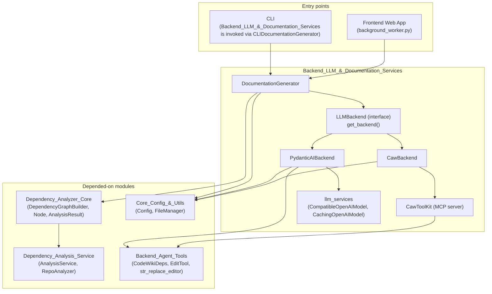
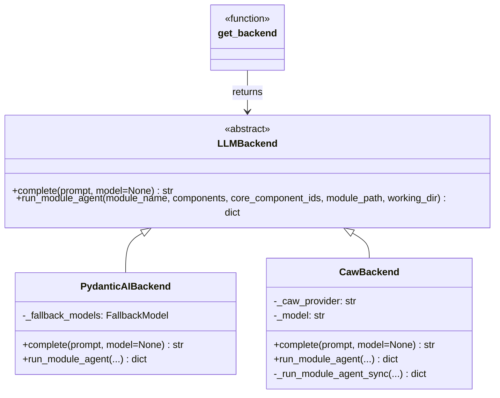
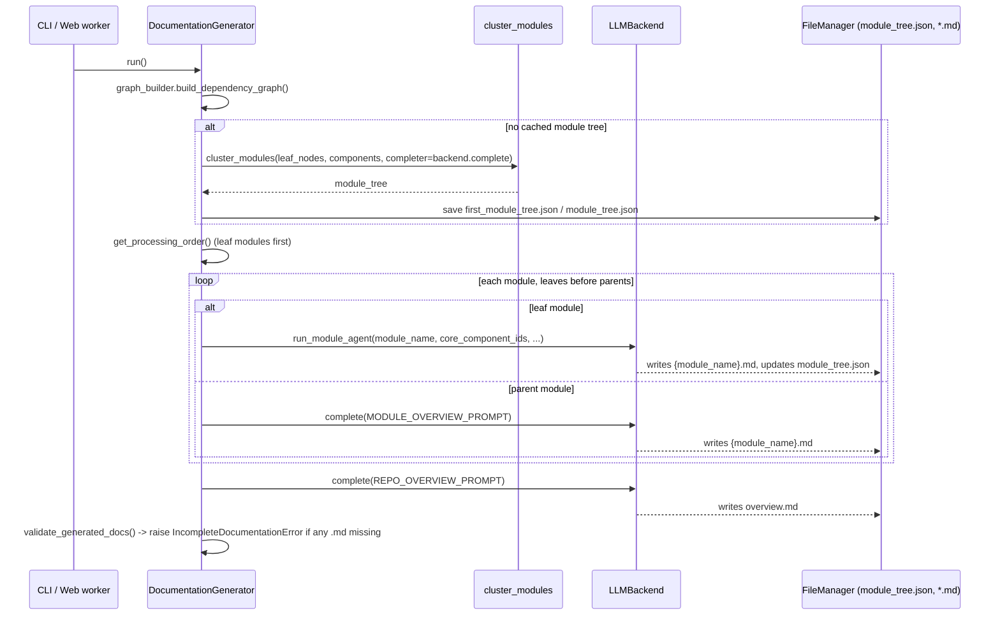
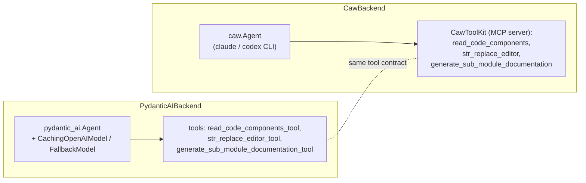

# Backend LLM & Documentation Services

## Purpose

This module is the **engine room of CodeWiki's documentation generation**. It
owns:

1. **The LLM backend abstraction** — a single interface (`LLMBackend`) that
   lets the rest of the system call an LLM without caring whether the call
   goes through an API key (OpenAI-compatible / Anthropic / Bedrock /
   Azure-OpenAI via pydantic-ai) or through the user's Claude/Codex CLI
   subscription (via the `caw` library).
2. **The top-level orchestrator** (`DocumentationGenerator`) that turns a
   dependency graph + module tree into a finished set of markdown pages —
   clustering modules, walking the tree leaves-first, running the per-module
   agent loop, and stitching parent/repo overviews on top.

Everything upstream of this module (dependency graph construction, module
clustering input, agent tool implementations) is documented elsewhere and
linked below; this module is the piece that actually *drives the agents* and
decides *which backend* runs them.

## How this module fits in the system

* [CLI](CLI.md) invokes documentation generation through
  `CLIDocumentationGenerator`, which ultimately constructs and runs a
  `DocumentationGenerator` from this module.
* [Frontend_Web_App](Frontend_Web_App.md) does the same from
  `background_worker.py` for web-submitted jobs.
* [Dependency_Analyzer_Core](Dependency_Analyzer_Core.md) supplies the
  `DependencyGraphBuilder`, `Node`/`Repository` models, and the module-tree
  JSON files (`module_tree.json`, `first_module_tree.json`) this module reads
  and writes.
* [Dependency_Analysis_Service](Dependency_Analysis_Service.md) and
  [Language_Analyzers](Language_Analyzers.md) sit underneath the graph
  builder and are not called directly from here.
* [Backend_Agent_Tools](Backend_Agent_Tools.md) provides `CodeWikiDeps` (the
  per-agent-run state object) and the `EditTool`/`str_replace_editor`
  implementation that both backends reuse for file writes and Mermaid
  validation.
* [Core_Config_&_Utils](Core_Config_&_Utils.md) provides the `Config` object
  (provider, model names, thresholds, paths) and `FileManager` for JSON/text
  I/O, used throughout this module.
* [MCP_Session_Management](MCP_Session_Management.md) is unrelated to LLM
  calls; it manages per-session workspaces for the MCP server front-end and
  is not a dependency of this module.

## Sub-modules

| Sub-module | Documentation | Responsibility |
|---|---|---|
| API-key backend & model layer | [Backend_LLM_&_Documentation_Services_pydantic_ai_backend.md](Backend_LLM_&_Documentation_Services_pydantic_ai_backend.md) | `LLMBackend` interface, provider selection (`get_backend`), `PydanticAIBackend` (pydantic-ai `Agent` + tool functions), and the `llm_services` model layer (`CompatibleOpenAIModel`, `CachingOpenAIModel`, fallback-model construction) |
| Subscription (caw) backend | [Backend_LLM_&_Documentation_Services_caw_backend.md](Backend_LLM_&_Documentation_Services_caw_backend.md) | `CawBackend` (routes through the `claude`/`codex` CLI) and `CawToolKit` (the MCP tool server exposing CodeWiki's tools to a caw agent) |
| Documentation orchestration | [Backend_LLM_&_Documentation_Services_documentation_generator.md](Backend_LLM_&_Documentation_Services_documentation_generator.md) | `DocumentationGenerator`: clustering trigger, leaf-first processing order, per-module agent dispatch, parent/repo overview assembly, and post-run validation |

## Architecture overview

### Backend selection

`get_backend(config)` is the single seam where provider choice becomes a
concrete class. Everything else in the codebase (the orchestrator, the
clustering step) talks only to the abstract `LLMBackend` interface.

* `provider in {"claude-code", "codex"}` (`is_caw_provider`) → `CawBackend`
* every other provider value (`openai-compatible`, `anthropic`, `bedrock`,
  `azure-openai`) → `PydanticAIBackend`

See [Backend_LLM_&_Documentation_Services_pydantic_ai_backend.md](Backend_LLM_&_Documentation_Services_pydantic_ai_backend.md)
and [Backend_LLM_&_Documentation_Services_caw_backend.md](Backend_LLM_&_Documentation_Services_caw_backend.md)
for the two implementations.

### End-to-end generation flow

Full detail on this flow lives in
[Backend_LLM_&_Documentation_Services_documentation_generator.md](Backend_LLM_&_Documentation_Services_documentation_generator.md).

### Per-module agent loop, both backends

Both backends implement the same contract (`run_module_agent`) but drive it
with different agent runtimes and different tool-call surfaces:

Both tool surfaces ultimately call into
[Backend_Agent_Tools](Backend_Agent_Tools.md) (`CodeWikiDeps`, `EditTool`)
and recurse into sub-modules using the same `is_complex_module` /
`max_token_per_leaf_module` / `max_depth` gating logic, so a module produces
equivalent documentation regardless of which backend generated it.

## Key cross-cutting concerns

- **Module tree as shared state**: `module_tree.json` (and the initial
  `first_module_tree.json` snapshot from clustering) is the single source of
  truth for hierarchy. Both backends load/mutate/save it, and sub-agent
  delegation (`generate_sub_module_documentation`) adds new branches to it
  in-memory before persisting. Name collisions across the (flat) docs
  directory are resolved by `module_naming.normalize_sub_module_specs` /
  `dedupe_module_tree_names`.
- **Recursion budget**: `config.max_depth` and `config.max_token_per_leaf_module`
  gate whether a module can delegate to sub-agents (`is_complex_module`
  + token count), preventing runaway fan-out on deeply nested repos.
- **Idempotency**: every entry point checks for an existing `overview.md` or
  `{module_name}.md` before doing any work, so a crashed run can be resumed
  by re-invoking generation over the same `docs_dir`.
- **Validation**: `DocumentationGenerator.validate_generated_docs` /
  `IncompleteDocumentationError` guarantee that a "successful" run actually
  produced every promised `.md` file, not just an updated tree in memory.

Configuration (`Config`, provider/model fields, thresholds) is defined in
[Core_Config_&_Utils](Core_Config_&_Utils.md); the underlying source-analysis
data structures (`Node`, `Repository`, `AnalysisResult`) come from
[Dependency_Analyzer_Core](Dependency_Analyzer_Core.md).
