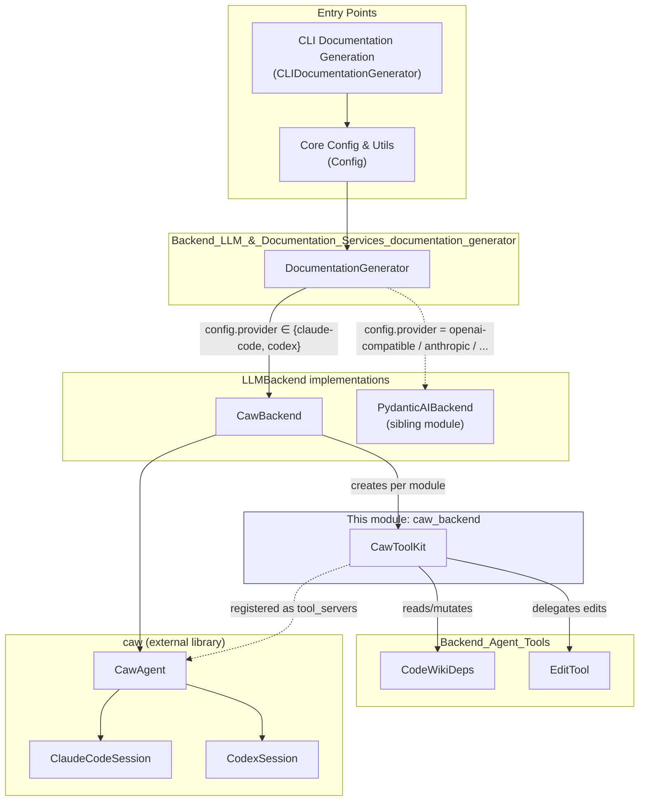
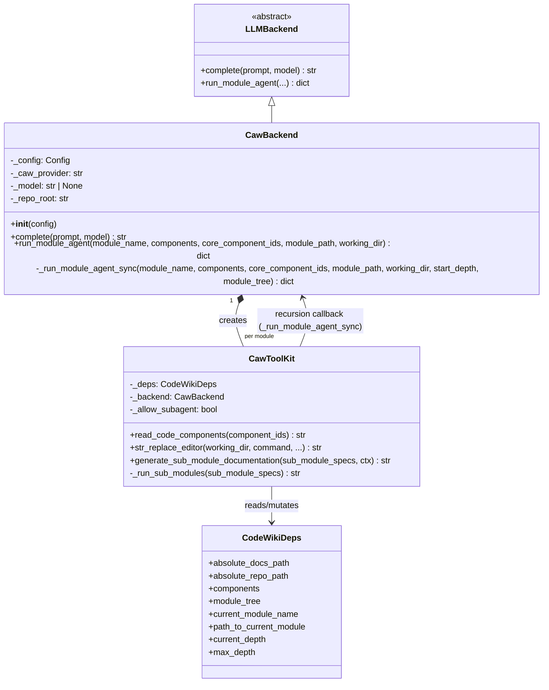
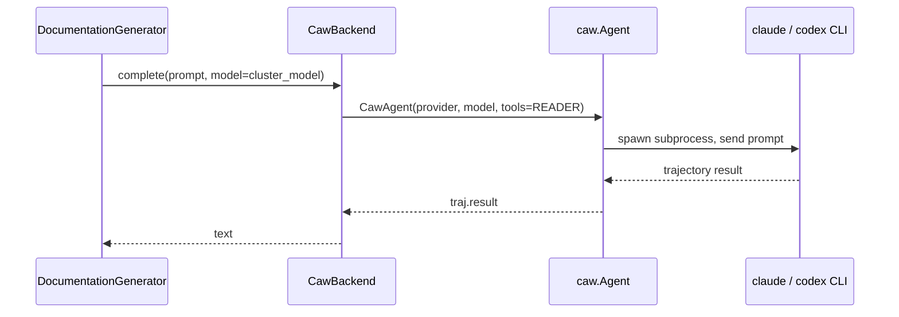
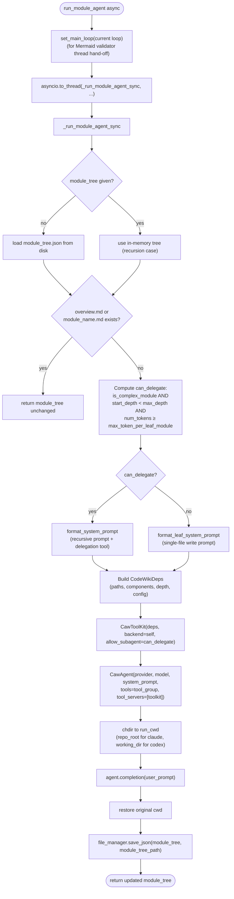
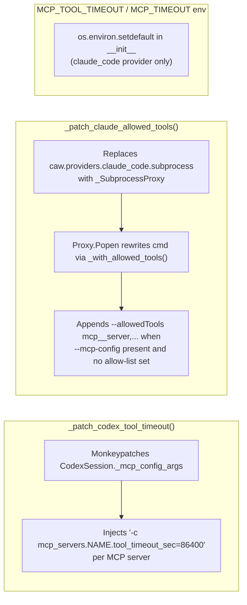
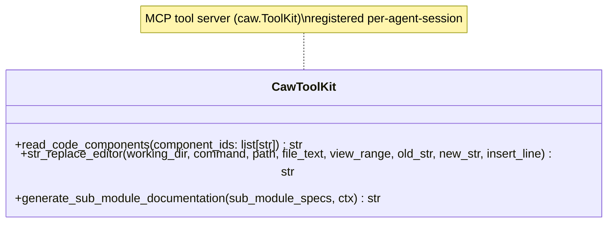
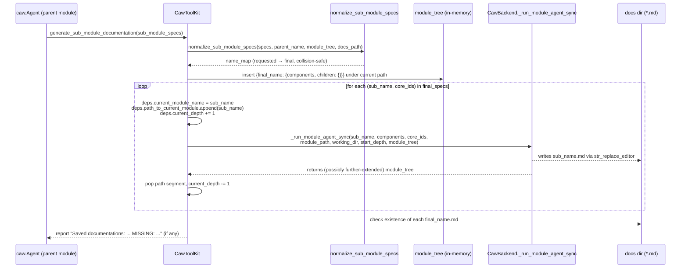
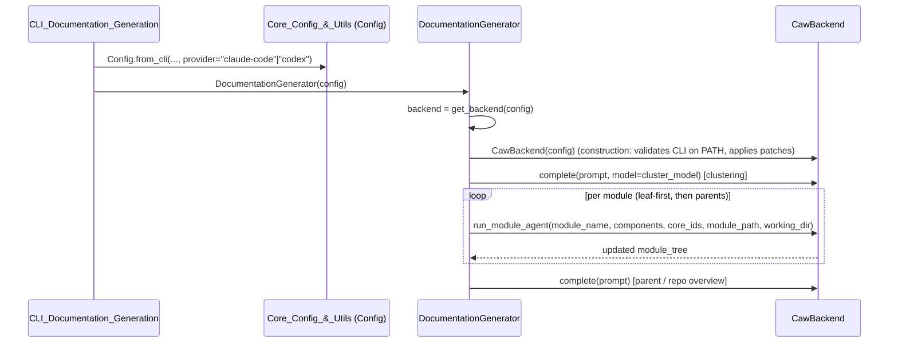

# Backend LLM & Documentation Services — `caw_backend`

## Introduction

This module implements **subscription-mode LLM execution** for CodeWiki via the `caw`
library, which wraps the official **Claude Code** and **Codex** CLI binaries. Instead of
calling a hosted chat-completions API with a metered API key, `CawBackend` authenticates
using the developer's existing OAuth CLI login (`claude login` / `codex login`) and drives
the CLI's own agent loop — including its native file-editing, tool-calling, and MCP
capabilities — to perform documentation generation.

The module consists of two tightly coupled components:

- **`CawBackend`** (`codewiki/src/be/caw_backend.py`) — the `LLMBackend` implementation
  that owns provider resolution, single-shot completions, and the per-module agent
  run/recursion driver.
- **`CawToolKit`** (`codewiki/src/be/caw_toolkit.py`) — an MCP tool server (subclass of
  `caw.ToolKit`) exposing CodeWiki's three agent tools (`read_code_components`,
  `str_replace_editor`, `generate_sub_module_documentation`) to the CLI-driven agent.

Together they are a **sibling implementation** of
[`Backend_LLM_&_Documentation_Services_pydantic_ai_backend`](Backend_LLM_&_Documentation_Services_pydantic_ai_backend.md),
which instead drives a hosted LLM through `pydantic-ai`. Both backends implement the same
abstract contract, `LLMBackend`, and are invoked identically by
[`DocumentationGenerator`](Backend_LLM_&_Documentation_Services_documentation_generator.md).
Selecting which one runs at a given invocation is a matter of `Config.provider` — this
module is chosen when `provider` is `"claude-code"` or `"codex"`.

---

## Position in the System

`CawBackend` is instantiated by the backend factory used inside
`DocumentationGenerator.__init__` (`get_backend(config)`), based on `Config.provider`.
It depends on:

- [`LLMBackend`](Backend_LLM_&_Documentation_Services_pydantic_ai_backend.md) — the abstract
  base class it implements.
- [`CodeWikiDeps` and `EditTool`](Backend_Agent_Tools.md) — shared agent-tool state and the
  file-editing/Mermaid-validation implementation reused from the pydantic-ai path.
- `codewiki/src/be/module_naming.py::normalize_sub_module_specs` — sub-module name
  collision resolution, shared with the pydantic-ai backend's equivalent tool.
- `codewiki/src/be/prompt_template.py` — prompt formatting functions
  (`format_system_prompt`, `format_leaf_system_prompt`, `format_user_prompt`).
- `codewiki/src/be/cluster_modules.py::format_potential_core_components` and
  `codewiki/src/be/utils.py` (`count_tokens`, `is_complex_module`, `set_main_loop`,
  `validate_mermaid_diagrams`) — shared heuristics/utilities also used by the pydantic-ai
  backend, so both backends decide leaf-vs-delegate module handling identically.
- `Config` (from [`Core_Config_&_Utils`](Core_Config_&_Utils.md)) — carries provider,
  model, depth, and token-threshold settings.
- The external `caw` package — `Agent`, `ToolGroup`, `ToolKit`/`tool` decorator, and
  provider session classes (`ClaudeCodeSession`, `CodexSession`).

---

## `CawBackend`

### Responsibilities

1. **Provider resolution** — maps CodeWiki's `provider` config value
   (`"claude-code"` / `"codex"`) to caw's internal provider key (`"claude_code"` /
   `"codex"`) and to the CLI binary name (`claude` / `codex`) used for a PATH sanity check.
2. **Single-shot completion** (`complete`) — used for clustering prompts and parent/repo
   overview generation, where no tool-calling agent loop is needed.
3. **Per-module agent orchestration** (`run_module_agent` / `_run_module_agent_sync`) —
   builds a `CodeWikiDeps`, decides whether the module can delegate to sub-agents, builds
   a `CawToolKit`, and drives a `caw.Agent` completion for the module.
4. **Recursive sub-module delegation** — `_run_module_agent_sync` is re-entered directly
   (bypassing the async entry point) by `CawToolKit._run_sub_modules` when a module's
   agent decides to fan out documentation to child modules.
5. **Environment/process hardening** — several module-level monkeypatches address gaps
   in the upstream `caw` library (see [Stopgap Patches](#stopgap-patches-applied-at-import-time)).

### Class diagram

### Provider & tool-group mapping

| CodeWiki `provider` | caw provider key | CLI binary | Agent tool group |
|---|---|---|---|
| `claude-code` | `claude_code` | `claude` | `READER \| PARALLEL` |
| `codex` | `codex` | `codex` | `READER \| PARALLEL \| EXEC` |

`ToolGroup.WRITER` (Write/Edit/NotebookEdit) and `ToolGroup.INTERACTION`
(AskUserQuestion) and `ToolGroup.WEB` are always excluded — the agent is forced to use
CodeWiki's own `str_replace_editor` tool so that every markdown write goes through the
same Mermaid-diagram validation path as the pydantic-ai backend. Codex additionally gets
`ToolGroup.EXEC` because Codex's non-interactive `exec` mode otherwise cancels MCP tool
calls unless sandboxed with `--dangerously-bypass-approvals-and-sandbox`.

### `complete()` — single-shot completions

Used by `DocumentationGenerator` for:
- Module clustering prompts (`cluster_modules`, via a `completer` lambda bound to
  `cluster_model`).
- Parent/repository overview generation (`generate_parent_module_docs`).

This call **blocks the calling thread** for the life of the CLI subprocess. Callers from
async contexts (like clustering inside `DocumentationGenerator.run`) accept this since no
concurrent work needs to happen during clustering.

### `run_module_agent()` / `_run_module_agent_sync()` — per-module documentation

This is the core agentic entry point, called once per module in
`DocumentationGenerator.generate_module_documentation`'s processing loop (leaf modules
first, then parents — see
[`Backend_LLM_&_Documentation_Services_documentation_generator`](Backend_LLM_&_Documentation_Services_documentation_generator.md)).

Key implementation details:

- **`start_depth` / `module_tree` parameters** exist purely to support recursion: when
  `CawToolKit` triggers a sub-module run, it calls `_run_module_agent_sync` directly
  (not the async `run_module_agent`), passing the parent's `current_depth` as
  `start_depth` and the **in-memory** `module_tree` (not yet flushed to disk) so newly
  staged sub-module branches are visible to the child.
- **Delegation gate (`can_delegate`)** mirrors the equivalent gate in
  `PydanticAIBackend` (see
  [`Backend_LLM_&_Documentation_Services_pydantic_ai_backend`](Backend_LLM_&_Documentation_Services_pydantic_ai_backend.md)):
  a module must span multiple files, have enough content
  (`num_tokens >= max_token_per_leaf_module`), and remaining recursion budget
  (`start_depth < max_depth`) before the recursive system prompt and
  `generate_sub_module_documentation` tool are offered. Otherwise the *leaf* system
  prompt is used and the toolkit disables `generate_sub_module_documentation`.
- **Working-directory pinning around `agent.completion`** is provider-specific:
  - For **Codex**, cwd is pinned to `working_dir` (the docs output dir) because Codex's
    native `file_change` tool resolves relative paths against the process cwd.
  - For **Claude Code**, cwd is pinned to `self._repo_root` because Claude writes only
    through CodeWiki's own `str_replace_editor` (absolute paths via `deps`), but Claude's
    `acceptEdits` permission mode (which orgs may force even when
    `--dangerously-skip-permissions` is requested) auto-approves reads/edits only *inside*
    the working directory — so the repo root must be the cwd to keep source reads
    in-scope.
  - The original cwd is always restored in a `finally` block. This mutation is safe because
    `DocumentationGenerator` processes modules **sequentially**, and nested
    `_run_module_agent_sync` recursive calls chdir to the same absolute paths.

### Stopgap patches applied at import time

Three module-level patches work around gaps/behavioral quirks in the upstream `caw`
library. They are applied once (idempotently, via a module-level "applied" flag) the
first time `codewiki.src.be.caw_backend` is imported:

| Patch | Problem it solves | Scope |
|---|---|---|
| `_patch_codex_tool_timeout` | Upstream `CodexSession` emits no per-server `tool_timeout_sec`, so Codex cancels MCP tool calls during long sub-module recursion. | Applied globally once; monkeypatches `CodexSession._mcp_config_args`. |
| `_patch_claude_allowed_tools` | Custom MCP-server tools aren't auto-approved under `acceptEdits`, and orgs can disable `bypassPermissions`; without an explicit `--allowedTools mcp__<server>` flag the agent's tool calls are silently denied and docs come out empty. | Wraps `subprocess.Popen` calls made *inside* `caw.providers.claude_code` only — process-wide `subprocess` is untouched. |
| `MCP_TOOL_TIMEOUT` / `MCP_TIMEOUT` env defaults | Prevents claude-code CLI from cancelling long sub-module recursion. | Set via `os.environ.setdefault` in `CawBackend.__init__`, only for the `claude_code` provider; a user-supplied override always wins. |

All three are defensive stopgaps documented in code comments as candidates for removal
once the corresponding capability lands upstream in `caw`.

---

## `CawToolKit`

`CawToolKit` is a `caw.ToolKit` subclass (`server_name="codewiki_tools"`) instantiated
fresh **per agent session** (once per top-level module, and again for every recursively
delegated sub-module). It is registered with the `CawAgent` via `tool_servers=[toolkit]`,
exposing three `@tool`-decorated methods over MCP to the underlying Claude Code / Codex
CLI.

### Tools exposed

1. **`read_code_components(component_ids)`** — looks up each `"path::name"` id in
   `deps.components` (populated once for the whole run by
   [`DependencyGraphBuilder`](Dependency_Analyzer_Core.md)) and returns concatenated
   source code, or a "not found" marker per missing id.

2. **`str_replace_editor(working_dir, command, path, ...)`** — thin MCP wrapper delegating
   to the shared `EditTool` implementation from
   [`Backend_Agent_Tools`](Backend_Agent_Tools.md), ensuring byte-for-byte identical
   editing/view/undo semantics as the pydantic-ai backend. Adds:
   - **Working-dir enum enforcement** (`"repo"` / `"docs"`) done manually at call time
     rather than via `Literal` types, because `from __future__ import annotations` turns
     `Literal` into unresolved forward refs that FastMCP's schema builder can't rebuild.
   - **`view`-only restriction on `working_dir="repo"`** — the agent may inspect source
     but never mutate it.
   - **Absolute-path rejection** and **`..`-escape containment check** (`Path.resolve()` +
     `relative_to`) so a malicious/careless agent path can never write outside
     `absolute_docs_path` / `absolute_repo_path`.
   - **JSON-string coercion** (`_coerce_json_arg`) for `view_range` / `insert_line`, since
     some MCP/CLI bridges serialize list/int arguments as JSON strings.
   - **Post-write Mermaid validation** — after any non-`view` command on a `.md` path, it
     calls `validate_mermaid_diagrams` (shared with the pydantic-ai backend via
     `codewiki.src.be.utils`) and appends the validation report to the tool result.

3. **`generate_sub_module_documentation(sub_module_specs, ctx)`** — the recursion trigger.
   Rejected outright (returns a corrective error string, no exception) if
   `self._allow_subagent` is `False` (i.e., the module was deemed a leaf by
   `CawBackend`'s delegation gate). Otherwise:
   - Runs `_run_sub_modules` in a worker thread via `asyncio.to_thread` so the MCP
     server's event loop isn't blocked while children complete.
   - Concurrently runs a `_heartbeat` task that emits MCP progress notifications every
     10 seconds so the calling CLI doesn't treat the long tool call as stalled/cancelled.

### Sub-module recursion flow (`_run_sub_modules`)

Notable behaviors:

- **Name collision resolution** happens *before* any tree mutation, via
  `normalize_sub_module_specs` (shared utility, also used by the pydantic-ai backend's
  equivalent tool) — because docs are saved into one **flat** directory, a sub-module name
  that collides with an existing tree entry or an on-disk `.md` stem is automatically
  renamed (typically prefixed with the parent module name).
- **Direct sync recursion** — `_run_sub_modules` calls
  `self._backend._run_module_agent_sync(...)` directly rather than going through the async
  `run_module_agent` wrapper, since it is already executing inside a worker thread spawned
  by the parent tool call; this avoids double-wrapping in `asyncio.to_thread`.
- **Depth bookkeeping** — `deps.current_depth` is incremented/decremented around each
  child call and passed as that child's `start_depth`, so `CawBackend`'s
  `can_delegate` gate correctly enforces `max_depth` across the whole recursive tree, not
  just per-session.
- **Failure visibility** — the final report distinguishes files that exist on disk after
  generation (`saved`) from those that don't (`missing`), and logs a warning for the
  latter. This directly feeds `DocumentationGenerator.validate_generated_docs`, which
  raises `IncompleteDocumentationError` if any expected `.md` file never landed (see
  [`Backend_LLM_&_Documentation_Services_documentation_generator`](Backend_LLM_&_Documentation_Services_documentation_generator.md)).

---

## Relationship to the pydantic-ai backend

Both backends satisfy identical goals and the same abstract `LLMBackend` contract but
differ in execution substrate:

| Aspect | `CawBackend` (this module) | [`PydanticAIBackend`](Backend_LLM_&_Documentation_Services_pydantic_ai_backend.md) |
|---|---|---|
| Auth | Existing `claude` / `codex` CLI OAuth subscription | API key via `llm_base_url` / `llm_api_key` |
| Execution engine | Official Claude Code / Codex CLI processes (subprocess) | In-process `pydantic-ai` `Agent` over an OpenAI-compatible HTTP model |
| Tool exposure | MCP `ToolKit` (`CawToolKit`) registered as `tool_servers` | Native pydantic-ai tool functions |
| File editing | Shared `EditTool` (via `str_replace_editor` MCP tool) | Shared `EditTool` (via native tool) |
| Delegation gate | `is_complex_module` + token/depth thresholds (identical heuristic) | Same heuristic, implemented in `generate_sub_module_documentation_tool` |
| Fallback model | Ignored (`config.fallback_model` unused — caw has no fallback chain) | Honored via `CompatibleOpenAIModel`/fallback logic |
| Blocking behavior | `complete()`/`agent.completion()` block the calling thread (offloaded via `asyncio.to_thread` for module agents) | Fully async throughout |

Because both share `CodeWikiDeps`, `EditTool`, `normalize_sub_module_specs`, and the
module-complexity heuristics, module authors extending CodeWiki's agent tools generally
only need to touch [`Backend_Agent_Tools`](Backend_Agent_Tools.md) once for both backends
to pick up the change.

---

## Where this module is invoked from

See [`Backend_LLM_&_Documentation_Services_documentation_generator`](Backend_LLM_&_Documentation_Services_documentation_generator.md)
for the full orchestration pipeline (dependency graph construction, module clustering,
topological processing order, metadata and validation), and
[`CLI_Documentation_Generation`](CLI_Documentation_Generation.md) for how `Config` (and
hence `provider`) is populated from CLI arguments / job definitions.
