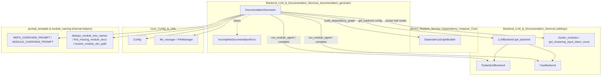
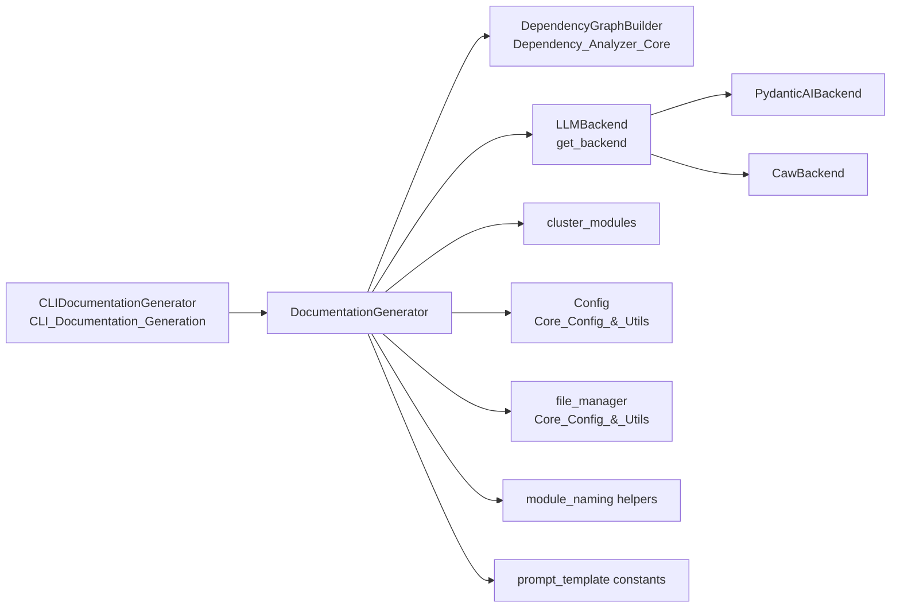
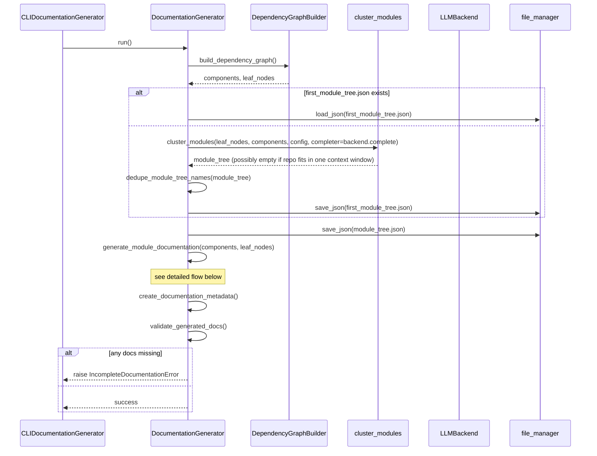
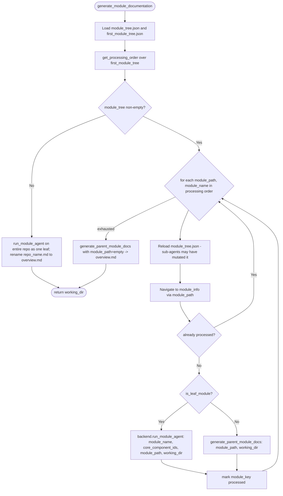
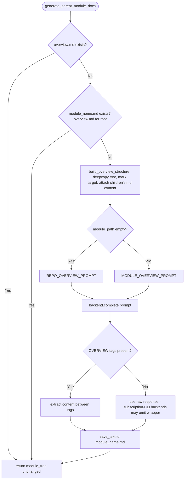
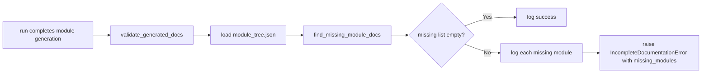
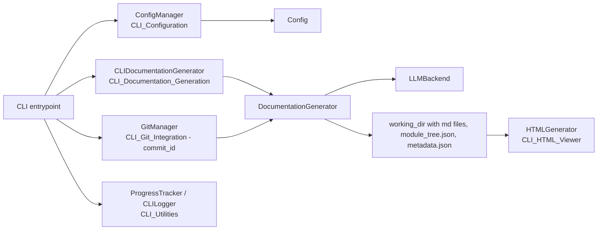

# Documentation Generator (`Backend_LLM_&_Documentation_Services_documentation_generator`)

## Introduction

The **Documentation Generator** module is the top-level orchestrator of CodeWiki's documentation pipeline. It is the single entry point (`DocumentationGenerator.run()`) that turns a parsed source repository into a complete, hierarchical set of Markdown documentation files. It coordinates dependency analysis, module clustering, bottom-up per-module documentation generation via LLM agents, and top-down overview synthesis — while ensuring the whole process is resumable, idempotent, and validated for completeness before it reports success.

This module sits at the center of the `Backend_LLM_&_Documentation_Services` parent module and delegates the actual "thinking" work to two sibling modules:

- [Backend_LLM_&_Documentation_Services_pydantic_ai_backend.md](Backend_LLM_&_Documentation_Services_pydantic_ai_backend.md) — API-key based LLM backend (`PydanticAIBackend`) built on `pydantic-ai` agents.
- [Backend_LLM_&_Documentation_Services_caw_backend.md](Backend_LLM_&_Documentation_Services_caw_backend.md) — subscription-CLI backend (`CawBackend`) that drives Claude Code / Codex CLIs.

Both backends implement the same `LLMBackend` abstract interface, which is the seam this module programs against — it never needs to know which concrete backend is in use.

## Responsibilities

`DocumentationGenerator` (in `codewiki/src/be/documentation_generator.py`) is responsible for:

1. **Kicking off dependency analysis** via [Dependency_Analysis_Service.md](Dependency_Analysis_Service.md) / [Dependency_Analyzer_Core.md](Dependency_Analyzer_Core.md) (`DependencyGraphBuilder`) to obtain the full component graph and its leaf nodes (documentable code units).
2. **Clustering leaf components into a module tree** (via `cluster_modules`), either through an LLM call or by staying flat when the repo is small enough to fit in one context window.
3. **Computing a bottom-up processing order** (leaf modules → parent modules → repository overview) using a dynamic-programming / topological-sort style traversal so that parent overviews are always written *after* all their children's docs exist.
4. **Delegating actual content generation** to an `LLMBackend` implementation:
   - Leaf/complex modules → `backend.run_module_agent(...)` (agentic, tool-using loop).
   - Parent modules & the repo overview → `backend.complete(prompt)` (single-shot completion over already-generated children docs).
5. **Persisting and reloading state** (`module_tree.json`, `first_module_tree.json`) so that generation can be resumed after partial failures without re-clustering or re-processing already-completed modules.
6. **Validating completeness** at the end of the run — every module in the final tree must have a corresponding `.md` file on disk (falling back to sanitized filename variants), otherwise an `IncompleteDocumentationError` is raised.
7. **Writing a metadata.json** file describing the generation run (model used, commit id, statistics, list of generated files).

## Architecture



## Dependency Overview



The `DocumentationGenerator` is instantiated and driven by the CLI layer (`CLIDocumentationGenerator`, see [CLI_Documentation_Generation.md](CLI_Documentation_Generation.md)), which supplies a `Config` object (see [Core_Config_&_Utils.md](Core_Config_&_Utils.md)) and optionally a pre-built `LLMBackend`.

## Core Data Structures

| File | Purpose |
|---|---|
| `first_module_tree.json` | The module tree exactly as produced by clustering (`cluster_modules`), before any sub-agent hierarchical modifications. Used to compute the leaf-first processing order so it's stable across resumed runs. |
| `module_tree.json` | The live, evolving module tree. Sub-agents can add nested sub-modules (`generate_sub_module_documentation_tool`) while processing a module, so this file is reloaded from disk before every module is processed. |
| `<module_name>.md` | Generated documentation for a single module (leaf or parent). Its existence is treated as a completion marker — if present, that module is skipped entirely on rerun. |
| `overview.md` | The top-level, whole-repository documentation, generated last. |
| `metadata.json` | Run metadata: timestamp, model, commit id, statistics, list of generated markdown files. |

Module tree entries follow this shape (see `AnalysisResult` / `NodeSelection` in [Dependency_Analyzer_Core.md](Dependency_Analyzer_Core.md) for the underlying component model):

```json
{
  "ModuleName": {
    "components": ["path/to/file.py::ClassName", "..."],
    "children": {
      "SubModuleName": { "components": [], "children": {} }
    }
  }
}
```

## Process Flow: `run()`



### `generate_module_documentation` — the dynamic-programming core



Key points:

- **Processing order** (`get_processing_order`) is a depth-first, post-order traversal: children are appended to the order list before their parent, so leaf modules are always generated first — a form of bottom-up dynamic programming where each parent's generation reuses ("memoizes") its children's already-written docs.
- **Leaf modules** (`is_leaf_module` — no children, or empty children dict) are handed to `backend.run_module_agent`, which runs a tool-using agent loop (`read_code_components`, `str_replace_editor`, and possibly `generate_sub_module_documentation_tool` for complex modules) against the concrete source code. See [Backend_Agent_Tools.md](Backend_Agent_Tools.md) for the tool implementations and [Backend_LLM_&_Documentation_Services_pydantic_ai_backend.md](Backend_LLM_&_Documentation_Services_pydantic_ai_backend.md) / [Backend_LLM_&_Documentation_Services_caw_backend.md](Backend_LLM_&_Documentation_Services_caw_backend.md) for how each backend implements this.
- **Parent modules** never touch source code directly — they synthesize an overview purely from their direct children's already-generated Markdown (`build_overview_structure`), via a single `backend.complete(prompt)` call.
- Both leaf and parent processing **short-circuit if the target `.md` already exists** (checked inside `run_module_agent` implementations and in `generate_parent_module_docs`), making the whole pipeline safely resumable after crashes, rate limits, or manual interruption.
- **Whole-repo mode**: if `cluster_modules` returns an empty tree (the entire component set fits under `max_token_per_module`), the generator skips clustering/hierarchy entirely and calls `run_module_agent` once for the whole repository, then renames the resulting `<repo_name>.md` to `overview.md`.

### `generate_parent_module_docs` — overview synthesis



`build_overview_structure` is the key data-shaping step: it deep-copies the module tree, walks down to the target module (marking it with `is_target_for_overview_generation: true`), then attaches each direct child's rendered Markdown under `child_info["docs"]` — resolved via `resolve_module_doc_path` (from `module_naming`, alongside `find_missing_module_docs`) to tolerate filename sanitization drift between the tree's module names and what sub-agents actually wrote to disk. This assembled JSON structure is embedded directly into the overview/repo prompt so the LLM only ever sees prose, not raw source.

## Validation & Error Handling



- `IncompleteDocumentationError` is a custom exception carrying the list of module names whose `.md` file could not be found (including `"overview"` if `overview.md` is missing). This closes a gap where a sub-agent silently failing (e.g., name-collision overwrite, tool error swallowed inside the agent loop) would otherwise go unnoticed and be reported as a successful run.
- Every per-module exception inside the main loop is logged (with traceback) and the loop `continue`s to the next module rather than aborting the whole run — partial failures are surfaced later via `validate_generated_docs`, not by crashing mid-loop.
- Failures in `generate_parent_module_docs` (LLM call itself) are re-raised, since a missing overview always indicates a hard failure worth stopping for at that point in the call stack (though `run()` still funnels everything through the top-level `try/except` for logging).

## Integration with `LLMBackend`

`DocumentationGenerator` depends only on the `LLMBackend` abstract interface (`codewiki/src/be/backend.py`), obtained via `get_backend(config)` unless a backend instance is injected directly (used by the CLI/tests):

```python
class LLMBackend(abc.ABC):
    def complete(self, prompt: str, *, model: str | None = None) -> str: ...
    async def run_module_agent(self, module_name, components, core_component_ids,
                                module_path, working_dir) -> Dict[str, Any]: ...
```

- `complete()` is used for clustering (via `cluster_modules(..., completer=backend.complete)`) and for parent/repo overview synthesis.
- `run_module_agent()` is used for leaf/complex module generation — it runs an agentic loop with tools and returns the (possibly-mutated) module tree, since sub-agents can add newly-discovered sub-modules to it.

Concrete backend selection (`get_backend`) branches on `config.provider`:

| Provider | Backend | Documentation |
|---|---|---|
| `openai-compatible`, `atlas-cloud`, `anthropic`, `bedrock`, `azure-openai` (API key based) | `PydanticAIBackend` | [Backend_LLM_&_Documentation_Services_pydantic_ai_backend.md](Backend_LLM_&_Documentation_Services_pydantic_ai_backend.md) |
| `claude_code`, `codex` (subscription CLI) | `CawBackend` | [Backend_LLM_&_Documentation_Services_caw_backend.md](Backend_LLM_&_Documentation_Services_caw_backend.md) |

This module never needs backend-specific branches itself — the abstract interface fully isolates it from prompt formatting, tool wiring, or subprocess management differences between the two implementations.

## Module Clustering

Before per-module generation begins, `run()` calls `cluster_modules` (from `codewiki/src/be/cluster_modules.py`) to group the flat set of leaf components discovered by dependency analysis into a hierarchical module tree:

- If the total token count of all leaf components is within `config.max_token_per_module`, clustering is **skipped** and an empty tree (`{}`) is used — triggering whole-repository documentation mode in `generate_module_documentation`.
- Otherwise, an LLM prompt (`format_cluster_prompt`) is sent through the backend's `complete()` (bound to `config.cluster_model` when set) to propose a grouping, recursively refining each cluster until it fits the token budget.
- The resulting tree is deduplicated (`dedupe_module_tree_names`) to avoid name collisions between sibling/cousin modules that would otherwise overwrite each other's `.md` files — this is only done for a freshly clustered tree, never for one reloaded from `first_module_tree.json` (renaming a cached key whose doc already exists on disk would orphan that file).

Both `first_module_tree.json` (immutable snapshot used for processing order) and `module_tree.json` (live, agent-mutable copy) are persisted immediately so that a rerun after failure/interruption reuses the same clustering result rather than re-invoking the LLM.

## Metadata Generation

`create_documentation_metadata` writes a `metadata.json` describing the run: timestamp, `main_model`, generator version, `repo_path`, `commit_id` (passed in at construction time — typically supplied by [CLI_Git_Integration.md](CLI_Git_Integration.md)'s `GitManager`), and statistics (`total_components`, `leaf_nodes`, `max_depth`). It also scans `working_dir` for any `.md` files not already listed and appends them to `files_generated`. This file is consumed by the CLI/HTML layers (see [CLI_HTML_Viewer.md](CLI_HTML_Viewer.md)) to display generation provenance.

## Relationship to the CLI



`DocumentationGenerator` is deliberately UI/CLI-agnostic — it has no knowledge of progress bars, logging formatting, or job status models (`JobStatus`, `DocumentationJob`, etc., defined in [CLI_Documentation_Generation.md](CLI_Documentation_Generation.md)). Those concerns are layered on top by `CLIDocumentationGenerator`, which wraps `run()` with progress reporting, job lifecycle tracking, and error surfacing suitable for both terminal and web-facing consumers (see [Frontend_Web_App.md](Frontend_Web_App.md) for the web job runner that also drives this class).

## Summary

`DocumentationGenerator` is the glue that turns raw dependency-graph output into a navigable, hierarchical documentation tree, using a leaf-first dynamic-programming traversal so that every overview is written strictly after its dependencies. Its design goals — idempotent resumability via on-disk completion markers, backend-agnostic LLM delegation through `LLMBackend`, and end-of-run completeness validation — make it robust to partial failures, LLM formatting quirks (missing `<OVERVIEW>` tags), and filename drift introduced by sub-agents.
