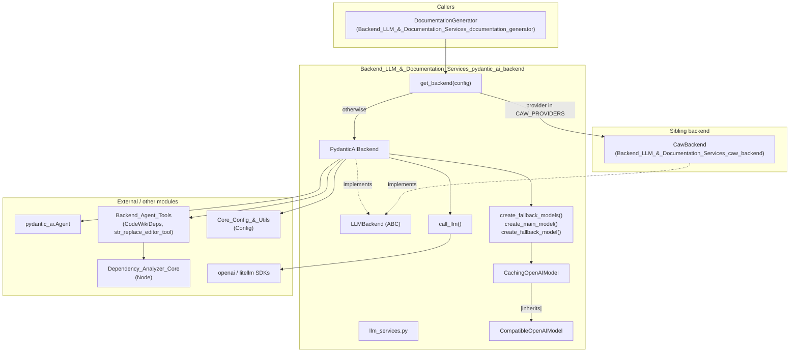
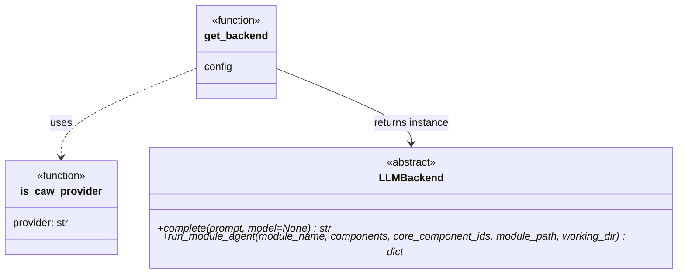
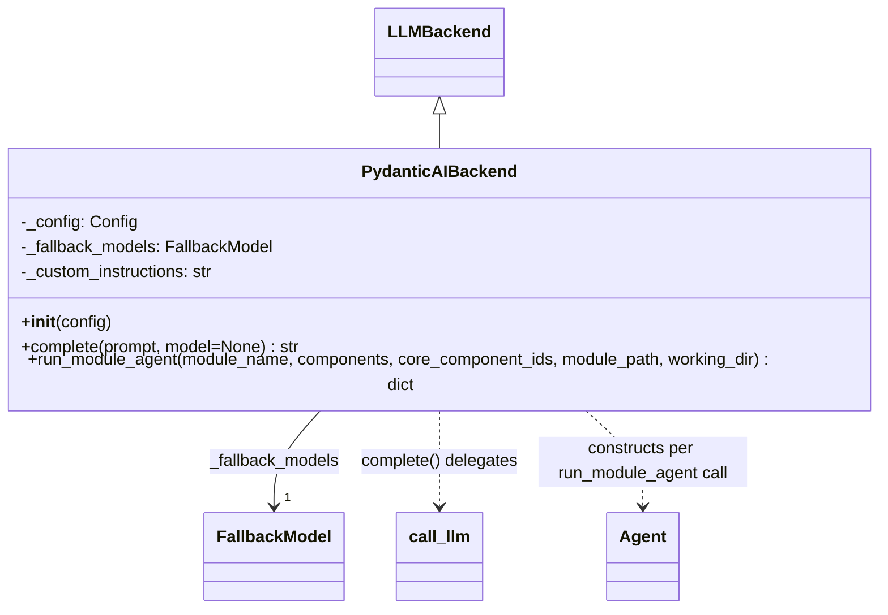
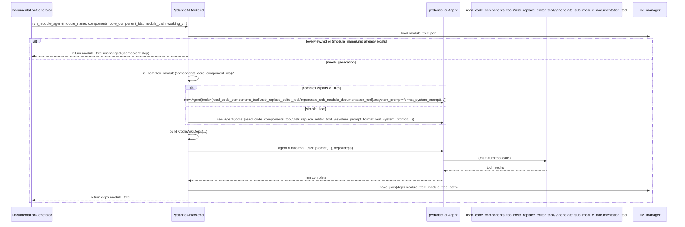
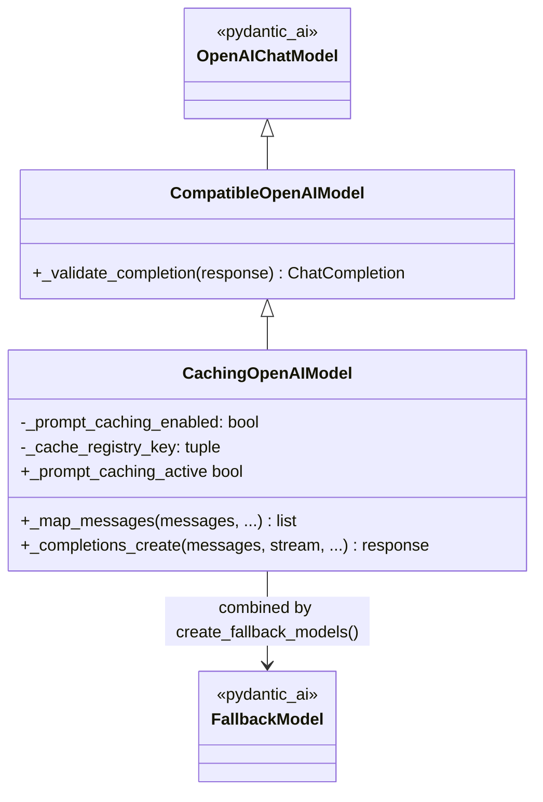
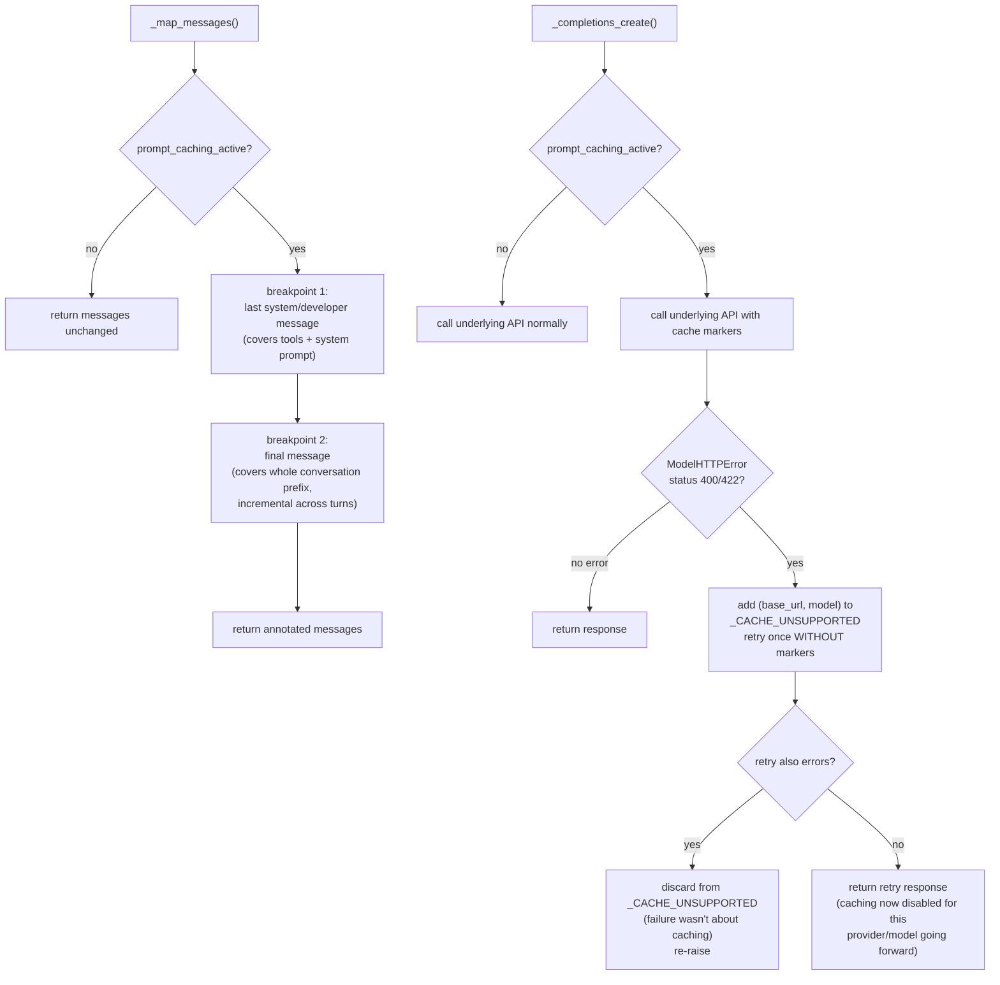
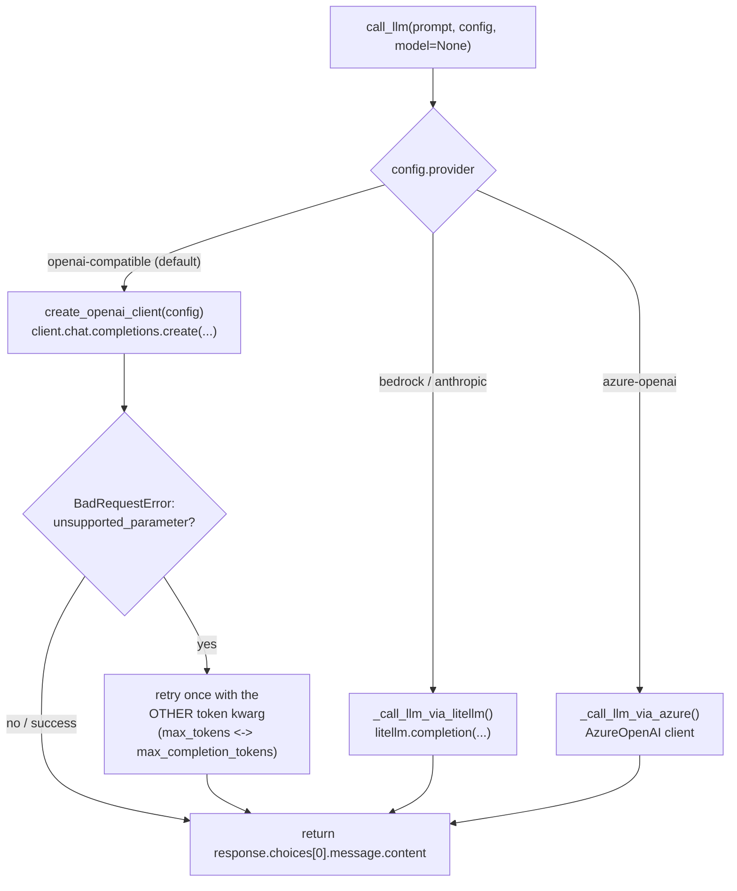
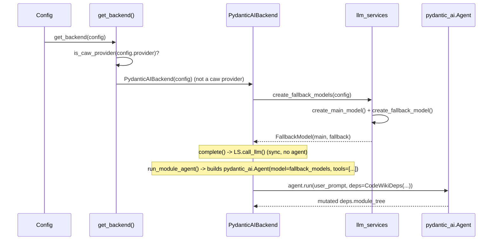

# Backend LLM & Documentation Services — pydantic-ai Backend

## Purpose

This sub-module is the **API-key based LLM path** of CodeWiki. It is one of
the two concrete implementations of the `LLMBackend` interface defined in the
parent module (see [Backend_LLM_&_Documentation_Services](Backend_LLM_&_Documentation_Services.md)
for the full picture), and it is the *default* backend — used whenever
`config.provider` is anything other than `claude-code` / `codex` (the
subscription-CLI providers handled by
[Backend_LLM_&_Documentation_Services_caw_backend](Backend_LLM_&_Documentation_Services_caw_backend.md)).

Concretely, this file group provides:

- **`LLMBackend`** (`backend.py`) — the abstract base class both concrete
  backends implement, plus `get_backend(config)` / `is_caw_provider(provider)`,
  the single seam where provider choice turns into a concrete backend
  instance.
- **`PydanticAIBackend`** (`pydantic_ai_backend.py`) — the concrete backend
  that drives [pydantic-ai](https://ai.pydantic.dev/)'s `Agent` machinery for
  the per-module documentation loop, and reuses a simple synchronous
  `call_llm` helper for one-shot completions (clustering, parent/repo
  overviews).
- **`llm_services.py`** (`CompatibleOpenAIModel`, `CachingOpenAIModel`, model
  factories, `call_llm`) — the model/client construction layer that adapts
  pydantic-ai's `OpenAIChatModel` to CodeWiki's multi-provider needs
  (OpenAI-compatible, Anthropic, Bedrock, Azure OpenAI, all routed through
  litellm-compatible proxies where needed) and adds resilience features:
  non-standard response patching, prompt-cache breakpoint injection with
  automatic fallback, and token-parameter auto-detection.

## Where this sits in the system

* [Backend_LLM_&_Documentation_Services_documentation_generator](Backend_LLM_&_Documentation_Services_documentation_generator.md)
  is the sole caller of `get_backend`/`LLMBackend` in normal operation —
  `DocumentationGenerator.__init__` calls `get_backend(config)` unless a
  backend instance is injected explicitly (used in tests).
- [Backend_LLM_&_Documentation_Services_caw_backend](Backend_LLM_&_Documentation_Services_caw_backend.md)
  is the sibling implementation selected when `config.provider` is a caw
  provider; both share the exact same `LLMBackend` contract so the
  orchestrator never needs to branch on backend type.
- [Backend_Agent_Tools](Backend_Agent_Tools.md) supplies `CodeWikiDeps` (the
  per-run context object) and `str_replace_editor_tool` /
  `read_code_components_tool`, which `PydanticAIBackend.run_module_agent`
  registers as pydantic-ai `Tool`s.
- [Core_Config_&_Utils](Core_Config_&_Utils.md) supplies `Config`, from which
  provider, model names, token limits, and prompt-caching flags are read.
- [Dependency_Analyzer_Core](Dependency_Analyzer_Core.md) supplies the `Node`
  model that makes up `components: Dict[str, Node]`.

## Component reference

### `backend.py` — the `LLMBackend` contract

- **`CAW_PROVIDERS = {"claude-code", "codex"}`** — the module-level constant
  that defines which `config.provider` values route to the subscription CLI
  path instead of the API-key path.
- **`is_caw_provider(provider)`** — trivial membership check against
  `CAW_PROVIDERS`.
- **`LLMBackend`** — an `abc.ABC` with two abstract methods:
  - `complete(prompt, *, model=None) -> str` — synchronous single-shot
    completion, used for module clustering and parent/repo overview
    generation (no tools, no multi-turn state).
  - `async run_module_agent(module_name, components, core_component_ids,
    module_path, working_dir) -> Dict[str, Any]` — the full per-module
    agentic documentation loop; returns the (possibly mutated) module tree
    dict so the caller can persist/inspect new sub-module branches added
    during the run.
- **`get_backend(config)`** — reads `config.provider` (default
  `"openai-compatible"`), does a **local import** of either `CawBackend` or
  `PydanticAIBackend` (avoiding a hard dependency / import cycle between the
  two backend modules), and returns the constructed instance.

### `pydantic_ai_backend.py` — `PydanticAIBackend`

`PydanticAIBackend` is a thin adapter: `complete()` simply forwards to
`llm_services.call_llm`, while `run_module_agent()` builds and runs a
`pydantic_ai.Agent` configured with CodeWiki's own tool functions.

**Construction (`__init__`)**

- Stores `config`.
- Eagerly builds `self._fallback_models = create_fallback_models(config)` — a
  `pydantic_ai.models.fallback.FallbackModel` chaining `config.main_model`
  then `config.fallback_model`, so a single model outage mid-run degrades
  gracefully instead of failing the whole module.
- Precomputes `self._custom_instructions = config.get_prompt_addition()` once
  (derived from `config.agent_instructions` — doc type, focus modules, free
  text — see [Core_Config_&_Utils](Core_Config_&_Utils.md)), reused for every
  agent run this backend instance performs.

**`complete(prompt, *, model=None)`**

Pure delegation: `return call_llm(prompt, self._config, model=model)`. No
agent, no tools — used by the orchestrator for clustering and
parent/repo-overview prompts where a single completion suffices.

**`run_module_agent(...)`** — the per-module agent loop:

Key implementation details:

1. **Idempotency guards** — before doing any work it checks for
   `overview.md` (means the whole run is finished) and `{module_name}.md`
   (means this specific module was already documented, e.g. by a previous
   crashed run being resumed). Both cases return the module tree unchanged
   without invoking the LLM.
2. **Complexity-based tool selection** — `is_complex_module(components,
   core_component_ids)` (from `codewiki/src/be/utils.py`) checks whether the
   module's core components span more than one source file. If so, the
   agent additionally gets `generate_sub_module_documentation_tool`,
   allowing it to recursively delegate parts of a large module to
   sub-agents, and is given the recursive `format_system_prompt`. Otherwise
   it's treated as a leaf module and given `format_leaf_system_prompt`
   (no delegation tool).
3. **`CodeWikiDeps` construction** — bundles everything a tool call needs:
   absolute repo/docs paths, the full `components` registry, the
   `path_to_current_module` breadcrumb, the in-memory `module_tree`,
   `max_depth`/`current_depth` recursion guards, `config`, and the
   precomputed `custom_instructions`. See
   [Backend_Agent_Tools](Backend_Agent_Tools.md) for the full field
   reference — this is the exact same dataclass shared with the caw backend.
4. **Agent execution** — `agent.run(user_prompt, deps=deps)` drives the
   multi-turn tool-calling loop (pydantic-ai internals: message history,
   tool dispatch, model fallback via `FallbackModel`). On success, the
   (potentially agent-mutated, e.g. via sub-module delegation)
   `deps.module_tree` is persisted back to `module_tree.json` and returned.
5. **Error handling** — any exception during `agent.run` is logged with
   full traceback and re-raised, letting the orchestrator's own
   try/except (in `generate_module_documentation`) decide whether to skip
   the module and continue with the rest of the tree.

### `llm_services.py` — model & client layer

This file is the lowest layer: it knows nothing about agents or tool
calling, only about constructing correctly-configured pydantic-ai `Model`
objects and OpenAI-SDK clients, and about making raw single-shot LLM calls
for every supported provider.

#### `CompatibleOpenAIModel`

A minimal subclass of pydantic-ai's `OpenAIChatModel` that patches a single
known incompatibility: some OpenAI-compatible proxies return
`choices[].index = None` instead of a sequential integer, which fails
pydantic validation. `_validate_completion` back-fills the index
(`0, 1, 2, ...`) before delegating to the parent implementation.

#### `CachingOpenAIModel`

Extends `CompatibleOpenAIModel` to inject **Anthropic-style prompt-cache
breakpoints** into outgoing requests — important for the multi-turn agent
loop in `run_module_agent`, where the system prompt + tool definitions +
conversation prefix are repeated on every turn and caching meaningfully cuts
cost/latency on Anthropic-backed proxies (e.g. via LiteLLM).

Design notes:

- **Two cache breakpoints** — the last system/developer message (caches
  the system prompt + tool schema, which never changes within a module run)
  and the final message (extends the cached prefix incrementally each
  turn). Tool-role messages get the marker at message level (not nested in
  a content part) because OpenAI-compatible proxies map that onto
  Anthropic's `tool_result` block shape; other roles get it on the last
  content part.
- **Module-level `_CACHE_UNSUPPORTED` set** — keyed by `(base_url,
  model_name)`, shared across all `CachingOpenAIModel` instances process-wide.
  This matters because sub-agent delegation (`generate_sub_module_documentation`)
  recreates model instances per tool call; the "does this provider reject
  cache_control?" probe should happen once per provider/model, not once per
  sub-module invocation.
- **Graceful degradation** — a `ModelHTTPError` with status 400/422 is
  interpreted as "provider rejects cache markers" (not a hard failure): the
  pair is remembered, the request retried once without markers, and future
  calls to the same provider/model skip cache-marker injection entirely. If
  the retry *also* fails, the pair is un-remembered (the failure wasn't
  about caching) and the original error propagates.

#### Model & client factories

| Function | Returns | Purpose |
|---|---|---|
| `create_main_model(config)` | `CachingOpenAIModel` | Wraps `config.main_model` with an `OpenAIProvider` pointed at `config.llm_base_url`/`llm_api_key`, prompt caching per `config.prompt_caching`. |
| `create_fallback_model(config)` | `CachingOpenAIModel` | Same, for `config.fallback_model`. |
| `create_fallback_models(config)` | `FallbackModel` | `FallbackModel(main, fallback)` — the object `PydanticAIBackend` passes to `Agent(...)`, so a failure on the main model automatically retries on the fallback. |
| `create_openai_client(config)` | `openai.OpenAI` | Plain OpenAI SDK client for `call_llm`'s default (openai-compatible) path. |
| `_create_litellm_openai_client(config)` | `openai.OpenAI` | An OpenAI-compatible client pointed at a litellm proxy; sets AWS env defaults for Bedrock. (Currently unused by `call_llm`'s litellm path, which calls `litellm.completion` directly — kept for completeness/future use.) |

#### Token-parameter and settings helpers

- **`_should_use_max_completion_tokens(model_name, base_url)`** — returns
  `True` for model families that require OpenAI's newer
  `max_completion_tokens` parameter instead of `max_tokens` (`o1`, `o3`,
  `o4`, `gpt-4o`, `gpt-4-turbo`, `gpt-5` patterns, or any model called
  directly against `api.openai.com`).
- **`_build_model_settings(config, model_name)`** — returns an
  `OpenAIChatModelSettings` with whichever token parameter is appropriate,
  and **deliberately omits `temperature`** — some reasoning models only
  accept the default temperature and reject explicit values.
- **`_get_litellm_model_name(model_name, provider)`** — prefixes the model
  name with `bedrock/` or `anthropic/` as required by litellm's model
  naming convention, if not already prefixed.

#### `call_llm` — the synchronous one-shot completion path

This is the function `PydanticAIBackend.complete()` delegates to, and it is
also called directly by the module-clustering step and by
`DocumentationGenerator.generate_parent_module_docs` (via
`backend.complete`) for parent/repo overview prompts — see
[Backend_LLM_&_Documentation_Services_documentation_generator](Backend_LLM_&_Documentation_Services_documentation_generator.md).

- **`openai-compatible` (default)** — builds a request with either
  `max_tokens` or `max_completion_tokens` based on
  `_should_use_max_completion_tokens`; if the server rejects that parameter
  with an `unsupported_parameter` `BadRequestError`
  (`_is_unsupported_token_param_error` inspects the structured error body,
  falling back to a message-string sniff for proxies that don't preserve
  structure), it retries once with the other parameter name.
- **`bedrock` / `anthropic`** — delegates to `_call_llm_via_litellm`, which
  prefixes the model name appropriately, sets AWS region env vars for
  Bedrock, and calls `litellm.completion(...)` directly (bypassing the
  OpenAI SDK entirely for this path).
- **`azure-openai`** — delegates to `_call_llm_via_azure`, which builds an
  `openai.AzureOpenAI` client from `config.llm_api_key`,
  `config.api_version`, and `config.llm_base_url`, using
  `config.azure_deployment` (falling back to `model`) as the deployment
  name.
- No `temperature` is ever sent, matching the reasoning-model constraint
  noted above.

## How the pieces cooperate at runtime

## Cross-cutting notes specific to this sub-module

- **Provider dispatch lives entirely in `get_backend`/`is_caw_provider`** —
  no other code in this sub-module (or the caw sub-module) needs to branch
  on provider type again; `PydanticAIBackend` itself is provider-agnostic at
  the `Agent`/`run_module_agent` level, with all provider-specific request
  shaping isolated inside `llm_services.py`.
- **Two independent "fallback" concepts** — don't confuse
  `config.fallback_model` (a *different model name* used when the main model
  errors, via pydantic-ai's `FallbackModel`) with the *token-parameter retry*
  in `call_llm` (same model, different request parameter) or the
  *prompt-caching retry* in `CachingOpenAIModel` (same model/request, cache
  markers stripped). All three are separate resilience mechanisms operating
  at different layers.
- **Shared `CodeWikiDeps` contract** — the deps object built in
  `run_module_agent` has exactly the same shape as the one built by
  `CawBackend._run_module_agent_sync` in the sibling module, which is what
  lets [Backend_Agent_Tools](Backend_Agent_Tools.md)'s tool implementations
  stay backend-agnostic.
