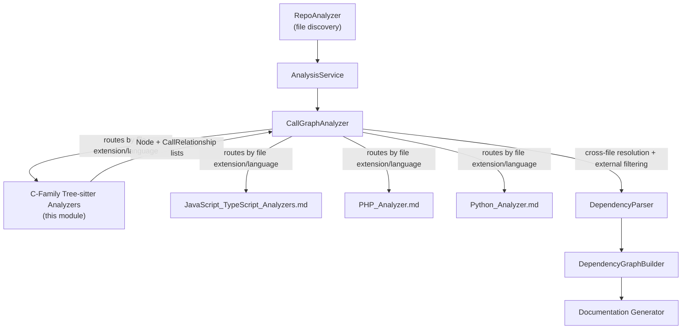
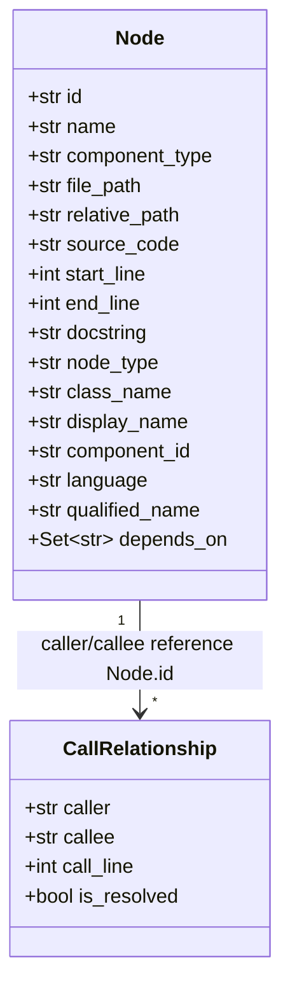
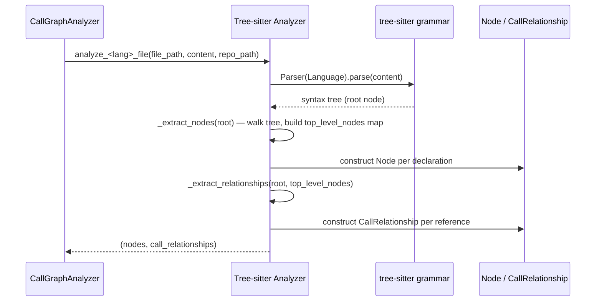
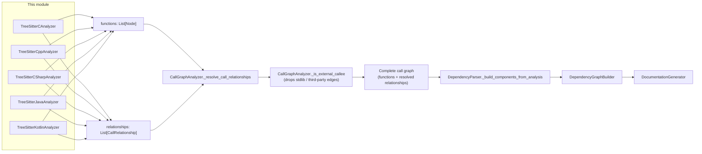

# C-Family Tree-sitter Analyzers

## Purpose

This module provides the **static-analysis front end** for the C-family of
programming languages — **C, C++, C#, Java, and Kotlin** — inside CodeWiki's
[Dependency Analysis Service](Dependency_Analysis_Service.md). Each analyzer
parses a single source file with a [tree-sitter](https://tree-sitter.github.io/)
grammar and produces two things that the rest of the pipeline consumes:

1. **`Node` records** — one per top-level declaration (class, struct,
   interface, function, method, global variable, type alias, …) representing
   a documentable "component".
2. **`CallRelationship` records** — directed edges describing how those
   components reference each other (calls, inheritance, field/property
   types, object creation, …).

These analyzers do **not** attempt full semantic resolution (that would
require a real compiler front end). Instead, each one performs the
best-effort, file-local resolution that is possible from syntax alone, and
emits **unresolved** relationships (`is_resolved=False`) whenever a target
cannot be pinned down within the file. The heavy lifting of matching those
unresolved edges to real components *anywhere in the repository* — and of
deciding which un-matched edges are truly external (standard library,
third-party) rather than real gaps — is centralized in
[`CallGraphAnalyzer`](Dependency_Analysis_Service.md), which every analyzer in
this module is designed to feed.

## Where this module sits in the system

* [`Dependency_Analysis_Service`](Dependency_Analysis_Service.md) owns
  `CallGraphAnalyzer`, which discovers source files, dispatches each file to
  the language-appropriate analyzer (including the ones documented here),
  and then performs **cross-file symbol resolution** and **external-symbol
  filtering** over the combined output of *all* language analyzers.
* [`Dependency_Analyzer_Core`](Dependency_Analyzer_Core.md) defines the shared
  data models (`Node`, `CallRelationship`) that every analyzer — in this
  module and its sibling language modules — must produce, plus the
  `DependencyParser` and `DependencyGraphBuilder` that turn the resolved call
  graph into the dependency graph used for documentation generation.
* Sibling language front ends live in
  [`JavaScript_TypeScript_Analyzers`](JavaScript_TypeScript_Analyzers.md),
  [`PHP_Analyzer`](PHP_Analyzer.md), and
  [`Python_Analyzer`](Python_Analyzer.md) — architecturally identical in
  role, just for different grammars.

## Shared data contract

Every analyzer in this module builds instances of the same two Pydantic
models (defined in `Dependency_Analyzer_Core`):

* **`Node.id` / `Node.component_id`** are built as
  `"{relative_path_from_repo_root}::{qualified_name}"`, e.g.
  `src/Foo.cpp::Logger.write`. This is the canonical identifier every other
  module in CodeWiki (documentation generator, HTML viewer, MCP tools) uses
  to refer to a piece of code.
* **`CallRelationship.is_resolved`** is the key coordination flag with
  `CallGraphAnalyzer`:
  * `True` means the analyzer is confident the `callee` is an exact `Node.id`
    (usually a same-file resolution).
  * `False` means the analyzer only knows a *name* — simple, qualified, or
    dotted — and is delegating final resolution to `CallGraphAnalyzer`'s
    repository-wide indexes (`_resolve_call_relationships`,
    `_build_resolution_indexes`) and its external-symbol classifier
    (`_is_external_callee`).

## Common analyzer architecture

Despite covering five different languages with very different grammars, all
five analyzers in this module follow the **same three-phase pipeline**:

1. **Parse** — each analyzer instantiates its own `tree_sitter.Language`
   binding (`tree_sitter_c`, `tree_sitter_cpp`, `tree_sitter_c_sharp`,
   `tree_sitter_java`, `tree_sitter_kotlin`) and parses the file content into
   a syntax tree.
2. **`_extract_nodes`** — a recursive tree walk that recognizes
   language-specific declaration node types (`function_definition`,
   `class_declaration`, `method_declaration`, …), builds a `Node` for each,
   and populates a `top_level_nodes` lookup dict (by simple name, qualified
   name, and/or component id) used later for local resolution.
3. **`_extract_relationships`** — a second recursive walk that recognizes
   reference sites (calls, `new`/object-creation, inheritance clauses, field
   / property type annotations) and emits a `CallRelationship` for each,
   resolving locally when possible and leaving `is_resolved=False` otherwise.

Every analyzer also implements the same pair of path helpers so that
`Node.id` is consistent across languages:

* `_get_relative_path()` — path of the file relative to `repo_path`.
* `_get_component_id(name, parent_class=None)` — `"{relative_path}::{name}"`,
  or `"{relative_path}::{parent_class}.{name}"` for members.

## Sub-modules

Because the five languages split naturally into families that share
resolution strategy and complexity level, this module's detailed
documentation is organized into three sub-modules:

| Sub-module | Languages | Focus |
|---|---|---|
| [C-Family_Tree-sitter_Analyzers_C_Cpp](C-Family_Tree-sitter_Analyzers_C_Cpp.md) | C, C++ | Positional/textual analysis, macro-tolerant parsing recovery for C++, no import/namespace system to resolve against |
| [C-Family_Tree-sitter_Analyzers_JVM](C-Family_Tree-sitter_Analyzers_JVM.md) | Java, Kotlin | Package/import-aware resolution, JDK filtering, variable-type tracking for member-call resolution |
| [C-Family_Tree-sitter_Analyzers_CSharp](C-Family_Tree-sitter_Analyzers_CSharp.md) | C# | `using`/alias-aware resolution, namespace declarations (block and file-scoped), static-import fallback |

Each sub-module page documents its analyzer(s) in depth: which AST node
types are recognized, how names are qualified, how member/variable types are
tracked for call resolution, and language-specific edge cases (macros,
partial classes, generics, primary constructors, etc.).

## How output feeds the rest of the pipeline

`CallGraphAnalyzer` dispatches to this module's analyzers based on file
language (`_analyze_c_file`, `_analyze_cpp_file`, `_analyze_csharp_file`,
`_analyze_java_file`, `_analyze_kotlin_file`), including a special routing
step (`_route_contextual_headers`) that decides whether an ambiguous `.h`
header should be parsed as C or C++ based on content signals and the
repository's overall file mix. See
[Dependency_Analysis_Service](Dependency_Analysis_Service.md) for full detail
on cross-file resolution and external-symbol filtering, and
[Dependency_Analyzer_Core](Dependency_Analyzer_Core.md) for the `Node` /
`CallRelationship` schema and how the resolved graph becomes the final
dependency graph used by
[documentation generation](Backend_LLM_&_Documentation_Services_documentation_generator.md).
