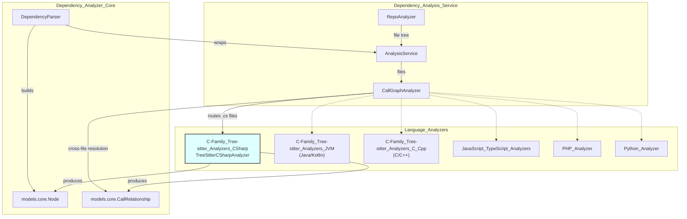
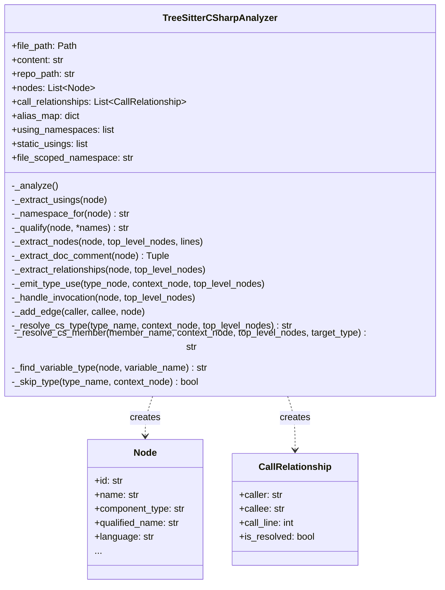
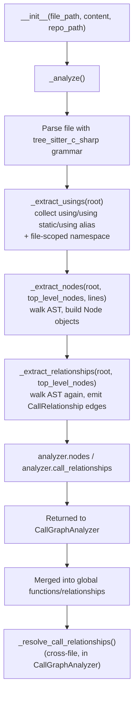
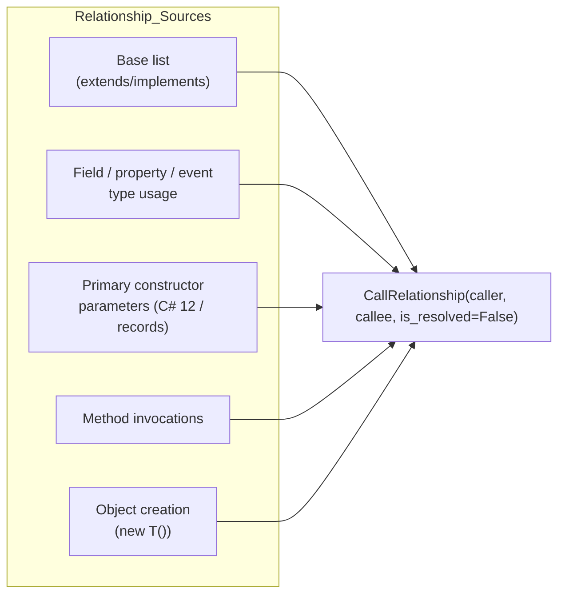
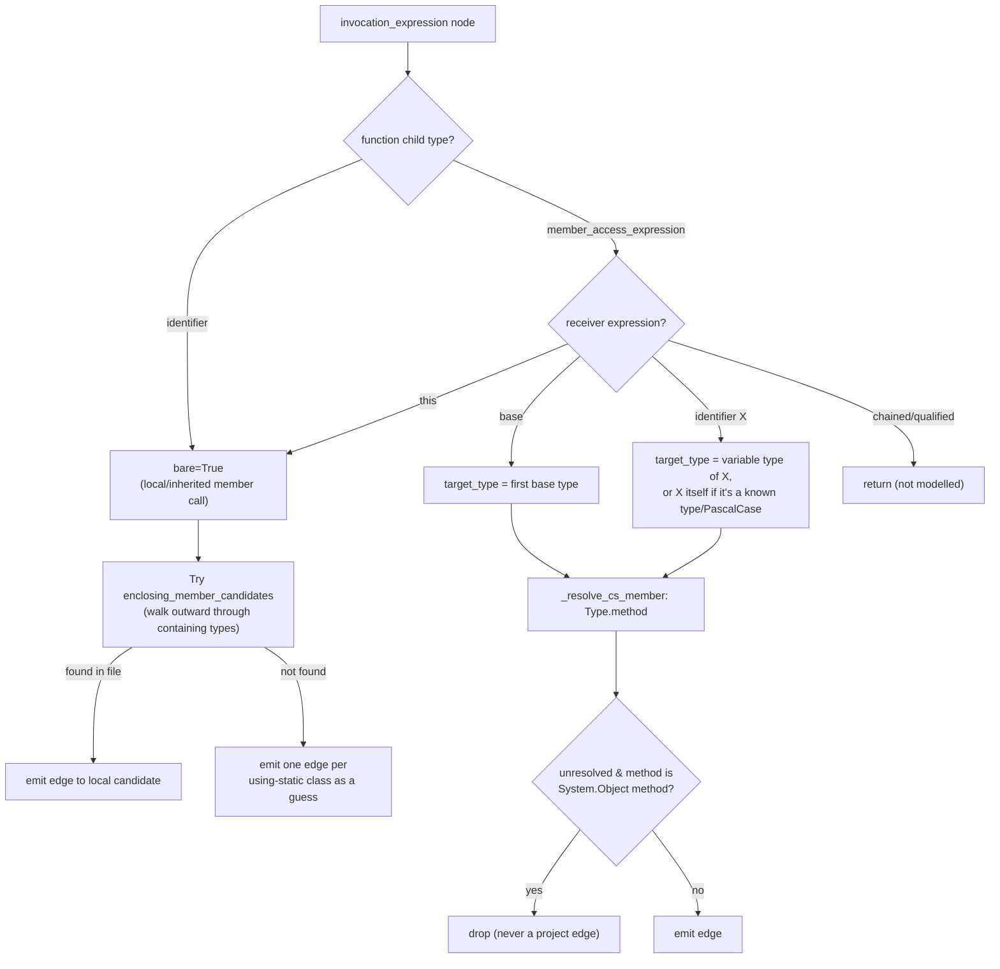
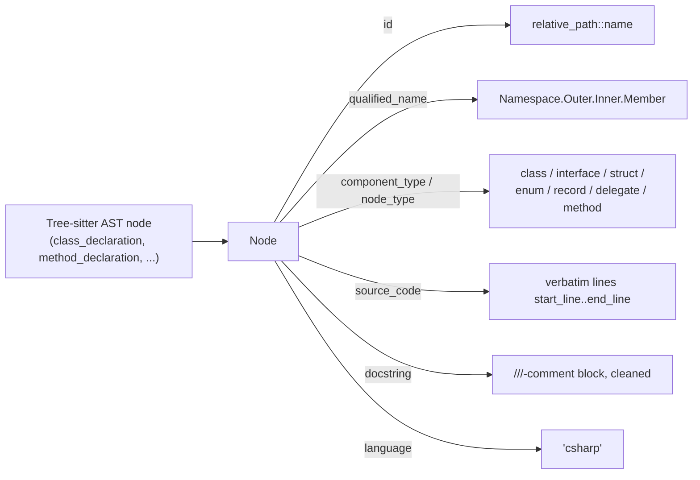

# C-Family Tree-sitter Analyzers: C#

## Introduction

The **C-Family_Tree-sitter_Analyzers_CSharp** module implements the C# language analyzer for CodeWiki's [Dependency_Analysis_Service](Dependency_Analysis_Service.md). It parses `.cs` source files with [tree-sitter](https://tree-sitter.github.io/tree-sitter/) grammars, extracts structural components (classes, interfaces, structs, enums, records, delegates, methods) as graph `Node`s, and emits unresolved `CallRelationship` edges for inheritance, field/property typing, object creation, and method invocations. These raw, per-file artifacts are then handed to the shared, language-agnostic [`CallGraphAnalyzer`](Dependency_Analysis_Service.md) for cross-file symbol resolution.

This module is a sibling of the other C-family analyzers — [C/C++](C-Family_Tree-sitter_Analyzers_C_Cpp.md) and [Java/Kotlin](C-Family_Tree-sitter_Analyzers_JVM.md) — and was explicitly "ported" from the Java analyzer so that C# reaches feature parity: methods are first-class components, names are namespace-qualified, `using` directives drive symbol resolution, and every cross-reference is emitted *unresolved*, deferring the actual linking decision to the shared resolver.

It contains a single core component:

| Component | File | Responsibility |
|---|---|---|
| `TreeSitterCSharpAnalyzer` | `codewiki/src/be/dependency_analyzer/analyzers/csharp.py` | Parses one C# file into `Node` and `CallRelationship` objects |
| `analyze_csharp_file` | same file | Thin functional wrapper instantiating the analyzer and returning its results |

---

## Position in the System

The analyzer is invoked exclusively by `CallGraphAnalyzer._analyze_csharp_file` (see [Dependency_Analysis_Service](Dependency_Analysis_Service.md)), which:
1. Reads file content and routes it based on extension/language detection.
2. Calls `analyze_csharp_file(file_path, content, repo_path)`.
3. Merges the returned `Node`s into its global function map and `CallRelationship`s into its global relationship list.
4. Later runs `_resolve_call_relationships` to turn the analyzer's *unresolved* edges into resolved, cross-file links (or drops them as external/noise).

The resulting `Node`/`CallRelationship` graph feeds the [Dependency_Analyzer_Core](Dependency_Analyzer_Core.md) (`DependencyParser`, `DependencyGraphBuilder`) and ultimately the [Backend LLM & Documentation Services](Backend_LLM_&_Documentation_Services.md) that generate the final wiki.

---

## Design Philosophy: "Resolve First, Filter Second"

A defining principle of this analyzer (and its Java/Kotlin siblings) is that **all** cross-references are emitted as unresolved `CallRelationship` candidates with `is_resolved=False`, deferring both linking and external-symbol filtering to `CallGraphAnalyzer`:

- Framework types (`List`, `Console`, `Task`, …) are **not** filtered at extraction time — doing so would silently drop a real edge whenever a project type shadows a framework name.
- Only true language primitives (`int`, `string`, `var`, …) and generic type parameters in scope are excluded early via `_skip_type`.
- The shared resolver (`CallGraphAnalyzer._is_external_callee`) later classifies any still-unresolved dotted callee as external if its namespace has no prefix relationship to any known project namespace.

This keeps the analyzer intentionally "dumb" about what is a real project symbol, pushing that decision to a stage with global visibility across all parsed files.

---

## Architecture

`Node` and `CallRelationship` are the shared pydantic models defined in [Dependency_Analyzer_Core](Dependency_Analyzer_Core.md) (`codewiki/src/be/dependency_analyzer/models/core.py`), used uniformly across all language analyzers.

---

## Processing Pipeline

### 1. Using-Directive Extraction (`_extract_usings`)

A full AST walk (not regex) collects three forms of `using`:

- **Plain**: `using MyApp.Models;` → appended to `using_namespaces`.
- **Static**: `using static MyApp.Helpers;` → appended to `static_usings`.
- **Alias**: `using S = System.Text;` → recorded in `alias_map["S"] = "System.Text"`.

It also records the `file_scoped_namespace` (C# 10+ `namespace Foo;` syntax), which combines with any nested block `namespace_declaration`s (see `_namespace_for`) to compute the fully qualified namespace at any AST location.

### 2. Node Extraction (`_extract_nodes`)

Recursively walks the tree, recognizing these declaration types and assigning a `component_type`:

| AST Node Type | `component_type` |
|---|---|
| `class_declaration` | `class` / `static class` / `abstract class` |
| `interface_declaration` | `interface` |
| `struct_declaration` | `struct` |
| `enum_declaration` | `enum` |
| `record_declaration` | `record` / `record struct` |
| `delegate_declaration` | `delegate` |
| `method_declaration` | `method` (named `ClassName.MethodName`) |

For each recognized declaration:
- `qualified_name` is computed via `_qualify` = namespace + enclosing type names + own name (dot-joined).
- `component_id` = `relative_file_path::name` (via `_get_component_id`).
- XML doc comments (`///`) immediately preceding the node are captured via `_extract_doc_comment`, skipping over attribute lists (`[Attr]`).
- The resulting `Node` is indexed in `top_level_nodes` under multiple keys — its simple name, its component id, its fully qualified name, and the last segment of the qualified name — so later relationship resolution can match declarations found anywhere in the same file by several naming conventions.

### 3. Relationship Extraction (`_extract_relationships`)

A second AST walk detects four categories of cross-references, always emitted with `is_resolved=False`:

- **Base list**: `class Foo : Bar, IBaz` → edges `Foo -> Bar`, `Foo -> IBaz` (C# doesn't distinguish base class from interfaces syntactically).
- **Field / property / event declarations**: the declared type is resolved and linked from the containing class.
- **Primary constructor parameters**: C# 12 primary constructors and record parameter lists are treated like field type usages.
- **Invocation expressions** (`_handle_invocation`): the most complex case — see below.
- **Object creation expressions**: `new Foo()` inside a method links the containing class to `Foo`.

#### Invocation Resolution Logic (`_handle_invocation`)

Key heuristics:
- **`this.Method()`** and bare `Method()` calls are attributed to the enclosing type chain (`_enclosing_member_candidates` walks outward from innermost to outermost containing type).
- **`base.Method()`** resolves to the first listed base type.
- **Identifier receivers** (`obj.Method()`) use `_find_variable_type` to look up the declared type of a local variable, parameter, field, or property — including `var x = new T()` inference — falling back to treating a PascalCase identifier as a static type reference (all-caps identifiers are treated as constants, not types).
- **Chained/qualified receivers** (`a.B().C()`, `Outer.Inner.M()`) are explicitly *not* modelled and skipped — a known, documented limitation.
- **`using static`** ambiguity: when a bare call can't be matched to any enclosing member, the analyzer emits one *candidate* edge per statically-imported class, since it cannot determine at parse time which one actually contains the member. Only the correct guess will resolve downstream; the rest are pruned by the shared resolver as external/unmatched.
- Calls resolving to a name in `CSHARP_OBJECT_METHODS` (from `codewiki/src/be/dependency_analyzer/utils/external_symbols.py`) that don't match a real project node are dropped, since they represent inherited `System.Object` members (`ToString`, `Equals`, `GetHashCode`, …) rather than project code.

### 4. Type Resolution Helpers

- **`_unwrap_type`**: strips `nullable_type`, `array_type`, `pointer_type`, and `generic_name` wrappers down to a bare type identifier (e.g., `List<Foo>?[]` → `List`).
- **`_skip_type`**: filters out C# primitives (`int`, `string`, `var`, `dynamic`, …) and any generic type parameter currently in scope (walked up through enclosing type/method declarations via `_find_type_parameters`).
- **`_resolve_cs_type`**: attempts to qualify a bare type name against, in order: alias map, enclosing type nesting (nested-type shadowing), then each `using` namespace — returning the first match found in `top_level_nodes` (same-file symbols). If nothing matches, it returns the bare simple name, deliberately *not* fabricating a namespace, so that:
  - A genuine project type in another file can still match by tail/simple name in the cross-file resolver.
  - A third-party type from an external library correctly stays unqualified, allowing `CallGraphAnalyzer`'s namespace-origin rule to classify it as external instead of confusing it with the current file's own namespace.
- **`_resolve_cs_member`**: builds a `Type.member` candidate string from a resolved receiver type, preferring an exact match in `top_level_nodes`, falling back to the simple (non-namespaced) type name.

---

## Data Model Mapping

Every extracted declaration becomes a `Node` (shared model, see [Dependency_Analyzer_Core](Dependency_Analyzer_Core.md)):

Every cross-reference becomes a `CallRelationship` (`caller`, `callee`, `call_line`, `is_resolved=False`), always pointing from a component id (or a best-effort candidate string) to another. The `caller` is either:
- the containing type's `component_id` (for base lists, field types, object creation without a specific method context), or
- the containing method's `component_id` when available (for invocations inside a method body).

The `callee` may be a fully resolved candidate (`Namespace.Type.Method`) or, in the "using static" guess case, one candidate string per static-import target — several unresolved edges from a single call site, of which at most one is expected to eventually resolve.

---

## Known Limitations

As documented directly in the source module docstring, these gaps are deliberate trade-offs rather than bugs:

1. **Partial classes** across multiple files each produce their own `Node` sharing the same qualified name; a bare reference is never arbitrarily bound to one half, so it may remain an honest unresolved gap.
2. **Top-level statements** (`global_statement`, C# 9+ top-level `Main`) have no containing type, so calls made there are not attributed to any caller.
3. **Cross-file `global using` visibility** is not modelled — visibility of `global using` directives declared in one file but used in another is not tracked.
4. **`new()` implicit object creation** (target-typed `new`) is not resolved to a concrete type.
5. **Tuple types** are not modelled as type references.
6. **Chained-receiver typing** (`a.B().C()`) is not resolved — the analyzer explicitly bails out on such invocation chains.

These limitations mean some real C# call edges will simply not appear in the dependency graph rather than being mis-attributed — consistent with the module's "resolve first, filter second" philosophy of preferring an honest gap over a false edge.

---

## Related Modules

- [Dependency_Analysis_Service](Dependency_Analysis_Service.md) — orchestrates repository-wide analysis; `CallGraphAnalyzer` is the sole caller of this module and performs cross-file resolution and external-symbol filtering.
- [Dependency_Analyzer_Core](Dependency_Analyzer_Core.md) — defines the shared `Node`/`CallRelationship` models and the `DependencyParser`/`DependencyGraphBuilder` that consume the aggregated graph.
- [C-Family_Tree-sitter_Analyzers_JVM](C-Family_Tree-sitter_Analyzers_JVM.md) — the Java analyzer this C# analyzer was ported from; shares the namespace/package-origin resolution rule in `CallGraphAnalyzer`.
- [C-Family_Tree-sitter_Analyzers_C_Cpp](C-Family_Tree-sitter_Analyzers_C_Cpp.md) — sibling C-family analyzer for C/C++.
- [Backend_LLM_&_Documentation_Services](Backend_LLM_&_Documentation_Services.md) — consumes the final dependency graph to generate module documentation such as this file.
