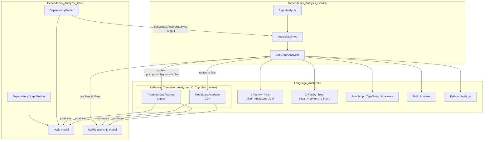
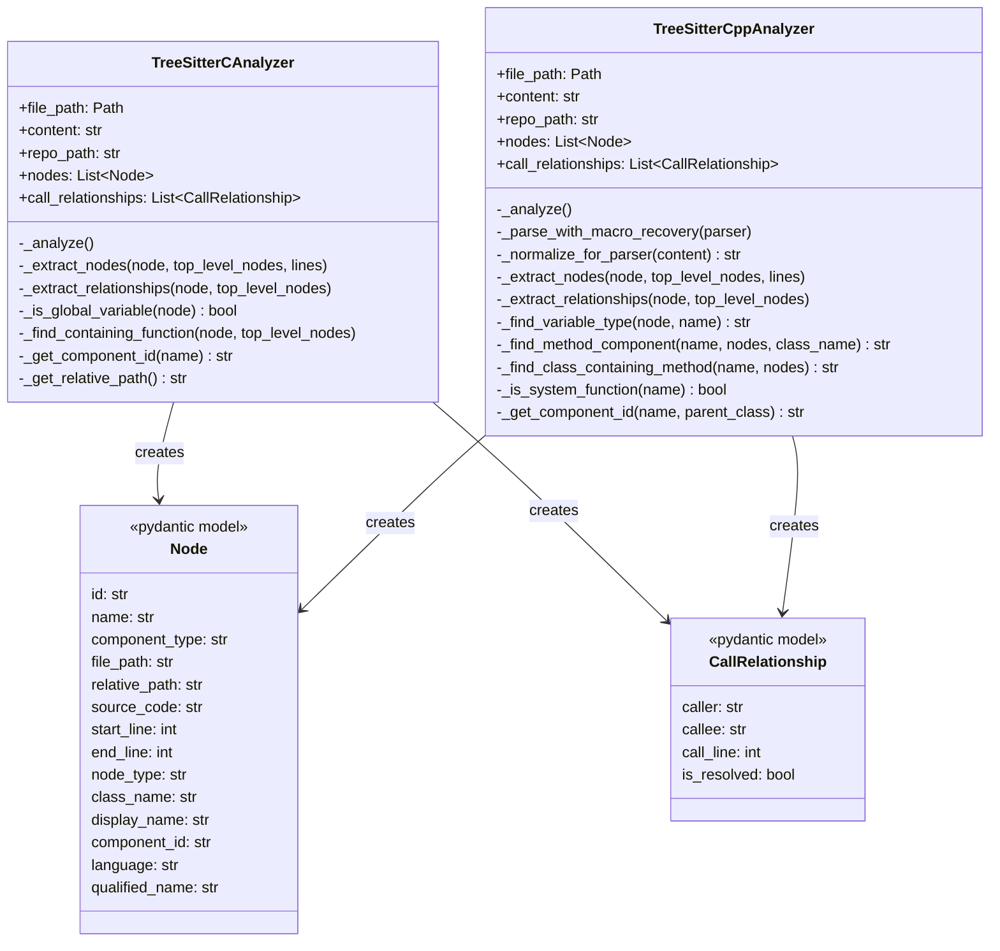
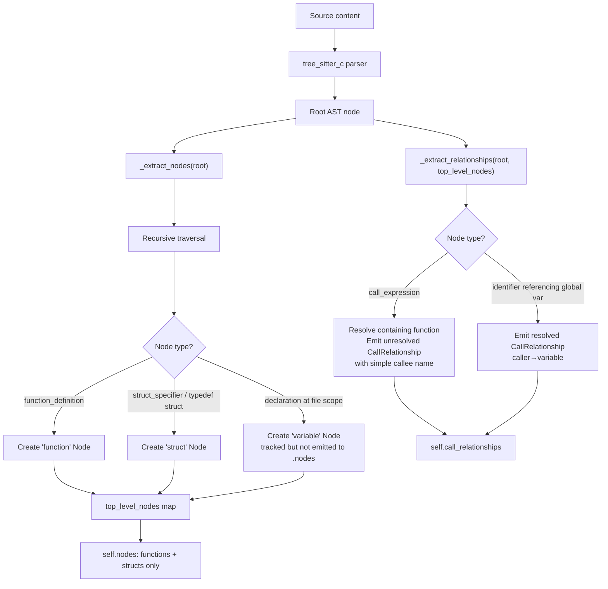
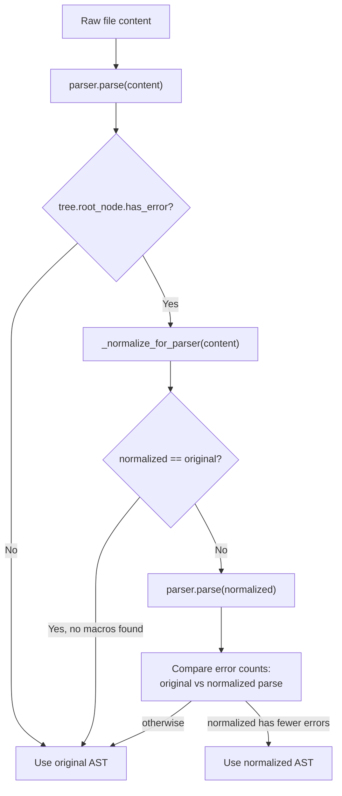
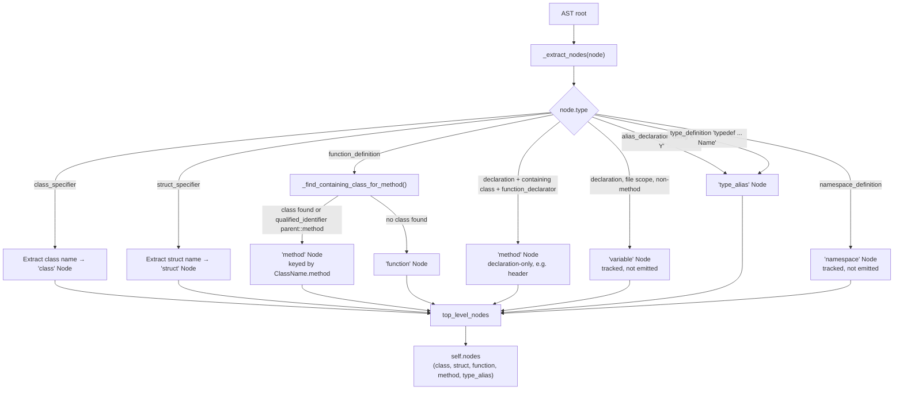
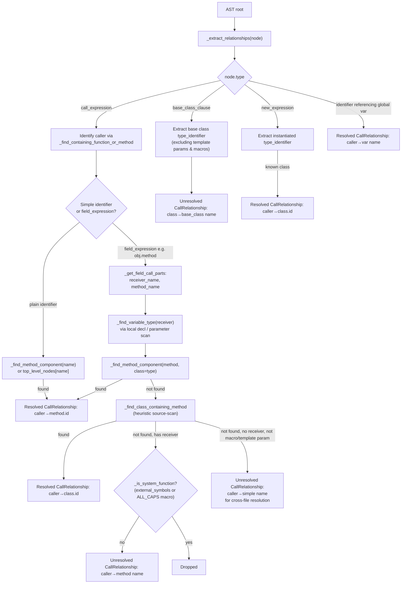
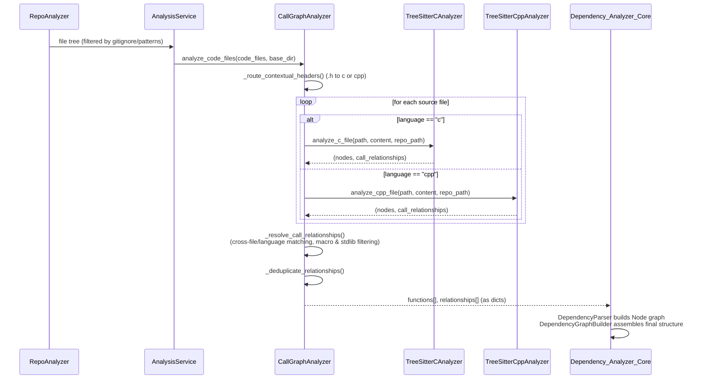

# C-Family Tree-sitter Analyzers: C & C++

## Introduction

The **C-Family Tree-sitter Analyzers (C/C++)** module provides static-analysis capabilities for C and C++ source files within the CodeWiki dependency-analysis pipeline. It is implemented as two sibling analyzers — `TreeSitterCAnalyzer` and `TreeSitterCppAnalyzer` — that each parse a single source file with [tree-sitter](https://tree-sitter.github.io/tree-sitter/) grammars (`tree_sitter_c` / `tree_sitter_cpp`), extract structural code components (functions, structs, classes, methods, global variables, type aliases, namespaces), and record call/usage relationships between them.

These analyzers are one of several language-specific plugins invoked by the [Dependency_Analysis_Service](Dependency_Analysis_Service.md)'s `CallGraphAnalyzer`, which is responsible for orchestrating multi-language repository analysis, cross-file/cross-language relationship resolution, and external-symbol filtering. The analyzers in this module only perform **single-file, language-specific extraction** — all cross-file resolution and unresolved-call filtering happens centrally afterward.

This module is a sibling to the other Tree-sitter-based language analyzer families:
- [C-Family_Tree-sitter_Analyzers_JVM](C-Family_Tree-sitter_Analyzers_JVM.md) (Java, Kotlin)
- [C-Family_Tree-sitter_Analyzers_CSharp](C-Family_Tree-sitter_Analyzers_CSharp.md) (C#)
- [JavaScript_TypeScript_Analyzers](JavaScript_TypeScript_Analyzers.md)
- [PHP_Analyzer](PHP_Analyzer.md)
- [Python_Analyzer](Python_Analyzer.md)

All of these plug into the same [Dependency_Analysis_Service](Dependency_Analysis_Service.md) and produce the same `Node` / `CallRelationship` data model defined in [Dependency_Analyzer_Core](Dependency_Analyzer_Core.md).

---

## Module Position in the System



The `CallGraphAnalyzer` (see [Dependency_Analysis_Service](Dependency_Analysis_Service.md)) decides, per file, which analyzer to invoke:
- `.c` files → `TreeSitterCAnalyzer`
- `.cpp`, `.cc`, `.cxx`, `.c++`, `.hpp`, `.hxx`, `.h++` → `TreeSitterCppAnalyzer`
- Ambiguous `.h` headers → routed to C++ if the header content shows C++ signals (namespaces, classes, templates, `::`, or C++ standard headers) **or** if the repository contains only C++ files and no C files (`_route_contextual_headers` / `_header_has_cpp_signal` in `CallGraphAnalyzer`).

---

## Component Overview



See [Dependency_Analyzer_Core](Dependency_Analyzer_Core.md) for the full `Node` and `CallRelationship` model definitions used throughout all language analyzers.

---

## `TreeSitterCAnalyzer` (c.py)

### Purpose
Parses a single `.c`/`.h` file using the `tree_sitter_c` grammar and extracts:
- **Functions** (`function_definition`)
- **Structs** (`struct_specifier`, and `typedef struct { ... } Name;` via `type_definition`)
- **Global variables** (top-level `declaration` nodes not nested inside a function)

It also records two kinds of relationships:
1. **Function → function calls** (`call_expression` inside a function body)
2. **Function → global variable usage** (identifier reference to a known global variable)

### Construction & Entry Point

```python
TreeSitterCAnalyzer(file_path, content, repo_path=None)
```
On construction, `_analyze()` runs immediately, populating `self.nodes` and `self.call_relationships`. The convenience function:

```python
analyze_c_file(file_path, content, repo_path=None) -> (List[Node], List[CallRelationship])
```

is the module-level entry point used by `CallGraphAnalyzer._analyze_c_file`.

### ID Scheme
- **`component_id`**: `"<relative_path>::<name>"` (e.g. `src/utils.c::compute_sum`)
- **module path** (`_get_module_path`): dotted path with `.c`/`.h` extension stripped, used for module grouping.

### Processing Flow



### Key Behaviors
- **Global variable detection** (`_is_global_variable`): walks up the parent chain; if any ancestor is a `function_definition`, the declaration is local, not global.
- **Struct name extraction** handles both direct `struct Name {}` and `typedef struct {} Name;` forms.
- **Call resolution deferral**: called function names are recorded as **simple names** with `is_resolved=False`. Filtering out libc/standard-library calls (e.g. `printf`, `malloc`) is intentionally **not** done here — it is deferred to `CallGraphAnalyzer` after cross-file resolution, so a project function that happens to shadow a libc name is not incorrectly dropped.
- Global variables are tracked in `top_level_nodes` for relationship resolution but are **not** added to `self.nodes` (only `function` and `struct` types are emitted as first-class components).

---

## `TreeSitterCppAnalyzer` (cpp.py)

### Purpose
A significantly more sophisticated analyzer for C++ that extracts:
- **Classes** (`class_specifier`)
- **Structs** (`struct_specifier`)
- **Functions** and **methods** (`function_definition`, disambiguated by whether a containing class is found)
- **Global variables** (top-level `declaration`)
- **Type aliases** (`using X = Y;` via `alias_declaration`, and `typedef` via `type_definition`)
- **Namespaces** (`namespace_definition`) — tracked structurally but not added to `self.nodes`

It records relationships for:
1. Function/method → function/method **calls** (including member calls via `field_expression`, e.g. `obj.method()` / `ptr->method()`)
2. Class → **base class** inheritance (`base_class_clause`)
3. Function/method → **object instantiation** (`new_expression`)
4. Function/method → **global variable usage**

### Construction & Entry Point

```python
TreeSitterCppAnalyzer(file_path, content, repo_path=None)
analyze_cpp_file(file_path, content, repo_path=None) -> (List[Node], List[CallRelationship])
```
Used by `CallGraphAnalyzer._analyze_cpp_file`.

### ID Scheme
- Free functions/classes/structs/type aliases: `"<relative_path>::<name>"`
- Methods: `"<relative_path>::<ClassName>.<method_name>"` (qualified with parent class via `_get_component_id(name, parent_class)`)
- `qualified_name` on the `Node` mirrors this: `"<ClassName>.<name>"` for methods, plain `name` otherwise.

### Macro-Tolerant Parsing

A distinctive feature of this analyzer is **macro recovery parsing**, designed to keep tree-sitter's C++ grammar from choking on export/visibility macros commonly found in real-world C++ codebases (e.g. `EXPORT_API void foo()`, `class LIB_API Logger {`, `LIB_BEGIN_NAMESPACE`).



Normalization strategy (`_normalize_for_parser`, driven by regexes):
- `_STANDALONE_MACRO_RE`: blanks lines that are *only* an ALL_CAPS macro (optionally macro-call style), e.g. `LIB_BEGIN_NAMESPACE` — preserves line numbers by replacing with an empty line rather than deleting it.
- `_SPECIFIER_MACRO_RE` / `_SPECIFIER_MACRO_CALL_RE`: strips an ALL_CAPS specifier macro (plain or function-call-like, e.g. `VISIBILITY("default")`) sitting directly before a declaration, at the start of a line or after a structural delimiter (`{`, `}`, `;`, `>`, `,`).
- `_KEYWORD_MACRO_RE`: strips an ALL_CAPS macro sitting between a `class`/`struct`/`union`/`enum` keyword and the real type name (e.g. `class LIB_API Logger` → `class Logger`).

All of these gate on `is_macro_name(...)` from `codewiki.src.be.dependency_analyzer.utils.external_symbols`, which relies on the **ALL_CAPS naming convention** rather than any hardcoded library-specific macro list — keeping the heuristic name-agnostic and safe for arbitrary codebases. Crucially, the self-correcting error-count comparison means normalization is a no-op for clean code (files with e.g. Win32-style ALL_CAPS *type* names like `HANDLE`/`DWORD` are never touched unless normalization measurably reduces parse errors).

### Node Extraction Flow



`top_level_nodes` is populated with multiple keys per method (component_id, `ClassName.method`, and bare method name as fallback) to make later relationship resolution robust regardless of how the call site refers to it.

### Relationship Extraction Flow



### Notable Resolution Helpers

| Helper | Purpose |
|---|---|
| `_find_variable_type` | Scans enclosing scopes (`compound_statement`, `field_declaration_list`, function parameters) to infer the declared type of a receiver variable used in `obj.method()` calls, enabling precise method resolution. |
| `_find_method_component` | Looks up a method by `ClassName.method` key first, then falls back to any method with a matching simple name across the file. |
| `_find_class_containing_method` | Heuristic fallback: scans a class's raw `source_code` text for a line containing `method_name(` combined with common return-type tokens (`void`, `int`, `bool`, or the class name itself) — used when the method wasn't independently extracted as a node (e.g., inline-defined in a header without separate declaration). |
| `_find_template_parameters` | Walks up to enclosing `template_declaration` nodes to collect in-scope type parameter names (e.g. `T`), preventing them from being misreported as unresolved project symbols or spurious base classes. |
| `_is_system_function` | Combines `is_external_symbol("cpp", name)` (curated stdlib/STL name check from `external_symbols`) with `is_macro_name(name)` (ALL_CAPS convention) to decide whether an unresolved member call should be suppressed rather than emitted as noise. |
| `_get_qualified_declarator_parts` | Extracts the parts of a `qualified_identifier` declarator (e.g. `Namespace::Class::method`) to recover the containing class even in out-of-class method definitions (`ReturnType ClassName::method() { ... }`). |

---

## Shared Design Patterns Across Both Analyzers

Both analyzers follow the same overall contract expected by `CallGraphAnalyzer` and `DependencyParser` (see [Dependency_Analyzer_Core](Dependency_Analyzer_Core.md)):

1. **Single-file, self-contained analysis** — no cross-file lookups are performed inside the analyzer itself.
2. **Two-pass traversal** — first pass (`_extract_nodes`) builds a `top_level_nodes` dictionary of all extractable symbols in the file; second pass (`_extract_relationships`) walks the tree again to record calls/usages, using the dictionary built in pass one for local resolution.
3. **Deferred resolution / filtering** — calls to symbols not found locally are emitted as `CallRelationship(is_resolved=False, callee=<simple name>)`. The heavy lifting of matching these across files/languages and filtering out genuinely external calls is centralized in `CallGraphAnalyzer._resolve_call_relationships` and `_is_external_callee` (see [Dependency_Analysis_Service](Dependency_Analysis_Service.md)).
4. **Component ID convention** — `"<relative_path_from_repo_root>::<name>"`, with methods further qualified by `.<ClassName>` prefix on the name portion in C++.
5. **`Node` / `CallRelationship` models** are shared Pydantic models from [Dependency_Analyzer_Core](Dependency_Analyzer_Core.md), ensuring uniform downstream consumption (dependency graph building, LLM documentation generation) regardless of source language.

---

## Data Flow: From Repository File to Call Graph



---

## Extension Points & Limitations

- **Language coverage**: Only standard C/C++ constructs are handled. Preprocessor directives (`#ifdef`, `#define` expansions beyond the macro-name heuristic) are not evaluated — the analyzer works purely on tree-sitter's syntactic parse.
- **Type resolution for calls** is best-effort (`_find_variable_type` only looks at local declarations/parameters in enclosing scopes, not full type inference), so complex call chains (e.g. through container elements or lambda captures) may resolve as unresolved calls, which is by design deferred to cross-file resolution or safely dropped as external.
- **Macro normalization** is purposely conservative (error-count comparison) to avoid corrupting legitimately macro-styled type names.
- Both analyzers rely on `codewiki.src.be.dependency_analyzer.utils.external_symbols` for the `is_external_symbol` / `is_macro_name` heuristics shared with the central `CallGraphAnalyzer` filtering step — keeping the external-vs-project distinction consistent across the whole pipeline (see [Dependency_Analysis_Service](Dependency_Analysis_Service.md) for the centralized filtering logic in `_is_external_callee`).

---

## Related Documentation

- [Dependency_Analysis_Service](Dependency_Analysis_Service.md) — orchestrates repository scanning, invokes these analyzers via `CallGraphAnalyzer`, and performs cross-file/language relationship resolution and external-symbol filtering.
- [Dependency_Analyzer_Core](Dependency_Analyzer_Core.md) — defines the shared `Node`, `CallRelationship` models, `DependencyParser`, and `DependencyGraphBuilder` that consume this module's output.
- [C-Family_Tree-sitter_Analyzers_JVM](C-Family_Tree-sitter_Analyzers_JVM.md) — sibling analyzers for Java/Kotlin using the same architectural pattern.
- [C-Family_Tree-sitter_Analyzers_CSharp](C-Family_Tree-sitter_Analyzers_CSharp.md) — sibling analyzer for C#.
- [JavaScript_TypeScript_Analyzers](JavaScript_TypeScript_Analyzers.md), [PHP_Analyzer](PHP_Analyzer.md), [Python_Analyzer](Python_Analyzer.md) — other language-specific analyzer families in the [Language_Analyzers](Dependency_Analysis_Service.md) group.
