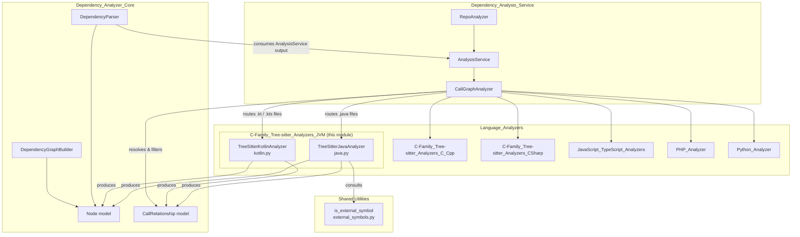
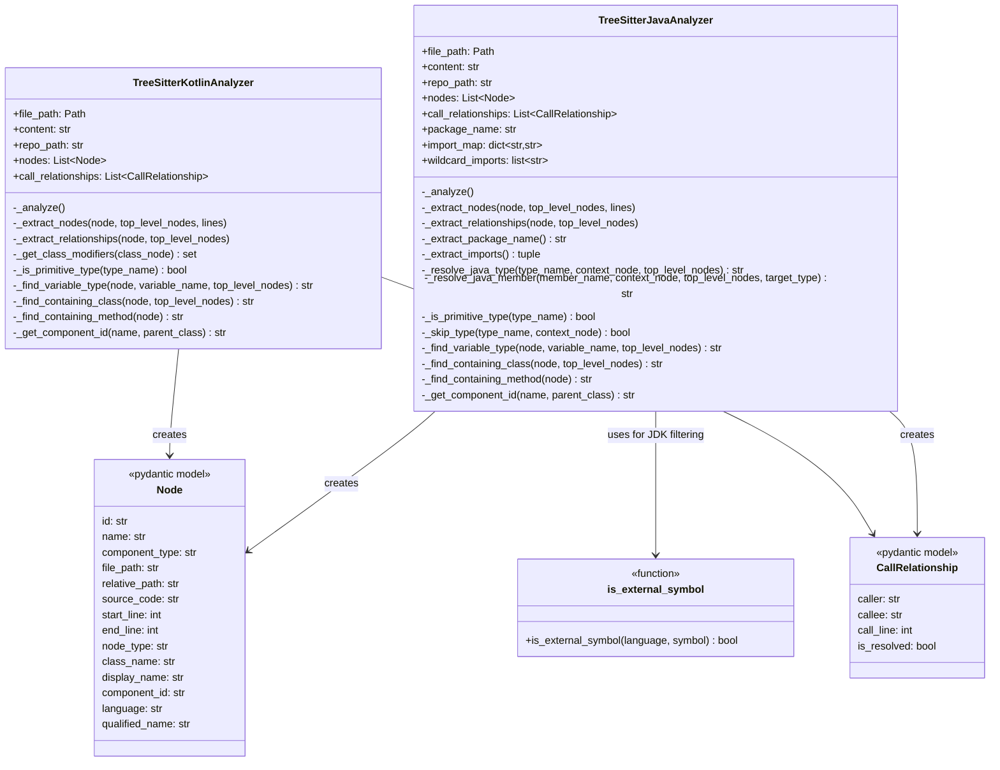
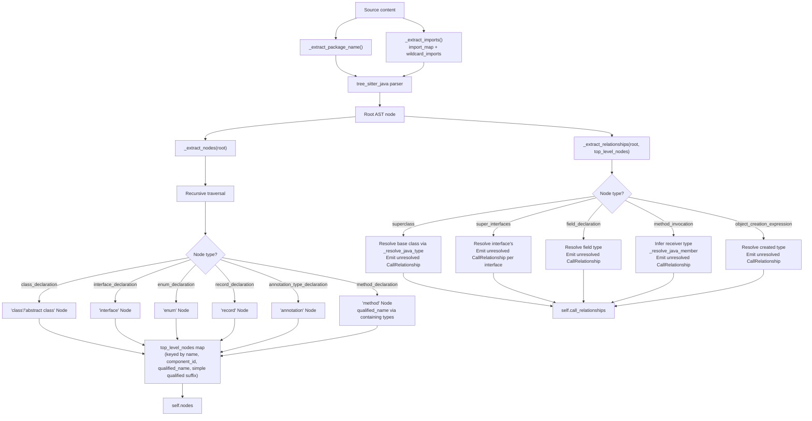
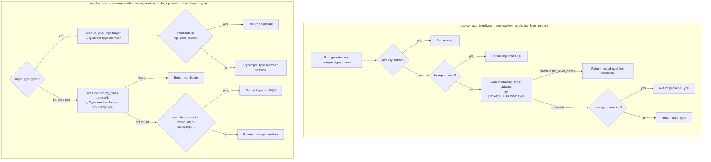
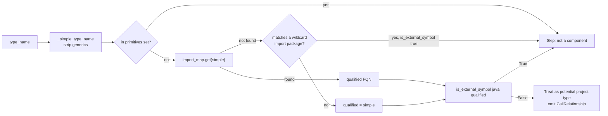
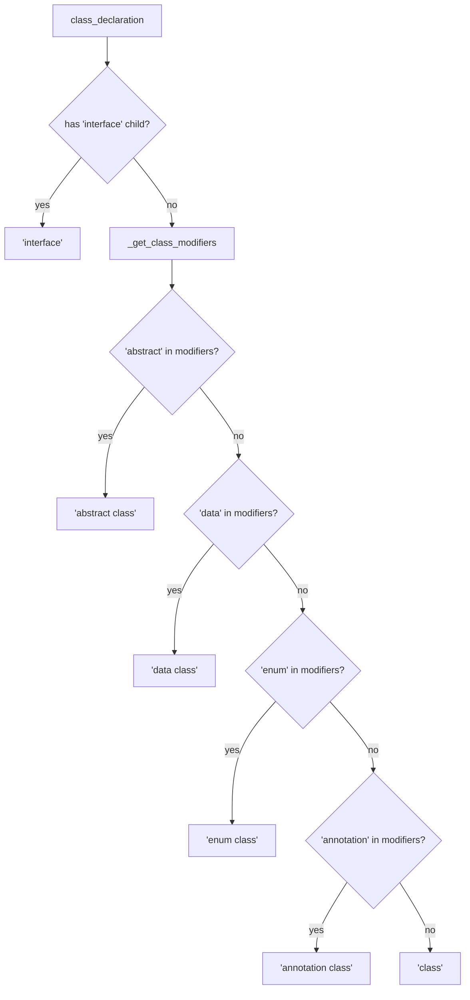
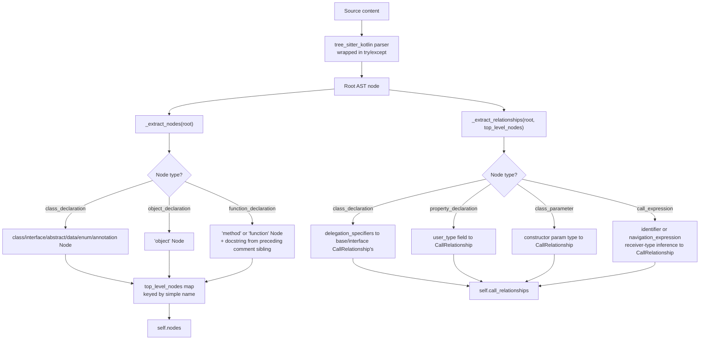
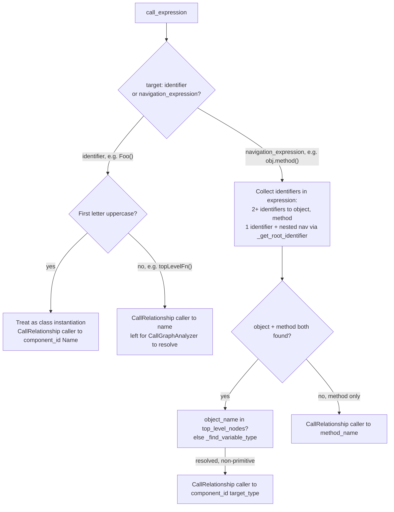

# C-Family Tree-sitter Analyzers: JVM (Java & Kotlin)

## Introduction

The **C-Family Tree-sitter Analyzers (JVM)** module provides static-analysis capabilities for Java and Kotlin source files within the CodeWiki dependency-analysis pipeline. It is implemented as two sibling analyzers — `TreeSitterJavaAnalyzer` and `TreeSitterKotlinAnalyzer` — that each parse a single source file with [tree-sitter](https://tree-sitter.github.io/tree-sitter/) grammars (`tree_sitter_java` / `tree_sitter_kotlin`), extract structural code components (classes, interfaces, enums, records, annotations, objects, methods, functions), and record inheritance/usage/call relationships between them.

Compared to the [C-Family_Tree-sitter_Analyzers_C_Cpp](C-Family_Tree-sitter_Analyzers_C_Cpp.md) sibling, the JVM analyzers are distinguished by **package/import-aware name resolution**: Java code is organized around `package` declarations and explicit `import` statements (including wildcard imports and static imports), which the Java analyzer parses and uses to qualify every type reference it encounters. This lets it resolve simple names like `Logger` to their fully-qualified form (`com.example.util.Logger`) and to reliably distinguish project types from JDK/runtime types using the shared [`is_external_symbol`](Dependency_Analyzer_Core.md) classifier. The Kotlin analyzer is comparatively lighter-weight (no import-table construction) and relies on a curated built-in/primitive-type set plus local variable/parameter scanning to avoid false-positive edges to standard-library types.

These analyzers are two of several language-specific plugins invoked by the [Dependency_Analysis_Service](Dependency_Analysis_Service.md)'s `CallGraphAnalyzer`, which orchestrates multi-language repository analysis, cross-file/cross-language relationship resolution, and external-symbol filtering. The analyzers documented here perform only **single-file, language-specific extraction** — all cross-file resolution and unresolved-call filtering happens centrally afterward in `CallGraphAnalyzer`.

This module is a sibling to the other Tree-sitter-based language analyzer families under [Language_Analyzers](C-Family_Tree-sitter_Analyzers.md):
- [C-Family_Tree-sitter_Analyzers_C_Cpp](C-Family_Tree-sitter_Analyzers_C_Cpp.md) (C, C++)
- [C-Family_Tree-sitter_Analyzers_CSharp](C-Family_Tree-sitter_Analyzers_CSharp.md) (C#)
- [JavaScript_TypeScript_Analyzers](JavaScript_TypeScript_Analyzers.md)
- [PHP_Analyzer](PHP_Analyzer.md)
- [Python_Analyzer](Python_Analyzer.md)

All of these plug into the same [Dependency_Analysis_Service](Dependency_Analysis_Service.md) and produce the same `Node` / `CallRelationship` data model defined in [Dependency_Analyzer_Core](Dependency_Analyzer_Core.md).

---

## Module Position in the System



The `CallGraphAnalyzer` (see [Dependency_Analysis_Service](Dependency_Analysis_Service.md)) dispatches per file:
- `.java` files → `TreeSitterJavaAnalyzer` (via `_analyze_java_file`)
- `.kt` / `.kts` files → `TreeSitterKotlinAnalyzer` (via `_analyze_kotlin_file`)

Both analyzers emit `Node` and `CallRelationship` lists that flow, unmodified in shape, into `CallGraphAnalyzer`'s repository-wide resolution indexes and external-symbol filter, and from there into [`DependencyParser`](Dependency_Analyzer_Core.md) and [`DependencyGraphBuilder`](Dependency_Analyzer_Core.md).

---

## Component Overview



See [Dependency_Analyzer_Core](Dependency_Analyzer_Core.md) for the full `Node` and `CallRelationship` model definitions used throughout all language analyzers.

---

## `TreeSitterJavaAnalyzer` (java.py)

### Purpose

Parses a single `.java` file using the `tree_sitter_java` grammar and extracts:
- **Classes** (`class_declaration`), further distinguished as `class` vs `abstract class` via modifier inspection
- **Interfaces** (`interface_declaration`)
- **Enums** (`enum_declaration`)
- **Records** (`record_declaration`)
- **Annotations** (`annotation_type_declaration`)
- **Methods** (`method_declaration`), qualified with their containing type as `ClassName.methodName`

It records relationships for:
1. **Inheritance** — `class X extends Y` (`superclass` clause)
2. **Interface implementation** — `class/enum/record X implements Y, Z` (`super_interfaces` clause)
3. **Field type usage** — a field's declared type referencing another project type
4. **Method calls** — both bare calls (`foo()`) and calls on a receiver (`obj.foo()`), with receiver-type inference
5. **Object creation** — `new SomeType(...)`

### Construction & Entry Point

```python
TreeSitterJavaAnalyzer(file_path, content, repo_path=None)
```
On construction, `__init__` immediately extracts the package name and import table, then runs `_analyze()`, populating `self.nodes` and `self.call_relationships`. The module-level convenience function:

```python
analyze_java_file(file_path, content, repo_path=None) -> (List[Node], List[CallRelationship])
```
is the entry point used by `CallGraphAnalyzer._analyze_java_file`.

### Package & Import Awareness

Unlike the C/C++ analyzers, Java's ID scheme must account for a real module/namespace system. On construction the analyzer:

1. **`_extract_package_name()`** — regex-matches the `package a.b.c;` statement (if any).
2. **`_extract_imports()`** — regex-scans every `import [static] a.b.C[.*];` statement, building:
   - `import_map: dict[str, str]` — simple name → fully-qualified name (e.g. `{"List": "java.util.List"}`), including static imports (`{"checkNotNull": "com.google.common.base.Preconditions.checkNotNull"}`).
   - `wildcard_imports: list[str]` — package prefixes from `import a.b.*;` statements, used only as a fallback signal for JDK-package detection (a project's own wildcard imports fall through to normal resolution).

These two structures power the "qualify a bare type/member name" logic in `_resolve_java_type` / `_resolve_java_member`, described below.

### ID Scheme

- **`component_id`** (via `_get_component_id`): `"<relative_path>::<name>"`, where `<name>` for a method is already `ClassName.methodName` (nested classes are **not** further nested in the component_id path — only `qualified_name` reflects full nesting).
- **`qualified_name`** (via `_qualified_type_name` / `_qualified_member_name`): the fully package-and-outer-class-qualified name, e.g. `com.example.Outer.Inner.method`, built by walking `_find_containing_type_names` (all enclosing class/interface/enum/record/annotation declarations) and prefixing the file's `package_name`.

This dual scheme means `component_id` is used for the graph key (matching the `<relative_path>::<name>` convention shared by all analyzers), while `qualified_name` is the semantically precise, package-qualified name used to resolve cross-references that mention the fully-qualified or partially-qualified form.

### Processing Flow



### Type & Member Resolution

The core resolution logic lives in two cooperating methods:



### JDK / External-Type Filtering

`_is_primitive_type` and `_skip_type` decide, at relationship-extraction time, whether a referenced type name can *ever* be a project component — avoiding emitting noisy edges to JDK/runtime types or generic type parameters:

- **Java primitives / keywords**: `boolean, byte, char, double, float, int, long, short, void, var` — always skipped.
- **Generic type parameters in scope** (`_find_type_parameters`): walks up through enclosing `class_declaration` / `interface_declaration` / `record_declaration` / `method_declaration` nodes collecting `type_parameters` (e.g. the `K`, `V` of `class Cache<K, V>`), so a field of type `K` isn't misclassified as an external or unresolved project reference.
- **JDK/runtime detection**: the simple type name is resolved through `import_map` (or, for wildcard imports, checked as `wildcard.SimpleName`) to its best-guess fully-qualified form, which is then passed to the shared [`is_external_symbol("java", qualified)`](Dependency_Analyzer_Core.md) classifier. This generalizes JDK filtering to *any* repository without hardcoding a type list — only the `java./javax./jdk./sun.` namespace-prefix rule and the curated `java.lang` set (which has no import statement to consult) are hardcoded.



### Method-Call Receiver-Type Inference

For `method_invocation` nodes (`obj.method()` or bare `method()`), the analyzer must guess what `obj`'s static type is in order to resolve `method` to a specific class member:

1. If the receiver identifier starts with an uppercase letter and is itself a known top-level type name → treat as a **static call** on that type.
2. Otherwise, call `_find_variable_type` — scans the enclosing method/constructor body (`local_variable_declaration`s, recursively through nested `block`s) and its parameter list, falling back to the enclosing class's `field_declaration`s, to find where `obj` was declared and what type annotation it carries.
3. If no declaration is found but the receiver is CamelCase (and not `ALL_CAPS`, which reads as a constant) → assume it's still a type reference (e.g. an imported class used for a static call CodeWiki didn't track as a local variable).
4. Bare calls with no receiver either resolve against enclosing types (walking outward through nested classes) or, if the callee corresponds to a static import, resolve directly via `import_map`.

A special guard: if the finally-resolved callee isn't a known project component and the method name is one of the well-known `Object` methods (`JAVA_OBJECT_METHODS`, e.g. `toString`, `equals`, `hashCode`), the call is dropped entirely rather than emitted as an unresolved edge — since an inherited `Object` method with no local override is never a meaningful project-internal edge to surface.

---

## `TreeSitterKotlinAnalyzer` (kotlin.py)

### Purpose

Parses a single `.kt`/`.kts` file using the `tree_sitter_kotlin` grammar and extracts:
- **Classes** (`class_declaration`), refined by modifier inspection into `class`, `abstract class`, `data class`, `enum class`, or `annotation class`
- **Interfaces** (`class_declaration` containing an `interface` child token)
- **Objects** (`object_declaration`) — Kotlin's singleton declaration form
- **Functions and Methods** (`function_declaration`) — qualified as `ClassName.methodName` when nested in a class/object, otherwise a free `function`

It records relationships for:
1. **Inheritance / interface implementation** via `delegation_specifiers` (Kotlin's unified `: Base(), Interface1, Interface2` syntax, including delegated constructor invocations)
2. **Property type usage** (`property_declaration` with an explicit `user_type` annotation)
3. **Constructor parameter type usage** (`class_parameter` in a primary constructor)
4. **Function/method calls** (`call_expression`), including receiver-qualified calls via `navigation_expression` (`obj.method()`)

Unlike the Java analyzer, Kotlin's analyzer does **not** build a package/import table — Kotlin source commonly omits explicit imports for same-package types, and the analyzer instead relies on simple-name matching against `top_level_nodes` plus a curated primitive/built-in filter.

### Construction & Entry Point

```python
TreeSitterKotlinAnalyzer(file_path, content, repo_path=None)
analyze_kotlin_file(file_path, content, repo_path=None) -> (List[Node], List[CallRelationship])
```
`_analyze()` wraps parsing in a `try/except`, logging and continuing gracefully (producing empty `nodes`/`call_relationships`) if the Kotlin grammar cannot parse the file — a defensive measure the Java analyzer does not need since Java's grammar is generally more forgiving of this codebase's inputs.

### ID Scheme

- **`component_id`** (`_get_component_id`): `"<relative_path>::<name>"`, where a method's `<name>` is already `ClassName.methodName` (mirrors the Java analyzer's flat, non-nested scheme).
- Unlike Java, Kotlin `Node` objects do **not** populate `qualified_name` or `language` — relationship targets are simple/qualified-simple names, left for `CallGraphAnalyzer` to resolve against the repository-wide `component_id`/name indexes.

### Class Modifier Refinement

`_get_class_modifiers` walks a `class_declaration`'s `modifiers` child, collecting inner tokens from `class_modifier` / `inheritance_modifier` / `visibility_modifier` groups (e.g. `abstract`, `data`, `enum`, `annotation`). `_extract_nodes` uses this set — together with a direct check for an `interface` child token — to assign the most specific `node_type`:



### Processing Flow



### Call-Expression Resolution

`call_expression` handling branches on the shape of the invoked target:



`_find_variable_type` mirrors the Java analyzer's scope-walking strategy, but adapted to Kotlin constructs:
1. **Function parameters** (`function_value_parameters` → `parameter` nodes with a `user_type`/`nullable_type` annotation).
2. **Local variable declarations** inside the function body (`_search_variable_declaration`, recursing through nested `block`s) — including a light type-inference fallback: if a `property_declaration` has no explicit type but its initializer is a `call_expression` to an uppercase-named function, that name is inferred as the type (covers `val x = Foo()` constructor-call idiom).
3. **Primary constructor parameters** (`primary_constructor` → `class_parameters` → `class_parameter`).
4. **Class-body properties** (`class_body`/`enum_class_body` → `property_declaration`).

### Built-in Type Filtering

`_is_primitive_type` uses a curated, hardcoded set of Kotlin primitive and standard-collection type names (`Boolean, Byte, ..., String, Unit, Nothing, Any, List, Set, Map, MutableList, ..., Array, IntArray, ..., Pair, Triple`) to suppress edges to obvious built-ins. This is simpler than the Java analyzer's import-aware `is_external_symbol` approach — Kotlin's analyzer does not currently attempt to resolve arbitrary `kotlin.*`/`kotlinx.*` stdlib types beyond this fixed list, so uncommon stdlib types may still produce unresolved edges that `CallGraphAnalyzer`'s downstream filtering must catch.

---

## Java vs. Kotlin: Design Comparison

| Aspect | `TreeSitterJavaAnalyzer` | `TreeSitterKotlinAnalyzer` |
|---|---|---|
| Package/import table | Yes — `package_name`, `import_map`, `wildcard_imports` parsed via regex | No — resolution is purely structural/local |
| Type qualification | `qualified_name` field set on every `Node`, package + outer-class qualified | Not set (`None`) — relies on simple names |
| External-symbol filtering | Delegates to shared `is_external_symbol("java", ...)` after import-based qualification | Curated fixed primitive/collection set only |
| Generic type parameters | Explicitly tracked and excluded (`_find_type_parameters`) | Not explicitly tracked |
| Inheritance/implements syntax | Separate `superclass` and `super_interfaces` clauses | Unified `delegation_specifiers` (Kotlin has one syntax for both) |
| Class variants | `class`, `abstract class`, `interface`, `enum`, `record`, `annotation` | `class`, `abstract class`, `data class`, `enum class`, `annotation class`, `interface`, `object` |
| Parse-failure handling | No explicit guard (grammar assumed to succeed) | Wrapped in `try/except`, logs and continues with empty results |
| Docstrings | Not captured (`has_docstring=False` always) | Captured from an immediately preceding `line_comment`/`block_comment` sibling |

Both analyzers, despite these differences, converge on the same `Node`/`CallRelationship` output contract described in [C-Family_Tree-sitter_Analyzers](C-Family_Tree-sitter_Analyzers.md) and [Dependency_Analyzer_Core](Dependency_Analyzer_Core.md), which is what allows `CallGraphAnalyzer` to treat all five C-family analyzers uniformly during cross-file resolution.

---

## Integration Points

- **Invocation**: `CallGraphAnalyzer._analyze_java_file` / `_analyze_kotlin_file` (see [Dependency_Analysis_Service](Dependency_Analysis_Service.md)) call `analyze_java_file` / `analyze_kotlin_file` per discovered source file (file discovery itself is handled by `RepoAnalyzer`).
- **Output consumption**: the returned `(nodes, call_relationships)` tuples are merged with every other language analyzer's output into `CallGraphAnalyzer`'s repository-wide indexes, where unresolved (`is_resolved=False`) edges are matched against known component IDs/qualified names, and any edge that still can't be matched is checked against `_is_external_callee` before being classified as either a real cross-file dependency or discarded as external/unknown.
- **Downstream**: resolved `Node`/`CallRelationship` data feeds [`DependencyParser`](Dependency_Analyzer_Core.md) and [`DependencyGraphBuilder`](Dependency_Analyzer_Core.md), which produce the dependency graph consumed by [documentation generation](Backend_LLM_&_Documentation_Services_documentation_generator.md).
- **Shared utility dependency**: `TreeSitterJavaAnalyzer` imports `JAVA_OBJECT_METHODS` and `is_external_symbol` from `codewiki.src.be.dependency_analyzer.utils.external_symbols` — the same module the C/C++ analyzers use for their own language-specific external-symbol sets (see [C-Family_Tree-sitter_Analyzers_C_Cpp](C-Family_Tree-sitter_Analyzers_C_Cpp.md) for that module's parallel usage).
