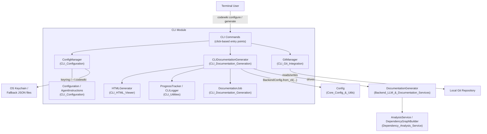
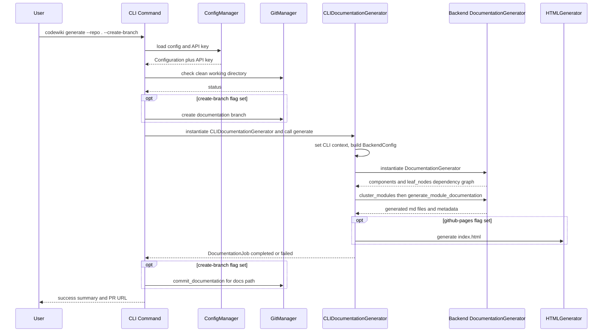

# CLI Module

## Introduction

The **CLI module** (`codewiki/cli/`) is the command-line entry point for CodeWiki. It provides the user-facing surface that developers interact with directly from a terminal to configure credentials, run repository analysis, generate documentation, produce a static HTML viewer, and optionally commit the results to a git branch.

The CLI module itself does not implement dependency analysis or LLM orchestration — it is a thin, user-experience-focused **adapter layer** that:

- Persists and validates user configuration (LLM provider, models, tokens, credentials) — see [CLI_Configuration](CLI_Configuration.md)
- Drives the backend documentation pipeline and tracks job state — see [CLI_Documentation_Generation](CLI_Documentation_Generation.md)
- Interacts with the local git repository (branch creation, commits, remote/PR URL detection) — see [CLI_Git_Integration](CLI_Git_Integration.md)
- Renders a self-contained static HTML viewer for GitHub Pages — see [CLI_HTML_Viewer](CLI_HTML_Viewer.md)
- Provides shared terminal UX primitives (colored logging, staged progress bars) — see [CLI_Utilities](CLI_Utilities.md)

For the actual dependency-graph analysis and LLM-driven documentation generation logic invoked by this module, see [Backend_LLM_&_Documentation_Services](Backend_LLM_&_Documentation_Services.md) and [Dependency_Analysis_Service](Dependency_Analysis_Service.md). Shared runtime configuration primitives (`Config`, `FileManager`) used to bridge CLI settings into the backend are documented in [Core_Config_&_Utils](Core_Config_&_Utils.md).

## Architecture Overview

The CLI module sits between the terminal user and the backend generation pipeline. It translates persistent user preferences and command-line flags into a backend `Config` object, runs the pipeline with progress feedback, and optionally wraps the run with git operations and static-site generation.

### Request Flow: `codewiki generate`

## Sub-modules

| Sub-module | Responsibility |
|---|---|
| [CLI_Configuration](CLI_Configuration.md) | Persistent user settings (`Configuration`, `AgentInstructions`) and secure credential storage (`ConfigManager`) using OS keyring with file fallback. |
| [CLI_Documentation_Generation](CLI_Documentation_Generation.md) | `CLIDocumentationGenerator` adapter that drives the backend pipeline stage-by-stage, and the `DocumentationJob`/`JobStatistics`/`LLMConfig`/`GenerationOptions` job-tracking models. |
| [CLI_Git_Integration](CLI_Git_Integration.md) | `GitManager` for working-directory checks, documentation branch creation, commits, and GitHub remote/PR URL derivation. |
| [CLI_HTML_Viewer](CLI_HTML_Viewer.md) | `HTMLGenerator` that renders a static, self-contained `index.html` documentation viewer suitable for GitHub Pages. |
| [CLI_Utilities](CLI_Utilities.md) | Shared terminal UX helpers: `CLILogger` (colored console logging) and `ProgressTracker`/`ModuleProgressBar` (staged progress and ETA reporting). |

## How the CLI Relates to the Rest of the System

- The CLI is one of two primary front-ends to the documentation pipeline; the other is the [Frontend_Web_App](Frontend_Web_App.md), which exposes the same backend capabilities via a web UI and background jobs, and the [MCP_Session_Management](MCP_Session_Management.md) module, which exposes it to MCP-compatible AI assistants.
- All three front-ends ultimately construct a `codewiki.src.config.Config` object (see [Core_Config_&_Utils](Core_Config_&_Utils.md)) and hand off to [Backend_LLM_&_Documentation_Services](Backend_LLM_&_Documentation_Services.md) for LLM orchestration, which in turn depends on [Dependency_Analysis_Service](Dependency_Analysis_Service.md) and the [Language_Analyzers](Language_Analyzers.md) for source-code parsing, and [Dependency_Analyzer_Core](Dependency_Analyzer_Core.md) for the underlying graph model.
- Backend agentic tool calls (file editing, dependency lookups) used during documentation generation are defined in [Backend_Agent_Tools](Backend_Agent_Tools.md).
