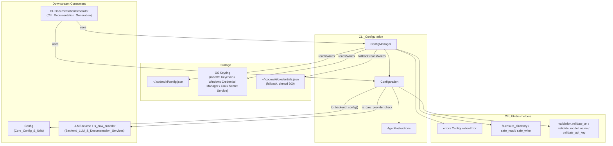
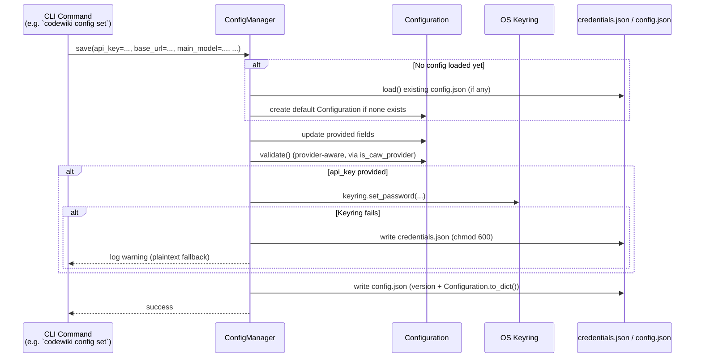
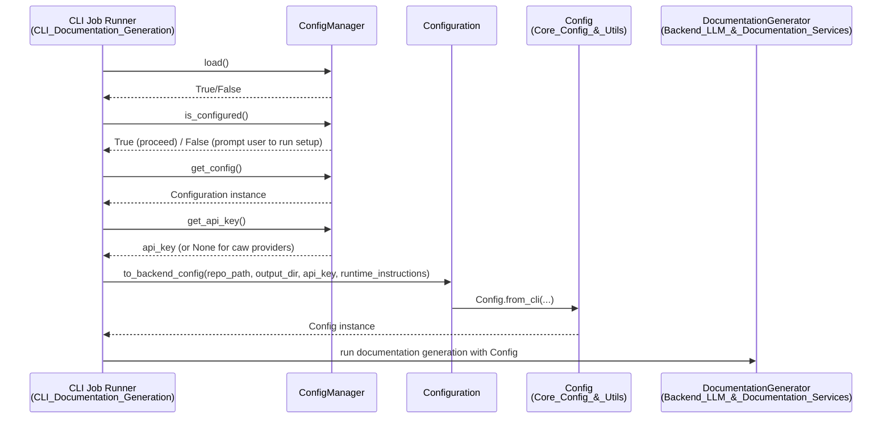
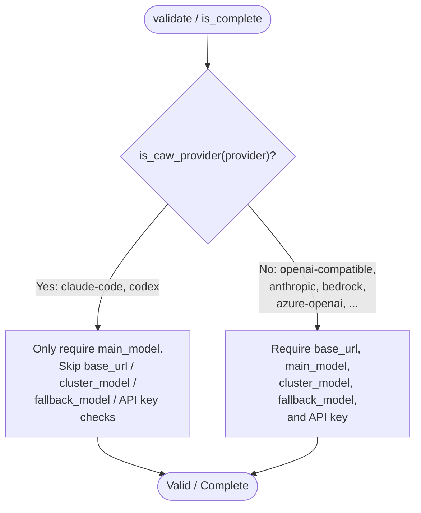

# CLI Configuration

## Introduction

The **CLI Configuration** module is responsible for managing all persistent, user-level settings for the CodeWiki command-line interface. It defines the data models that represent a user's LLM provider settings and documentation preferences (`Configuration`, `AgentInstructions`), and provides the `ConfigManager` service that reads, writes, validates, and securely stores these settings on disk.

This module acts as the bridge between what a user configures once (via `codewiki config` commands or an interactive setup wizard) and the runtime configuration (`Config`, see [Core_Config_&_Utils](Core_Config_&_Utils.md)) consumed by the documentation generation pipeline for each individual job. It is a foundational dependency for [CLI_Documentation_Generation](CLI_Documentation_Generation.md), which uses the loaded `Configuration` to build backend jobs.

---

## Purpose & Core Functionality

The module has three main responsibilities:

1. **Data Modeling** — Define the shape of persisted configuration (`Configuration`) and optional documentation-customization instructions (`AgentInstructions`).
2. **Secure Persistence** — Read/write configuration to `~/.codewiki/config.json`, and securely store the sensitive LLM API key using the OS keyring (with an encrypted-permission file fallback for headless/keyring-less environments).
3. **Validation & Translation** — Validate configuration completeness/correctness per LLM provider type, and translate the CLI-level `Configuration` into the backend's `Config` object (`to_backend_config`) used by the actual documentation generation engine.

---

## Architecture Overview

---

## Component Reference

### `Configuration` (codewiki/cli/models/config.py)

A dataclass representing the full set of persistent settings a user configures once. Fields cover:

- **LLM connection**: `base_url`, `main_model`, `cluster_model`, `fallback_model`, `provider`
- **Provider-specific extras**: `aws_region` (Bedrock), `api_version` / `azure_deployment` (Azure OpenAI)
- **Generation tuning**: `max_tokens`, `max_token_per_module`, `max_token_per_leaf_module`, `max_depth`, `prompt_caching`, `use_gitignore`
- **Output**: `default_output`
- **Customization**: `agent_instructions` (an embedded `AgentInstructions` instance)

Key behaviors:

| Method | Purpose |
|---|---|
| `validate()` | Raises `ConfigurationError` if required fields are missing/invalid. Delegates to `is_caw_provider()` (see [Backend_LLM_&_Documentation_Services](Backend_LLM_&_Documentation_Services.md)) to determine whether subscription-mode providers (`claude-code`, `codex`) skip URL/cluster/fallback-model checks, since they authenticate via CLI OAuth instead of an API key. |
| `is_complete()` | Lightweight completeness check (no exception), used by `ConfigManager.is_configured()`. Same caw-provider short-circuit as `validate()`. |
| `to_dict()` / `from_dict()` | Serialize/deserialize to/from the JSON structure persisted on disk. Omits empty `agent_instructions`. |
| `to_backend_config()` | **The critical bridge method.** Converts this persistent `Configuration` (plus a target `repo_path`, `output_dir`, resolved `api_key`, and optional per-run `runtime_instructions`) into a `Config` instance from `codewiki/src/config.py` (see [Core_Config_&_Utils](Core_Config_&_Utils.md)) via `Config.from_cli(...)`. Runtime instructions override persistent `agent_instructions` field-by-field. |

### `AgentInstructions` (codewiki/cli/models/config.py)

A dataclass capturing optional customization for the documentation agent:

- `include_patterns` / `exclude_patterns` — file filtering globs
- `focus_modules` — modules to document in more detail
- `doc_type` — one of `api`, `architecture`, `user-guide`, `developer`, or free-form
- `custom_instructions` — free-form text appended to the agent prompt

`get_prompt_addition()` renders these into natural-language prompt text consumed by the backend documentation agents (see [Backend_LLM_&_Documentation_Services](Backend_LLM_&_Documentation_Services.md) and [Dependency_Analysis_Service](Dependency_Analysis_Service.md) for where component/module context is supplied alongside this prompt).

`is_empty()` lets callers (e.g. `Configuration.to_backend_config`) decide whether to keep the persistent instructions or override them with per-invocation runtime instructions.

### `ConfigManager` (codewiki/cli/config_manager.py)

Stateful service class that owns the lifecycle of a `Configuration` object plus the associated secret API key.

**Storage locations:**

| Data | Primary Store | Fallback Store |
|---|---|---|
| API key | OS Keyring (service=`codewiki`, account=`api_key`) | `~/.codewiki/credentials.json` (mode `0600`, plaintext) |
| All other settings | `~/.codewiki/config.json` | — |

Fallback is triggered automatically when:
- `CODEWIKI_NO_KEYRING` environment variable is set to `1`/`true`/`yes`, or
- The system keyring raises a `KeyringError` (or any other exception) at check-time or at runtime (e.g. headless containers, RHEL without Secret Service).

**Public API:**

| Method | Description |
|---|---|
| `load()` | Loads `config.json` into `self._config`, then resolves the API key from keyring or fallback file. Returns `False` if no config file exists yet. |
| `save(**fields)` | Upserts any provided fields into the in-memory `Configuration` (loading existing config first if needed, or creating sensible defaults), validates once enough fields are present (provider-aware), persists the API key (keyring or file fallback with automatic downgrade + warning on keyring failure), then writes `config.json`. |
| `get_api_key()` | Lazily resolves and caches the API key (keyring first, then file). |
| `get_config()` | Returns the currently loaded/saved `Configuration`, or `None`. |
| `is_configured()` | `True` if a `Configuration` exists, is complete (`Configuration.is_complete()`), and — for non-caw providers — an API key is present. |
| `delete_api_key()` | Removes the key from both keyring and fallback file. |
| `clear()` | Full reset: deletes API key and `config.json`, clears in-memory state. |
| `keyring_available` (property) | Whether the OS keyring backend is usable in the current environment. |
| `config_file_path` (property) | Path to `~/.codewiki/config.json`. |

---

## Data Flow: Saving Configuration

---

## Data Flow: Resolving Configuration for a Documentation Job

---

## Provider-Aware Validation Logic

`Configuration` supports multiple LLM providers, some of which are "subscription-mode" (caw) providers that authenticate through an external CLI's OAuth flow rather than an API key + base URL. `is_caw_provider()` (defined in [Backend_LLM_&_Documentation_Services](Backend_LLM_&_Documentation_Services.md), `codewiki/src/be/backend.py`) determines this branching for `claude-code` and `codex` providers.

This same branching is used in both `ConfigManager.save()` (to decide when enough fields exist to trigger validation) and `ConfigManager.is_configured()` (to decide whether an API key is required).

---

## Dependencies

| Dependency | Module | Usage |
|---|---|---|
| `ConfigurationError`, `FileSystemError` | [CLI_Utilities](CLI_Utilities.md) (`codewiki/cli/utils/errors.py`) | Raised on invalid config or filesystem failures |
| `ensure_directory`, `safe_read`, `safe_write` | [CLI_Utilities](CLI_Utilities.md) (`codewiki/cli/utils/fs.py`) | Safe filesystem I/O for config/credentials files |
| `validate_url`, `validate_model_name`, `validate_api_key` | [CLI_Utilities](CLI_Utilities.md) (`codewiki/cli/utils/validation.py`) | Field-level validation used inside `Configuration.validate()` |
| `is_caw_provider` | [Backend_LLM_&_Documentation_Services](Backend_LLM_&_Documentation_Services.md) (`codewiki/src/be/backend.py`) | Determines subscription-mode vs. API-key-mode provider behavior |
| `Config.from_cli` | [Core_Config_&_Utils](Core_Config_&_Utils.md) (`codewiki/src/config.py`) | Target type produced by `Configuration.to_backend_config()` |
| `keyring` (third-party) | — | OS-native secret storage backend |

## Consumers

| Consumer | Module | Usage |
|---|---|---|
| `CLIDocumentationGenerator` | [CLI_Documentation_Generation](CLI_Documentation_Generation.md) | Loads `Configuration` via `ConfigManager`, resolves the API key, and calls `to_backend_config()` to construct the runtime `Config` for a `DocumentationJob` |
| CLI setup/config commands (`codewiki config ...`) | CLI entry points | Drive `ConfigManager.save()` / `.load()` / `.clear()` to manage user settings interactively |

---

## Key Design Notes

- **Security-first API key handling**: The module prefers OS-level secret storage and only falls back to a plaintext file with restrictive permissions (`0600`) when no keyring backend is available, always logging a warning in that case.
- **Separation of persistent vs. runtime config**: `Configuration` is user-level and long-lived; `Config` (backend) is job-specific and ephemeral, built fresh for every documentation run via `to_backend_config()`. This separation allows CLI defaults to be overridden per-invocation (e.g., different `repo_path`, `output_dir`, or one-off `AgentInstructions`) without mutating stored settings.
- **Progressive/partial validation**: `ConfigManager.save()` only invokes `Configuration.validate()` once enough fields are populated to make validation meaningful, allowing multi-step configuration workflows (e.g., an interactive wizard prompting for one field at a time) without premature failures.
