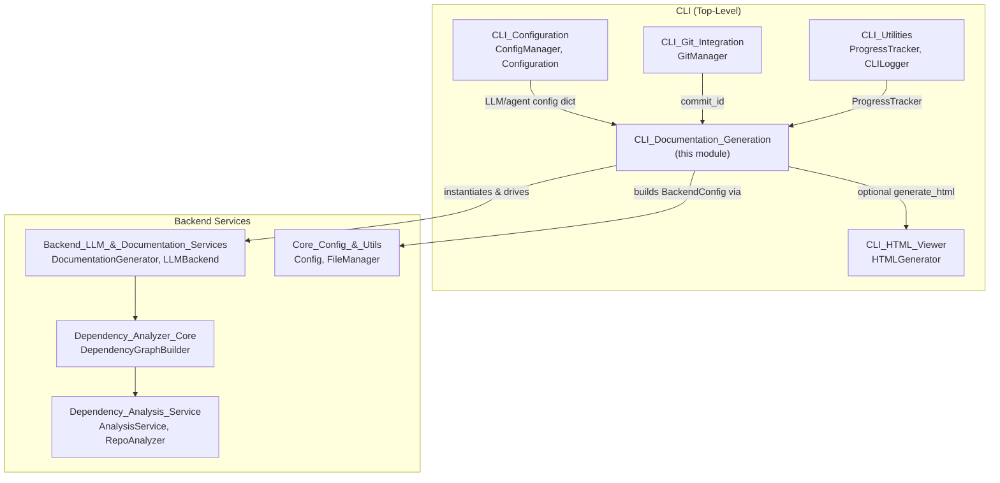
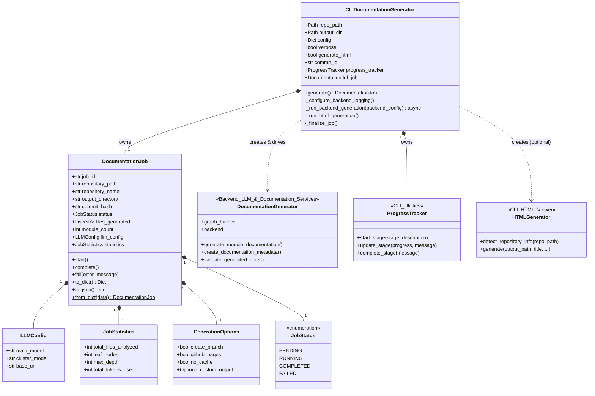
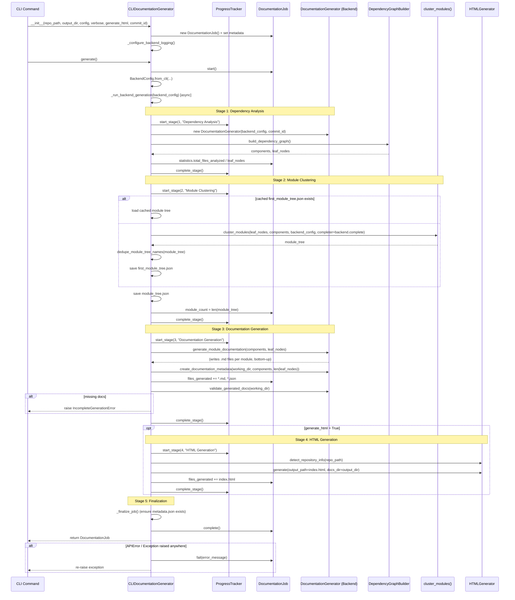
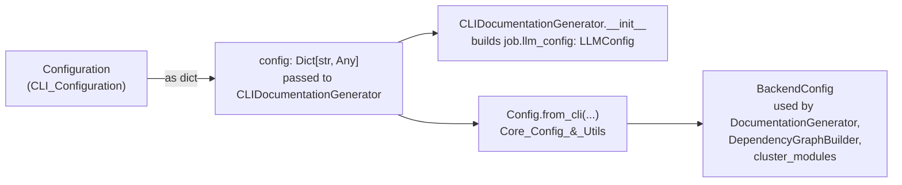
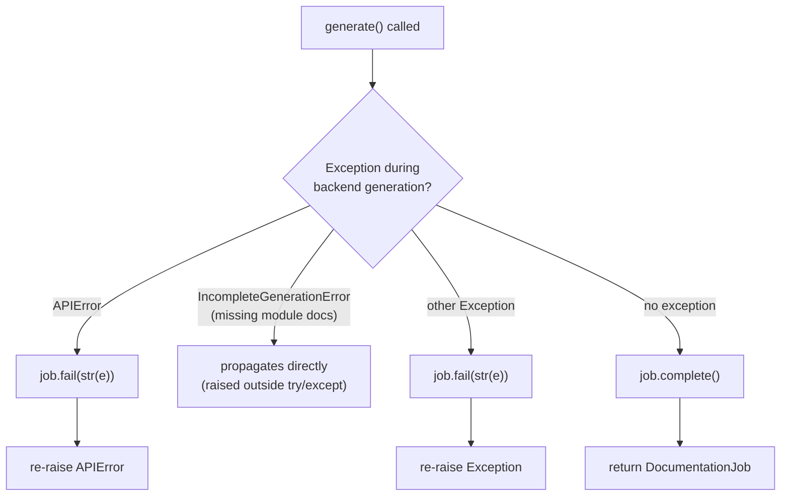

# CLI Documentation Generation

## Introduction

The **CLI Documentation Generation** module is the orchestration layer that drives a single `codewiki generate` run from the command line. It bridges the user-facing CLI experience with the framework-agnostic backend documentation pipeline ([Backend_LLM_&_Documentation_Services](Backend_LLM_&_Documentation_Services.md)), adding CLI-specific concerns such as staged progress reporting, structured job tracking, colored logging, and optional HTML viewer generation.

The module is composed of two main responsibilities:

- **`CLIDocumentationGenerator`** (`codewiki/cli/adapters/doc_generator.py`) — an adapter that wraps the backend's `DocumentationGenerator` and `DependencyGraphBuilder`, exposing a single `generate()` entry point that runs the full pipeline (dependency analysis → module clustering → documentation generation → optional HTML generation → finalization) while emitting progress updates.
- **Job data models** (`codewiki/cli/models/job.py`) — `DocumentationJob`, `JobStatus`, `LLMConfig`, `GenerationOptions`, and `JobStatistics`, which together capture the full lifecycle and metadata of a documentation generation run in a serializable form (used for `metadata.json` and for reporting job outcomes back to the CLI/user).

This module sits at the center of the CLI subsystem, consuming configuration from [CLI_Configuration](CLI_Configuration.md), progress/logging primitives from [CLI_Utilities](CLI_Utilities.md), optional HTML rendering from [CLI_HTML_Viewer](CLI_HTML_Viewer.md), and git metadata from [CLI_Git_Integration](CLI_Git_Integration.md) (commit id, branch, etc., typically supplied by the calling CLI command). Underneath, it delegates the actual dependency analysis and LLM-driven writing to the [Backend_LLM_&_Documentation_Services](Backend_LLM_&_Documentation_Services.md), [Dependency_Analysis_Service](Dependency_Analysis_Service.md), and [Dependency_Analyzer_Core](Dependency_Analyzer_Core.md) modules.

---

## Module Position in the System

---

## Component Overview

### `CLIDocumentationGenerator`

`CLIDocumentationGenerator` is the CLI-side facade over the backend pipeline. It is instantiated once per `generate` invocation and is responsible for:

1. **Bootstrapping job state** — creates a `DocumentationJob`, populates repository/output metadata, and stores an `LLMConfig` snapshot.
2. **Configuring backend logging** — attaches a `ColoredFormatter` (from [Dependency_Analyzer_Core](Dependency_Analyzer_Core.md)) to the `codewiki.src.be` logger tree, routing INFO-level logs to stdout in verbose mode or suppressing to WARNING+ on stderr otherwise, and disabling propagation to avoid duplicate output.
3. **Translating CLI config → backend `Config`** — builds a `BackendConfig` (`codewiki.src.config.Config`, see [Core_Config_&_Utils](Core_Config_&_Utils.md)) via `Config.from_cli(...)`, forwarding LLM connection details, provider selection, token budgets, agent instructions, and gitignore/prompt-caching flags.
4. **Driving the 5-stage pipeline** with `ProgressTracker` (see [CLI_Utilities](CLI_Utilities.md)):
   - Stage 1 — Dependency Analysis
   - Stage 2 — Module Clustering
   - Stage 3 — Documentation Generation
   - Stage 4 — HTML Generation (optional)
   - Stage 5 — Finalization
5. **Validating completeness** — after generation, calls `doc_generator.validate_generated_docs()` and raises `IncompleteGenerationError` if any expected module `.md` files are missing, preventing a "false success" (addresses silent failures from name collisions or failed sub-agents).
6. **Returning a completed/failed `DocumentationJob`** for the CLI command layer to render results or errors.

#### Class Responsibilities Diagram

---

### Job Data Models (`codewiki/cli/models/job.py`)

These dataclasses define the serializable state of a documentation generation job:

| Model | Purpose |
|---|---|
| `JobStatus` | String enum: `pending`, `running`, `completed`, `failed`. |
| `LLMConfig` | Snapshot of the LLM settings used for the run (`main_model`, `cluster_model`, `base_url`). |
| `GenerationOptions` | User-selected CLI flags: branch creation, GitHub Pages mode, cache bypass, custom output path. |
| `JobStatistics` | Run metrics: files analyzed, leaf node count, max depth, total tokens used. |
| `DocumentationJob` | The aggregate job record — identity (`job_id`, UUID), repo/output paths, git info, timestamps, `status`, `error_message`, generated file list, module count, and nested `LLMConfig`/`GenerationOptions`/`JobStatistics`. Provides `start()`, `complete()`, `fail()` lifecycle transitions, plus `to_dict()`/`to_json()`/`from_dict()` for persistence (e.g., written as `metadata.json` fallback, or consumed by other tooling that inspects run results). |

`DocumentationJob` is intentionally backend-agnostic — it does not import from `codewiki.src.be`, keeping the CLI's job-tracking model decoupled from backend internals.

---

## Documentation Generation Pipeline

### End-to-End Sequence

### Stage Breakdown

| Stage | Weight* | Responsibility | Key Collaborators |
|---|---|---|---|
| 1. Dependency Analysis | 40% | Parse repository source into a component graph and identify leaf (entry-point) nodes | `DependencyGraphBuilder` ([Dependency_Analyzer_Core](Dependency_Analyzer_Core.md)), language analyzers ([Language_Analyzers](Language_Analyzers.md)) |
| 2. Module Clustering | 20% | Group leaf nodes into a hierarchical module tree, using cached `first_module_tree.json` if present, else LLM-based clustering | `cluster_modules()`, `dedupe_module_tree_names()` (Backend_LLM_&_Documentation_Services) |
| 3. Documentation Generation | 30% | Bottom-up generation of per-module `.md` docs, repository overview, and `metadata.json`; validates no docs are missing | `DocumentationGenerator.generate_module_documentation`, `validate_generated_docs` |
| 4. HTML Generation (optional) | 5% | Render a static `index.html` viewer embedding the module tree and metadata | `HTMLGenerator` ([CLI_HTML_Viewer](CLI_HTML_Viewer.md)) |
| 5. Finalization | 5% | Confirm `metadata.json` exists; mark job complete | `DocumentationJob.complete()` |

\* Weights defined in `ProgressTracker.STAGE_WEIGHTS`, used for ETA estimation — see [CLI_Utilities](CLI_Utilities.md).

---

## Configuration Flow

`CLIDocumentationGenerator` does not read configuration files directly — it receives a plain `config: Dict[str, Any]` (typically assembled by the CLI command layer from [CLI_Configuration](CLI_Configuration.md)'s `ConfigManager`/`Configuration`) and translates it into the backend's typed `Config` object.

Fields forwarded to `Config.from_cli(...)` include: `base_url`, `api_key`, `main_model`, `cluster_model`, `fallback_model`, `provider`, `aws_region`, `max_tokens`, `max_token_per_module`, `max_token_per_leaf_module`, `max_depth`, `agent_instructions` (see `AgentInstructions` in [CLI_Configuration](CLI_Configuration.md)), `use_gitignore`, and `prompt_caching`.

---

## Error Handling

- **`APIError`** — raised when dependency analysis, module clustering, or documentation generation calls fail (e.g., LLM API failures); wraps the underlying exception with a descriptive message and a dedicated CLI exit code.
- **`IncompleteGenerationError`** — raised specifically when `validate_generated_docs()` detects module `.md` files expected by the final `module_tree.json` but absent on disk. This check is placed outside the stage's `try/except` block so it is never masked as a generic `APIError`; it carries `missing_modules` for precise CLI reporting.
- Both error types derive from the CLI's shared `CodeWikiError` hierarchy (`codewiki/cli/utils/errors.py`), each mapping to a specific process exit code.

---

## Relationship to Other Modules

| Module | Relationship |
|---|---|
| [CLI_Configuration](CLI_Configuration.md) | Supplies the `Configuration`/`AgentInstructions` data that the CLI command layer flattens into the `config` dict consumed by `CLIDocumentationGenerator`. |
| [CLI_Git_Integration](CLI_Git_Integration.md) | Supplies `commit_id` (via `GitManager.get_commit_hash()`) used for incremental-update tracking and embedded in generated metadata. |
| [CLI_HTML_Viewer](CLI_HTML_Viewer.md) | Invoked in Stage 4 when `generate_html=True`; consumes `module_tree.json`/`metadata.json` written by Stage 3 to render `index.html`. |
| [CLI_Utilities](CLI_Utilities.md) | Provides `ProgressTracker` (stage/ETA reporting) and `CLILogger` (general CLI logging), plus `ColoredFormatter` reuse for consistent terminal output. |
| [Backend_LLM_&_Documentation_Services](Backend_LLM_&_Documentation_Services.md) | Provides `DocumentationGenerator`, the core orchestrator for dependency-graph-driven, bottom-up module documentation generation and the `LLMBackend` abstraction used for completions. |
| [Dependency_Analyzer_Core](Dependency_Analyzer_Core.md) | Provides `DependencyGraphBuilder` (invoked via `doc_generator.graph_builder`) and `ColoredFormatter` for logging. |
| [Dependency_Analysis_Service](Dependency_Analysis_Service.md) / [Language_Analyzers](Language_Analyzers.md) | Perform the actual per-language parsing underlying Stage 1. |
| [Core_Config_&_Utils](Core_Config_&_Utils.md) | Supplies `Config` (backend configuration dataclass, `Config.from_cli`) and `FileManager`/`file_manager` used for reading/writing module trees and generated files. |

---

## Key Design Notes

- **Adapter pattern, not reimplementation**: `CLIDocumentationGenerator` deliberately delegates all heavy lifting (graph building, clustering, LLM completions, file writes) to the backend `DocumentationGenerator`; its own logic is limited to config translation, progress reporting, and CLI-specific error/job bookkeeping.
- **Caching-aware clustering**: Stage 2 checks for a previously persisted `first_module_tree.json` before invoking LLM-based clustering, allowing repeated runs (e.g., incremental docs) to skip expensive clustering calls.
- **Whole-repository fallback**: if clustering yields zero top-level modules (repo small enough to fit context), the pipeline still completes correctly — logged clearly in verbose mode ("continuing in whole-repository documentation mode").
- **Strict completeness validation**: the module treats a successful LLM run that nonetheless fails to write all expected `.md` files as a failure (`IncompleteGenerationError`), guarding against silent partial documentation (a known failure mode with module name collisions or crashed sub-agents).
- **Logging isolation**: backend loggers (`codewiki.src.be`) are explicitly configured and detached from root-logger propagation to keep CLI console output clean and controllable via `--verbose`.
