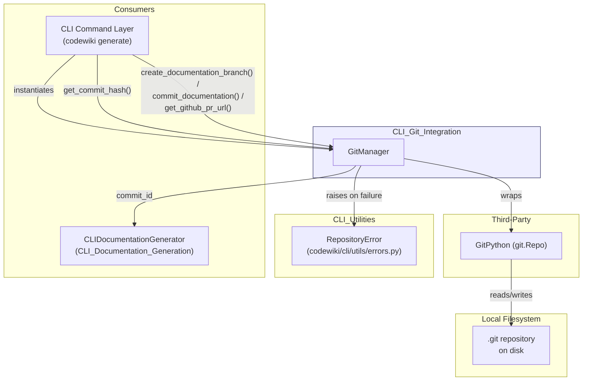
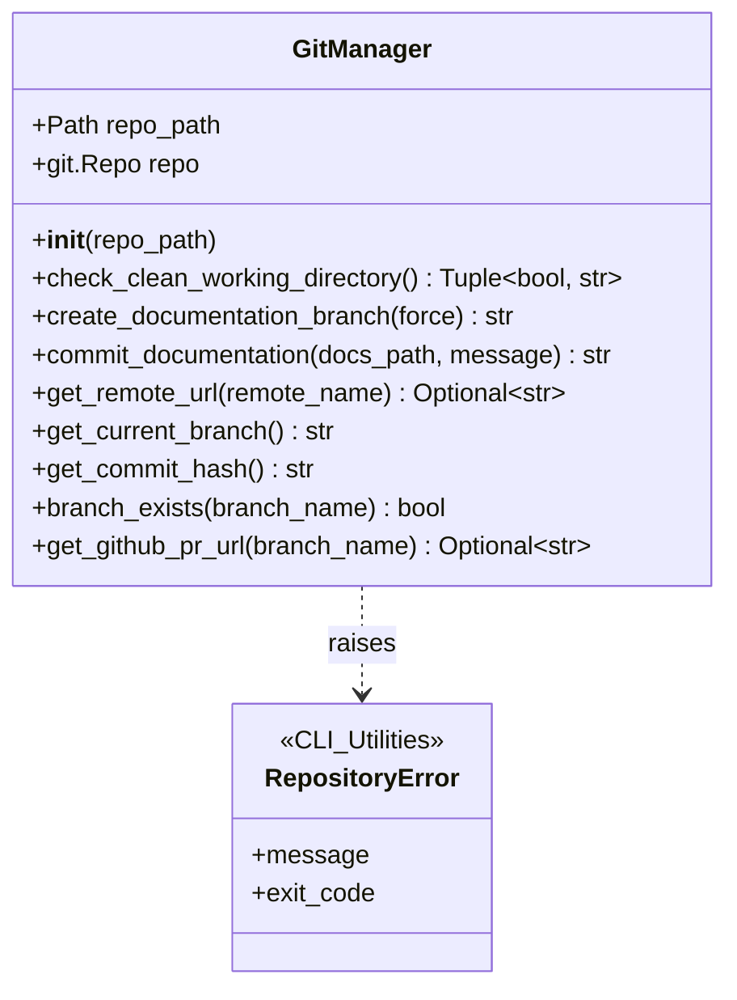
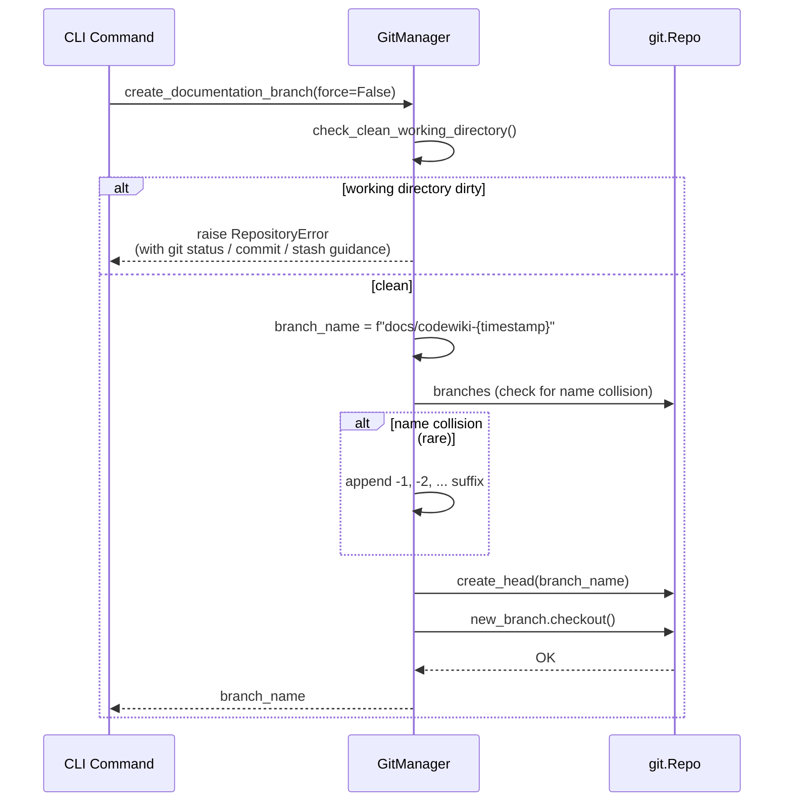
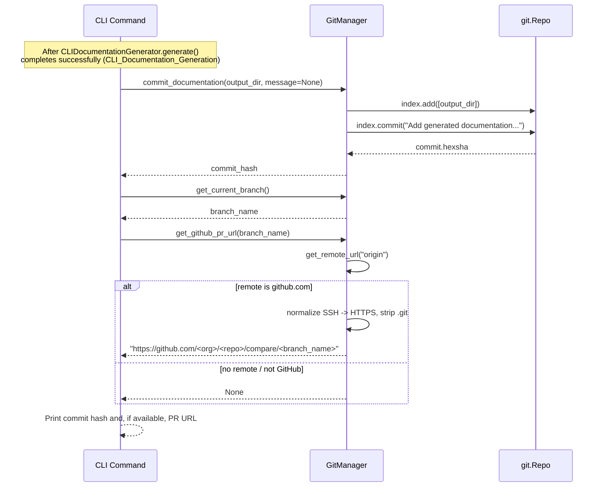
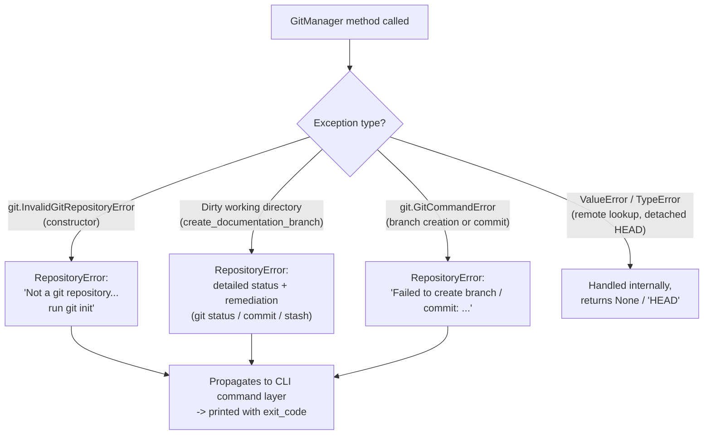

# CLI Git Integration

## Introduction

The **CLI Git Integration** module provides the `GitManager` class (`codewiki/cli/git_manager.py`), a thin, focused wrapper around [GitPython](https://gitpython.readthedocs.io/) that gives the CodeWiki CLI everything it needs to safely interact with a local git repository during a documentation run.

Its responsibilities are narrow but essential to the `codewiki generate --create-branch` workflow:

- Verifying that a target directory is actually a git repository.
- Checking whether the working directory is clean before making changes.
- Creating a dedicated, timestamped documentation branch.
- Committing generated documentation artifacts.
- Reading repository metadata (current branch, commit hash, remote URL).
- Deriving a GitHub "compare/PR" URL for the documentation branch, when the remote is GitHub.

This module has no knowledge of *what* documentation is generated — that is the responsibility of [CLI_Documentation_Generation](CLI_Documentation_Generation.md). `GitManager` is invoked directly by the CLI command layer (the `codewiki generate` entry point), which orchestrates it alongside [CLI_Configuration](CLI_Configuration.md) and [CLI_Documentation_Generation](CLI_Documentation_Generation.md) as described in the parent [CLI](CLI.md) module documentation.

---

## Purpose & Core Functionality

`GitManager` exists to answer three questions the CLI needs answered around every "generate documentation and open a PR" workflow:

1. **Is it safe to proceed?** — Is this a git repository, and is the working directory clean enough to create a new branch without losing uncommitted work?
2. **Where should the output go?** — Create (or reuse) a uniquely-named `docs/codewiki-<timestamp>` branch to isolate generated documentation from the user's working branch.
3. **How do I finish and let the user act on the result?** — Commit the generated docs, and produce a ready-to-click GitHub compare/PR URL so the user (or CI) can review and merge the change.

All git interaction is funneled through GitPython's `git.Repo` object, and all failure modes are normalized into the CLI's shared `RepositoryError` exception (see [CLI_Utilities](CLI_Utilities.md)) so that the CLI's top-level error handler can present a consistent, actionable message and exit code.

---

## Architecture Overview

### Where `GitManager` fits in the `codewiki generate` command

`GitManager` is never invoked by the documentation-generation pipeline itself; it is orchestrated *around* it by the CLI command layer. The command layer:

1. Uses `GitManager` to validate repository state and (optionally) create a branch **before** calling into [CLI_Documentation_Generation](CLI_Documentation_Generation.md).
2. Passes `GitManager.get_commit_hash()` into `CLIDocumentationGenerator` as `commit_id`, which is embedded in generated metadata for incremental-update tracking.
3. Uses `GitManager` again **after** generation completes to commit the output and surface a PR URL.

```mermaid
graph LR
    A["CLI Command Layer"] --> B["GitManager.check_clean_working_directory()"]
    B --> C{"--create-branch flag?"}
    C -- yes --> D["GitManager.create_documentation_branch()"]
    C -- no --> E["proceed on current branch"]
    D --> F["GitManager.get_commit_hash()"]
    E --> F
    F --> G["CLIDocumentationGenerator.generate()<br/>(CLI_Documentation_Generation)"]
    G --> H{"--create-branch flag?"}
    H -- yes --> I["GitManager.commit_documentation(output_dir)"]
    I --> J["GitManager.get_github_pr_url(branch_name)"]
    J --> K["Print PR URL to user"]
    H -- no --> L["Print completion summary"]
```

---

## Component Reference

### `GitManager` (`codewiki/cli/git_manager.py`)

Constructed with the path to a repository; internally opens a `git.Repo` handle with `search_parent_directories=True` so it works correctly even when `repo_path` is a subdirectory of the git root.

#### Public API

| Method | Description | Failure Behavior |
|---|---|---|
| `__init__(repo_path)` | Resolves `repo_path` and opens the repository via `git.Repo(repo_path, search_parent_directories=True)`. | Raises `RepositoryError` if `git.InvalidGitRepositoryError` is caught, with a hint to run `git init`. |
| `check_clean_working_directory()` | Checks `repo.is_dirty(untracked_files=True)`; if dirty, builds a human-readable summary of modified files (`repo.index.diff(None)`) and untracked files (`repo.untracked_files`), truncated to the first 3 entries each. | Never raises; returns `(bool, str)`. |
| `create_documentation_branch(force=False)` | Unless `force=True`, calls `check_clean_working_directory()` and raises if dirty. Generates a branch name `docs/codewiki-<YYYYmmdd-HHMMSS>`, disambiguating with a numeric suffix if it collides with an existing branch (defensive; unlikely given timestamp granularity). Creates and checks out the new branch via `repo.create_head(...)` / `.checkout()`. | Raises `RepositoryError` on dirty working directory (with a detailed remediation message) or on `GitCommandError` during branch creation. |
| `commit_documentation(docs_path, message=None)` | Stages `docs_path` (`repo.index.add([...])`) and commits (`repo.index.commit(message)`), defaulting to `"Add generated documentation\n\nGenerated by CodeWiki CLI"`. Returns the new commit's `hexsha`. | Raises `RepositoryError` on `GitCommandError`. |
| `get_remote_url(remote_name="origin")` | Returns the URL of the named remote, or `None` if it doesn't exist. | Catches `ValueError` internally; never raises. |
| `get_current_branch()` | Returns `repo.active_branch.name`, or the literal string `"HEAD"` if in detached-HEAD state. | Catches `TypeError` internally; never raises. |
| `get_commit_hash()` | Returns `repo.head.commit.hexsha` — the current `HEAD` commit SHA. | — |
| `branch_exists(branch_name)` | Returns whether `branch_name` is among `repo.branches`. | — |
| `get_github_pr_url(branch_name)` | Resolves the `origin` remote URL, normalizes SSH (`git@github.com:...`) and `.git`-suffixed URLs to an `https://github.com/...` form, and returns `<base_url>/compare/<branch_name>`. Returns `None` if there's no remote or it's not a `github.com` URL. | Never raises. |

---

## Data Flow: Creating a Documentation Branch

## Data Flow: Committing Documentation & Deriving a PR URL

---

## Error Handling

`GitManager` deliberately converts all GitPython-specific exceptions into the CLI's shared `RepositoryError` (defined in [CLI_Utilities](CLI_Utilities.md), `codewiki/cli/utils/errors.py`), which derives from `CodeWikiError` and carries an `EXIT_REPOSITORY_ERROR` exit code. This keeps git-specific exception types out of the rest of the CLI, allowing the top-level command handler to catch a single, consistent error hierarchy regardless of whether a failure originated in configuration, documentation generation, or git operations.

Key design point: `check_clean_working_directory()` is intentionally **non-raising** — it returns a `(bool, str)` tuple so callers can decide how to react (e.g., the CLI command may want to show the status and prompt the user, rather than immediately failing). The raising behavior only kicks in inside `create_documentation_branch()`, where dirtiness is treated as a hard precondition (unless explicitly bypassed with `force=True`).

---

## Dependencies

| Dependency | Source | Usage |
|---|---|---|
| `git.Repo`, `git.InvalidGitRepositoryError`, `git.exc.GitCommandError` | GitPython (third-party) | Underlying implementation for all repository inspection and mutation operations. |
| `RepositoryError` | [CLI_Utilities](CLI_Utilities.md) (`codewiki/cli/utils/errors.py`) | Normalized exception type raised on all git failure paths. |

`GitManager` has no dependency on any backend module ([Backend_LLM_&_Documentation_Services](Backend_LLM_&_Documentation_Services.md), [Dependency_Analysis_Service](Dependency_Analysis_Service.md), etc.) — it operates purely on the local filesystem/git state and is safe to use independently of any documentation-generation run.

---

## Consumers

| Consumer | Relationship |
|---|---|
| CLI command layer (`codewiki generate`) | Primary caller. Instantiates `GitManager` for the target `repo_path`, uses `check_clean_working_directory()` / `create_documentation_branch()` before generation, and `commit_documentation()` / `get_github_pr_url()` after generation, per the `--create-branch` flag. |
| [CLI_Documentation_Generation](CLI_Documentation_Generation.md) (`CLIDocumentationGenerator`) | Indirect consumer — receives `commit_id` as a constructor argument, which the CLI command layer typically obtains via `GitManager.get_commit_hash()`. This value is embedded in generated `metadata.json` to support incremental-update tracking across runs. `CLIDocumentationGenerator` does not instantiate or call `GitManager` itself. |

---

## Key Design Notes

- **Single Responsibility**: `GitManager` only performs git operations — no documentation logic, no LLM calls, no HTML rendering. This keeps it trivially testable and reusable outside the `generate` command (e.g., for future commands that need branch/PR metadata).
- **Timestamped, collision-resistant branch naming**: Using a `YYYYmmdd-HHMMSS` timestamp for branch names (`docs/codewiki-<timestamp>`) makes repeated runs safe and traceable, while the numeric-suffix fallback guards against the edge case of two runs within the same second.
- **Fail-safe defaults, explicit escape hatches**: Working-directory-dirty checks are enforced by default to protect user work, but `force=True` is available for automated/CI contexts where the caller has already made an informed decision to proceed.
- **GitHub-aware, but not GitHub-dependent**: `get_github_pr_url()` degrades gracefully (returns `None`) for non-GitHub remotes or repositories without a configured remote, so the rest of the CLI can treat the PR URL as an optional convenience rather than a hard requirement.
- **Consistent error surface**: By funneling every git failure through `RepositoryError`, the module ensures git-related problems are reported to the user with the same tone, formatting, and exit-code conventions as configuration or generation errors — see the CLI-wide error handling conventions in [CLI_Documentation_Generation](CLI_Documentation_Generation.md#error-handling) and [CLI_Utilities](CLI_Utilities.md).
