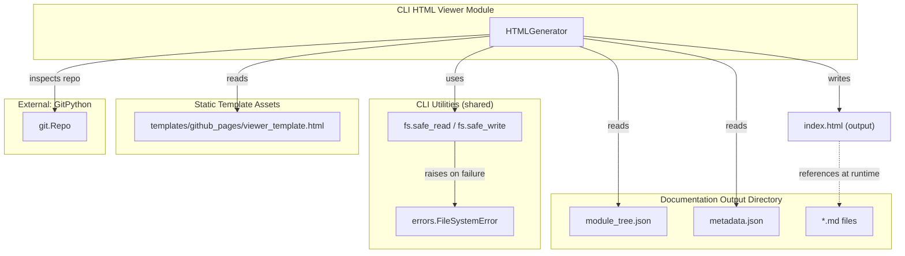
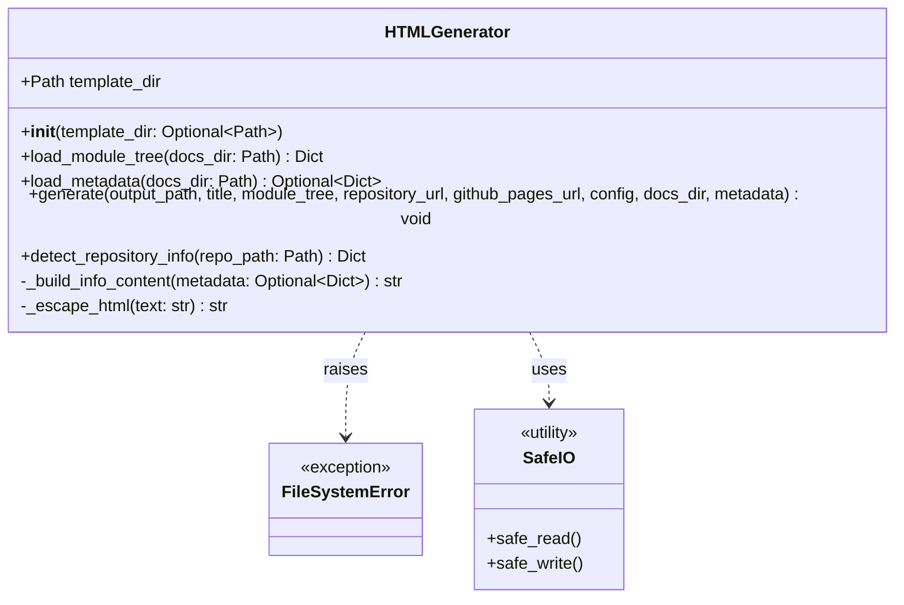
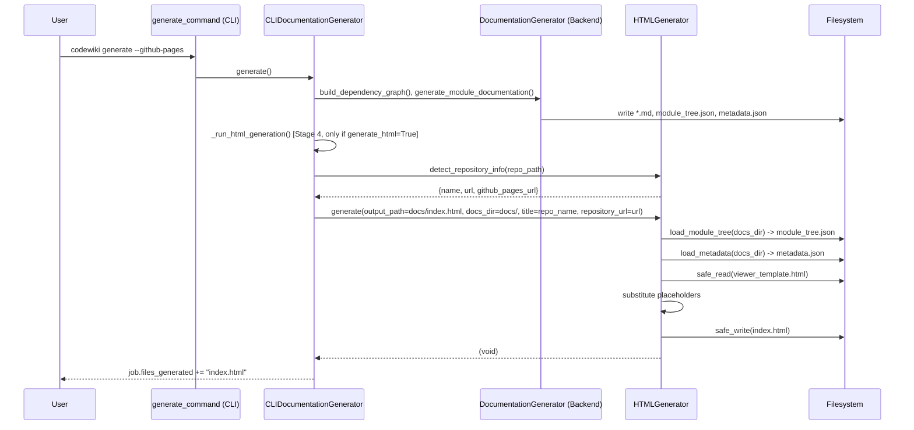
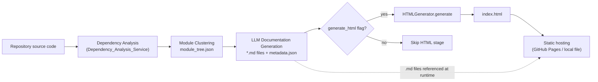

# CLI HTML Viewer

## Introduction

The **CLI HTML Viewer** module is responsible for turning the raw Markdown-based documentation artifacts produced by CodeWiki (`*.md`, `module_tree.json`, `metadata.json`) into a **single self-contained, static `index.html` file** that can be published directly to GitHub Pages (or any static host) and browsed offline without a build step.

It is a small, focused module consisting of a single class — `HTMLGenerator` — that:

- Loads the generated documentation's `module_tree.json` and `metadata.json`.
- Injects that data, along with repository metadata (name, URL, GitHub Pages URL), into a pre-built HTML template (`viewer_template.html`).
- Writes the final HTML file to disk using safe, atomic file operations.
- Detects git repository information (remote URL, computed GitHub Pages URL) to enrich the generated page with a "View Repository" link and generation metadata panel.

This module is a leaf component of the [CLI module](CLI.md) family and is invoked as an optional final stage of the documentation generation pipeline implemented by [CLI_Documentation_Generation](CLI_Documentation_Generation.md).

---

## Purpose & Core Functionality

| Responsibility | Description |
|---|---|
| **Template-based HTML generation** | Reads a static HTML template with placeholder tokens and performs string substitution to embed configuration and content. |
| **Module tree & metadata loading** | Reads `module_tree.json` and `metadata.json` from the documentation output directory produced by the backend [Backend_LLM_&_Documentation_Services](Backend_LLM_%26_Documentation_Services.md). |
| **Repository info detection** | Uses `GitPython` to inspect the local git repository and derive the remote URL and the expected GitHub Pages URL. |
| **Info panel construction** | Builds a small HTML fragment summarizing generation info (model used, timestamp, commit, component/module statistics) for display in the viewer sidebar. |
| **Safe file I/O** | Delegates all file reads/writes to shared CLI utilities (`safe_read`/`safe_write`) that provide atomic writes and consistent error handling (`FileSystemError`). |

The generated `index.html` is fully client-side: it embeds the module tree and metadata as inline JSON and relies on client-side JavaScript (bundled in the template) using `marked.js` for Markdown rendering and `mermaid.js` for diagram rendering. No server-side processing or build tooling is required at view time — the browser fetches the referenced `.md` files relative to `index.html` and renders them dynamically.

---

## Architecture



### Class Diagram



---

## Component Details

### `HTMLGenerator`

**File:** `codewiki/cli/html_generator.py`

The single public class in this module. It has no persistent state beyond the resolved `template_dir`; all generation logic is stateless and driven by method arguments.

#### `__init__(template_dir: Optional[Path] = None)`
Resolves the template directory. If not explicitly provided, defaults to the package-bundled template at `codewiki/templates/github_pages/` (two levels up from `html_generator.py`, then into `templates/github_pages`).

#### `load_module_tree(docs_dir: Path) -> Dict[str, Any]`
Loads `module_tree.json` from the documentation directory produced by the backend clustering/generation pipeline (see [Dependency_Analyzer_Core](Dependency_Analyzer_Core.md) and [Backend_LLM_&_Documentation_Services](Backend_LLM_%26_Documentation_Services.md)). If the file is missing, falls back to a minimal single-node "Overview" tree so the viewer never fails to render entirely. Parsing errors are wrapped in `FileSystemError`.

#### `load_metadata(docs_dir: Path) -> Optional[Dict[str, Any]]`
Loads `metadata.json`, which contains `generation_info` (model, timestamp, commit id) and `statistics` (total components, max depth) written by the documentation generator. This file is optional — the viewer degrades gracefully (hides the info panel) if it is absent or unparsable.

#### `generate(...)`
The main entry point. Performs the following steps:

1. **Auto-load** `module_tree` and `metadata` from `docs_dir` if not explicitly supplied.
2. **Load the HTML template** (`viewer_template.html`); raises `FileSystemError` if missing.
3. **Build the info panel** HTML fragment via `_build_info_content`.
4. **Build the repository link** HTML anchor if a `repository_url` is given.
5. **Compute `docs_base_path`** — the relative path from the output HTML file to the docs directory containing the `.md` files, so the client-side JS can fetch them correctly.
6. **Serialize** `config`, `module_tree`, and `metadata` to indented JSON strings for embedding.
7. **Token substitution** — replace all `{{PLACEHOLDER}}` tokens in the template with the computed values (see [Template Placeholders](#template-placeholders) below).
8. **Write** the resulting HTML to `output_path` using `safe_write` (atomic write via temp file + rename), creating parent directories as needed.

#### `_build_info_content(metadata) -> str`
Constructs a series of `<div class="info-row">` HTML snippets summarizing:
- Model used (`generation_info.main_model`)
- Generation date (parsed from ISO `generation_info.timestamp`)
- Short commit hash (`generation_info.commit_id[:8]`)
- Total components (`statistics.total_components`, comma-formatted)
- Max hierarchy depth (`statistics.max_depth`)

Returns an empty string if no `generation_info` is present, which causes the sidebar info panel to be hidden (`{{SHOW_INFO}} = "none"`).

#### `_escape_html(text) -> str`
Simple HTML entity escaping (`& < > " '`) applied to any user/repo-derived string (e.g., title, model name) before embedding into the template to avoid HTML injection/breakage.

#### `detect_repository_info(repo_path: Path) -> Dict[str, Optional[str]]`
Uses `GitPython` (`git.Repo`) to:
- Read the repository name from the path.
- Read the `origin` remote URL, normalizing SSH (`git@github.com:...`) to HTTPS and stripping `.git` suffix.
- If the remote is a GitHub URL, compute the expected GitHub Pages URL as `https://{owner}.github.io/{repo}/`.

All git errors are swallowed (`except Exception: pass`), so this method always returns a dict with at least `name` populated — it never raises, ensuring HTML generation can proceed even outside a git repository or without a configured remote.

---

## Template Placeholders

The `HTMLGenerator` performs literal string replacement against `viewer_template.html` (bundled at `codewiki/templates/github_pages/viewer_template.html`). The template is a fully self-contained HTML page using CDN-hosted `marked.js` (Markdown rendering) and `mermaid.js` (diagram rendering), plus embedded CSS/JS for sidebar navigation and dynamic content loading.

| Placeholder | Source | Description |
|---|---|---|
| `{{TITLE}}` | `title` arg (escaped) | Page `<title>` and sidebar logo text |
| `{{REPO_LINK}}` | `repository_url` arg | Anchor tag linking to the GitHub repo, or empty string |
| `{{SHOW_INFO}}` | Computed | `"block"` or `"none"` — controls visibility of the info panel |
| `{{INFO_CONTENT}}` | `_build_info_content()` | HTML rows with generation statistics |
| `{{CONFIG_JSON}}` | `config` arg | Arbitrary JSON config embedded as a JS constant `CONFIG` |
| `{{MODULE_TREE_JSON}}` | `module_tree` arg/loaded | JS constant `MODULE_TREE` — drives sidebar navigation tree |
| `{{METADATA_JSON}}` | `metadata` arg/loaded | JS constant `METADATA` (or `null`) |
| `{{DOCS_BASE_PATH}}` | Computed | Relative path prefix used by client JS to fetch `.md` files |

At runtime in the browser, the embedded JavaScript uses `MODULE_TREE` to render a collapsible sidebar navigation, fetches the corresponding `.md` file (relative to `DOCS_BASE_PATH`) when a nav item is clicked, converts it with `marked.js`, and renders any ```mermaid fenced code blocks using `mermaid.js`.

---

## Integration with the Documentation Generation Pipeline

`HTMLGenerator` is not invoked directly by end users; it is orchestrated by `CLIDocumentationGenerator` (part of [CLI_Documentation_Generation](CLI_Documentation_Generation.md)) as an optional **Stage 4** step, only when the user passes `--github-pages` to the `codewiki generate` CLI command.



Relevant excerpt from `CLIDocumentationGenerator._run_html_generation`:

```python
def _run_html_generation(self):
    self.progress_tracker.start_stage(4, "HTML Generation")
    from codewiki.cli.html_generator import HTMLGenerator
    html_generator = HTMLGenerator()
    repo_info = html_generator.detect_repository_info(self.repo_path)
    output_path = self.output_dir / "index.html"
    html_generator.generate(
        output_path=output_path,
        title=repo_info['name'],
        repository_url=repo_info['url'],
        github_pages_url=repo_info['github_pages_url'],
        docs_dir=self.output_dir  # auto-loads module_tree.json & metadata.json
    )
    self.job.files_generated.append("index.html")
    self.progress_tracker.complete_stage()
```

See [CLI_Documentation_Generation](CLI_Documentation_Generation.md) for the full 5-stage pipeline (Dependency Analysis → Module Clustering → Documentation Generation → **HTML Generation** → Finalization) and the `DocumentationJob` model that tracks `files_generated`.

---

## Data Flow



---

## Error Handling

`HTMLGenerator` relies on the shared CLI error hierarchy defined in `codewiki/cli/utils/errors.py`:

- **`FileSystemError`** (subclass of `CodeWikiError`) is raised when:
  - The template file (`viewer_template.html`) cannot be found.
  - `safe_read`/`safe_write` encounter I/O failures (missing file, permission errors, disk failures) while loading `module_tree.json` or writing `index.html`.
- **Non-critical failures** (e.g., malformed `metadata.json`, git detection errors) are intentionally swallowed and degrade gracefully — the viewer will simply omit the info panel or repository link rather than failing the entire documentation generation run.

This mirrors the fail-soft philosophy used elsewhere in the CLI: optional enhancements (HTML viewer, info panel, repo link) should never block the core documentation output.

---

## Dependencies on Other Modules

| Dependency | Module | Usage |
|---|---|---|
| `safe_read`, `safe_write` | [CLI_Utilities](CLI_Utilities.md) (`codewiki/cli/utils/fs.py`) | Atomic, error-wrapped file I/O |
| `FileSystemError` | [CLI_Utilities](CLI_Utilities.md) (`codewiki/cli/utils/errors.py`) | Standardized error signaling |
| `CLIDocumentationGenerator` | [CLI_Documentation_Generation](CLI_Documentation_Generation.md) | Orchestrates invocation of `HTMLGenerator` as pipeline Stage 4 |
| `module_tree.json`, `metadata.json` | [Backend_LLM_&_Documentation_Services](Backend_LLM_%26_Documentation_Services.md) / [Dependency_Analyzer_Core](Dependency_Analyzer_Core.md) | Produced upstream; consumed for embedding in the viewer |
| `GitManager` (indirectly, via `git.Repo`) | [CLI_Git_Integration](CLI_Git_Integration.md) | Both use `GitPython`, but `HTMLGenerator.detect_repository_info` operates independently and does not share state with `GitManager` |

No other module depends on `HTMLGenerator` — it is a terminal, presentation-only leaf in the CLI documentation pipeline.

---

## Summary

The CLI HTML Viewer module provides a lightweight, dependency-free (at runtime) way to package generated Markdown documentation into a browsable static site. It cleanly separates concerns from the documentation generation backend by only consuming already-generated artifacts (`module_tree.json`, `metadata.json`, `.md` files) and a static HTML template, making it easy to test, template-swap, or extend (e.g., custom themes) without touching the LLM-driven generation logic in [Backend_LLM_&_Documentation_Services](Backend_LLM_%26_Documentation_Services.md).
