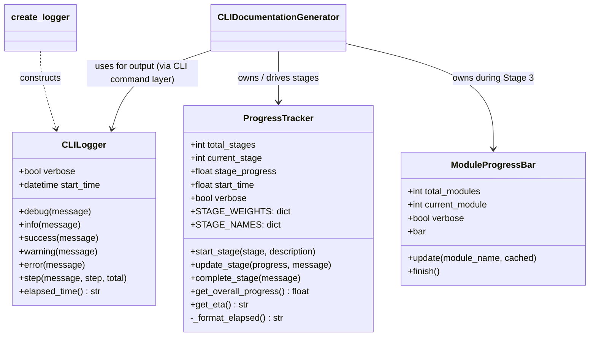
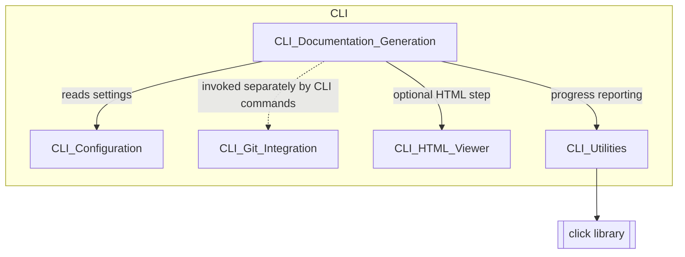
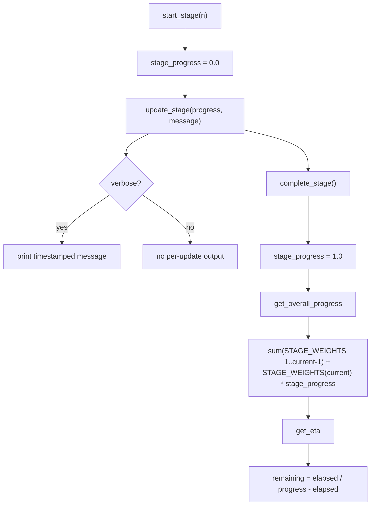
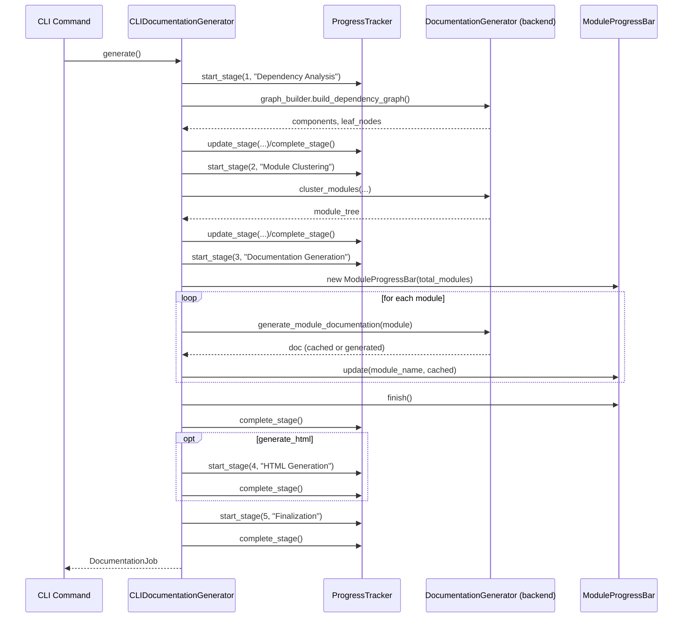
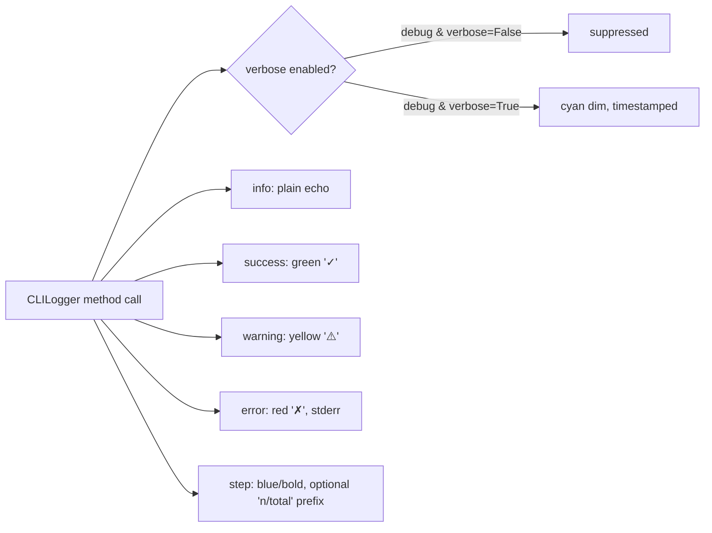

# CLI Utilities

## Introduction

The **CLI Utilities** module provides the foundational presentation-layer building blocks used throughout the CodeWiki command-line interface. It contains two lightweight, dependency-free helper classes:

- **`CLILogger`** — a colored, timestamp-aware console logger with distinct semantics for debug, info, success, warning, and error output.
- **`ProgressTracker`** / **`ModuleProgressBar`** — stage-based and per-module progress reporting utilities that estimate ETA and render progress bars or verbose step logs.

These utilities have no knowledge of documentation generation, git, or configuration logic. Instead, they are consumed by higher-level CLI components — most notably [CLI_Documentation_Generation](CLI_Documentation_Generation.md) — to surface human-readable feedback while the CLI orchestrates dependency analysis, module clustering, and documentation generation. Because they are pure UI/output helpers, they can be reused by any CLI command (e.g., `generate`, `update`, `serve`) without introducing coupling to business logic.

This document describes the internal design of these utilities, how they interact with each other and with consuming modules, and where they fit within the broader CLI architecture.

---

## Module Purpose & Scope

| Concern | Handled by CLI_Utilities? | Notes |
|---|---|---|
| Colored/leveled console output | ✅ `CLILogger` | Uses `click.secho`/`click.echo` |
| Elapsed time tracking | ✅ `CLILogger.elapsed_time()` | Simple wall-clock delta since logger creation |
| Multi-stage progress with ETA | ✅ `ProgressTracker` | Weighted stages (Dependency Analysis, Clustering, Doc Gen, HTML Gen, Finalization) |
| Per-module progress (bar or verbose list) | ✅ `ModuleProgressBar` | Wraps `click.progressbar` or verbose per-module log lines |
| Documentation generation orchestration | ❌ | See [CLI_Documentation_Generation](CLI_Documentation_Generation.md) |
| Git branch/commit operations | ❌ | See [CLI_Git_Integration](CLI_Git_Integration.md) |
| Static HTML viewer generation | ❌ | See [CLI_HTML_Viewer](CLI_HTML_Viewer.md) |
| CLI configuration loading/validation | ❌ | See [CLI_Configuration](CLI_Configuration.md) |

---

## Component Overview

### `CLILogger`

A minimal, stateful logger designed for CLI ergonomics rather than structured application logging (compare with the backend's `ColoredFormatter` in [Dependency_Analyzer_Core](Dependency_Analyzer_Core.md), which formats Python `logging` records instead of ad-hoc CLI messages).

Key characteristics:

- **Verbose gating**: `debug()` messages are only emitted when `verbose=True`; all other levels are always shown.
- **Semantic coloring**: `success` (green, `✓`), `warning` (yellow, `⚠️`), `error` (red, `✗`, written to `stderr`), `step` (blue/bold, optional `[n/total]` prefix).
- **Session timing**: `start_time` is captured at construction; `elapsed_time()` returns a human-friendly `Xm Ys` or `Ys` string.
- **Factory function**: `create_logger(verbose)` is a thin convenience wrapper for constructing a `CLILogger`.

```python
logger = create_logger(verbose=True)
logger.step("Starting analysis", step=1, total=5)
logger.debug("Parsing file foo.py")   # only shown when verbose
logger.success("Analysis complete")
logger.warning("No .gitignore found")
logger.error("API request failed")
```

### `ProgressTracker`

Tracks progress across the five conceptual phases of a documentation generation run, using fixed **stage weights** to compute an overall completion percentage and estimate time remaining (ETA).

| Stage | Name | Weight |
|---|---|---|
| 1 | Dependency Analysis | 40% |
| 2 | Module Clustering | 20% |
| 3 | Documentation Generation | 30% |
| 4 | HTML Generation (optional) | 5% |
| 5 | Finalization | 5% |

Core lifecycle methods:

- `start_stage(stage, description=None)` — begins a stage, printing either a verbose timestamped header (`[MM:SS] Phase n/N: ...`) or a compact non-verbose banner (`[n/N] ...`).
- `update_stage(progress, message=None)` — records sub-stage progress (0.0–1.0); in verbose mode also prints an indented status line.
- `complete_stage(message=None)` — marks the stage 100% complete; in verbose mode prints stage duration and an optional completion message.
- `get_overall_progress()` — sums the weights of fully completed stages plus the weighted partial progress of the current stage.
- `get_eta()` — linearly extrapolates total time from elapsed time and overall progress (`elapsed / progress - elapsed`), formatted as `Xh Ym`, `Xm Ys`, or `Ys`.
- `_format_elapsed()` — internal helper producing `MM:SS` timestamps used in verbose headers/messages.

### `ModuleProgressBar`

A companion utility specifically for the "N modules to document" sub-task inside Stage 3 (Documentation Generation). It supports two mutually exclusive display modes selected at construction time:

- **Non-verbose**: wraps `click.progressbar` (context-manager style, entered in `__init__` via `__enter__()` and exited via `finish()`), showing ETA and percentage.
- **Verbose**: suppresses the bar and instead prints one line per module via `update()`, indicating whether the module was `✓ (cached)` or `⟳ (generating)`.

```python
bar = ModuleProgressBar(total_modules=12, verbose=False)
for module in modules:
    ... # generate documentation for module
    bar.update(module.name, cached=module.was_cached)
bar.finish()
```

---

## Architecture



---

## Position Within the CLI Module

`CLI_Utilities` is a leaf/support module in the CLI subsystem. It is depended upon by orchestration components but has no outgoing dependencies on other CLI or backend modules.



**Consumers:**

- **[CLI_Documentation_Generation](CLI_Documentation_Generation.md)** — `CLIDocumentationGenerator` instantiates a `ProgressTracker(total_stages=5, verbose=verbose)` in its constructor and drives it through all five stages (`start_stage` → `update_stage` → `complete_stage`) as it delegates to the backend `DocumentationGenerator` (see [Backend_LLM_&_Documentation_Services](Backend_LLM_&_Documentation_Services.md)) for dependency analysis, module clustering, and per-module doc generation. `ModuleProgressBar` is used inside Stage 3 to report per-module completion (cached vs. freshly generated).
- **CLI command entry points** (Click commands, not shown in the provided component set) typically construct a `CLILogger` via `create_logger(verbose)` to print step-by-step status, warnings, and final success/error messages surrounding calls into `CLIDocumentationGenerator`, [CLI_Git_Integration](CLI_Git_Integration.md) (branch/commit operations), and [CLI_HTML_Viewer](CLI_HTML_Viewer.md).

---

## Data & Control Flow

### Stage-Weighted Progress Calculation



### Documentation Generation Run — Progress Touchpoints

This sequence illustrates how `CLIDocumentationGenerator` (from [CLI_Documentation_Generation](CLI_Documentation_Generation.md)) drives `ProgressTracker` and `ModuleProgressBar` across the run.



### Logger Output Levels



---

## Design Notes

- **No business logic**: Both `CLILogger` and `ProgressTracker`/`ModuleProgressBar` are intentionally free of any awareness of repositories, LLM configuration, or documentation content. This keeps them trivially testable and reusable across every CLI subcommand.
- **`click` as the only dependency**: All rendering is delegated to `click.secho`/`click.echo`/`click.progressbar`, ensuring consistent terminal behavior (color detection, TTY handling, Windows compatibility) without reimplementing terminal logic.
- **Verbose vs. non-verbose duality**: Every utility in this module exposes two output modes — a terse, bar/banner-based mode for normal runs and a detailed, timestamped, line-by-line mode for debugging (`--verbose` flag). This mirrors the same duality found in `CLIDocumentationGenerator._configure_backend_logging()`, which also branches on verbosity to control backend log levels via `ColoredFormatter` (see [Dependency_Analyzer_Core](Dependency_Analyzer_Core.md)).
- **ETA estimation is linear/naive**: `ProgressTracker.get_eta()` assumes uniform progress velocity (`total_estimated = elapsed / progress`). This is intentionally simple — sufficient for a CLI progress indicator, not intended for precise scheduling.
- **Stateless composability**: Because these classes carry no global or singleton state, multiple `CLILogger`/`ProgressTracker` instances can coexist (e.g., for parallel or nested CLI operations) without interference.

---

## Related Modules

- [CLI_Documentation_Generation](CLI_Documentation_Generation.md) — primary consumer; orchestrates the 5-stage pipeline using `ProgressTracker` and `ModuleProgressBar`, and produces the `DocumentationJob` result.
- [CLI_Configuration](CLI_Configuration.md) — supplies the `Configuration`/`LLMConfig` values that `CLIDocumentationGenerator` passes into the backend during the stages tracked by `ProgressTracker`.
- [CLI_Git_Integration](CLI_Git_Integration.md) — handles branch creation and commits around a documentation run; typically reports status through a `CLILogger` instance owned by the CLI command layer.
- [CLI_HTML_Viewer](CLI_HTML_Viewer.md) — invoked as the optional Stage 4 ("HTML Generation") tracked by `ProgressTracker`.
- [Backend_LLM_&_Documentation_Services](Backend_LLM_&_Documentation_Services.md) — the underlying `DocumentationGenerator` whose dependency analysis, clustering, and per-module generation steps are what `ProgressTracker`/`ModuleProgressBar` visualize.
- [Dependency_Analyzer_Core](Dependency_Analyzer_Core.md) — contains `ColoredFormatter`, the backend-log analog to this module's CLI-facing colored output.
