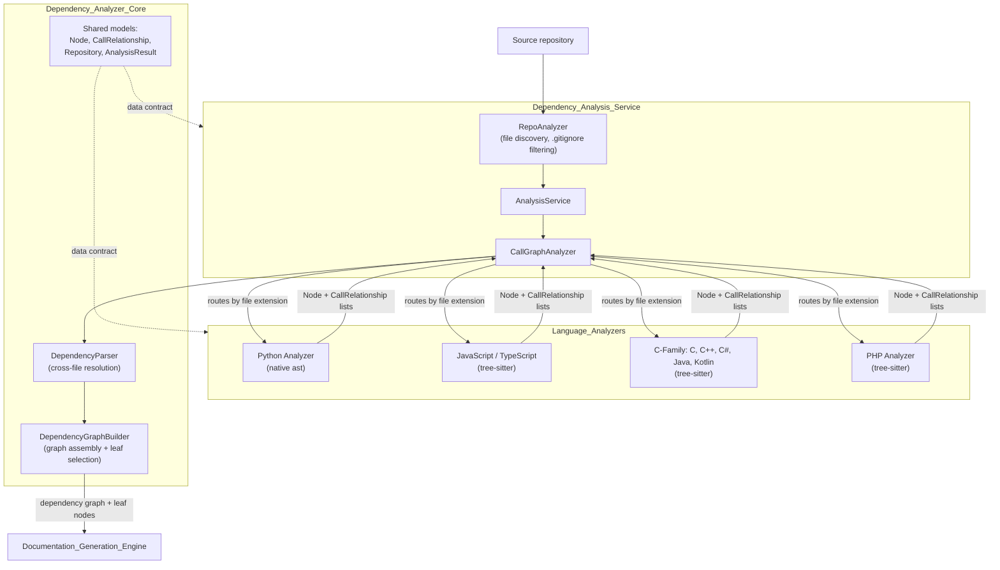

# Code Analysis Engine

## Purpose

The **Code_Analysis_Engine** subsystem is CodeWiki's static-analysis front half: everything that turns a raw source repository into a fully-resolved, language-agnostic dependency graph, ready for LLM-driven documentation generation. It answers the question *"what components exist in this codebase, and how do they depend on each other?"* — without invoking a single LLM call.

The subsystem is organized as a three-layer pipeline:

1. **[Language_Analyzers](Language_Analyzers.md)** — per-language "front ends" (Python `ast`, tree-sitter grammars for JS/TS, C-family, PHP) that parse individual source files into `Node` (component) and `CallRelationship` (edge) records.
2. **[Dependency_Analysis_Service](Dependency_Analysis_Service.md)** — the orchestration layer (`AnalysisService`, `RepoAnalyzer`, `CallGraphAnalyzer`) that discovers files, dispatches them to the right analyzer, resolves cross-file references, and filters out external/stdlib symbols.
3. **[Dependency_Analyzer_Core](Dependency_Analyzer_Core.md)** — the shared data models (`Node`, `CallRelationship`, `Repository`, `AnalysisResult`) plus `DependencyParser` and `DependencyGraphBuilder`, which assemble the final project-wide dependency graph and select the "leaf" components that documentation generation starts from.

The engine's single output — a dependency graph of components keyed by `"{relative_path}::{qualified_name}"` — is consumed by the [Documentation_Generation_Engine](Documentation_Generation_Engine.md).

## Architecture

Key design decisions:

* **Best-effort, file-local parsing.** Individual analyzers never attempt compiler-grade resolution; they mark each reference `is_resolved=True/False` and defer repository-wide matching to `CallGraphAnalyzer`'s indexes. This keeps per-language analyzers simple and uniform.
* **One shared data contract.** All analyzers emit the same Pydantic models owned by `Dependency_Analyzer_Core`, so the rest of the system is language-agnostic.
* **Deterministic and LLM-free.** The whole subsystem is pure static analysis; its output is cached to `temp/dependency_graphs/` so repeated documentation runs skip re-parsing.

## Modules

| Module | Responsibility | Documentation |
|---|---|---|
| **Dependency_Analyzer_Core** | Shared `Node`/`CallRelationship` models, `DependencyParser`, `DependencyGraphBuilder`, leaf-node selection | [Dependency_Analyzer_Core.md](Dependency_Analyzer_Core.md) |
| **Dependency_Analysis_Service** | Repository discovery, per-language dispatch, cross-file symbol resolution, external-symbol filtering | [Dependency_Analysis_Service.md](Dependency_Analysis_Service.md) |
| **Language_Analyzers** | Per-language extraction of components and relationships (Python, JS/TS, C-family, PHP) | [Language_Analyzers.md](Language_Analyzers.md) |

## Related Modules

* [Documentation_Generation_Engine](Documentation_Generation_Engine.md) — consumes the dependency graph produced here to cluster modules and generate documentation.
* [Core_Config_&_Utils](Core_Config_&_Utils.md) — provides the `Config` object (include/exclude patterns, repo path) and `FileManager` used for graph caching.
* [User_Interfaces](User_Interfaces.md) — the CLI, web app, and MCP server that trigger analysis runs.
