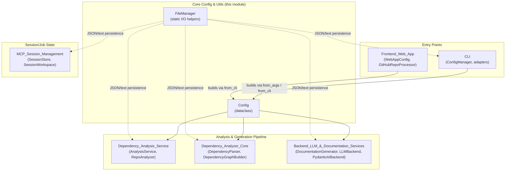
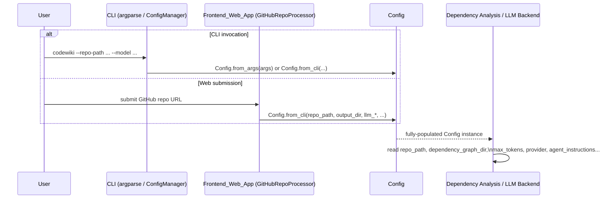
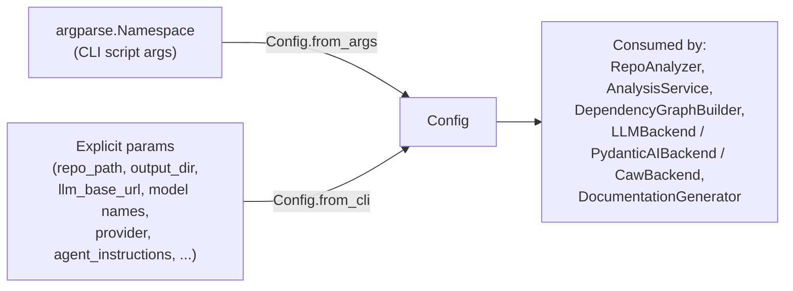
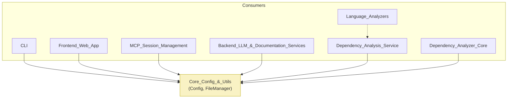

# Core Config & Utils

## Introduction

The **Core Config & Utils** module is the foundational, dependency-free layer of CodeWiki. It provides two small but critical building blocks that are consumed by virtually every other module in the system:

1. **`Config`** (`codewiki/src/config.py`) — a single, canonical dataclass that captures all runtime configuration for a documentation-generation run: repository location, output paths, LLM provider/model selection, token budgets, and agent customization instructions.
2. **`FileManager`** (`codewiki/src/utils.py`) — a minimal, static-method utility class that centralizes all JSON/text file I/O so that the rest of the codebase never has to duplicate `open()`/`json.dump()` boilerplate.

Because these components have no dependencies on any other CodeWiki module, they sit at the very bottom of the dependency graph and are safe to import from anywhere — CLI entry points, the FastAPI-based web frontend, the backend LLM/documentation services, and the dependency-analysis pipeline all import from this module directly or indirectly.

## Why this module exists

CodeWiki runs in two distinct contexts:

- **CLI context** — a developer runs `codewiki` locally against a repo path, with credentials pulled from `~/.codewiki/config.json` + OS keyring (see [CLI](CLI.md)).
- **Web-app context** — a hosted service processes GitHub repository submissions asynchronously, with credentials from environment variables (see [Frontend_Web_App](Frontend_Web_App.md)).

`Config` unifies these two invocation styles behind one dataclass and two factory constructors (`from_args` for CLI argparse namespaces, `from_cli` for programmatic CLI use), so that all downstream services (dependency analyzers, LLM backends, documentation generators) only ever need to reason about a single `Config` object, regardless of how the run was triggered.

`FileManager` exists to keep file-system side effects consistent (UTF-8 encoding, pretty-printed JSON, directory auto-creation) across the many places in the system that persist intermediate artifacts — dependency graphs, module trees, generated docs, cache entries, job state, etc.

## Architecture Overview

### Data flow: from invocation to a fully-populated `Config`

## Sub-modules

This module is intentionally small and cohesive; the two components below are documented together in a single reference rather than split into separate files, since they have no internal sub-structure of their own and are best understood as a pair.

### `Config` — Runtime Configuration

`Config` is a `@dataclass` holding everything a documentation-generation run needs:

- **Paths**: `repo_path`, `output_dir`, `dependency_graph_dir`, `docs_dir`.
- **Decomposition control**: `max_depth` (hierarchical module-tree depth, default `MAX_DEPTH = 2`).
- **LLM selection**: `llm_base_url`, `llm_api_key`, `main_model`, `cluster_model`, `fallback_model`, and `provider` (one of `openai-compatible`, `atlas-cloud`, `anthropic`, `bedrock`, `azure-openai`), plus provider-specific fields `aws_region`, `api_version`, `azure_deployment`.
- **Token budgets**: `max_tokens`, `max_token_per_module`, `max_token_per_leaf_module` — these bound how much content is generated per LLM call and per module in the documentation tree.
- **Prompt caching**: `prompt_caching` flag, consumed by [Backend_LLM_&_Documentation_Services](Backend_LLM_&_Documentation_Services.md)'s `CachingOpenAIModel` to decide whether to inject `cache_control` breakpoints.
- **Customization**: `agent_instructions` — an optional dict surfaced through convenience properties (`include_patterns`, `exclude_patterns`, `focus_modules`, `doc_type`, `custom_instructions`) and the `get_prompt_addition()` method, which renders these into natural-language instructions appended to LLM prompts. This dict is typically populated by `AgentInstructions` in the [CLI](CLI.md) module's `codewiki/cli/models/config.py`.
- **Repo hygiene**: `use_gitignore` — passed through to `RepoAnalyzer`/`GitIgnoreFilter` in the [Dependency_Analysis_Service](Dependency_Analysis_Service.md) to decide whether `.gitignore` rules are applied before analysis.

Two module-level helpers manage a global CLI/web-app switch:

- `set_cli_context(enabled)` / `is_cli_context()` — a process-wide flag letting shared code (e.g., credential loading) branch between reading `~/.codewiki/config.json` + keyring (CLI) versus environment variables (web app), without threading a context object through every call.

Module-level constants (`OUTPUT_BASE_DIR`, `DEPENDENCY_GRAPHS_DIR`, `DOCS_DIR`, `FIRST_MODULE_TREE_FILENAME`, `MODULE_TREE_FILENAME`, `OVERVIEW_FILENAME`, default token limits, default model names via `MAIN_MODEL`/`FALLBACK_MODEL_1`/`CLUSTER_MODEL`, and `LLM_BASE_URL`/`LLM_API_KEY` env-var defaults) define the system-wide defaults referenced by both CLI and web-app configuration builders.

#### Construction paths

- **`Config.from_args(args)`**: derives a sanitized `docs_dir` from the repo folder name and uses global env-var-derived defaults for LLM settings. Used by the legacy/simple CLI code path.
- **`Config.from_cli(...)`**: the richer constructor used by [CLI](CLI.md)'s `ConfigManager`/`CLIDocumentationGenerator` and by [Frontend_Web_App](Frontend_Web_App.md)'s `GitHubRepoProcessor`/`BackgroundWorker`. It accepts explicit provider, token-budget, and `agent_instructions` parameters and lays out a `temp/` working directory under `output_dir` for intermediate dependency-graph artifacts, keeping the user-facing `docs_dir` separate and clean.

### `FileManager` — Static File I/O Helpers

`FileManager` (and its module-level singleton instance `file_manager`) provides five static methods, all consistently using UTF-8 encoding:

| Method | Purpose |
|---|---|
| `ensure_directory(path)` | `os.makedirs(path, exist_ok=True)` — idempotent directory creation |
| `save_json(data, filepath)` | Pretty-printed (`indent=4`), non-ASCII-safe JSON write |
| `load_json(filepath)` | Returns parsed JSON, or `None` if the file doesn't exist (graceful missing-file handling) |
| `save_text(content, filepath)` | Plain UTF-8 text write |
| `load_text(filepath)` | Plain UTF-8 text read |

Because it has no state and no external dependencies, `FileManager` is used as a shared utility across nearly every other module:

- [Dependency_Analysis_Service](Dependency_Analysis_Service.md) and [Dependency_Analyzer_Core](Dependency_Analyzer_Core.md) use it to persist `module_tree.json`, `first_module_tree.json`, and dependency-graph JSON artifacts under `Config.dependency_graph_dir`.
- [Backend_LLM_&_Documentation_Services](Backend_LLM_&_Documentation_Services.md)'s `DocumentationGenerator` uses it to write generated Markdown files (e.g., `overview.md`) into `Config.docs_dir`.
- [MCP_Session_Management](MCP_Session_Management.md) and [Frontend_Web_App](Frontend_Web_App.md) rely on the same JSON helpers for session/job state and cache persistence.
- [CLI](CLI.md)'s `ConfigManager` uses the same load/save JSON pattern (conceptually) for `~/.codewiki/config.json`.

## How this module fits into the overall system

Because neither `Config` nor `FileManager` import from any other CodeWiki module, this module has **zero internal dependencies** — it is purely a foundation layer. All architectural detail about *how* `Config` values are produced from user input, or *how* file artifacts are consumed downstream, lives in the respective consumer module docs:

- [CLI](CLI.md) — builds `Config` from command-line arguments and manages persistent user configuration (`ConfigManager`), credentials, and progress reporting.
- [Frontend_Web_App](Frontend_Web_App.md) — builds `Config` per submitted GitHub repository and drives background job processing.
- [MCP_Session_Management](MCP_Session_Management.md) — manages session/workspace state for the MCP server, persisting state via JSON.
- [Backend_LLM_&_Documentation_Services](Backend_LLM_&_Documentation_Services.md) — consumes `Config`'s LLM/provider/token settings to drive documentation generation.
- [Dependency_Analysis_Service](Dependency_Analysis_Service.md) and [Dependency_Analyzer_Core](Dependency_Analyzer_Core.md) — consume `Config`'s repo/output paths and `use_gitignore` flag, and use `FileManager` to persist dependency graphs and module trees.
- [Language_Analyzers](Language_Analyzers.md) — per-language AST analyzers invoked by the dependency analysis service.
