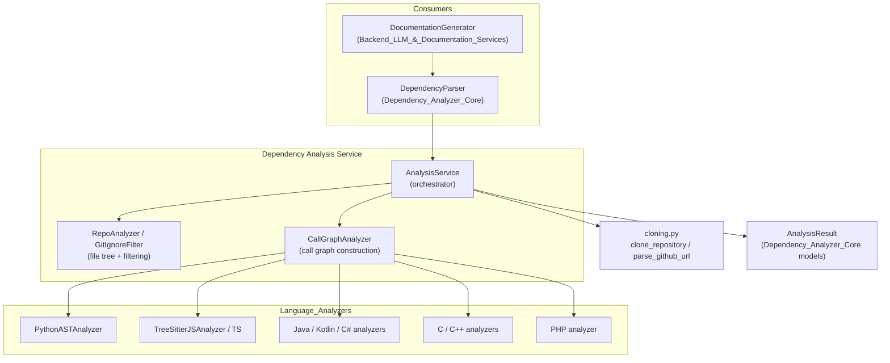
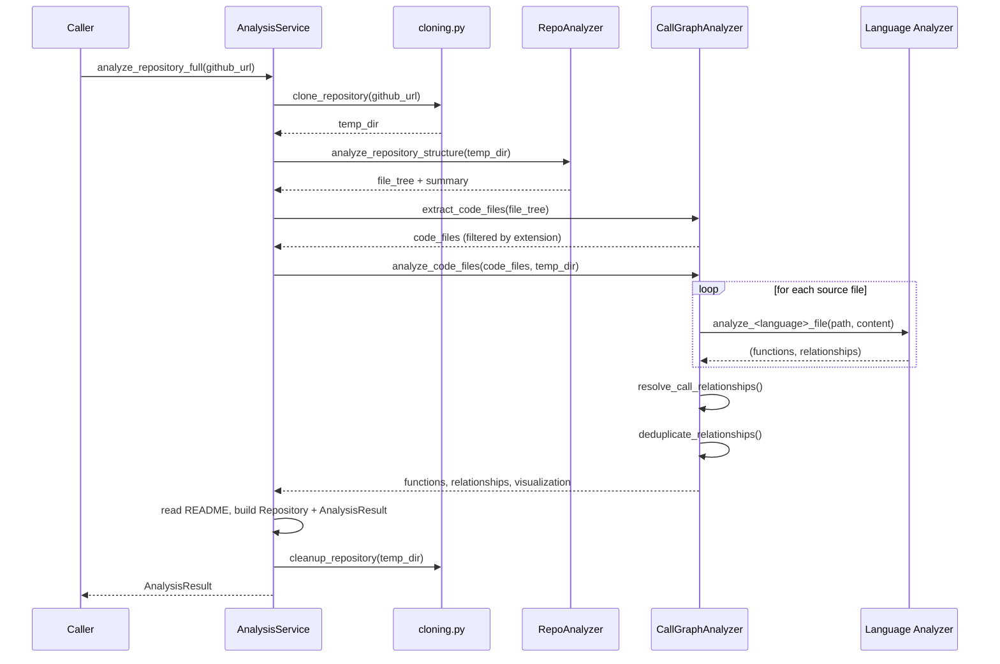
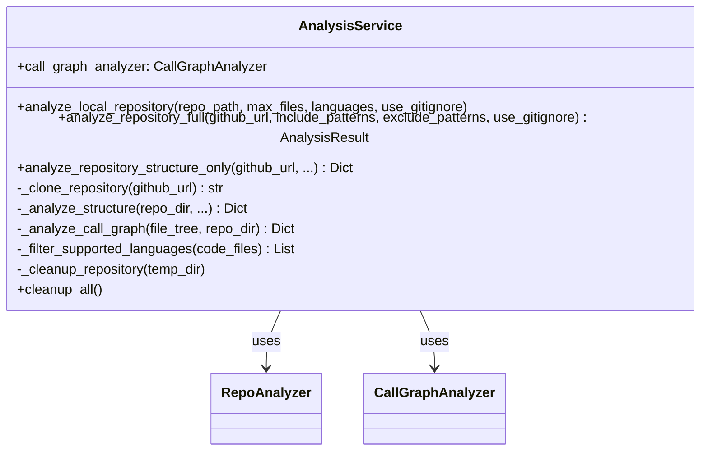
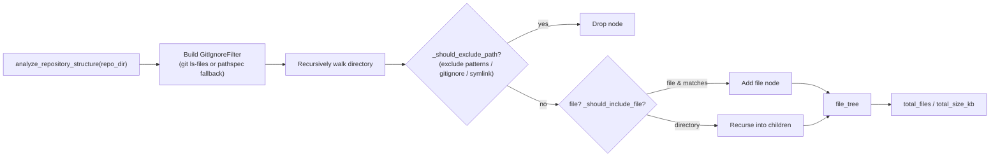
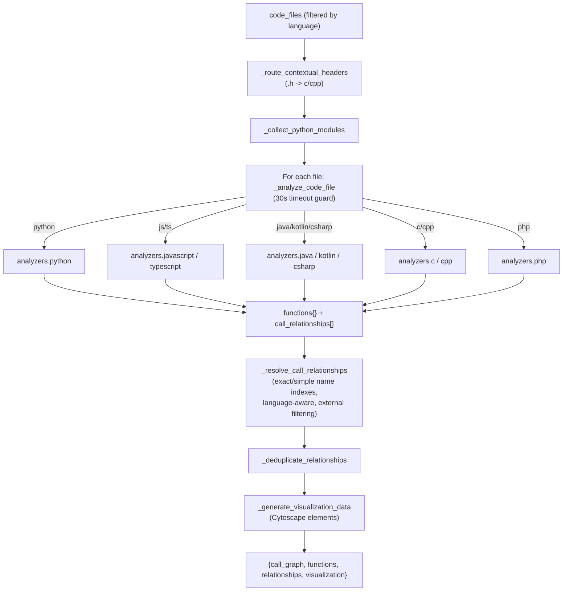
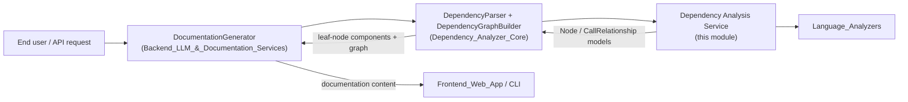

# Dependency Analysis Service

## Purpose

The **Dependency Analysis Service** is the orchestration layer that turns a raw repository (local folder or a
GitHub URL) into a structured, language-aware **call graph**: a set of `Node` objects (functions, methods,
classes, ...) and `CallRelationship` edges between them. It is the entry point used by higher-level components
—most notably `DependencyParser` in [Dependency_Analyzer_Core](Dependency_Analyzer_Core.md) and the
[Backend_LLM_&_Documentation_Services](Backend_LLM_%26_Documentation_Services.md) documentation pipeline—to
obtain the data that ultimately feeds LLM-driven documentation generation.

The module has three responsibilities, each owned by one component:

| Component | File | Responsibility |
|---|---|---|
| `AnalysisService` | `analysis/analysis_service.py` | Top-level orchestrator: clone/locate a repo, drive structure analysis, drive call-graph analysis, assemble the final `AnalysisResult`, and clean up temporary state. |
| `RepoAnalyzer` / `GitIgnoreFilter` | `analysis/repo_analyzer.py` | Walk the file system, build a filtered file tree (include/exclude glob patterns + Git ignore semantics), and compute summary statistics. |
| `CallGraphAnalyzer` | `analysis/call_graph_analyzer.py` | Dispatch each discovered source file to the appropriate per-language analyzer (see [Language_Analyzers](Language_Analyzers.md)), collect functions/relationships, resolve cross-file/cross-language calls, and produce visualization-ready data. |

## Architecture Overview

## Data Flow: Full Repository Analysis

`AnalysisService.analyze_repository_full` is the richest entry point. It performs cloning, structure discovery,
call-graph construction, and packages everything into an `AnalysisResult` (defined in
[Dependency_Analyzer_Core](Dependency_Analyzer_Core.md)).

## Component Details

### `AnalysisService`

Central façade exposing three analysis modes:

- **`analyze_repository_full(github_url, ...)`** — clones a remote repository, runs structure + call-graph
  analysis, reads the README, and returns a fully populated `AnalysisResult` (functions, relationships, file
  tree, summary, Cytoscape visualization data). Cleans up the temporary clone directory afterward (also
  tracked in `_temp_directories` and cleaned via `cleanup_all()` / `__del__` as a safety net).
- **`analyze_repository_structure_only(github_url, ...)`** — lightweight variant that skips call-graph
  generation, useful for quick previews of repository layout.
- **`analyze_local_repository(repo_path, ...)`** — analyzes a folder already present on disk (no cloning),
  used for local/offline workflows; returns a simplified dict (`nodes`, `relationships`, `summary`) rather
  than a full `AnalysisResult`.

Internally it composes a `RepoAnalyzer` (structure) and a `CallGraphAnalyzer` (call graph), and delegates
repository acquisition to `cloning.py` helpers (`clone_repository`, `cleanup_repository`, `parse_github_url`).
It also filters files down to the set of currently supported languages (Python, JavaScript, TypeScript, Java,
C#, C, C++, PHP, Kotlin) before invoking the call-graph analyzer.

Two module-level functions, `analyze_repository` and `analyze_repository_structure_only`, are kept as
backward-compatible wrappers around a freshly constructed `AnalysisService`.

### `RepoAnalyzer` and `GitIgnoreFilter`

`RepoAnalyzer.analyze_repository_structure(repo_dir)` recursively walks a directory into a nested `file_tree`
dict (`type`, `name`, `path`, `extension`/`children`), applying:

- **Include patterns** (`fnmatch`-style globs) — if provided, they *replace* the defaults
  (`DEFAULT_INCLUDE_PATTERNS`); otherwise all files are eligible for inclusion.
- **Exclude patterns** — merged with `DEFAULT_IGNORE_PATTERNS`; matched against full relative path, filename,
  and path segments.
- **Git ignore semantics** via `GitIgnoreFilter`, which prefers shelling out to `git ls-files --others
  --ignored --exclude-standard` (so nested `.gitignore` files, global excludes, and tracked-file rules behave
  exactly like Git) and falls back to a `pathspec`-based scan of every `.gitignore` file in the tree when Git
  is unavailable or the folder isn't a Git worktree.

Symlinks and paths that resolve outside the repository root are rejected defensively while building the tree.
The result also includes a summary (`total_files`, `total_size_kb`).

### `CallGraphAnalyzer`

The multi-language orchestrator. Given a list of code files (already filtered to supported extensions via
`extract_code_files`), it:

1. **Routes ambiguous `.h` headers** (`_route_contextual_headers`) to either C or C++ based on content signals
   (namespaces, classes, templates, `::`, or known C++ standard headers) and repository composition.
2. **Collects Python module names** up front (`_collect_python_modules`) to support accurate project-vs-external
   import classification later.
3. **Dispatches each file** to the language-specific analyzer function based on `file_info["language"]`,
   delegating to the implementations documented in [Language_Analyzers](Language_Analyzers.md):
   - `python` → `analyzers/python.py::analyze_python_file`
   - `javascript` / `typescript` → tree-sitter analyzers in `analyzers/javascript.py` / `typescript.py`
   - `java`, `kotlin`, `csharp`, `c`, `cpp`, `php` → respective tree-sitter analyzers
   Each file is analyzed under a 30-second timeout guard (`timeout` context manager, POSIX `SIGALRM`-based,
   no-op on Windows) so a pathological file cannot stall the whole run.
4. **Resolves call relationships** (`_resolve_call_relationships`): builds global and per-language exact/
   simple-name lookup indexes (`_build_resolution_indexes`) from `id`, `component_id`, `qualified_name`, and
   `name`, then attempts to match each unresolved `CallRelationship.callee` — preferring matches within the
   caller's own language, falling back to language-qualified/simple-name matching, and finally dropping
   relationships that are provably external (standard library calls, C/C++ macros, or third-party
   package/module calls) via `is_external_symbol`/`is_macro_name` and dotted-package/module heuristics.
5. **Deduplicates** relationships on `(caller, callee)` pairs.
6. **Generates visualization data**: a Cytoscape.js-compatible `{elements: [...]}` structure with per-language
   CSS classes (`lang-python`, `lang-cpp`, ...) and node/edge classification, plus a resolution summary
   (`total_nodes`, `total_edges`, `unresolved_calls`).

It also exposes `generate_llm_format()` (a compact, LLM-friendly functions/relationships view) and
`_select_most_connected_nodes(target_count)` (degree-centrality-based pruning for very large graphs).

## Key Data Structures

The service produces/consumes model types defined in
[Dependency_Analyzer_Core](Dependency_Analyzer_Core.md#models):

- **`Node`** — a single code component (function, method, class, ...) with identity (`id`, `component_id`,
  `qualified_name`), location (`file_path`, `relative_path`, `start_line`/`end_line`), documentation
  (`docstring`), and its outgoing `depends_on` set.
- **`CallRelationship`** — a directed edge `caller -> callee`, with `call_line` and an `is_resolved` flag set
  once `CallGraphAnalyzer` matches the callee to a concrete `Node`.
- **`Repository`** — metadata about the analyzed repo (`url`, `name`, `clone_path`, `analysis_id`).
- **`AnalysisResult`** — the full output bundle: `repository`, `functions` (list of `Node`), `relationships`
  (list of `CallRelationship`), `file_tree`, `summary`, `visualization`, and optional `readme_content`.

## Position in the Overall System

- **[Dependency_Analyzer_Core](Dependency_Analyzer_Core.md)** consumes this service directly:
  `DependencyParser.parse_repository()` instantiates an `AnalysisService`, calls its private
  `_analyze_structure` / `_analyze_call_graph` helpers, and converts the resulting functions/relationships
  dicts into `Node` objects with `depends_on` edges, which `DependencyGraphBuilder` then turns into a
  traversable dependency graph and a set of "leaf" components.
- **[Language_Analyzers](Language_Analyzers.md)** supplies every per-language `analyze_*_file` function that
  `CallGraphAnalyzer` dispatches to; this module is language-agnostic and treats each analyzer as a pluggable
  strategy returning `(functions, relationships[, extra])`.
- **[Backend_LLM_&_Documentation_Services](Backend_LLM_%26_Documentation_Services.md)** sits above
  `Dependency_Analyzer_Core` and uses the resulting component graph as the substrate for LLM-driven
  documentation generation (see `DocumentationGenerator`).
- Repository acquisition (`git clone`, URL parsing) is handled by `analysis/cloning.py`, a small internal
  helper module used exclusively by `AnalysisService`.

## Design Notes

- **Fail-safe cleanup**: every cloning path is wrapped in try/except blocks that clean up the temporary
  directory on failure, and `AnalysisService` also tracks all created temp dirs for a final `cleanup_all()` /
  `__del__` safety net.
- **Security-conscious file reads**: file content and README lookups go through `safe_open_text` /
  `assert_safe_path` to guard against path traversal outside the repository root.
- **Language extensibility**: adding a new language mainly requires (a) a new `analyze_<lang>_file` function
  in [Language_Analyzers](Language_Analyzers.md), (b) a dispatch branch in
  `CallGraphAnalyzer._analyze_code_file`, and (c) adding the language to
  `AnalysisService._filter_supported_languages` / `_get_supported_languages`.
- **Resolution favors precision over recall**: relationships that cannot be confidently resolved to a known
  project `Node` — and are provably external (stdlib, macros, third-party imports) — are dropped rather than
  kept as noisy unresolved edges, keeping the resulting call graph focused on in-repository architecture.
