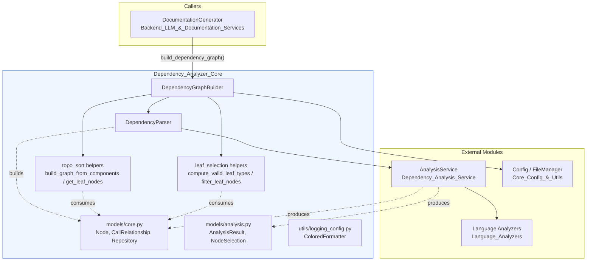
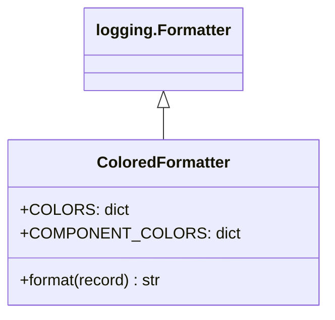
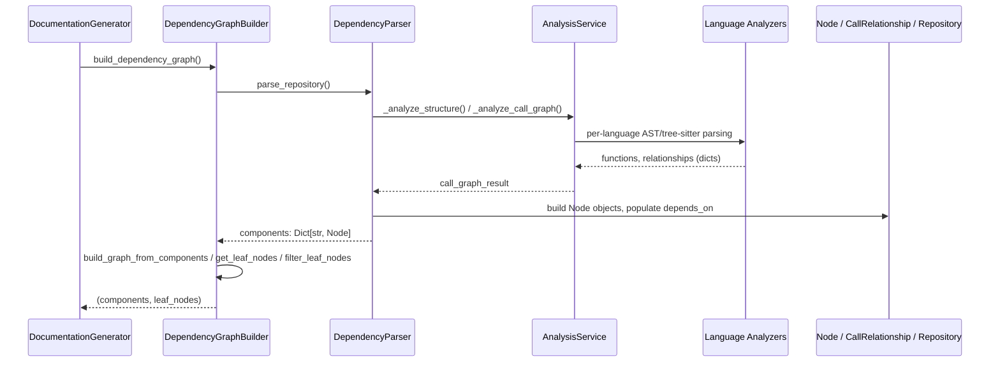

# Dependency Analyzer Core

## Purpose

`Dependency_Analyzer_Core` is the structural backbone of CodeWiki's static-analysis pipeline. It defines the **shared data models** (`Node`, `CallRelationship`, `Repository`, `AnalysisResult`, `NodeSelection`) used across the whole dependency-analysis subsystem, and provides the **orchestration layer** that turns raw, language-specific analysis output into a normalized dependency graph ready for hierarchical documentation generation.

Concretely, this module is responsible for:

- Driving a full-repository parse via `DependencyParser`, converting the output of [Dependency_Analysis_Service](Dependency_Analysis_Service.md) into a unified map of `Node` objects keyed by component id.
- Building and persisting the dependency graph, and computing the set of "leaf" components (via `DependencyGraphBuilder`) that seed the bottom-up, hierarchical documentation process used by [Backend_LLM_&_Documentation_Services](Backend_LLM_%26_Documentation_Services.md).
- Defining the canonical Pydantic models (`Node`, `CallRelationship`, `Repository`, `AnalysisResult`, `NodeSelection`) shared by nearly every other backend module — the analysis service, the language analyzers, and the documentation generator all read/write these types.
- Supplying a small logging utility (`ColoredFormatter`) used to make CLI/console output readable during long-running analysis jobs.

This module sits **below** [Dependency_Analysis_Service](Dependency_Analysis_Service.md) and the [Language_Analyzers](Language_Analyzers.md) in the sense that it consumes their raw output, but **above** them architecturally in that it defines the data contracts (`Node`, `CallRelationship`, `Repository`) that those services must produce. It is, in turn, consumed by [Backend_LLM_&_Documentation_Services](Backend_LLM_%26_Documentation_Services.md), which uses the components/leaf-nodes produced here to drive hierarchical LLM-based documentation generation, and by [Core_Config_&_Utils](Core_Config_%26_Utils.md), which supplies the `Config` object consumed by `DependencyGraphBuilder`.

## Architecture Overview

## Sub-modules

| Sub-module | Description | Documentation |
|---|---|---|
| Parsing & Graph Building | Turns raw multi-language analysis results into `Node` maps, builds the dependency graph, resolves cycles, and selects the leaf components that seed hierarchical documentation. | [Dependency_Analyzer_Core_parsing.md](Dependency_Analyzer_Core_parsing.md) |
| Data Models | The Pydantic model layer (`Node`, `CallRelationship`, `Repository`, `AnalysisResult`, `NodeSelection`) shared across the dependency-analysis subsystem. | [Dependency_Analyzer_Core_models.md](Dependency_Analyzer_Core_models.md) |

### Logging Utility

`codewiki/src/be/dependency_analyzer/utils/logging_config.py::ColoredFormatter` is a small, standalone `logging.Formatter` subclass used to colorize console output (log level, timestamp) for readability during CLI/analysis runs. It is applied via `setup_logging()` / `setup_module_logging()` helpers in the same file and has no dependencies on the rest of the module — it is documented here directly rather than as a separate sub-module.

## How This Module Fits Into the System

Downstream, `DocumentationGenerator` (see [Backend_LLM_&_Documentation_Services](Backend_LLM_%26_Documentation_Services.md)) uses the `components` map and `leaf_nodes` list to drive a bottom-up documentation pass: leaf components (typically classes/functions with no further internal dependencies) are documented first, then progressively rolled up into higher-level module documentation.

## Key Design Notes

- **Language-agnostic contract**: `Node` and `CallRelationship` are intentionally generic (string ids, sets of dependency ids) so that any of the [Language_Analyzers](Language_Analyzers.md) (Python, JS/TS, C-family, PHP) can populate them uniformly — `DependencyParser` never needs to know which language produced a given function dict.
- **Two ID reconciliation strategies**: `DependencyParser._build_components_from_analysis` reconciles caller/callee references both via an exact `component_id_mapping` and, as a fallback, by scanning components for name-only matches — this compensates for analyzers that don't always emit fully qualified callee ids.
- **Leaf-node heuristics**: `compute_valid_leaf_types` / `filter_leaf_nodes` (used by `DependencyGraphBuilder` and internally by the graph traversal) adapt to the codebase's style — OOP-heavy repositories restrict leaves to class/interface/struct types, while function-oriented or mixed-paradigm codebases (e.g. plain C, or C/C++ with minimal OOP) also allow free functions to qualify as leaves so that the resulting documentation tree stays meaningfully bounded in size.
- **Persistence**: `DependencyParser.save_dependency_graph` serializes the full component map (including `depends_on` sets converted to lists) to JSON, giving a durable, inspectable artifact of each analysis run under `Config.dependency_graph_dir`.
