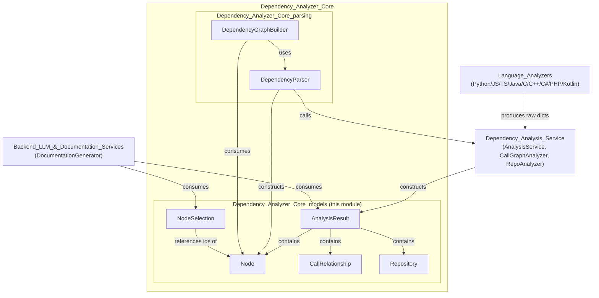
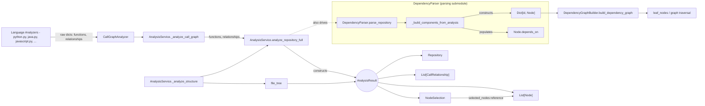
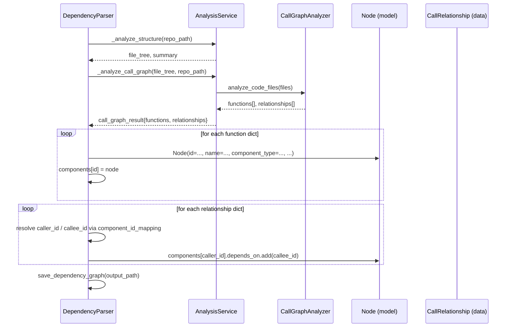
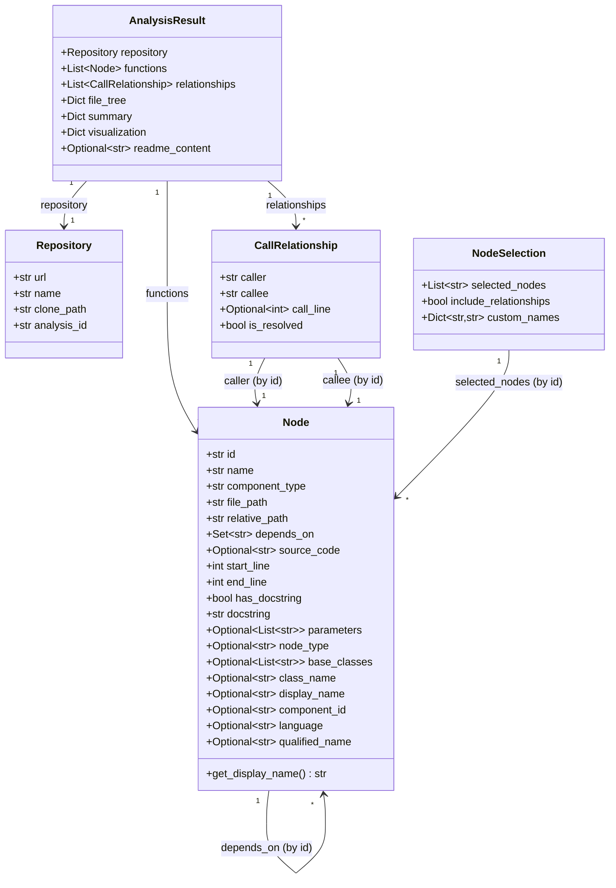

# Dependency Analyzer Core Models

## Introduction

The **Dependency_Analyzer_Core_models** module defines the foundational Pydantic data models used throughout the CodeWiki dependency-analysis pipeline. It provides the canonical, strongly-typed representations for:

- **Repository** — metadata about the analyzed source repository
- **Node** — a single code component (function, class, method, interface, etc.) discovered by language-specific analyzers
- **CallRelationship** — a directed edge representing a call/usage relationship between two `Node`s
- **AnalysisResult** — the aggregate output of a full repository analysis run
- **NodeSelection** — a user/consumer-facing selection of nodes for partial export or documentation generation

These models act as the **shared data contract** between the language analyzers, the call-graph/dependency-graph builders, the analysis orchestration service, and downstream consumers such as the documentation generator and frontend/CLI layers. Because every other component in the dependency-analysis subsystem consumes or produces these models, this module has no internal business logic of its own — it is purely a schema/data-model layer, making it a stable, low-churn dependency for the rest of the system.

---

## Module Location & Relationships

This module is a child of [Dependency_Analyzer_Core](Dependency_Analyzer_Core.md), sitting alongside its sibling [Dependency_Analyzer_Core_parsing](Dependency_Analyzer_Core_parsing.md) (which contains `DependencyParser` and `DependencyGraphBuilder`).

See also: [Language_Analyzers](Language_Analyzers.md), [Dependency_Analysis_Service](Dependency_Analysis_Service.md), and [Backend_LLM_&_Documentation_Services](Backend_LLM_&_Documentation_Services.md) for the components that produce or consume these models.

---

## Core Components

### 1. `Node` (`models/core.py`)

Represents a single analyzable code component (function, method, class, interface, struct, etc.) extracted by any of the language-specific analyzers.

| Field | Type | Description |
|---|---|---|
| `id` | `str` | Globally unique identifier for the node (often `file_path::qualified_name`) |
| `name` | `str` | Simple/short name of the component |
| `component_type` | `str` | Kind of component (e.g., `function`, `method`, `class`) |
| `file_path` | `str` | Absolute path to the source file |
| `relative_path` | `str` | Path relative to repository root |
| `depends_on` | `Set[str]` | IDs of other `Node`s this node calls/depends on (populated from `CallRelationship`s) |
| `source_code` | `Optional[str]` | Raw source snippet for the component |
| `start_line` / `end_line` | `int` | Location within the file |
| `has_docstring` / `docstring` | `bool` / `str` | Documentation metadata |
| `parameters` | `Optional[List[str]]` | Function/method parameter names |
| `node_type` | `Optional[str]` | Finer-grained type (e.g., `class`, `interface`, `struct`, `enum`, `record`) |
| `base_classes` | `Optional[List[str]]` | Parent classes/interfaces, if applicable |
| `class_name` | `Optional[str]` | Enclosing class name (for methods) |
| `display_name` | `Optional[str]` | Human-friendly name for UI/docs |
| `component_id` | `Optional[str]` | Redundant/legacy identifier, mirrors `id` |
| `language` | `Optional[str]` | Source language (e.g., `python`, `java`) |
| `qualified_name` | `Optional[str]` | Fully qualified name (namespace/module aware) |

**Method:**
- `get_display_name() -> str`: Returns `display_name` if set, otherwise falls back to `name`. Used by rendering layers (docs, HTML generator) to present a consistent human-readable label without needing to check for `None`.

`Node.depends_on` is the backbone of dependency-graph traversal performed in [Dependency_Analyzer_Core_parsing](Dependency_Analyzer_Core_parsing.md) (`DependencyGraphBuilder.build_dependency_graph`, leaf-node computation, etc.).

### 2. `CallRelationship` (`models/core.py`)

Represents a directed call/usage edge between two nodes, as detected by the [Language_Analyzers](Language_Analyzers.md) and consolidated by `CallGraphAnalyzer` in the [Dependency_Analysis_Service](Dependency_Analysis_Service.md).

| Field | Type | Description |
|---|---|---|
| `caller` | `str` | ID of the calling node |
| `callee` | `str` | ID (or name, if unresolved) of the called node |
| `call_line` | `Optional[int]` | Line number where the call occurs |
| `is_resolved` | `bool` | Whether `callee` was successfully matched to a known `Node.id` |

Relationships are consumed by `DependencyParser._build_components_from_analysis` to populate each `Node.depends_on` set — resolving legacy/raw IDs into canonical component IDs, and falling back to name-matching when the direct ID lookup fails.

### 3. `Repository` (`models/core.py`)

Lightweight metadata describing the repository under analysis.

| Field | Type | Description |
|---|---|---|
| `url` | `str` | Source URL (e.g., GitHub repo URL) |
| `name` | `str` | Repository name |
| `clone_path` | `str` | Local filesystem path where the repo was cloned/checked out |
| `analysis_id` | `str` | Unique identifier for this analysis run (typically `{owner}-{name}`) |

Produced by `AnalysisService.analyze_repository_full` (in [Dependency_Analysis_Service](Dependency_Analysis_Service.md)) using data from `parse_github_url` and the cloning step, and embedded into `AnalysisResult.repository`.

### 4. `AnalysisResult` (`models/analysis.py`)

The top-level aggregate model returned by a **full repository analysis**. It composes `Repository`, `Node`, and `CallRelationship` together with supplementary metadata.

| Field | Type | Description |
|---|---|---|
| `repository` | `Repository` | Metadata about the analyzed repo |
| `functions` | `List[Node]` | All discovered components (functions, classes, methods, etc.) |
| `relationships` | `List[CallRelationship]` | All discovered call/usage edges |
| `file_tree` | `Dict[str, Any]` | Hierarchical representation of the repository's files/directories |
| `summary` | `Dict[str, Any]` | Aggregate statistics (file counts, function counts, languages found, etc.) |
| `visualization` | `Dict[str, Any]` | Precomputed visualization payload (e.g., for graph rendering), defaults to `{}` |
| `readme_content` | `Optional[str]` | Raw contents of the repository's README file, if found |

`AnalysisResult` is constructed exclusively inside `AnalysisService.analyze_repository_full` (see [Dependency_Analysis_Service](Dependency_Analysis_Service.md)) and subsequently consumed by downstream documentation generation (`DocumentationGenerator` in [Backend_LLM_&_Documentation_Services](Backend_LLM_&_Documentation_Services.md)) and any API/CLI layer that needs a complete snapshot of the analysis.

### 5. `NodeSelection` (`models/analysis.py`)

A lightweight model representing a **user-driven subset** of nodes — e.g., for exporting only part of a dependency graph, or scoping documentation generation to specific components.

| Field | Type | Description |
|---|---|---|
| `selected_nodes` | `List[str]` | IDs of `Node`s selected for export/processing (default: empty list) |
| `include_relationships` | `bool` | Whether to include `CallRelationship` edges between selected nodes (default: `True`) |
| `custom_names` | `Dict[str, str]` | Optional mapping of node ID → user-supplied display name override |

This model decouples the "full" analysis output (`AnalysisResult`) from partial/filtered views requested by consumers, without requiring changes to the core graph models.

---

## Data Flow

The diagram below shows how raw analyzer output flows through these models to become the final `AnalysisResult`, and how a subset can later be captured via `NodeSelection`.

---

## Component Interaction: Building `Node.depends_on`

`DependencyParser` (in [Dependency_Analyzer_Core_parsing](Dependency_Analyzer_Core_parsing.md)) is the primary consumer that transforms raw analysis dicts into strongly-typed `Node` objects and resolves relationships into the `depends_on` set.

Key resolution logic in `_build_components_from_analysis`:
1. Each function dict is mapped 1:1 to a `Node`, keyed by its `id` (with a legacy `file_path:name` alias also tracked in `component_id_mapping`).
2. Each `CallRelationship`-like dict's `caller`/`callee` values are resolved through `component_id_mapping`; if `callee` is not found by ID, a fallback name-match against existing `Node.name` values is attempted.
3. Successfully resolved edges are folded directly into `Node.depends_on` — meaning explicit `CallRelationship` objects are primarily used at the `AnalysisResult`/`AnalysisService` layer, while the parser's internal graph representation flattens them into the node's own dependency set for efficient graph traversal.

---

## Model Relationships (Class Diagram)

---

## Usage Across the System

| Consumer | How it uses these models |
|---|---|
| [Dependency_Analyzer_Core_parsing](Dependency_Analyzer_Core_parsing.md) — `DependencyParser` | Constructs `Node` instances from raw analyzer output; resolves `CallRelationship`-style dicts into `Node.depends_on`; serializes `Node`s to JSON via `save_dependency_graph` |
| [Dependency_Analyzer_Core_parsing](Dependency_Analyzer_Core_parsing.md) — `DependencyGraphBuilder` | Consumes the `Dict[str, Node]` produced by `DependencyParser` to build a traversable graph and compute leaf nodes for documentation scoping |
| [Dependency_Analysis_Service](Dependency_Analysis_Service.md) — `AnalysisService` | Constructs the full `AnalysisResult` (with `Repository`, `Node` list, `CallRelationship` list) from cloned repository analysis; also returns lighter-weight dicts for structure-only analysis |
| [Dependency_Analysis_Service](Dependency_Analysis_Service.md) — `CallGraphAnalyzer` | Produces the raw function/relationship dictionaries later hydrated into `Node`/`CallRelationship` |
| [Language_Analyzers](Language_Analyzers.md) (Python, JS/TS, C-family, PHP, Kotlin) | Emit language-specific raw component and call data that conforms to the shape expected by `Node`/`CallRelationship` construction |
| [Backend_LLM_&_Documentation_Services](Backend_LLM_&_Documentation_Services.md) — `DocumentationGenerator` | Consumes `AnalysisResult` (and `NodeSelection` for scoped/partial doc generation) to drive LLM-based documentation generation |
| [Frontend_Web_App](Frontend_Web_App.md) / CLI layers | Indirectly rely on the JSON-serialized form of these models (e.g., dependency graph JSON files, job statistics) for status reporting and visualization |

---

## Design Notes

- **Pydantic-based validation**: All models subclass `pydantic.BaseModel`, giving automatic validation, JSON (de)serialization, and default value handling — critical since data flows through multiple layers (analyzers → service → parser → graph builder → doc generator) often crossing process/file boundaries (e.g., `save_dependency_graph` writes JSON to disk).
- **`depends_on` as `Set[str]`**: Using a set avoids duplicate edges and enables efficient membership checks during graph traversal (used by `DependencyGraphBuilder` for leaf-node computation and cycle-safe traversal).
- **Loose coupling via IDs**: Relationships between models (`Node.depends_on`, `CallRelationship.caller/callee`, `NodeSelection.selected_nodes`) are expressed as string IDs rather than embedded object references, keeping the models serialization-friendly and avoiding circular references in JSON output.
- **Backward compatibility**: `Node.component_id` duplicates `Node.id` for legacy consumers, and `DependencyParser` maintains a `component_id_mapping` to bridge older `file_path:name`-style identifiers with the newer canonical `id` scheme.
- **Separation of concerns**: This module intentionally contains **no business logic** — parsing, graph-building, and orchestration logic live in [Dependency_Analyzer_Core_parsing](Dependency_Analyzer_Core_parsing.md) and [Dependency_Analysis_Service](Dependency_Analysis_Service.md), keeping the data contracts stable and independently testable.
