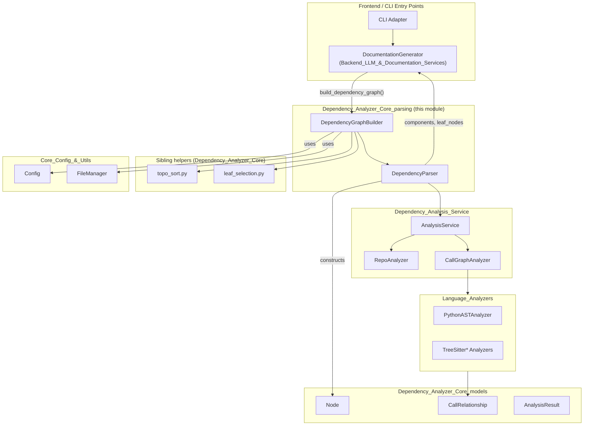
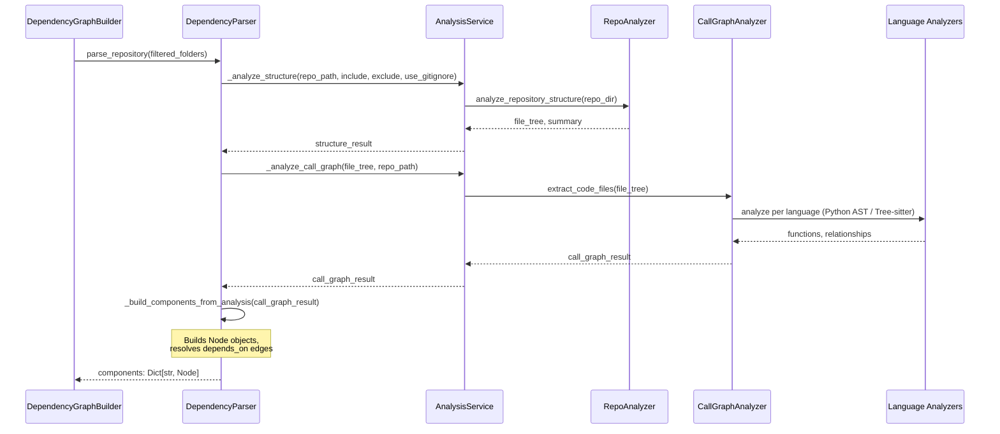
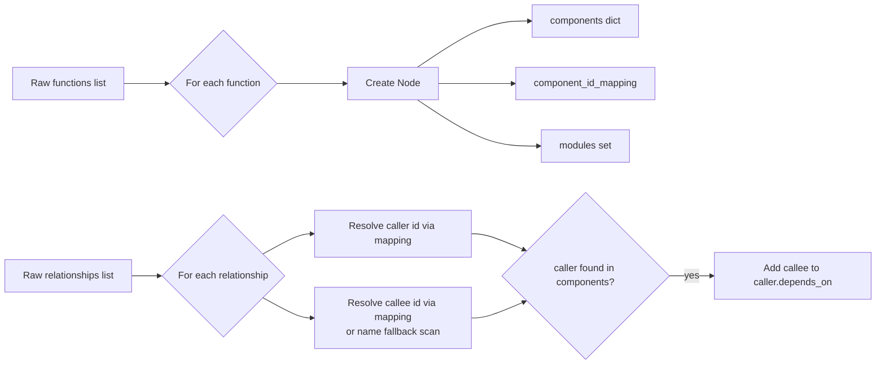
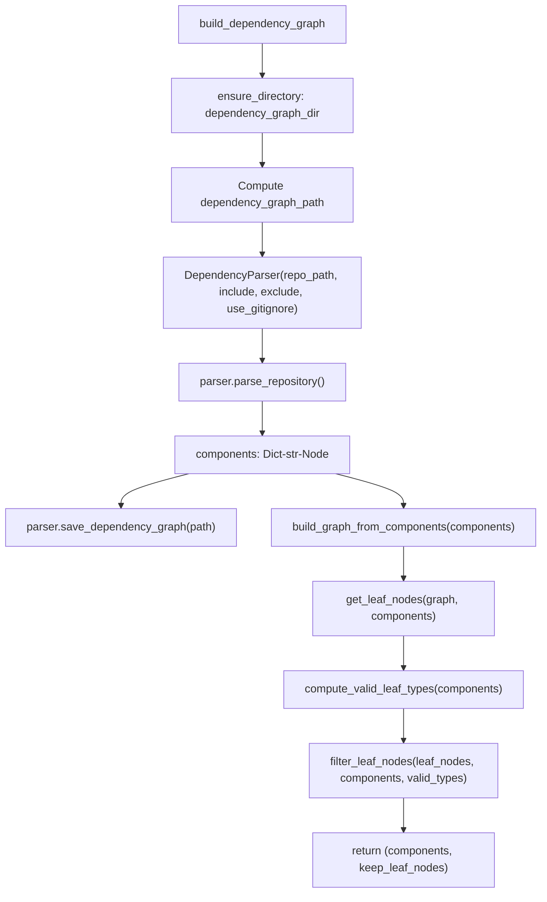
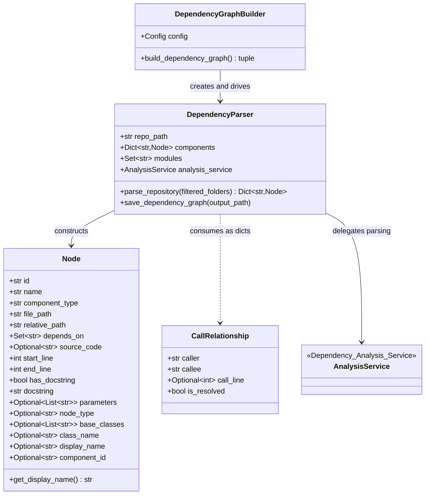
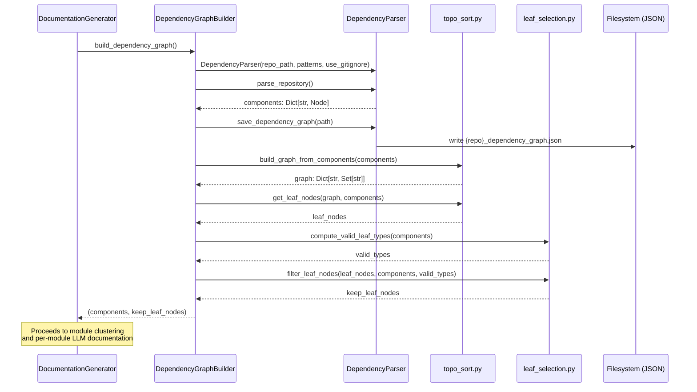

# Dependency Analyzer Core: Parsing

## Introduction

The **Dependency Analyzer Core: Parsing** module is the orchestration layer that turns a raw source repository into a *dependency graph* of code components (functions, classes, methods, etc.) ready for downstream documentation generation. It sits at the boundary between low-level, language-specific static analysis (performed by the [Dependency_Analysis_Service](Dependency_Analysis_Service.md) and its [Language_Analyzers](Language_Analyzers.md)) and the higher-level clustering/LLM documentation pipeline (see [Backend_LLM_&_Documentation_Services](Backend_LLM_&_Documentation_Services.md)).

It has two responsibilities:

1. **Parsing** (`DependencyParser` in `ast_parser.py`) — walk a repository, run structure + call-graph analysis, and normalize the results into a flat dictionary of typed `Node` objects with resolved `depends_on` edges.
2. **Graph building** (`DependencyGraphBuilder` in `dependency_graphs_builder.py`) — wrap the parser, persist the resulting graph to disk, and reduce the (typically huge) component graph down to a manageable set of **leaf nodes** that later drive bottom-up documentation generation.

This module is a child of [Dependency_Analyzer_Core](Dependency_Analyzer_Core.md), sitting alongside its sibling [Dependency_Analyzer_Core_models](Dependency_Analyzer_Core_models.md), which defines the `Node`, `CallRelationship`, `Repository`, and `AnalysisResult` data models consumed and produced here.

---

## Module Position in the System

---

## Component Overview

### `DependencyParser` (`ast_parser.py`)

`DependencyParser` is the entry point for turning a repository path into a dictionary of `Node` objects (`Dict[str, Node]`), keyed by a unique component id (e.g. `path/to/file.py::ClassName.method_name`).

**Responsibilities:**

- Accepts a `repo_path`, optional `include_patterns` / `exclude_patterns` file filters, and a `use_gitignore` flag.
- Delegates all heavy lifting (file discovery, filtering, AST/tree-sitter parsing per language) to an internal `AnalysisService` instance from [Dependency_Analysis_Service](Dependency_Analysis_Service.md).
- Normalizes the raw dict-based analysis output into strongly-typed `Node` instances (see [Dependency_Analyzer_Core_models](Dependency_Analyzer_Core_models.md)).
- Resolves caller → callee relationships into each `Node.depends_on` set, using both exact component-id matches and a fallback by-name lookup.
- Persists the graph to JSON via `save_dependency_graph`.

**Key methods:**

| Method | Purpose |
|---|---|
| `__init__(repo_path, include_patterns, exclude_patterns, use_gitignore)` | Configure the parser and instantiate an `AnalysisService`. |
| `parse_repository(filtered_folders=None)` | Orchestrates structure analysis → call-graph analysis → component/edge construction. Returns `self.components`. |
| `_build_components_from_analysis(call_graph_result)` | Converts raw `functions`/`relationships` dicts into `Node` objects and populates `depends_on` edges. |
| `_determine_component_type(func_dict)` | Maps raw analyzer output to a normalized component type (`method`, `class`, `interface`, `function`, etc.). |
| `_file_to_module_path(file_path)` | Converts a file path into a dotted module path (used for module bookkeeping). |
| `save_dependency_graph(output_path)` | Serializes all components (with `depends_on` sets converted to lists) to a JSON file. |

#### Parsing sequence

#### Component construction & relationship resolution

`_build_components_from_analysis` performs two passes:

1. **Node construction pass** — for every function/class entry returned by the call-graph analyzer, a `Node` (see [Dependency_Analyzer_Core_models](Dependency_Analyzer_Core_models.md)) is created with fields like `id`, `component_type`, `file_path`, `source_code`, `docstring`, `parameters`, `base_classes`, etc. A `component_id_mapping` is built to support both the canonical id and a legacy `file_path:name` id format. Module paths are also collected into `self.modules`.
2. **Relationship resolution pass** — for each `CallRelationship`-like dict (`caller`, `callee`, `is_resolved`), the parser resolves both ends to canonical component ids (falling back to a name-based scan of `self.components` if the callee id isn't directly found) and adds the callee id into the caller `Node.depends_on` set.

---

### `DependencyGraphBuilder` (`dependency_graphs_builder.py`)

`DependencyGraphBuilder` is a thin orchestration wrapper used directly by `DocumentationGenerator` (see [Backend_LLM_&_Documentation_Services](Backend_LLM_&_Documentation_Services.md)). It wires together `DependencyParser`, disk persistence, and leaf-node computation to produce the two artifacts the documentation pipeline needs: the full `components` map and a curated list of `leaf_nodes`.

**Key method — `build_dependency_graph()`:**

1. Ensures the configured `dependency_graph_dir` exists (via `FileManager`, [Core_Config_&_Utils](Core_Config_&_Utils.md)).
2. Computes a sanitized output path `{repo_name}_dependency_graph.json` for the serialized graph.
3. Reads `include_patterns` / `exclude_patterns` / `use_gitignore` from `Config`.
4. Instantiates a `DependencyParser` and calls `parse_repository()` to get `components`.
5. Persists the graph via `parser.save_dependency_graph(...)`.
6. Builds an in-memory adjacency graph with `build_graph_from_components(components)` (from `topo_sort.py`).
7. Computes leaf nodes with `get_leaf_nodes(graph, components)`.
8. Filters leaf nodes down to valid types using `compute_valid_leaf_types` + `filter_leaf_nodes` (from `leaf_selection.py`), ensuring only real, well-typed components (classes/interfaces/structs, or functions in function-heavy codebases) are kept.
9. Returns `(components, keep_leaf_nodes)`.

#### Why "leaf nodes" matter

The documentation pipeline ([Backend_LLM_&_Documentation_Services](Backend_LLM_&_Documentation_Services.md)) processes the codebase bottom-up: it needs a manageable, semantically meaningful set of "atomic" components — classes, interfaces, structs, or (in function-heavy / non-OOP codebases) standalone functions — to seed clustering and per-module documentation generation. Leaf nodes are nodes in the dependency graph that nothing else depends on (i.e., not referenced as a dependency by any other node), representing top-level entry points of the dependency chain. `topo_sort.py` and `leaf_selection.py` (siblings within [Dependency_Analyzer_Core](Dependency_Analyzer_Core.md)) implement:

- **Cycle resolution** — the raw call graph may contain cycles (e.g., mutual recursion); `get_leaf_nodes` first resolves cycles into a DAG.
- **Conciseness** — `__init__` methods are collapsed to their owning class name so constructors don't appear as separate leaves.
- **Leaf reduction** — if too many leaf nodes are found (`LEAF_REDUCTION_THRESHOLD`), nodes that are dependencies of others are pruned from the leaf set to keep it a manageable size.
- **Type filtering** — `compute_valid_leaf_types` decides whether standalone functions should be treated as valid leaves (e.g. for C-style procedural codebases) or whether only class/interface/struct-like types should count (`OOP_TYPES`), based on the ratio of OOP vs. function components in the repo.

---

## Data Model Dependencies

This module produces and consumes types defined in [Dependency_Analyzer_Core_models](Dependency_Analyzer_Core_models.md):

- **`Node`** — the canonical in-memory representation of a parsed code component (function, method, class, etc.), including `depends_on: Set[str]` for outgoing dependency edges.
- **`CallRelationship`** — the raw caller/callee shape produced by language analyzers before being folded into `Node.depends_on`.
- **`Repository` / `AnalysisResult`** — used further upstream by `AnalysisService.analyze_repository_full` (see [Dependency_Analysis_Service](Dependency_Analysis_Service.md)), though `DependencyParser` itself only uses the lower-level `_analyze_structure` / `_analyze_call_graph` primitives rather than the full `AnalysisResult` wrapper.

---

## Configuration & Utilities Used

- **`Config`** (see [Core_Config_&_Utils](Core_Config_&_Utils.md)) supplies `repo_path`, `dependency_graph_dir`, `include_patterns`, `exclude_patterns`, and `use_gitignore` to `DependencyGraphBuilder`.
- **`FileManager`** (see [Core_Config_&_Utils](Core_Config_&_Utils.md)) is used by `DependencyGraphBuilder` to ensure output directories exist (JSON persistence of the graph itself is done directly by `DependencyParser.save_dependency_graph`, using standard file I/O rather than `FileManager`).

---

## Typical Usage Flow (End-to-End)

`DocumentationGenerator.run()` (in [Backend_LLM_&_Documentation_Services](Backend_LLM_&_Documentation_Services.md)) calls `self.graph_builder.build_dependency_graph()` as its very first step, then uses the returned `components` and `leaf_nodes` to drive module clustering and bottom-up, per-module LLM documentation generation.

---

## Summary

| Aspect | Details |
|---|---|
| **Primary role** | Convert a raw repository into a normalized, typed dependency graph and extract a curated set of leaf components. |
| **Key classes** | `DependencyParser`, `DependencyGraphBuilder` |
| **Upstream dependency** | [Dependency_Analysis_Service](Dependency_Analysis_Service.md) (`AnalysisService`, `RepoAnalyzer`, `CallGraphAnalyzer`) and [Language_Analyzers](Language_Analyzers.md) for actual per-language parsing. |
| **Sibling dependency** | [Dependency_Analyzer_Core_models](Dependency_Analyzer_Core_models.md) for `Node`/`CallRelationship` types; `topo_sort.py` and `leaf_selection.py` helpers within [Dependency_Analyzer_Core](Dependency_Analyzer_Core.md) for graph traversal and leaf filtering. |
| **Downstream consumer** | [Backend_LLM_&_Documentation_Services](Backend_LLM_&_Documentation_Services.md) (`DocumentationGenerator`), which uses the produced `components`/`leaf_nodes` to drive clustering and documentation generation. |
| **Configuration source** | [Core_Config_&_Utils](Core_Config_&_Utils.md) (`Config`, `FileManager`). |
| **Persisted artifact** | `{sanitized_repo_name}_dependency_graph.json` under `Config.dependency_graph_dir`. |
