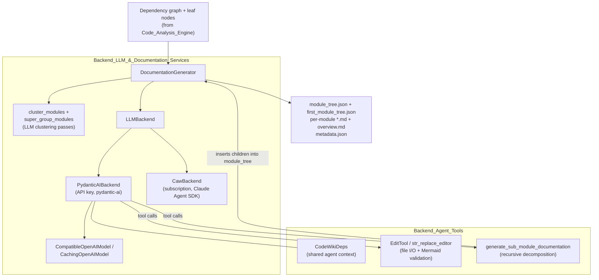
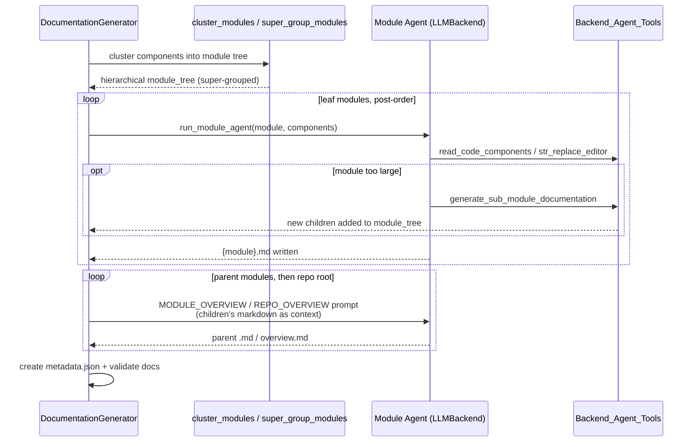

# Documentation Generation Engine

## Purpose

The **Documentation_Generation_Engine** subsystem is CodeWiki's LLM-driven back half: it takes the dependency graph produced by the [Code_Analysis_Engine](Code_Analysis_Engine.md) and turns it into the finished documentation set — per-module Markdown files with validated Mermaid diagrams, parent-module overviews, and the repository-level `overview.md`.

It consists of two tightly-coupled modules:

1. **[Backend_LLM_&_Documentation_Services](Backend_LLM_&_Documentation_Services.md)** — the orchestration core. `DocumentationGenerator` drives the end-to-end flow (module clustering → super-grouping → leaf-first traversal → parent overviews → metadata/validation), while the `LLMBackend` abstraction provides two interchangeable execution engines: `PydanticAIBackend` (API-key based, via `pydantic-ai` with prompt-caching-aware OpenAI-compatible models) and `CawBackend` (subscription-based, driving the Claude Agent SDK / `caw` CLI).
2. **[Backend_Agent_Tools](Backend_Agent_Tools.md)** — the sandboxed tools handed to documentation agents: `EditTool` / `str_replace_editor` (file viewing and editing with built-in Mermaid diagram validation), the `CodeWikiDeps` shared context object, and the sub-module documentation spawner that lets an agent recursively decompose a large module into child modules at generation time.

The engine works **bottom-up**: leaf modules are documented first by autonomous agents that read real source code through their tools; parent modules and the repository overview are then synthesized from their children's finished Markdown.

## Architecture

### Generation flow

Key design decisions:

* **Two backends, one contract.** `LLMBackend` isolates the generator from how agents actually run, so API-key users (`PydanticAIBackend`) and subscription users (`CawBackend`) share the same pipeline.
* **Agents write files themselves.** Documentation isn't returned as chat text; agents use `str_replace_editor` to write Markdown directly, and every embedded Mermaid diagram is validated before the write is accepted.
* **Dynamic hierarchy.** The module tree is not fixed after clustering: agents can split oversized modules into sub-modules at runtime, and the tree (persisted to `module_tree.json`) grows accordingly.
* **Resumability.** An existing `{module}.md` short-circuits regeneration, making interrupted or incremental runs cheap.

## Modules

| Module | Responsibility | Documentation |
|---|---|---|
| **Backend_LLM_&_Documentation_Services** | Pipeline orchestration, module clustering/super-grouping, LLM backend abstraction (API-key and subscription) | [Backend_LLM_&_Documentation_Services.md](Backend_LLM_&_Documentation_Services.md) |
| **Backend_Agent_Tools** | Agent-facing sandboxed tools: file viewer/editor with Mermaid validation, shared `CodeWikiDeps` context, sub-module spawner | [Backend_Agent_Tools.md](Backend_Agent_Tools.md) |

## Related Modules

* [Code_Analysis_Engine](Code_Analysis_Engine.md) — produces the dependency graph and leaf nodes this engine documents.
* [Core_Config_&_Utils](Core_Config_&_Utils.md) — `Config` (models, token budgets, depth limits) and `FileManager` (tree/metadata persistence) used throughout the pipeline.
* [User_Interfaces](User_Interfaces.md) — the CLI, web app, and MCP server that invoke this engine and present its output.
