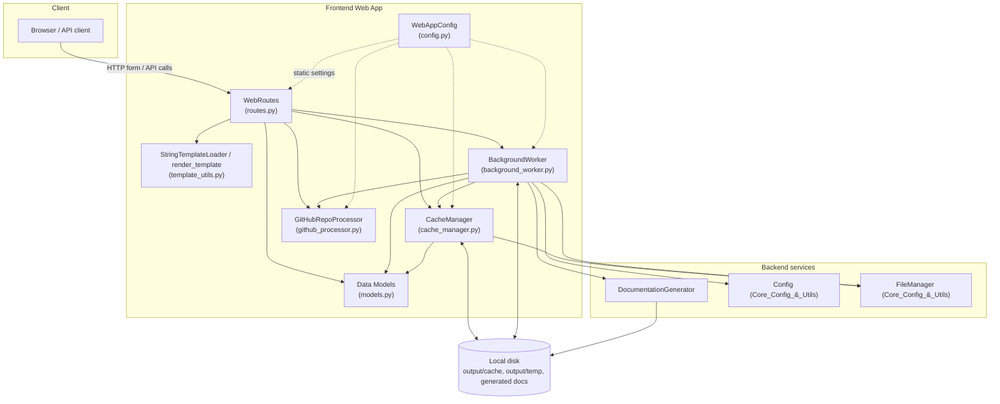
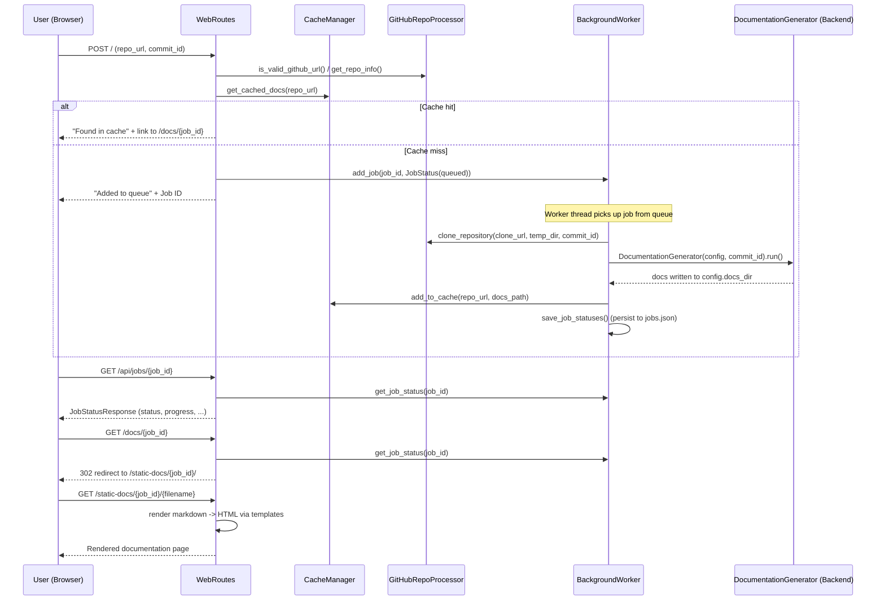

# Frontend Web App

## Introduction

The **Frontend Web App** module is the user-facing HTTP layer of CodeWiki. It exposes a FastAPI-based
web interface that lets a user submit a GitHub repository URL, tracks the asynchronous documentation
generation job for that repository, serves the generated markdown documentation as browsable HTML pages,
and caches completed results so repeated requests for the same repository are served instantly.

This module acts as the orchestration glue between the outside world (browser/API clients) and the
backend documentation-generation pipeline. It does not perform dependency analysis or LLM calls itself;
instead it delegates the heavy lifting to [Backend_LLM_&_Documentation_Services](Backend_LLM_%26_Documentation_Services.md)
(specifically `DocumentationGenerator`) and to [Core_Config_&_Utils](Core_Config_%26_Utils.md) for shared
configuration (`Config`) and file I/O (`FileManager`).

## Purpose & Responsibilities

- Provide a simple web form to submit a GitHub repository for documentation generation.
- Validate and normalize submitted GitHub URLs.
- Queue and asynchronously process documentation-generation jobs in a background thread, without
  blocking the FastAPI request/response cycle.
- Persist job state and a documentation cache to disk so results survive process restarts and repeated
  submissions are served from cache instead of re-running the (expensive) generation pipeline.
- Render generated markdown documentation as navigable HTML pages using Jinja2 templates.
- Expose a small JSON API for polling job status.

## Architecture Overview

## Sub-modules

The Frontend Web App is organized into three functional areas, each documented in detail in its own file:

| Sub-module | Description | Documentation |
|---|---|---|
| **Job Processing & Caching** | Owns the job lifecycle (queueing, background processing, persistence) and the documentation cache used to avoid re-generating docs for the same repository/commit. | [Frontend_Web_App_job_processing.md](Frontend_Web_App_job_processing.md) |
| **Web Routes & Rendering** | FastAPI route handlers for the submission form, job-status API, and documentation viewer, plus the Jinja2-based template rendering utilities. | [Frontend_Web_App_web_routes.md](Frontend_Web_App_web_routes.md) |
| **GitHub Integration & App Configuration** | Validates GitHub URLs, extracts repo metadata, clones repositories, and centralizes all web-app configuration constants (directories, timeouts, ports). | [Frontend_Web_App_github_config.md](Frontend_Web_App_github_config.md) |

## End-to-End Request Flow

The following sequence illustrates how a repository submission flows through the module and into the
backend documentation pipeline:

## Key Data Models

All shared data structures used across the module live in `codewiki/src/fe/models.py`:

- **`RepositorySubmission`** — Pydantic model validating the submitted repository URL (`HttpUrl`).
- **`JobStatus`** — Dataclass tracking a documentation job's lifecycle (`queued` → `processing` →
  `completed`/`failed`), including timestamps, progress text, error messages, and the resulting
  `docs_path`.
- **`JobStatusResponse`** — Pydantic response model mirroring `JobStatus` for the JSON status API.
- **`CacheEntry`** — Dataclass representing a cached documentation result keyed by a hash of the
  repository URL.

These models are consumed by all three sub-modules; see [Frontend_Web_App_job_processing.md](Frontend_Web_App_job_processing.md)
for how `JobStatus`/`CacheEntry` are persisted, and [Frontend_Web_App_web_routes.md](Frontend_Web_App_web_routes.md)
for how they are serialized in HTTP responses.

## Relationship to Other Modules

- **[Backend_LLM_&_Documentation_Services](Backend_LLM_%26_Documentation_Services.md)** — `BackgroundWorker`
  instantiates `DocumentationGenerator` to run the actual analysis + LLM documentation pipeline for a
  cloned repository.
- **[Core_Config_&_Utils](Core_Config_%26_Utils.md)** — `Config.from_args` builds the pipeline configuration
  consumed by `DocumentationGenerator`, and the shared `file_manager` (`FileManager`) singleton is used
  throughout the Frontend Web App for reading/writing JSON and text files (job state, cache index,
  generated markdown).
- **[Dependency_Analysis_Service](Dependency_Analysis_Service.md) / [Dependency_Analyzer_Core](Dependency_Analyzer_Core.md)** —
  invoked indirectly via `DocumentationGenerator`; the Frontend Web App has no direct dependency on them.
- **[CLI](CLI.md)** — an alternative entry point into the same backend documentation-generation
  pipeline; the Frontend Web App provides the equivalent capability through a browser/HTTP interface
  instead of a command line.

## Typical Deployment

`WebAppConfig` (see [Frontend_Web_App_github_config.md](Frontend_Web_App_github_config.md)) defines
directories (`./output/cache`, `./output/temp`, `./output/`) and server defaults (host `127.0.0.1`,
port `8000`) used when wiring up the FastAPI application (routes + background worker + cache manager)
in the application entry point.
