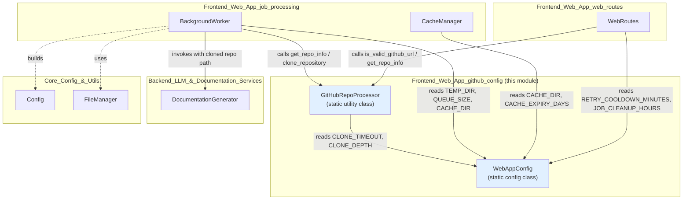
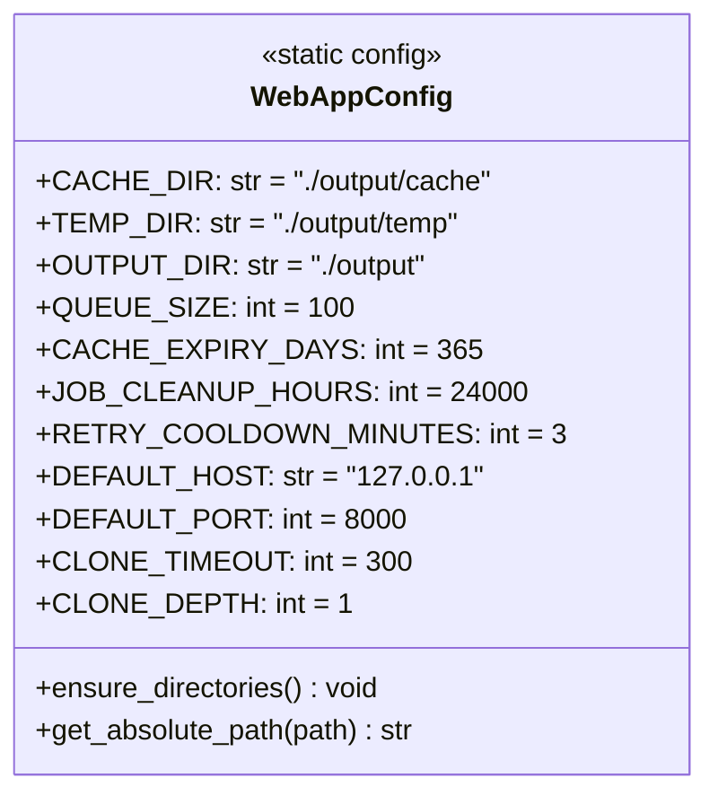
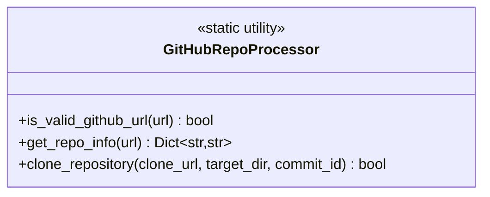
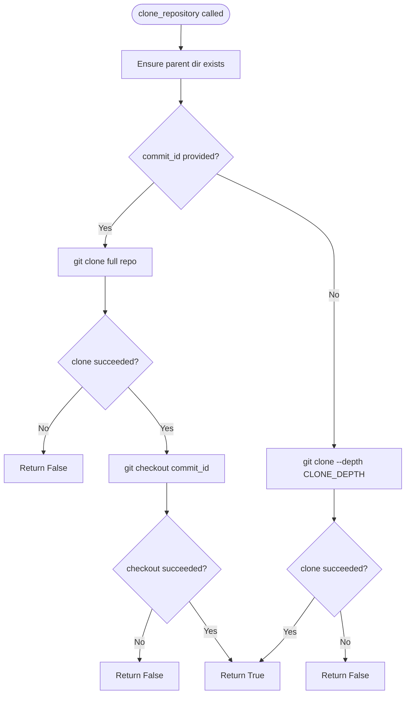
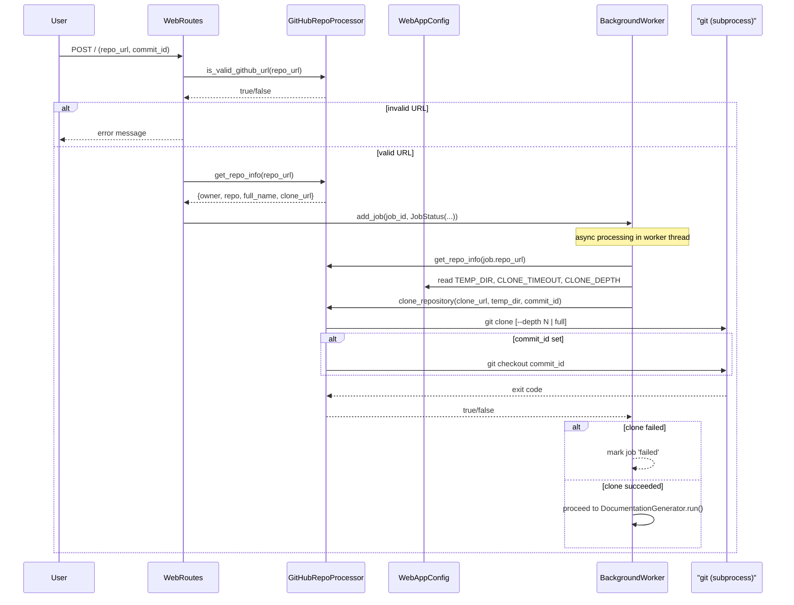
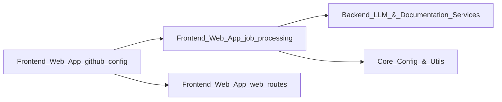

# Frontend Web App — GitHub & Config

## Introduction

The **Frontend_Web_App_github_config** module provides two foundational, low-level services used throughout the [Frontend_Web_App](Frontend_Web_App.md) module family:

1. **`WebAppConfig`** (`codewiki/src/fe/config.py`) — a centralized, static configuration class that defines directory locations, queue sizes, cache expiry policies, job cleanup rules, server defaults, and git cloning parameters for the web application.
2. **`GitHubRepoProcessor`** (`codewiki/src/fe/github_processor.py`) — a stateless utility class responsible for validating GitHub repository URLs, extracting repository metadata, and cloning repositories to local disk (optionally at a specific commit).

These two components have no business logic of their own beyond validation, parsing, and cloning — they act as **shared infrastructure** that other Frontend Web App submodules (job processing, web routes) depend on. This module sits at the bottom of the Frontend Web App dependency stack: almost every other component in the frontend imports from it, but it imports from nothing else in the frontend.

---

## Module Purpose & Responsibilities

| Component | Responsibility |
|---|---|
| `WebAppConfig` | Single source of truth for all configurable constants (paths, timeouts, limits) used by the frontend web application. |
| `GitHubRepoProcessor` | Validates GitHub URLs, parses owner/repo/clone-url metadata, and performs `git clone` (shallow or full + checkout) operations into temporary directories. |

### Why this module exists

Documentation generation begins with a user submitting a GitHub URL. Before any expensive analysis or LLM-based documentation work can start (see [Backend_LLM_&_Documentation_Services](Backend_LLM_&_Documentation_Services.md) and [Dependency_Analysis_Service](Dependency_Analysis_Service.md)), the system must:

- Confirm the URL is actually a GitHub repository URL.
- Derive a canonical, URL-safe identifier for the repository (used as job IDs, cache keys, and temp directory names).
- Physically clone the repository's source code onto local disk for analysis.

`GitHubRepoProcessor` encapsulates all of this, while `WebAppConfig` supplies the directory paths, timeouts, and clone-depth settings it needs.

---

## Architecture



---

## Component Details

### `WebAppConfig`

A pure static-configuration class (no instantiation required, all attributes are class-level). It groups settings into logical categories:



**Key settings and their consumers:**

| Setting | Used By | Purpose |
|---|---|---|
| `CACHE_DIR` | `CacheManager`, `BackgroundWorker` (jobs.json location) | Where cached documentation index/entries are stored |
| `TEMP_DIR` | `BackgroundWorker` | Where repositories are cloned during processing |
| `OUTPUT_DIR` | `WebAppConfig.ensure_directories` | Root output directory for generated docs |
| `QUEUE_SIZE` | `BackgroundWorker` | Max size of the in-memory job processing `Queue` |
| `CACHE_EXPIRY_DAYS` | `CacheManager` | TTL for cached documentation entries |
| `JOB_CLEANUP_HOURS` | `WebRoutes.cleanup_old_jobs` | How long completed/failed jobs are retained before removal |
| `RETRY_COOLDOWN_MINUTES` | `WebRoutes.index_post` | Cooldown before a previously-failed job can be resubmitted |
| `DEFAULT_HOST` / `DEFAULT_PORT` | Web server bootstrap (ASGI app entrypoint) | Default bind address/port |
| `CLONE_TIMEOUT` | `GitHubRepoProcessor.clone_repository` | Max seconds allowed for `git clone` subprocess |
| `CLONE_DEPTH` | `GitHubRepoProcessor.clone_repository` | Shallow clone depth for the default (no-commit) case |

**Utility methods:**

- `ensure_directories()` — idempotently creates `CACHE_DIR`, `TEMP_DIR`, and `OUTPUT_DIR` on disk (called at application startup).
- `get_absolute_path(path)` — thin wrapper around `os.path.abspath` for consistent path resolution.

---

### `GitHubRepoProcessor`

A collection of `@staticmethod`s — no instance state — that handles all GitHub-URL-related concerns.



#### `is_valid_github_url(url) -> bool`
Validates that a URL:
- Has a `github.com` / `www.github.com` netloc.
- Has at least two non-empty path segments (`owner/repo`).

Used by `WebRoutes.index_post` (see [Frontend_Web_App_web_routes](Frontend_Web_App_web_routes.md)) as a form-submission guard before any job is queued.

#### `get_repo_info(url) -> Dict[str, str]`
Parses a validated URL into a structured dict:

```json
{
  "owner": "owner-name",
  "repo": "repo-name",
  "full_name": "owner-name/repo-name",
  "clone_url": "https://github.com/owner-name/repo-name.git"
}
```

This `full_name` value (with `/` replaced by `--`) becomes the canonical **job ID** used across the system by `BackgroundWorker` and `WebRoutes` for:
- Job status tracking (`JobStatus.job_id`)
- Temp clone directory naming (`TEMP_DIR/{job_id}`)
- Documentation output directory naming (`{job_id}-docs`)
- URL normalization for cache lookups (`CacheManager.get_repo_hash`)

#### `clone_repository(clone_url, target_dir, commit_id=None) -> bool`
Performs the actual `git clone` via `subprocess.run`:

- **Default path (no `commit_id`)**: shallow clone using `--depth WebAppConfig.CLONE_DEPTH`, bounded by `WebAppConfig.CLONE_TIMEOUT`.
- **Commit-pinned path**: full clone (no `--depth`, since arbitrary commits may not be reachable in a shallow clone) followed by `git checkout <commit_id>`.
- Ensures parent directory of `target_dir` exists before cloning.
- Returns `False` and logs to stdout on any subprocess failure or exception — callers (`BackgroundWorker`) treat this as a job failure.



---

## Data Flow: From URL Submission to Cloned Repository



---

## Relationships to Other Modules



- **[Frontend_Web_App_job_processing](Frontend_Web_App_job_processing.md)**: `BackgroundWorker` is the primary consumer of both `WebAppConfig` (for `TEMP_DIR`, `QUEUE_SIZE`, `CACHE_DIR`) and `GitHubRepoProcessor` (for `get_repo_info` and `clone_repository`) during its job-processing lifecycle. `CacheManager` also depends on `WebAppConfig` for cache directory and expiry settings.
- **[Frontend_Web_App_web_routes](Frontend_Web_App_web_routes.md)**: `WebRoutes` uses `GitHubRepoProcessor.is_valid_github_url` and `get_repo_info` to validate and normalize user-submitted URLs before creating jobs, and reads `WebAppConfig.RETRY_COOLDOWN_MINUTES` / `JOB_CLEANUP_HOURS` for retry and cleanup policy.
- **[Backend_LLM_&_Documentation_Services](Backend_LLM_&_Documentation_Services.md)**: Once `GitHubRepoProcessor` clones a repository, the resulting local path is handed to `DocumentationGenerator` (built with a `Config` from [Core_Config_&_Utils](Core_Config_&_Utils.md)) to perform the actual analysis and documentation generation.
- **[Core_Config_&_Utils](Core_Config_&_Utils.md)**: Distinct from `WebAppConfig` — `Config` (in `codewiki/src/config.py`) governs backend/analysis settings, while `WebAppConfig` governs only frontend web-app concerns. `FileManager` is used by sibling frontend components (`BackgroundWorker`, `CacheManager`) for JSON persistence, not directly by this module.

---

## Design Notes

- **Statelessness**: Both `WebAppConfig` and `GitHubRepoProcessor` are designed as static/class-level utilities with no instance state, making them safe to use anywhere without dependency injection or lifecycle management.
- **Fail-safe validation**: `is_valid_github_url` wraps all parsing in a broad `try/except`, returning `False` on any malformed input rather than raising — this keeps the web form handler (`WebRoutes.index_post`) simple and robust against arbitrary user input.
- **Shallow vs. full clone tradeoff**: The shallow-clone default (`CLONE_DEPTH = 1`) minimizes clone time and disk usage for the common case (latest `HEAD`), while the commit-pinned path trades this efficiency for the ability to check out arbitrary historical commits.
- **Centralized tunables**: By keeping all frontend-specific constants in `WebAppConfig`, operators can adjust queue sizes, cache TTLs, and clone behavior without touching business logic in `BackgroundWorker` or `WebRoutes`.
