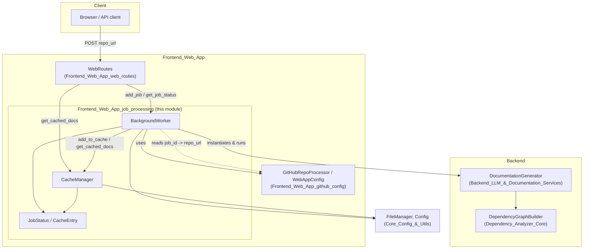
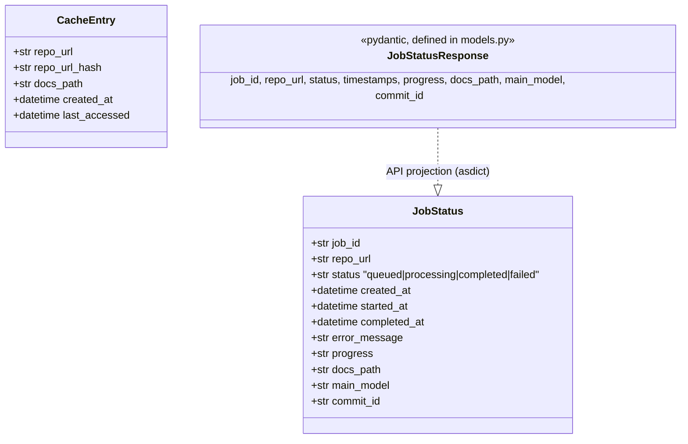
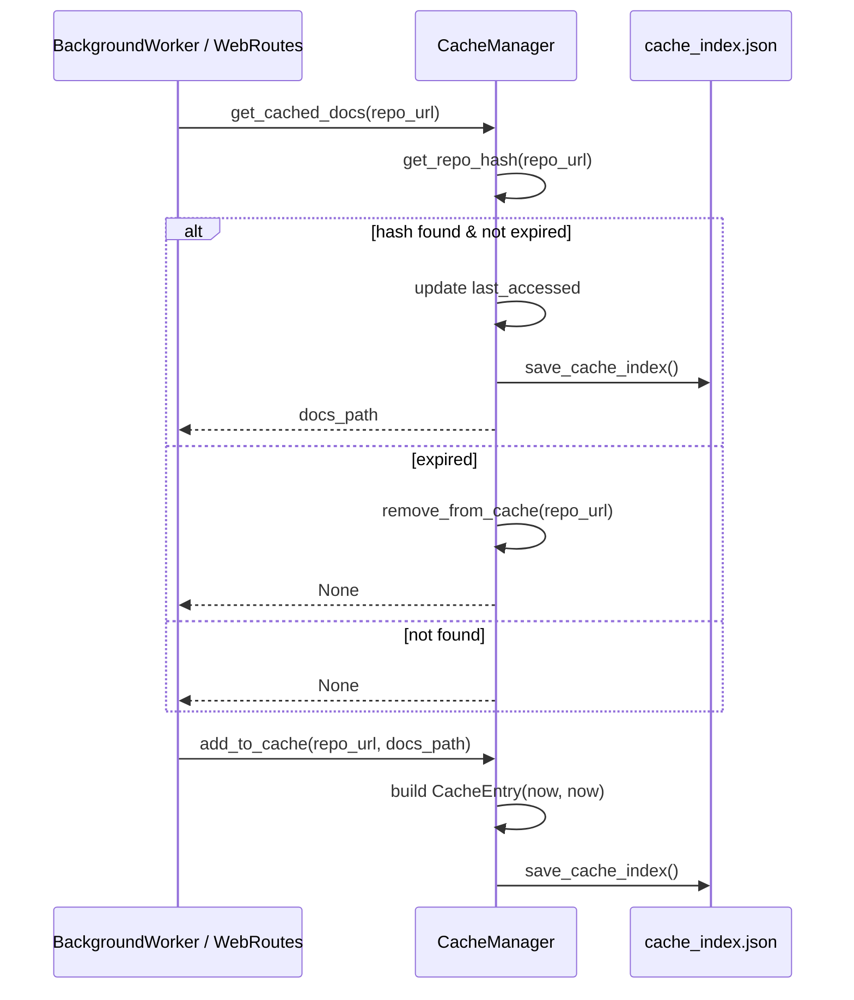
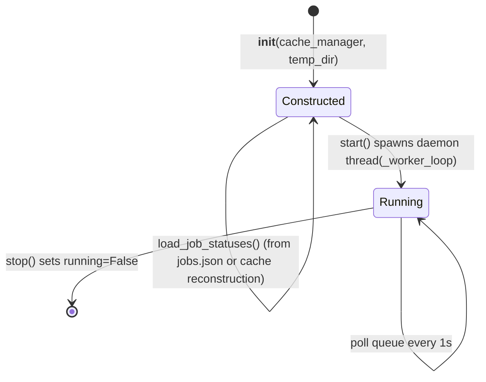
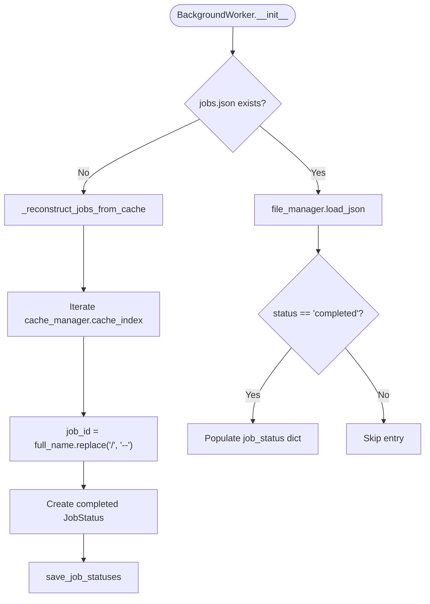
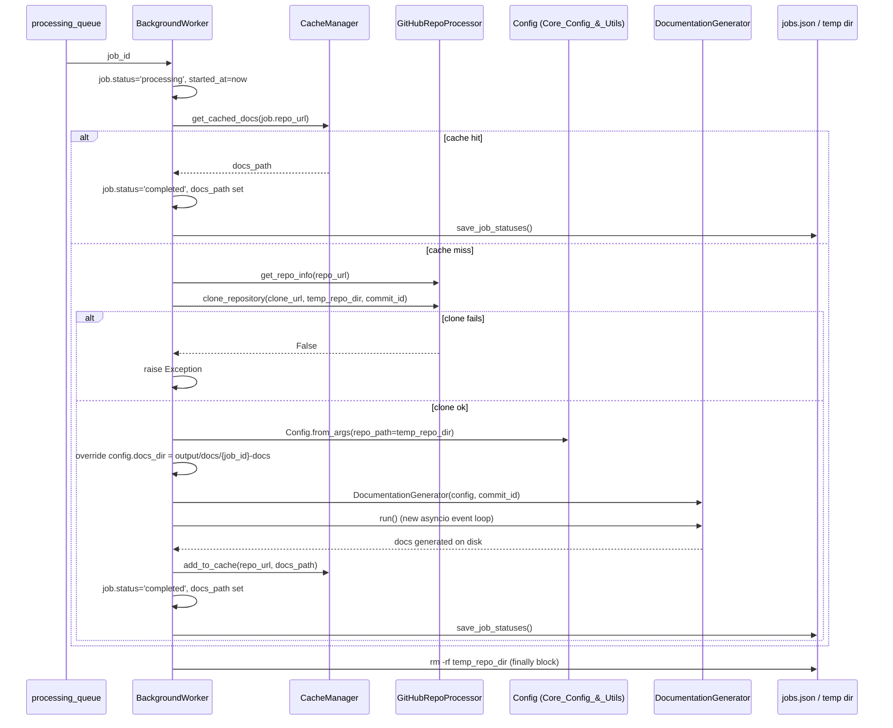
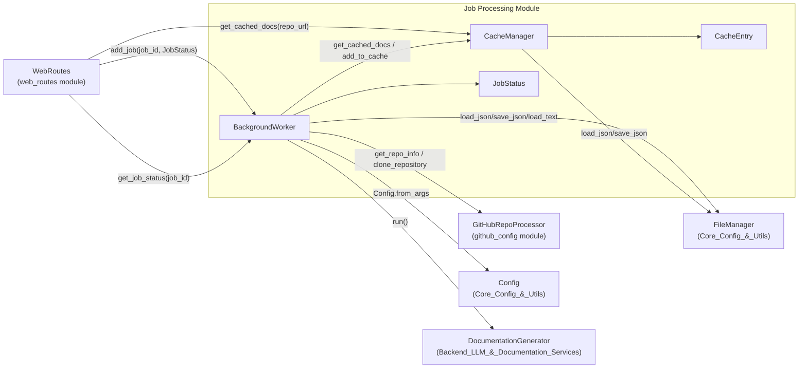

# Frontend Web App — Job Processing

## Introduction

The **Job Processing** module is the asynchronous execution engine behind CodeWiki's web application. It receives repository documentation requests submitted through the [Web Routes](Frontend_Web_App_web_routes.md) layer, queues them, clones the target repository, drives the full documentation-generation pipeline, and persists both the job's lifecycle state and the resulting docs so subsequent requests can be served instantly from cache.

This module is composed of three tightly-coupled components, all living under `codewiki/src/fe/`:

| Component | File | Responsibility |
|---|---|---|
| `BackgroundWorker` | `background_worker.py` | Owns the job queue, worker thread, and orchestrates clone → generate → cache for each job |
| `CacheManager` | `cache_manager.py` | Maps repository URLs to previously generated documentation directories, with expiry |
| `JobStatus` / `CacheEntry` | `models.py` | Plain dataclasses describing a job's lifecycle and a cache record |

It sits between the user-facing [Frontend_Web_App_web_routes](Frontend_Web_App_web_routes.md) module (which enqueues jobs and polls status) and the [Backend_LLM_&_Documentation_Services](Backend_LLM_%26_Documentation_Services.md) module (which performs the actual dependency analysis + LLM-driven doc generation via `DocumentationGenerator`). It also depends on [Frontend_Web_App_github_config](Frontend_Web_App_github_config.md) for repo validation/cloning and app-wide settings, and on [Core_Config_&_Utils](Core_Config_%26_Utils.md) for filesystem helpers and generation `Config`.

---

## Position in the System

---

## Data Models

`models.py` defines the plain-data contracts used throughout this module (and consumed by [Frontend_Web_App_web_routes](Frontend_Web_App_web_routes.md) for API responses).

- `JobStatus` is a mutable dataclass held in-memory (`BackgroundWorker.job_status`) and mirrored to disk as `jobs.json`.
- `CacheEntry` maps a hashed repository URL to a documentation directory and tracks freshness (`created_at`) and usage (`last_accessed`).
- `JobStatusResponse` (used by the routes module) is built via `JobStatusResponse(**asdict(job))`, so this module's `JobStatus` is the single source of truth for job state exposed over the API.

---

## CacheManager

`CacheManager` provides a simple, file-backed key/value cache keyed by a SHA-256 hash (truncated to 16 chars) of the repository URL. It avoids re-running the (expensive, LLM-driven) documentation pipeline for repositories that were already processed within the configured expiry window.

### Responsibilities
- Persist/reload a `cache_index.json` (dict of hash → `CacheEntry`) under `WebAppConfig.CACHE_DIR`.
- Compute deterministic hashes for repo URLs (`get_repo_hash`).
- Serve cached docs paths only if within `CACHE_EXPIRY_DAYS`, otherwise evict.
- Bump `last_accessed` on cache hits.
- Support manual removal and bulk expiry cleanup.

Key methods:
- `load_cache_index()` / `save_cache_index()` — serialize `CacheEntry` objects to/from JSON via [`FileManager`](Core_Config_%26_Utils.md) (`file_manager.load_json` / `save_json`).
- `get_repo_hash(repo_url)` — `sha256(repo_url)[:16]`.
- `get_cached_docs(repo_url)` — returns a valid docs path or `None`, evicting expired entries as a side effect.
- `add_to_cache(repo_url, docs_path)` — inserts/overwrites an entry with fresh timestamps.
- `remove_from_cache(repo_url)` — deletes a single entry.
- `cleanup_expired_cache()` — bulk-removes entries older than `cache_expiry_days`.

Configuration (`CACHE_DIR`, `CACHE_EXPIRY_DAYS`) comes from `WebAppConfig`, documented in [Frontend_Web_App_github_config](Frontend_Web_App_github_config.md).

---

## BackgroundWorker

`BackgroundWorker` is the orchestration core: a single background thread that consumes a bounded `Queue` of job IDs and drives each job through cloning, dependency analysis + LLM documentation generation, and caching — while keeping an in-memory + on-disk record of job status for the UI/API to poll.

### Construction & Lifecycle

- `__init__` wires in a `CacheManager`, resolves `temp_dir` (default `WebAppConfig.TEMP_DIR`), creates a bounded `Queue(maxsize=WebAppConfig.QUEUE_SIZE)`, and eagerly loads any known job statuses from `jobs.json`.
- `start()` / `stop()` control a single daemon `threading.Thread` running `_worker_loop`, so the worker survives independently of request-handling threads in the ASGI app.
- `add_job(job_id, job)` is the public entry point used by [WebRoutes](Frontend_Web_App_web_routes.md) to register a new `JobStatus` and enqueue its ID.
- `get_job_status(job_id)` / `get_all_jobs()` expose read access for the status API and index page.

### Persistence & Recovery

Because job state lives in memory, `BackgroundWorker` mirrors it to `jobs.json` (under `WebAppConfig.CACHE_DIR`) so that:
- A server restart doesn't lose the history of **completed** jobs (only `completed` jobs are reloaded from `jobs.json` — in-flight jobs are intentionally dropped to avoid resuming into an inconsistent state).
- If `jobs.json` is missing entirely (e.g., first run after a cache-only deployment), `_reconstruct_jobs_from_cache()` rebuilds synthetic `completed` `JobStatus` entries directly from `CacheManager.cache_index`, using [`GitHubRepoProcessor.get_repo_info`](Frontend_Web_App_github_config.md) to derive a stable `job_id` (`owner--repo`).

### The Worker Loop and Job Processing Pipeline

`_worker_loop` runs continuously while `self.running`, pulling one `job_id` at a time from the queue (1s poll interval when idle) and delegating to `_process_job`.

`_process_job(job_id)` is the heart of this module — it implements the full documentation pipeline for one repository:

Step-by-step:

1. **Status transition** — mark job `processing`, record `started_at`, tag `main_model` from `codewiki.src.config.MAIN_MODEL`.
2. **Cache check** — `CacheManager.get_cached_docs(job.repo_url)`; on hit, short-circuit straight to `completed` without touching git or the LLM backend.
3. **Repo resolution & clone** — `GitHubRepoProcessor.get_repo_info` (see [Frontend_Web_App_github_config](Frontend_Web_App_github_config.md)) extracts `full_name`/`clone_url`; the repo is cloned into `temp_dir/{job_id}` (optionally checking out `job.commit_id`) via `GitHubRepoProcessor.clone_repository`.
4. **Config construction** — builds a documentation-generation `Config` via `Config.from_args` (see [Core_Config_&_Utils](Core_Config_%26_Utils.md)), then overrides `docs_dir` to a job-scoped path (`output/docs/{job_id}-docs`) so concurrent jobs never collide.
5. **Documentation generation** — instantiates `DocumentationGenerator(config, job.commit_id)` (see [Backend_LLM_&_Documentation_Services](Backend_LLM_%26_Documentation_Services.md)) and drives its async `run()` coroutine on a fresh event loop created specifically for this worker-thread invocation (since `_process_job` executes outside any existing asyncio context).
6. **Cache write-back** — on success, the absolute `docs_dir` path is registered in the `CacheManager` so future requests for the same `repo_url` are served instantly.
7. **Status finalization** — `completed` (with `docs_path`) or `failed` (with `error_message`/`progress` describing the exception) is written back to `job_status` and flushed via `save_job_statuses()`.
8. **Cleanup** — regardless of outcome, the temporary clone directory is removed with `rm -rf` in a `finally` block.

### Persistence Format

`save_job_statuses()` / `load_job_statuses()` serialize the `job_status` dict to `jobs.json` (ISO-formatted timestamps, `None`-safe) using [`FileManager`](Core_Config_%26_Utils.md). This file is the durable record consulted on process restart and is what powers the "recent jobs" list rendered by [WebRoutes.index_get](Frontend_Web_App_web_routes.md).

---

## Component Interactions

---

## Design Notes

- **Single-threaded worker, thread-safe enough for a single-process web app**: only one worker thread mutates `job_status`, avoiding explicit locking; the `Queue` provides safe hand-off from request-handling threads (which call `add_job`) to the worker thread.
- **Idempotent event loop management**: because `_process_job` runs in a plain background thread (not inside FastAPI/Starlette's event loop), it explicitly creates and tears down its own `asyncio` event loop per job to invoke `DocumentationGenerator.run()`.
- **Cache-first design**: the cache check happens before any git/network/LLM work, making repeated requests for the same repository (common during demos or re-visits) essentially free after the first successful generation.
- **Graceful degradation on restart**: rather than trusting potentially-corrupt in-flight state after a crash, only `completed` jobs are restored from `jobs.json`; if that file is absent, cache contents alone are enough to reconstruct a usable job history.
- **Job ID scheme**: `job_id` is always derived as `owner--repo` (slash replaced with double-dash) so it is filesystem- and URL-safe; both this module and [WebRoutes](Frontend_Web_App_web_routes.md) rely on this convention for constructing paths and reverse-mapping IDs back to repo URLs.

## Related Modules

- [Frontend_Web_App_web_routes](Frontend_Web_App_web_routes.md) — HTTP layer that submits jobs to and polls status from this module, and serves the generated docs it produces.
- [Frontend_Web_App_github_config](Frontend_Web_App_github_config.md) — `GitHubRepoProcessor` (URL validation, cloning) and `WebAppConfig` (directories, timeouts, cache expiry) consumed throughout this module.
- [Backend_LLM_&_Documentation_Services](Backend_LLM_%26_Documentation_Services.md) — `DocumentationGenerator`, the async pipeline this module invokes to actually produce documentation.
- [Core_Config_&_Utils](Core_Config_%26_Utils.md) — `Config` (generation configuration) and `FileManager` (JSON/text I/O helpers) used for persistence and pipeline setup.
