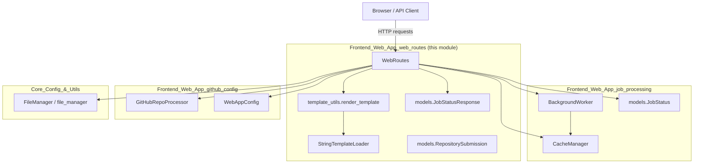
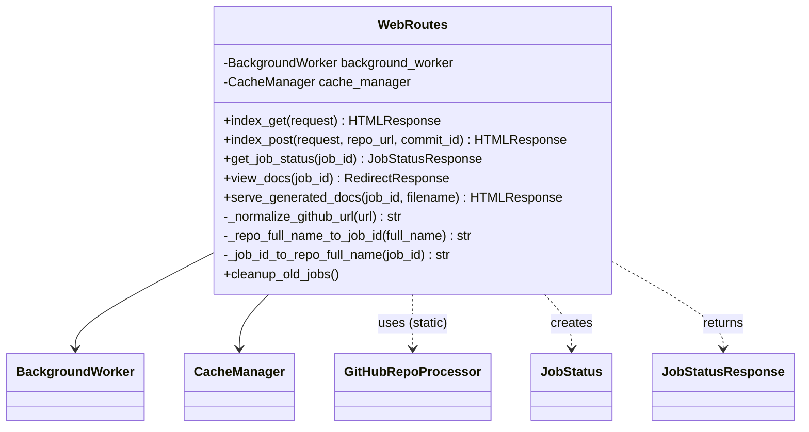
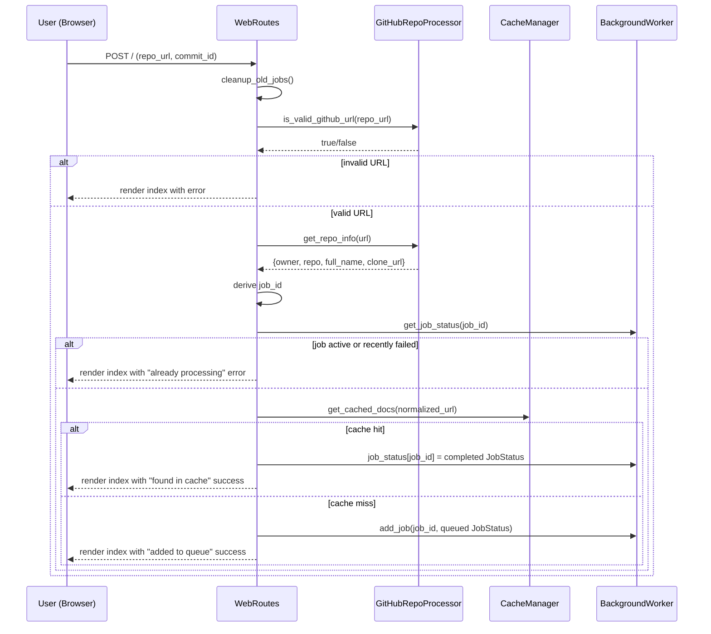
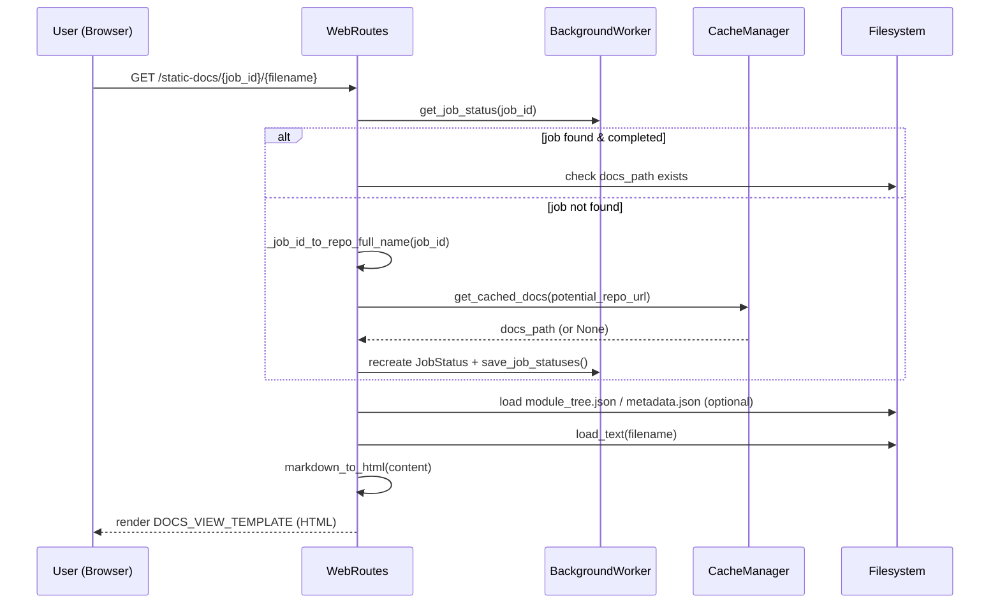
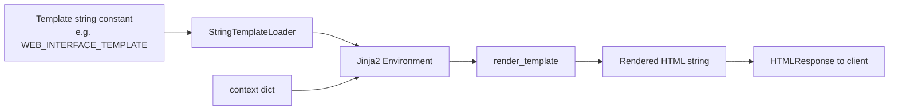
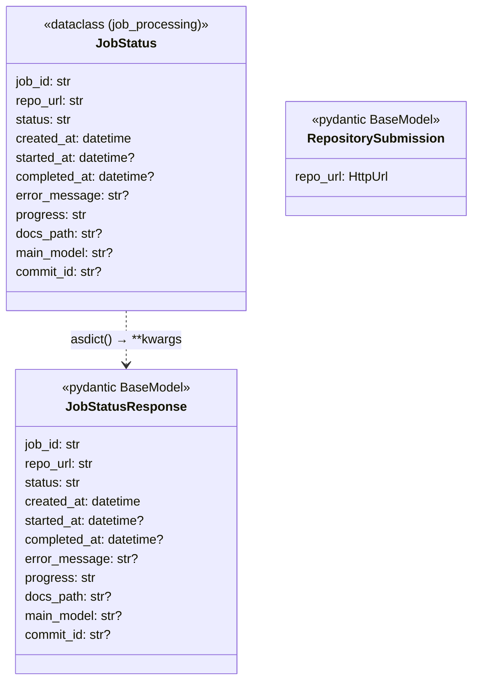

# Frontend Web App — Web Routes

## Introduction

The **Frontend_Web_App_web_routes** module is the HTTP-facing layer of the CodeWiki Frontend Web App. It defines the FastAPI route handlers (`WebRoutes`), the request/response data contracts (`JobStatusResponse`, `RepositorySubmission`), and a lightweight Jinja2 rendering utility (`StringTemplateLoader` / `render_template`) used to turn in-code HTML template strings into rendered pages.

This module is the entry point that end users and API clients interact with: it accepts GitHub repository submissions, shows job/queue status, and serves the generated Markdown documentation as HTML pages. It orchestrates — but does not implement — the actual job queueing, caching, and documentation generation logic, which live in the sibling [Frontend_Web_App_job_processing](Frontend_Web_App_job_processing.md) and [Frontend_Web_App_github_config](Frontend_Web_App_github_config.md) modules.

---

## Module Responsibilities

| Responsibility | Component |
|---|---|
| Render the main submission form and job list | `WebRoutes.index_get` |
| Validate and accept new repository submissions | `WebRoutes.index_post` |
| Expose job status as JSON (API) | `WebRoutes.get_job_status` |
| Redirect to a completed job's docs | `WebRoutes.view_docs` |
| Serve individual documentation pages (Markdown → HTML) | `WebRoutes.serve_generated_docs` |
| Normalize GitHub URLs / derive job IDs | `WebRoutes._normalize_github_url`, `_repo_full_name_to_job_id`, `_job_id_to_repo_full_name` |
| Periodic cleanup of stale job records | `WebRoutes.cleanup_old_jobs` |
| Render Jinja2 string templates without file-based template loading | `template_utils.StringTemplateLoader`, `render_template`, `render_navigation`, `render_job_list` |
| Typed contracts for API responses and form submissions | `models.JobStatusResponse`, `models.RepositorySubmission` |

---

## Architecture Overview

`WebRoutes` is a thin controller class. It is constructed with references to a `BackgroundWorker` (job queue/processing) and a `CacheManager` (docs cache lookup) — both defined in [Frontend_Web_App_job_processing](Frontend_Web_App_job_processing.md). It also depends on `GitHubRepoProcessor` and `WebAppConfig` from [Frontend_Web_App_github_config](Frontend_Web_App_github_config.md), and the shared `file_manager` utility from [Core_Config_&_Utils](Core_Config_&_Utils.md).

---

## Component Details

### `WebRoutes`

`WebRoutes` groups all FastAPI-facing endpoint handlers for the application. It is instantiated once at app startup with shared singleton instances of `BackgroundWorker` and `CacheManager`, then its bound methods are registered against FastAPI route paths (e.g. `/`, `/api/jobs/{job_id}`, `/docs/{job_id}`, `/static-docs/{job_id}/{filename}`) by the application bootstrap code.

#### Endpoint behaviors

**`index_get(request)`**
Renders the main landing page. Pulls all known jobs from `BackgroundWorker.get_all_jobs()`, sorts them newest-first, takes the top 100, and renders `WEB_INTERFACE_TEMPLATE` with an empty form and the job list.

**`index_post(request, repo_url, commit_id)`**
Handles the submission form (`multipart/form-data`):
1. Calls `cleanup_old_jobs()` first.
2. Validates `repo_url` is non-empty and a valid GitHub URL via `GitHubRepoProcessor.is_valid_github_url`.
3. Normalizes the URL (`_normalize_github_url`) and derives a URL-safe `job_id` from `owner--repo`.
4. Checks for an existing job in `queue`/`processing` state, or a `failed` job within the retry cooldown window (`WebAppConfig.RETRY_COOLDOWN_MINUTES`) — if found, blocks resubmission with an informative message.
5. Otherwise checks the `CacheManager` for previously generated docs; if cached, synthesizes a `completed` `JobStatus` immediately (no processing needed).
6. Otherwise creates a new `queued` `JobStatus` and enqueues it via `BackgroundWorker.add_job`.
7. Re-renders the index page with a success/error message and the refreshed job list.

**`get_job_status(job_id)`**
Simple JSON API: looks up `BackgroundWorker.get_job_status(job_id)`, raises `404` if missing, otherwise converts the `JobStatus` dataclass to a `JobStatusResponse` pydantic model via `asdict(job)`.

**`view_docs(job_id)`**
Validates the job is `completed` and its `docs_path` exists on disk, then issues an HTTP 302 redirect to the static docs mount point (`/static-docs/{job_id}/`).

**`serve_generated_docs(job_id, filename)`**
The core documentation viewer:
1. Looks up the job; if missing, attempts to reconstruct it by reverse-mapping `job_id` → `owner/repo` (`_job_id_to_repo_full_name`) and checking the `CacheManager` directly — supporting deep-linking to docs whose original job record has been cleaned up.
2. Loads `module_tree.json` and `metadata.json` sidecar files from the docs directory if present (used for navigation and page metadata).
3. Reads the requested Markdown `filename`, converts it to HTML via `visualise_docs.markdown_to_html`, derives a page title via `get_file_title`, and renders it inside `DOCS_VIEW_TEMPLATE`.

**`cleanup_old_jobs()`**
Removes `completed`/`failed` job records older than `WebAppConfig.JOB_CLEANUP_HOURS` from the in-memory `job_status` dict (does not touch the cache or on-disk docs).

#### Data flow: Submitting a repository

#### Data flow: Viewing documentation

---

### `template_utils.py` — String-based Jinja2 Rendering

Because the web app embeds its HTML templates directly as Python string constants (in the `templates` module, e.g. `WEB_INTERFACE_TEMPLATE`, `DOCS_VIEW_TEMPLATE`) rather than loading them from `.html` files, this module provides a minimal Jinja2 integration that renders from in-memory strings.

- **`StringTemplateLoader(BaseLoader)`** — a custom Jinja2 loader whose `get_source` simply returns the stored template string, bypassing filesystem template resolution. The `uptodate` callback always returns `True` since templates are immutable strings for the lifetime of the process.
- **`render_template(template, context)`** — builds a fresh `Environment` per call (autoescaping `html`/`xml`, with `trim_blocks`/`lstrip_blocks` enabled for cleaner output), loads the anonymous template (empty name `''`), and renders it with the given context dict. Used by every `WebRoutes` handler that returns `HTMLResponse`.
- **`render_navigation(module_tree, current_page)`** — helper that renders a documentation sidebar/nav from a hierarchical `module_tree` dict (as produced by the [Dependency_Analysis_Service](Dependency_Analysis_Service.md) / [Backend_LLM_&_Documentation_Services](Backend_LLM_&_Documentation_Services.md) pipeline and persisted as `module_tree.json`). Currently invoked ad hoc rather than wired directly into `serve_generated_docs` (which instead passes the raw `module_tree` dict into the page template's context for in-template iteration).
- **`render_job_list(jobs)`** — helper for rendering a list of `JobStatus`/`JobStatusResponse`-like objects as HTML job cards with status badges and "View Documentation" links.

---

### `models.py` (route-relevant subset) — `JobStatusResponse` & `RepositorySubmission`

While the full `models.py` file also defines `JobStatus` and `CacheEntry` (owned conceptually by [Frontend_Web_App_job_processing](Frontend_Web_App_job_processing.md)), this module's routes specifically depend on two Pydantic models that define the **external API contract**:

- **`RepositorySubmission`** — a Pydantic `BaseModel` with a single validated `repo_url: HttpUrl` field. This represents the strict/typed shape of a repository submission (useful for JSON API clients), complementing the looser `Form(...)`-based parsing used directly in `index_post` for the HTML form flow.
- **`JobStatusResponse`** — the Pydantic response model returned by `get_job_status`. It mirrors the internal `JobStatus` dataclass field-for-field (`job_id`, `repo_url`, `status`, timestamps, `progress`, `docs_path`, `main_model`, `commit_id`), but as a `BaseModel` it gets automatic JSON serialization, OpenAPI schema generation, and datetime encoding — decoupling the internal job-tracking representation from the public API shape.

---

## External Dependencies

| Dependency | Module | Role |
|---|---|---|
| `BackgroundWorker` | [Frontend_Web_App_job_processing](Frontend_Web_App_job_processing.md) | Job queue, in-memory job status store, async documentation generation orchestration |
| `CacheManager` | [Frontend_Web_App_job_processing](Frontend_Web_App_job_processing.md) | Lookup/storage of previously generated docs keyed by hashed repo URL |
| `JobStatus` | [Frontend_Web_App_job_processing](Frontend_Web_App_job_processing.md) (`models.py`) | Internal dataclass representing a job's lifecycle state |
| `GitHubRepoProcessor` | [Frontend_Web_App_github_config](Frontend_Web_App_github_config.md) | URL validation, repo info extraction, repository cloning |
| `WebAppConfig` | [Frontend_Web_App_github_config](Frontend_Web_App_github_config.md) | Central configuration (cache dirs, cleanup thresholds, retry cooldowns) |
| `file_manager` (`FileManager`) | [Core_Config_&_Utils](Core_Config_&_Utils.md) | JSON/text file I/O (`module_tree.json`, `metadata.json`, markdown content) |
| `visualise_docs.markdown_to_html`, `get_file_title` | Frontend Web App (sibling utility, not in this module's core components) | Converts generated Markdown documentation into displayable HTML with title extraction |
| `templates.WEB_INTERFACE_TEMPLATE`, `templates.DOCS_VIEW_TEMPLATE` | Frontend Web App templates | String-based HTML templates rendered via `template_utils.render_template` |

---

## How This Module Fits the System

The overall CodeWiki pipeline flows roughly as:

1. A user submits a GitHub repo through **Frontend_Web_App_web_routes** (`WebRoutes.index_post`).
2. The job is queued via **Frontend_Web_App_job_processing** (`BackgroundWorker`), which clones the repo (**Frontend_Web_App_github_config**), invokes the **[Dependency_Analysis_Service](Dependency_Analysis_Service.md)** and **[Dependency_Analyzer_Core](Dependency_Analyzer_Core.md)** to build a dependency/call graph using the appropriate **[Language_Analyzers](Language_Analyzers.md)**, then hands off to **[Backend_LLM_&_Documentation_Services](Backend_LLM_&_Documentation_Services.md)** (`DocumentationGenerator`) to produce Markdown documentation files on disk.
3. Results are cached (`CacheManager`) and job state is persisted (`BackgroundWorker.save_job_statuses`).
4. Users poll or view results back through **Frontend_Web_App_web_routes** — `get_job_status` for programmatic polling, `view_docs`/`serve_generated_docs` for the rendered documentation viewer.

This module is therefore the **presentation and API boundary** of the Frontend Web App: it never performs cloning, analysis, or generation itself, delegating all heavy lifting to the job-processing and backend service layers while focusing purely on HTTP request handling, validation, and HTML rendering.
