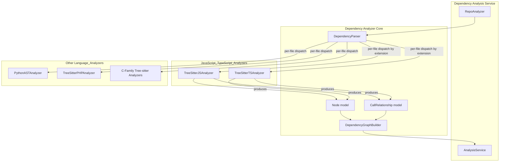
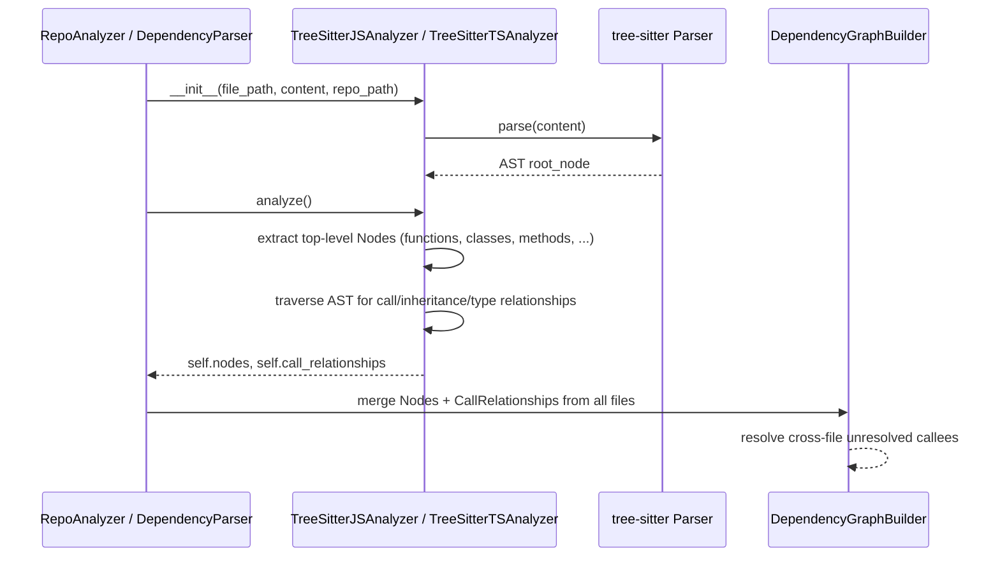

# JavaScript & TypeScript Analyzers

## Purpose

The `JavaScript_TypeScript_Analyzers` module provides static source-code analysis for JavaScript and TypeScript files within CodeWiki's dependency analysis pipeline. It parses source files using [tree-sitter](https://tree-sitter.github.io/tree-sitter/) grammars, extracts structural "components" (functions, classes, methods, interfaces, enums, type aliases, etc.), and infers **call/inheritance/type relationships** between them. The output feeds directly into the system-wide dependency graph that powers CodeWiki's documentation generation and code navigation features.

This module is a sibling of the other language-specific analyzers documented under [Language_Analyzers.md](Language_Analyzers.md), and its outputs conform to the shared data model defined in [Dependency_Analyzer_Core.md](Dependency_Analyzer_Core.md) (`Node` and `CallRelationship`). It is invoked by the orchestration layer described in [Dependency_Analysis_Service.md](Dependency_Analysis_Service.md).

## Module Position in the System



The two analyzers in this module are functionally independent (no shared base class), but they follow an identical **contract**:

1. Accept a file path, its raw text content, and the repository root path.
2. Parse the content into a tree-sitter AST.
3. Walk the AST to extract top-level declarations as `Node` objects.
4. Walk the AST again (or in the same pass) to extract `CallRelationship` objects describing calls, instantiations, inheritance, and type references between those declarations.
5. Expose the results either via analyzer instance attributes (`.nodes`, `.call_relationships`) or via a module-level convenience function (`analyze_javascript_file_treesitter` / `analyze_typescript_file_treesitter`).

## Sub-modules

| Sub-module | Description | Documentation |
|---|---|---|
| JavaScript Analyzer | Parses `.js`/`.jsx`/`.mjs`/`.cjs` files with the tree-sitter JavaScript grammar; single-pass declaration + call extraction; JSDoc-based type dependency mining. | [JavaScript_TypeScript_Analyzers_javascript.md](JavaScript_TypeScript_Analyzers_javascript.md) |
| TypeScript Analyzer | Parses `.ts`/`.tsx` files with the tree-sitter TypeScript grammar; two-phase "collect all entities, then filter to top-level" extraction; native TS type-annotation and generics resolution. | [JavaScript_TypeScript_Analyzers_typescript.md](JavaScript_TypeScript_Analyzers_typescript.md) |

## Shared Design Concepts

Although implemented separately, both analyzers share the following design patterns, which are useful to understand before reading the sub-module docs:

### 1. Component Identity

Every extracted declaration becomes a `Node` (defined in [Dependency_Analyzer_Core.md](Dependency_Analyzer_Core.md)) whose `id`/`component_id` follows the pattern:

```
<relative_file_path>::<name>
<relative_file_path>::<ClassName>.<methodName>   (for methods)
```

This id scheme lets the global `DependencyGraphBuilder` merge per-file results into one project-wide graph without collisions.

### 2. Receiver-First Call Resolution

Both analyzers resolve `expr.method()` call expressions by inspecting the **receiver** of the member expression before falling back to a bare (unresolved) name:

- `this.method()` / `super.method()` → resolved against the enclosing class (and, for `super`, its declared base classes).
- `identifier.method()` where `identifier` is itself a top-level class name → resolved as a static/qualified call.
- `identifier.method()` where `identifier` is a local variable → resolved by scanning the enclosing scope for a `new ClassName(...)` initializer or (TypeScript only) a type annotation.
- Dotted chains (`a.b.c()`) with no resolvable root, or calls on composite/literal receivers → recorded as an **unresolved bare name**, unless the tail is a well-known built-in prototype method (e.g. `Array.prototype.map`), in which case the call is dropped entirely to avoid noise.

This resolution strategy is what allows CodeWiki's later graph-merging phase to stitch together cross-file relationships (an unresolved callee name gets matched against other files' top-level names by the global resolver in `DependencyGraphBuilder`).

### 3. Relationship De-duplication

Both analyzers maintain a `seen_relationships` set keyed by `(caller, callee, call_line)` (JS) or `(caller_id, callee_id)` (TS) to avoid emitting duplicate `CallRelationship` entries when the same call site is visited more than once during traversal.

### 4. Resolved vs. Unresolved Callees

`CallRelationship.is_resolved` is `True` only when the callee could be matched to a `Node` already known within the *same file*. Unresolved relationships carry a bare logical name (e.g. `"Foo.bar"` instead of `"src/foo.ts::Foo.bar"`) which is left for the cross-file resolution stage in [Dependency_Analyzer_Core.md](Dependency_Analyzer_Core.md) / [Dependency_Analysis_Service.md](Dependency_Analysis_Service.md).

## High-Level Processing Flow



## Relevant External Dependencies

- **tree-sitter / tree_sitter_javascript / tree_sitter_typescript** — the underlying parsing libraries.
- `codewiki/src/be/dependency_analyzer/models/core.py` (`Node`, `CallRelationship`) — the shared output schema, documented in [Dependency_Analyzer_Core.md](Dependency_Analyzer_Core.md).
- `codewiki/src/be/dependency_analyzer/utils/external_symbols.py` (`JS_TS_PROTOTYPE_METHODS`) — a shared list of known built-in prototype method names used by both analyzers to suppress false-positive unresolved relationships.
- `codewiki/src/be/dependency_analyzer/ast_parser.py` (`DependencyParser`) — dispatches files to the correct analyzer by extension; see [Dependency_Analyzer_Core.md](Dependency_Analyzer_Core.md).
- `codewiki/src/be/dependency_analyzer/analysis/repo_analyzer.py` (`RepoAnalyzer`) — walks the repository tree and invokes the parser per file; see [Dependency_Analysis_Service.md](Dependency_Analysis_Service.md).

## See Also

- [Language_Analyzers.md](Language_Analyzers.md) — parent module overview covering all language analyzers (C-family, PHP, Python, JS/TS).
- [Dependency_Analyzer_Core.md](Dependency_Analyzer_Core.md) — the `Node`/`CallRelationship` models and the graph builder that consumes this module's output.
- [Dependency_Analysis_Service.md](Dependency_Analysis_Service.md) — the orchestrating service that walks a repository and invokes analyzers file-by-file.
