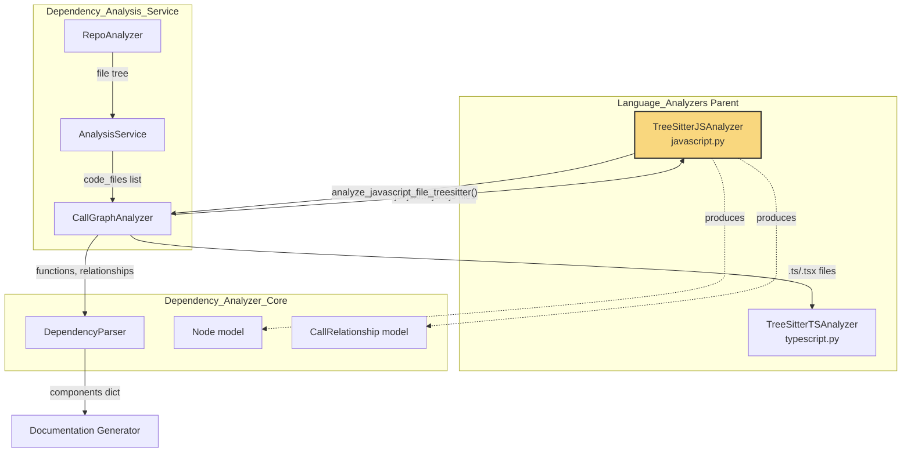
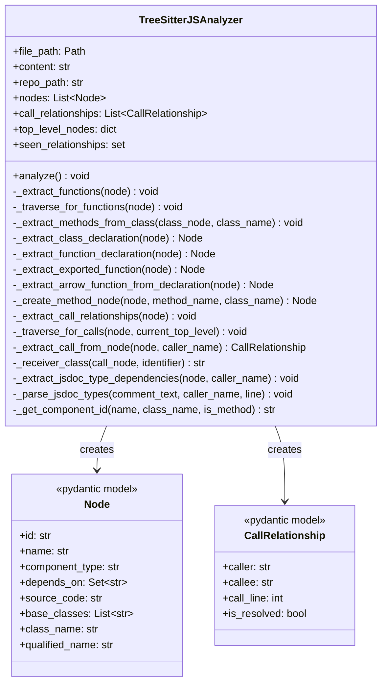
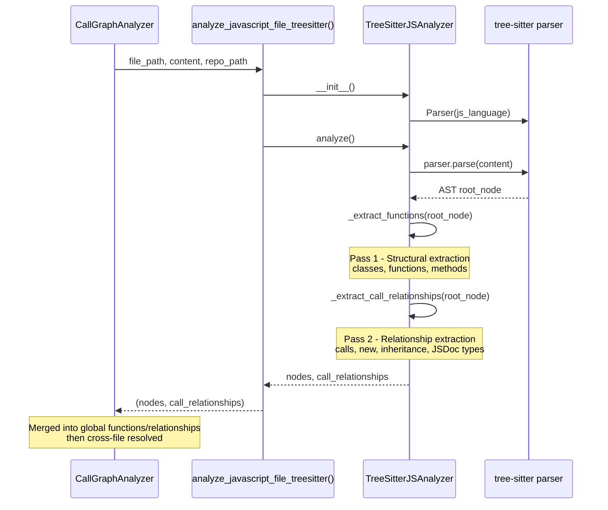
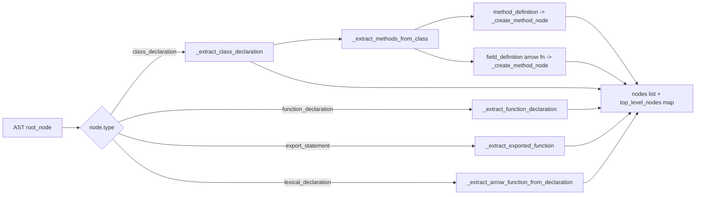
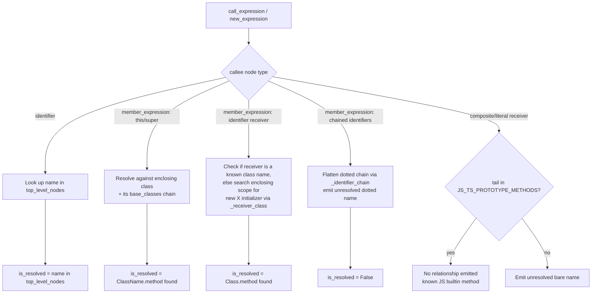
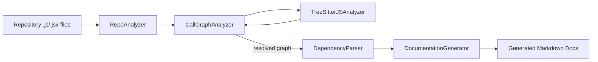

# JavaScript Analyzer (`JavaScript_TypeScript_Analyzers_javascript`)

## Introduction

The **JavaScript Analyzer** module is a language-specific static analysis component of CodeWiki's [Dependency Analysis Service](Dependency_Analysis_Service.md). It parses `.js` / `.jsx` / `.mjs` / `.cjs` source files using [tree-sitter](https://tree-sitter.github.io/tree-sitter/) grammars, extracts structural entities (functions, classes, methods) as `Node` objects, and infers call/inheritance/type relationships between them as `CallRelationship` objects.

Its output feeds directly into the [Dependency Analyzer Core](Dependency_Analyzer_Core.md), where per-file resolved and unresolved relationships from all languages are merged into a single project-wide dependency graph. This graph is the foundation for the documentation generation pipeline (see [Backend LLM & Documentation Services](Backend_LLM_&_Documentation_Services.md)).

The module is a sibling of the [TypeScript Analyzer](JavaScript_TypeScript_Analyzers_typescript.md) — the two share nearly identical extraction/resolution strategies (TypeScript's analyzer is effectively a superset that additionally understands type annotations, interfaces, and generics), and both share the parent grouping `JavaScript_TypeScript_Analyzers`.

---

## Purpose & Scope

`TreeSitterJSAnalyzer` (in `codewiki/src/be/dependency_analyzer/analyzers/javascript.py`) is responsible for:

1. **Parsing** a single JavaScript source file into an AST using `tree_sitter_javascript`.
2. **Extracting top-level components**: classes (and abstract classes/interfaces, which JS syntax trees can contain when mixed with `.jsx`/ambient constructs), standalone functions (including generators and arrow functions assigned to `const`/`let`/`var`), and class methods (including arrow-function class fields).
3. **Building intra-file relationships**: function/method calls, `new` expression construction, class inheritance (`extends`), and JSDoc-derived type dependencies (`@param`, `@returns`, `@type`, `@typedef`, `@interface`).
4. **Emitting `Node` and `CallRelationship` objects** that conform to the shared [Dependency Analyzer Core](Dependency_Analyzer_Core.md) data models, ready for cross-file/cross-language resolution by `CallGraphAnalyzer`.

The module purposefully does **not** attempt project-wide (cross-file) symbol resolution — that responsibility belongs to `CallGraphAnalyzer._resolve_call_relationships`, which merges per-file `is_resolved=False` "bare name" callees against a global index built from every analyzed file.

---

## Architecture Overview

- **Entry point**: `analyze_javascript_file_treesitter(file_path, content, repo_path)` — a module-level function wrapping `TreeSitterJSAnalyzer`, called by `CallGraphAnalyzer._analyze_javascript_file` (see [Dependency Analysis Service](Dependency_Analysis_Service.md)).
- **Output consumption**: Returned `(nodes, relationships)` tuples are merged into `CallGraphAnalyzer.functions` / `call_relationships`, later cross-resolved and deduplicated, then converted into the final `components` dictionary by `DependencyParser` in [Dependency_Analyzer_Core](Dependency_Analyzer_Core.md).

---

## Component Diagram

Refer to [Dependency_Analyzer_Core](Dependency_Analyzer_Core.md) for the full `Node` / `CallRelationship` model definitions shared across all language analyzers.

---

## Analysis Pipeline (Process Flow)

### Two-Pass Design

The analyzer performs **two independent tree traversals**:

1. **Structural pass** (`_extract_functions` → `_traverse_for_functions`): Walks the AST once to discover all declaration-like nodes and populate `self.nodes` and `self.top_level_nodes` (a name → `Node` lookup used later for resolution). This pass must complete before relationship extraction, since resolution needs to know which names are legitimate top-level/method components in this file.
2. **Relationship pass** (`_extract_call_relationships` → `_traverse_for_calls`): Walks the AST again, tracking a `current_top_level` "scope" (the enclosing function/method/class name) as it descends, and emitting a `CallRelationship` whenever it encounters a `call_expression`, `await_expression` wrapping a call, `new_expression`, class `extends` heritage, or a JSDoc comment with type annotations.

---

## Entity Extraction Details

| AST Node Type | Extraction Method | Resulting `component_type` |
|---|---|---|
| `class_declaration` / `abstract_class_declaration` / `interface_declaration` | `_extract_class_declaration` | `class` / `abstract class` / `interface` |
| `method_definition` (inside `class_body`) | `_create_method_node` | `method` (constructor excluded from output, but tracked in `top_level_nodes`) |
| `field_definition` with arrow-function value | `_create_method_node` | `method` |
| `function_declaration` / `generator_function_declaration` (not nested in a class) | `_extract_function_declaration` | `function` |
| `export_statement` wrapping a function | `_extract_exported_function` | `function` (renamed to `"default"` for `export default function (...)`) |
| `lexical_declaration` (`const`/`let` assigned an arrow/function expression) | `_extract_arrow_function_from_declaration` | `function` |

Component IDs follow the pattern `"{relative_path}::{name}"` for top-level entities and `"{relative_path}::{ClassName}.{methodName}"` for methods, generated by `_get_component_id`.

---

## Relationship Resolution Strategy

Unlike languages with static typing, JavaScript calls must be resolved heuristically. The analyzer classifies each `call_expression`'s callee node and applies receiver-specific logic in `_extract_call_from_node`:

Key design principles (shared with the [TypeScript Analyzer](JavaScript_TypeScript_Analyzers_typescript.md)):

- **Never file-prefix unresolved names.** An unresolved callee (e.g. a call to a function defined in another file, or an external library call) is emitted as a bare logical name (`"someFunc"` or `"Class.method"`), *not* `"path::someFunc"`. This lets `CallGraphAnalyzer._resolve_call_relationships` attempt project-wide resolution using its global name indexes, and lets it correctly classify genuinely external calls (see `_is_external_callee` in [Dependency_Analysis_Service](Dependency_Analysis_Service.md)).
- **Receiver-first resolution for member calls.** `this.foo()` / `super.foo()` resolve against the enclosing class and its declared base classes; `obj.foo()` resolves against `obj`'s inferred class (either because `obj` itself is a known top-level class, or because a `new ClassName()` initializer for that identifier is found in an enclosing scope via `_receiver_class`/`_find_new_initializer`).
- **Prototype-method filtering.** Calls like `array.map(...)` or `str.trim()` on receivers whose type cannot be determined are checked against `JS_TS_PROTOTYPE_METHODS` (a shared built-in method name set) and silently dropped rather than emitted as spurious unresolved relationships.
- **Deduplication.** `_add_relationship` uses a `(caller, callee, call_line)` tuple in `seen_relationships` to avoid duplicate edges from repeated traversal paths (e.g. `await` wrapping a `call_expression`).

### JSDoc Type Dependencies

Because plain JavaScript lacks static types, the analyzer additionally mines **JSDoc comments** for type references via `_extract_jsdoc_type_dependencies` → `_parse_jsdoc_types`, recognizing `@param {Type}`, `@returns {Type}`, `@type {Type}`, `@typedef {Object} Name`, and `@interface Name` patterns. Extracted type names are filtered against a built-in-type blocklist (`_is_builtin_type_js`) before being emitted as relationships — this lets JSDoc-annotated JS codebases participate in the same dependency graph as strongly-typed languages.

---

## Data Model Reference

The analyzer produces instances of two Pydantic models defined centrally in [Dependency_Analyzer_Core](Dependency_Analyzer_Core.md):

- **`Node`** — one row per structural component (function/class/method), including `source_code`, `start_line`/`end_line`, `base_classes`, `class_name`, `display_name`, and the crucial `component_id` used as a graph key.
- **`CallRelationship`** — a directed edge `caller -> callee`, with `call_line` and `is_resolved` (whether `callee` is a fully-qualified component id vs. a bare logical name awaiting global resolution).

These models are language-agnostic; the JS analyzer is only responsible for populating them correctly from tree-sitter's JavaScript grammar output.

---

## Integration Points

| Consumer | How it uses this module |
|---|---|
| [`CallGraphAnalyzer`](Dependency_Analysis_Service.md) | Calls `analyze_javascript_file_treesitter()` per `.js`/`.jsx`/`.mjs`/`.cjs` file found by `RepoAnalyzer`, merges results into the global function/relationship pools, then performs cross-file/cross-language resolution and external-call filtering. |
| [`DependencyParser`](Dependency_Analyzer_Core.md) | Consumes the final merged `functions`/`relationships` output (after `CallGraphAnalyzer` processing) to build the `components: Dict[str, Node]` graph with populated `depends_on` sets. |
| [Documentation Generator](Backend_LLM_&_Documentation_Services.md) | Uses the resulting dependency graph (nodes + edges) as grounding context when generating module/component documentation via LLM prompts. |

---

## Related Documentation

- [Language_Analyzers](Language_Analyzers.md) — parent grouping covering all per-language tree-sitter/AST analyzers.
- [JavaScript_TypeScript_Analyzers_typescript](JavaScript_TypeScript_Analyzers_typescript.md) — the TypeScript sibling analyzer; shares the same resolution philosophy with added type-annotation awareness.
- [Dependency_Analysis_Service](Dependency_Analysis_Service.md) — orchestrates `RepoAnalyzer` (file discovery) and `CallGraphAnalyzer` (per-file dispatch + cross-file resolution).
- [Dependency_Analyzer_Core](Dependency_Analyzer_Core.md) — shared `Node`/`CallRelationship` models and the `DependencyParser` that assembles the final component graph.
- [Backend_LLM_&_Documentation_Services](Backend_LLM_&_Documentation_Services.md) — downstream consumer that turns the dependency graph into generated documentation.
