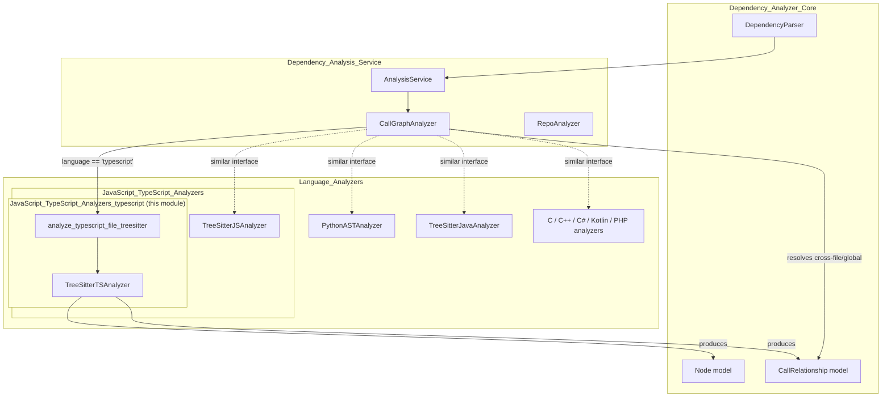
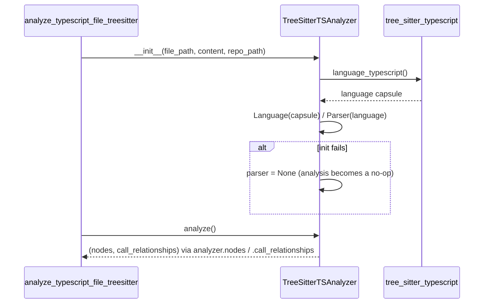
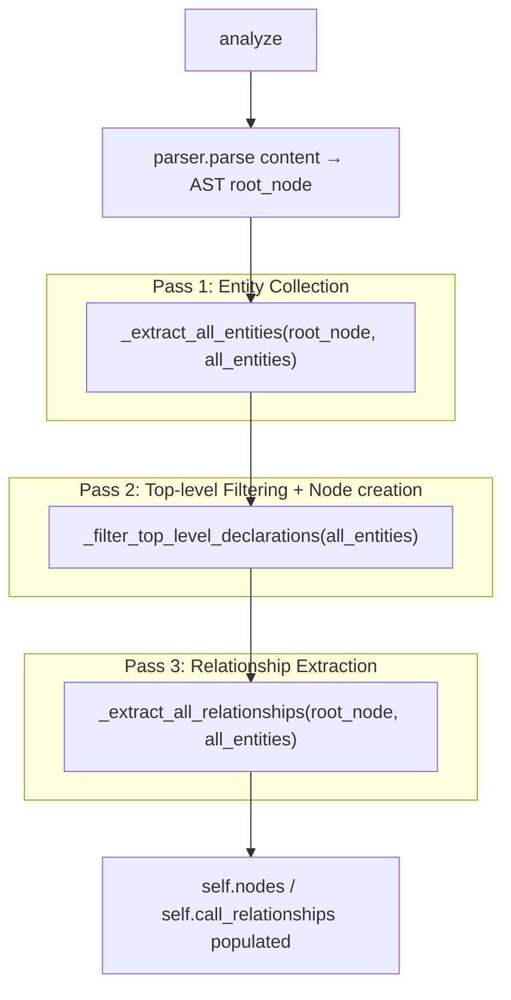
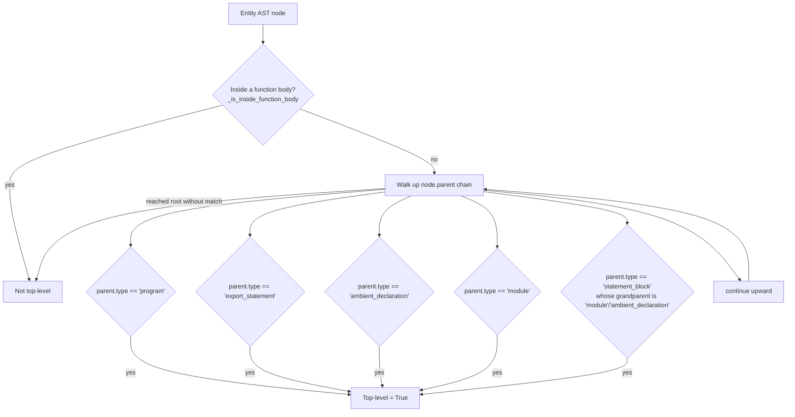
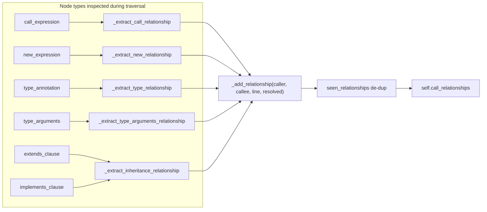
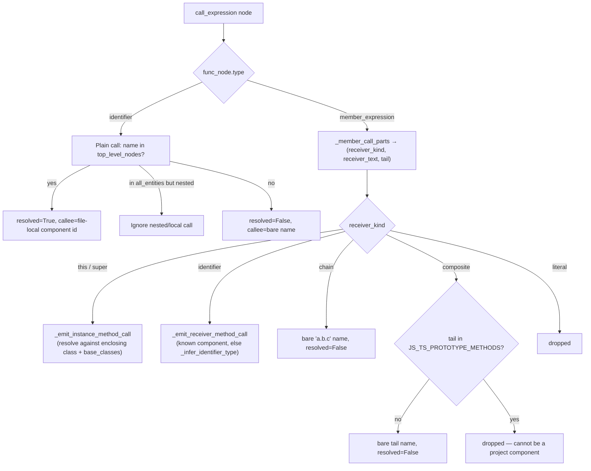
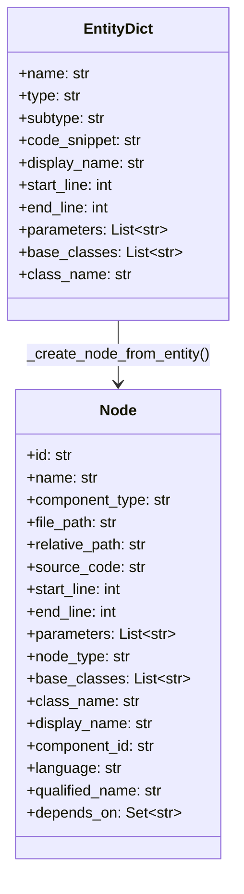

# JavaScript_TypeScript_Analyzers_typescript

## Introduction

The `JavaScript_TypeScript_Analyzers_typescript` module implements **`TreeSitterTSAnalyzer`**, the TypeScript-specific static-analysis engine used by CodeWiki's [Dependency Analysis Service](Dependency_Analysis_Service.md) to build a language-agnostic dependency/call graph.

Given the raw source text of a `.ts`/`.tsx` file, the analyzer parses it with [`tree-sitter`](https://tree-sitter.github.io/) (via the `tree_sitter_typescript` grammar), extracts all **top-level components** (functions, classes, interfaces, type aliases, enums, exported constants, ambient/namespace declarations, class methods), and infers the **call/inheritance/type relationships** between them. The output is a pair of framework-neutral model objects — `List[Node]` and `List[CallRelationship]` (defined in [Dependency_Analyzer_Core](Dependency_Analyzer_Core.md)) — that feed into the cross-file, cross-language resolution step performed by `CallGraphAnalyzer`.

This module is the TypeScript counterpart to [`JavaScript_TypeScript_Analyzers_javascript`](JavaScript_TypeScript_Analyzers_javascript.md) (`TreeSitterJSAnalyzer`). Both share the parent grouping [`JavaScript_TypeScript_Analyzers`](JavaScript_TypeScript_Analyzers.md) and largely mirror each other's design, with the TypeScript analyzer additionally understanding TS-only syntax: interfaces, type aliases, enums, `type_annotation`/`type_arguments`, `implements_clause`, ambient/namespace declarations, and generics.

---

## Module Position in the System

The entry point `analyze_typescript_file_treesitter(file_path, content, repo_path)` is invoked by `CallGraphAnalyzer._analyze_typescript_file` (see [Dependency_Analysis_Service](Dependency_Analysis_Service.md)) for every source file whose detected language is `typescript`. The analyzer never talks to disk directly (besides implicitly through the path it is given) and never performs cross-file resolution — that responsibility belongs entirely to `CallGraphAnalyzer`, which merges nodes/relationships from all files and files across all supported languages.

---

## Responsibilities

| Responsibility | Description |
|---|---|
| **Parsing** | Initializes a `tree_sitter.Parser` bound to the `tree_sitter_typescript` TypeScript grammar and parses file content into an AST. |
| **Entity extraction** | Walks the whole AST once, capturing *every* named declaration (functions, arrow functions, methods, classes, interfaces, type aliases, enums, variables, export statements, ambient/namespace declarations) into a flat `all_entities` dict keyed by name, tagging each with its AST node, depth, and parent context. |
| **Top-level filtering** | Re-examines each captured entity and keeps only those that are truly top-level (module scope, exported, or declared in an ambient/namespace `module`/`statement_block`), discarding anything nested inside a function body. |
| **Node construction** | Converts each qualifying top-level entity into a `Node` (from [Dependency_Analyzer_Core](Dependency_Analyzer_Core.md)) with a stable `component_id` of the form `<relative_path>::<name>`. |
| **Relationship extraction** | Performs a second AST traversal, tracking "current top-level" context, to emit `CallRelationship` records for: function/method calls, `new` expressions, type annotations, generic type arguments, and `extends`/`implements` clauses. |
| **Local resolution** | Resolves receiver types (`this`, `super`, typed variables, `new X()` inference) to same-file component ids whenever possible; anything it cannot resolve is emitted as a bare logical name for the global resolver in `CallGraphAnalyzer` to attempt cross-file resolution. |

---

## Core Component: `TreeSitterTSAnalyzer`

### Construction & Initialization

Key instance state:
- `nodes: List[Node]` — final top-level components discovered in the file.
- `call_relationships: List[CallRelationship]` — all relationships discovered.
- `seen_relationships: Set[Tuple[str,str]]` — de-duplication key (`caller_id`, `callee_id`).
- `top_level_nodes: Dict[str, Node]` — name → `Node` lookup used throughout resolution to check "is this name defined in this file?".

If the tree-sitter grammar fails to load, `self.parser` is `None` and `analyze()` becomes a safe no-op (logged at debug level), so a broken native binding never crashes the wider analysis pipeline.

### High-Level Pipeline (`analyze()`)

The analyzer makes **three full passes** over the AST:

1. **`_extract_all_entities`** – recursively visits every node, dispatching by `node.type` to one of the `_extract_*_entity` helper methods (see table below). Each recognized declaration becomes a dict entry in `all_entities[name]`, annotated with `depth`, `node` (raw AST node reference), and `parent_context`.
2. **`_filter_top_level_declarations`** – for every captured entity, calls `_is_actually_top_level` to decide whether it belongs at module/export/ambient scope (as opposed to being nested inside a function body). Qualifying entities become `Node` objects via `_create_node_from_entity`, subject to an exclusion filter (`_should_include_node`) that drops variables and names like `constructor`/`__proto__`/`prototype`. Class/abstract-class entities additionally trigger `_extract_constructor_dependencies` to capture constructor-parameter type dependencies (dependency-injection style wiring).
3. **`_extract_all_relationships`** – re-walks the AST maintaining a "current top-level" name as it descends, and emits relationships whenever it encounters call expressions, `new` expressions, type annotations, generic type arguments, or inheritance clauses.

### Entity Types Recognized

| AST node type | Extraction method | Resulting `Node.component_type` | Notes |
|---|---|---|---|
| `function_declaration` | `_extract_function_entity` | `function` | detects `async` |
| `generator_function_declaration` | `_extract_function_entity` | `function` | subtype `generator_function` |
| `arrow_function` (via `variable_declarator`) | `_extract_arrow_function_entity` | `function` | subtype `arrow_function` |
| `method_definition` | `_extract_method_entity` | `function` | name qualified as `Class.method`; detects `async`/`static` |
| `class_declaration` / `abstract_class_declaration` | `_extract_class_entity` | `class` | captures `extends`/`implements` as `base_classes` |
| `interface_declaration` | `_extract_interface_entity` | `interface` | captures `extends` |
| `type_alias_declaration` | `_extract_type_alias_entity` | `type` | |
| `enum_declaration` | `_extract_enum_entity` | `enum` | |
| `variable_declarator` / `lexical_declaration` / `variable_declaration` | `_extract_variable_entity` / `_extract_lexical_declaration_entity` / `_extract_variable_declaration_entity` | `variable` | excluded from final `nodes` list (see `_should_include_node`), but still tracked in `all_entities` for relationship resolution |
| `export_statement` | `_extract_export_statement_entity` | `function` / `class` / `interface` | unwraps the exported function/class/interface/const-arrow-function/default-call-export |
| `ambient_declaration` | `_extract_ambient_declaration_entity` | `ambient_declaration` | handles `declare module "x"` / `declare namespace X` |

### Top-Level Determination

This logic lets the analyzer correctly treat code inside `declare module "foo" { ... }` or `declare namespace Bar { ... }` blocks as top-level, while still rejecting helper functions/classes declared inside another function's body.

### Relationship Extraction

The second traversal (`_traverse_for_relationships`) maintains a "current top-level" name that changes whenever it re-enters one of the "new top-level" node types (`_is_new_top_level`): function/class/interface/type-alias/enum declarations, `export_statement`, or `method_definition`. While inside a known top-level scope, the following node types trigger relationship emission:

#### Call Resolution Strategy (`_extract_call_relationship`)

Call resolution is *receiver-aware* — it classifies the callee expression before deciding how to resolve it:

Key resolution helpers:

- **`_member_call_parts`** classifies the object of a member expression into `this`, `super`, `identifier`, `chain` (pure dotted identifier chain), `composite` (call result / subscript / parenthesized / `new` expression), or `literal`.
- **`_emit_instance_method_call`** resolves `this.m()` against the enclosing class (by splitting `caller_name` at the first `.`) and `super.m()` against its `base_classes`; falls back to emitting the qualified-but-unresolved name (`Class.method`) so the global resolver in `CallGraphAnalyzer` can find it if it's defined in another file.
- **`_emit_receiver_method_call`** first checks if the receiver identifier is itself a top-level component (e.g., a static call `SomeClass.method()` or namespace/enum access); otherwise calls **`_infer_identifier_type`**, which walks up enclosing scopes (`method_definition`, `function_declaration`, `arrow_function`, `class_declaration`, `program`, etc.) and looks for a `new X()` initializer or a TypeScript type annotation (`_find_declared_type`) matching the identifier, to infer its class and then resolve `<InferredType>.<method>`.
- Anything that cannot be locally resolved is still emitted, but as a **bare logical name** — the module deliberately never invents a fake file-qualified id for a name it hasn't actually found in `top_level_nodes`. This matters because `CallGraphAnalyzer._resolve_callee` (see [Dependency_Analysis_Service](Dependency_Analysis_Service.md)) performs the authoritative, project-wide (and cross-language) resolution pass afterward, using exact/simple-name indexes; only names that stay unresolved after that stage are ultimately classified as external via `is_external_symbol` / `JS_TS_PROTOTYPE_METHODS`.

#### Type & Inheritance Relationships

- **`_extract_type_relationship`** / **`_extract_type_arguments_relationship`** walk `type_annotation` / `type_arguments` subtrees, collecting all `type_identifier` nodes, filtering out TS built-ins (`_is_builtin_type`: `string`, `number`, `boolean`, `object`, `undefined`, `null`, `void`, `never`, `any`, `unknown`), and emitting a relationship (resolved if the type is a known top-level node in the same file, else a bare unresolved name).
- **`_extract_inheritance_relationship`** handles both `extends_clause` and `implements_clause`, emitting relationships to each base identifier — resolved when defined in the same file, otherwise bare.
- **`_extract_constructor_dependencies`** (invoked once per class during Pass 2) inspects the class's `constructor` method's `formal_parameters`, extracting each parameter's TypeScript type annotation as a dependency edge from the class to that type — capturing common dependency-injection patterns.

### Node Construction (`_create_node_from_entity`)

Each qualifying entity dict is converted into a `Node` (schema defined in [Dependency_Analyzer_Core](Dependency_Analyzer_Core.md)):

Component ids follow the convention **`<relative_path>::<name>`** (see `_get_component_id` / `_get_relative_path`), where `name` for methods is already qualified as `ClassName.methodName`. `language` is hard-coded to `"typescript"`. The `depends_on` field on `Node` is left empty here — dependency edges live exclusively in the separate `CallRelationship` list; it is `DependencyParser` (in [Dependency_Analyzer_Core](Dependency_Analyzer_Core.md)) that later folds resolved relationships back into each `Node.depends_on` set.

### Filtering Rules (`_should_include_node`)

- All `variable` component types are dropped from the final node list (they exist only to support relationship resolution, e.g., `const x = new Foo()`).
- Names whose last dot-segment is `constructor`, `__proto__`, or `prototype` are excluded — these are structural JS/TS artifacts, not meaningful documentable components.

---

## Data Flow Summary

```mermaid
flowchart LR
    Src["TypeScript source file (.ts/.tsx)"] --> Parser["tree_sitter_typescript Parser"]
    Parser --> AST["AST (root_node)"]
    AST --> Pass1["Pass 1: _extract_all_entities → all_entities dict"]
    Pass1 --> Pass2["Pass 2: _filter_top_level_declarations"]
    Pass2 --> Nodes["List[Node] (top_level_nodes)"]
    AST --> Pass3["Pass 3: _extract_all_relationships"]
    Nodes -.lookup for resolution.-> Pass3
    Pass3 --> Rels["List[CallRelationship]"]
    Nodes --> Output["(nodes, call_relationships)"]
    Rels --> Output
    Output --> CGA["CallGraphAnalyzer.analyze_code_files"]
    CGA --> GlobalResolve["Cross-file / cross-language resolution<br/>_resolve_call_relationships"]
    GlobalResolve --> FinalGraph["Consolidated dependency graph<br/>(consumed by DependencyParser, DocumentationGenerator)"]
```

Downstream consumers:
- **`CallGraphAnalyzer`** ([Dependency_Analysis_Service](Dependency_Analysis_Service.md)) merges the analyzer's output with every other language analyzer's output, then performs global relationship resolution (exact/simple-name indexes, external-symbol filtering) and visualization-data generation.
- **`DependencyParser`** ([Dependency_Analyzer_Core](Dependency_Analyzer_Core.md)) consumes the fully-resolved function/relationship dictionaries to build the final `Dict[str, Node]` component map (populating each `Node.depends_on`) and can serialize it to disk via `save_dependency_graph`.
- That component map ultimately feeds the [Backend_LLM_&_Documentation_Services](Backend_LLM_&_Documentation_Services.md) documentation generation pipeline, where each `Node`'s `source_code`, `display_name`, and dependency edges are used to prompt the LLM for per-module documentation (see [Backend_LLM_&_Documentation_Services_documentation_generator](Backend_LLM_&_Documentation_Services_documentation_generator.md)).

---

## Comparison with `TreeSitterJSAnalyzer`

Both analyzers in [JavaScript_TypeScript_Analyzers](JavaScript_TypeScript_Analyzers.md) share the same architectural shape (multi-pass AST traversal, `top_level_nodes` lookup table, receiver-aware call resolution, bare-name emission for unresolved callees), differing mainly in grammar coverage:

| Aspect | `TreeSitterTSAnalyzer` (this module) | `TreeSitterJSAnalyzer` ([sibling](JavaScript_TypeScript_Analyzers_javascript.md)) |
|---|---|---|
| Grammar | `tree_sitter_typescript.language_typescript()` | `tree_sitter_javascript.language()` |
| Entity collection strategy | Single flat-map pass (`_extract_all_entities`) then top-level filter | Direct recursive traversal appending straight into `self.nodes` |
| TS-only constructs | interfaces, type aliases, enums, ambient/namespace declarations, type annotations/arguments, `implements_clause` | not applicable |
| Type-dependency source | native TS type annotations (`type_annotation`, `type_arguments`) | JSDoc comment parsing (`@param {Type}`, `@returns {Type}`, etc.) |
| Constructor DI extraction | yes, via typed constructor parameters | not present |
| Local type inference for `recv.method()` | `_infer_identifier_type` uses `new X()` **and** TS type annotations | `_receiver_class` uses only `new X()` initializers |

---

## Error Handling & Robustness

- Parser initialization failures are caught and logged; `analyze()` becomes a no-op rather than raising, so a single bad file cannot abort the whole-repository analysis run performed by `CallGraphAnalyzer.analyze_code_files` (which itself wraps each file analysis in a try/except and a 30-second timeout — see [Dependency_Analysis_Service](Dependency_Analysis_Service.md)).
- Every extraction/relationship helper method is wrapped in its own `try/except`, logging at `debug` level and returning `None`/skipping — a malformed or unusual AST shape in one construct never prevents extraction of the rest of the file.
- The top-level `analyze_typescript_file_treesitter` function itself catches all exceptions and returns `([], [])` on failure, guaranteeing a well-typed (if empty) result to its caller.
