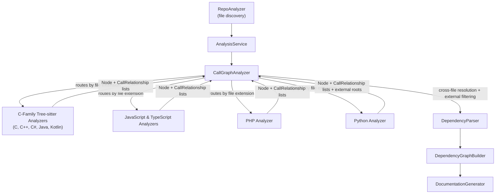
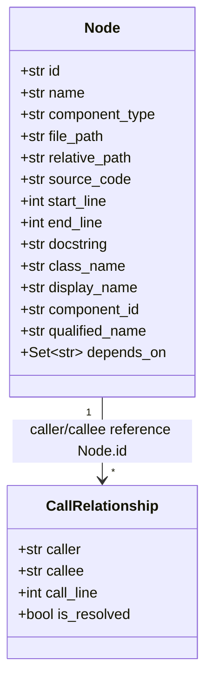
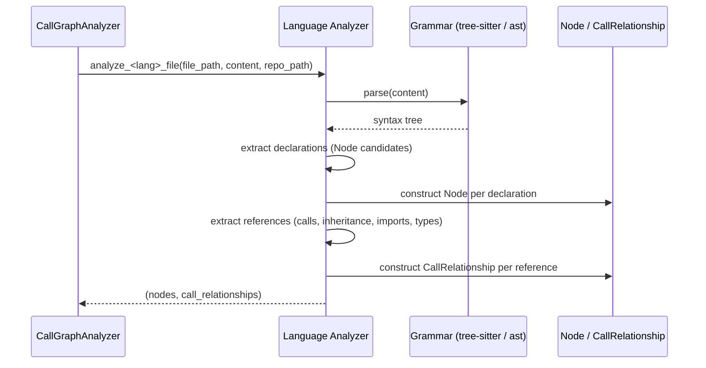
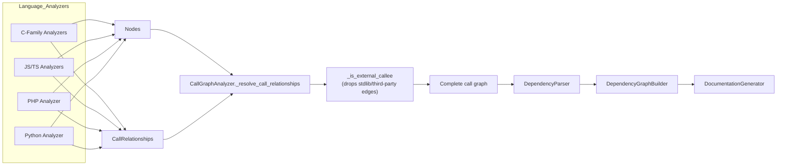

# Language Analyzers

## Purpose

The **Language_Analyzers** module is the collection of language-specific static analysis "front ends" that power CodeWiki's [Dependency_Analysis_Service](Dependency_Analysis_Service.md). For each supported programming language, an analyzer parses a single source file — using either [tree-sitter](https://tree-sitter.github.io/) grammars or, for Python, the native `ast` module — and extracts:

1. **`Node` records** — one per top-level declaration (class, struct, interface, function, method, trait, enum, global variable, type alias, …), representing a documentable "component".
2. **`CallRelationship` records** — directed edges describing how those components reference each other (calls, inheritance, interface implementation, instantiation, field/property types, imports, …).

None of these analyzers attempt full semantic/compiler-grade resolution. Instead, each performs the best-effort, file-local resolution possible from syntax alone, marking relationships `is_resolved=True` when the target is confidently known within the same file, and `is_resolved=False` (a best-effort qualified/dotted name) otherwise. The heavy lifting of matching unresolved edges to real components anywhere in the repository — and filtering out edges to genuinely external/third-party/stdlib symbols — is centralized in `CallGraphAnalyzer`, part of [Dependency_Analysis_Service](Dependency_Analysis_Service.md). The resulting resolved call graph is then transformed into the project-wide dependency graph by [Dependency_Analyzer_Core](Dependency_Analyzer_Core.md), which ultimately feeds [Backend_LLM_&_Documentation_Services](Backend_LLM_&_Documentation_Services.md) for documentation generation.

Currently supported languages/analyzers:

| Language(s) | Analyzer(s) | Parsing technology |
|---|---|---|
| C, C++, C#, Java, Kotlin | `TreeSitterCAnalyzer`, `TreeSitterCppAnalyzer`, `TreeSitterCSharpAnalyzer`, `TreeSitterJavaAnalyzer`, `TreeSitterKotlinAnalyzer` | tree-sitter |
| JavaScript, TypeScript | `TreeSitterJSAnalyzer`, `TreeSitterTSAnalyzer` | tree-sitter |
| PHP | `TreeSitterPHPAnalyzer` (+ `NamespaceResolver`) | tree-sitter |
| Python | `PythonASTAnalyzer` | native `ast` |

## Architecture

### Position in the system

### Shared data contract

Every analyzer in this module builds instances of the same two Pydantic models, owned by [Dependency_Analyzer_Core](Dependency_Analyzer_Core.md):

* **`Node.id` / `component_id`**: `"{relative_path_from_repo_root}::{qualified_name}"`, e.g. `src/Foo.cpp::Logger.write` — the canonical identifier used across CodeWiki.
* **`CallRelationship.is_resolved`**: `True` when the callee is a confirmed same-file `Node.id`; `False` when only a name (simple, qualified, or dotted) is known, deferring final resolution to `CallGraphAnalyzer`'s repository-wide indexes and external-symbol classifier.

### Common analyzer pipeline

Despite covering very different languages/grammars, all analyzers follow the same three-phase pattern:

### Output flow

## Sub-modules & Core Components

| Sub-module | Languages | Key Components | Documentation |
|---|---|---|---|
| **C-Family Tree-sitter Analyzers** | C, C++, C#, Java, Kotlin | `TreeSitterCAnalyzer`, `TreeSitterCppAnalyzer`, `TreeSitterCSharpAnalyzer`, `TreeSitterJavaAnalyzer`, `TreeSitterKotlinAnalyzer` | [C-Family_Tree-sitter_Analyzers.md](C-Family_Tree-sitter_Analyzers.md) |
| **JavaScript & TypeScript Analyzers** | JavaScript, TypeScript | `TreeSitterJSAnalyzer`, `TreeSitterTSAnalyzer` | [JavaScript_TypeScript_Analyzers.md](JavaScript_TypeScript_Analyzers.md) |
| **PHP Analyzer** | PHP | `TreeSitterPHPAnalyzer`, `NamespaceResolver` | [PHP_Analyzer.md](PHP_Analyzer.md) |
| **Python Analyzer** | Python | `PythonASTAnalyzer` | [Python_Analyzer.md](Python_Analyzer.md) |

## Related Modules

* [Dependency_Analysis_Service](Dependency_Analysis_Service.md) — owns `CallGraphAnalyzer`, which discovers files, dispatches them to the appropriate analyzer in this module, and performs cross-file symbol resolution and external-symbol filtering.
* [Dependency_Analyzer_Core](Dependency_Analyzer_Core.md) — defines the shared `Node`/`CallRelationship` models and the `DependencyParser`/`DependencyGraphBuilder` that turn resolved call graphs into the final dependency graph.
* [Backend_LLM_&_Documentation_Services](Backend_LLM_&_Documentation_Services.md) — consumes the dependency graph to generate human-readable documentation.