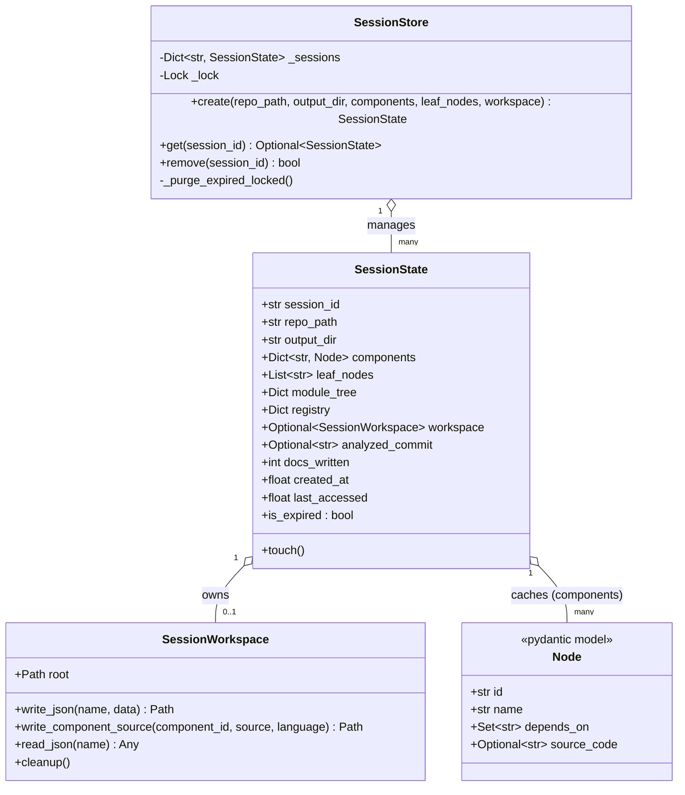
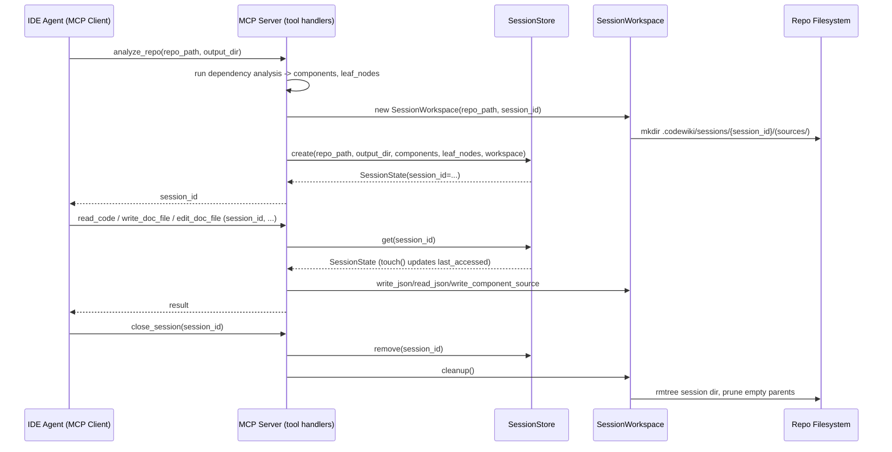
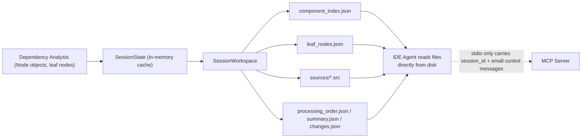
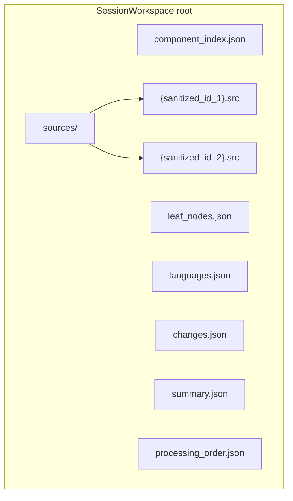
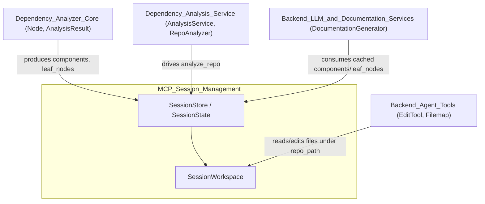

# MCP Session Management

## 1. Purpose

The **MCP Session Management** module is the stateful backbone of the CodeWiki
**Model Context Protocol (MCP) Server**. When an IDE agent (e.g. an AI coding
assistant) calls the `analyze_repo` MCP tool, this module:

1. Creates a new **session** that caches the results of repository analysis
   (parsed components, leaf nodes, module tree, etc.) in memory, keyed by a
   unique `session_id`.
2. Provisions an **on-disk workspace** where bulky analysis artifacts (source
   code snippets, JSON indexes) are written, so that large payloads never
   need to be streamed through the narrow MCP stdio channel.
3. Tracks session lifecycle — expiration, eviction, and cleanup — so that
   long-running MCP servers don't leak memory or disk space across many
   client interactions.

Every subsequent MCP tool call (read code, write documentation, edit files,
inspect/modify the module tree, close the session) looks up the session by
its `session_id` to operate on the cached analysis state without
re-parsing the repository from scratch.

This module sits between:
- **Dependency_Analysis_Service** / **Dependency_Analyzer_Core** — which
  produce the `Node` objects, leaf-node lists, and dependency graphs that a
  session caches (see [Dependency_Analysis_Service.md](Dependency_Analysis_Service.md)
  and [Dependency_Analyzer_Core.md](Dependency_Analyzer_Core.md)).
- **Backend_Agent_Tools** — whose editing tools (e.g. `EditTool`,
  `Filemap`) operate on files inside the session's repo/workspace path (see
  [Backend_Agent_Tools.md](Backend_Agent_Tools.md)).
- **Backend_LLM_&_Documentation_Services** — which use session-cached
  components/leaf nodes as input to drive documentation generation (see
  [Backend_LLM_&_Documentation_Services.md](Backend_LLM_&_Documentation_Services.md)).

## 2. Architecture Overview

The module consists of two tightly-coupled files:

| File | Responsibility |
|---|---|
| `codewiki/mcp/session.py` | In-memory session registry: creation, lookup, TTL-based expiry, LRU-style eviction, and thread-safety. |
| `codewiki/mcp/workspace.py` | Per-session on-disk directory management: writing/reading JSON artifacts and component source files, and cleanup. |



### 2.1 Session Lifecycle Flow



### 2.2 Data Flow: Avoiding Large stdio Payloads



## 3. Core Concepts

### 3.1 `SessionState` (session.py)

`SessionState` is a plain dataclass holding everything a session needs
across tool calls:

- **Identity & paths**: `session_id`, `repo_path`, `output_dir`.
- **Analysis cache**: `components` (a `Dict[str, Node]` — see
  [Dependency_Analyzer_Core.md](Dependency_Analyzer_Core.md) for the `Node`
  model), `leaf_nodes`, `module_tree`, and a generic `registry` dict for
  ad-hoc session-scoped data.
- **Workspace handle**: an optional `SessionWorkspace` for on-disk artifact
  storage (`None` if the session doesn't need one).
- **Incremental-update baseline**: `analyzed_commit` records the git `HEAD`
  commit *at analyze_repo time*. This is deliberately **not** updated to the
  HEAD at close time, because commits made mid-session (e.g. by the agent
  editing files) must still be considered part of the diff the next
  `analyze_repo` call needs to pick up — baselining to close-time HEAD would
  silently skip documenting those changes.
- **Bookkeeping**: `docs_written` (skips a metadata baseline update if no
  docs were written this session), `created_at`, `last_accessed`.
- **`touch()`**: refreshes `last_accessed`, called on every successful
  `get()`.
- **`is_expired`**: `True` once `last_accessed` is older than the TTL
  (`_SESSION_TTL_SECONDS = 2 hours`).

### 3.2 `SessionStore` (session.py)

A thread-safe (`threading.Lock`-guarded), in-memory registry of all active
`SessionState` objects, keyed by `session_id`.

Key behaviors:

- **`create(...)`**: 
  1. Purges expired sessions first (`_purge_expired_locked`).
  2. If at capacity (`_MAX_SESSIONS = 10`), evicts the least-recently-used
     session (oldest `last_accessed`), cleaning up its workspace on disk.
  3. Generates a collision-free 12-character hex `session_id`
     (`uuid.uuid4().hex[:12]`).
  4. Stores and returns the new `SessionState`.
- **`get(session_id)`**: Returns the session if present and not expired
  (calling `touch()` to extend its life); otherwise cleans up and returns
  `None`. This lazy-expiry check means expired sessions are also removed
  opportunistically on lookup, not just during `create`.
- **`remove(session_id)`**: Explicit removal (used by an MCP `close_session`
  tool), returns whether the session existed. Note: unlike `get()`/`create()`,
  `remove()` does **not** call `workspace.cleanup()` itself — the caller
  (typically the `close_session` tool handler) is responsible for invoking
  cleanup after removing the session, or accessing the returned state before
  removal to do so.
- **`_purge_expired_locked()`**: Internal helper (must be called while
  holding `_lock`) that sweeps all expired sessions and cleans up their
  workspaces.

This design bounds both **memory** (max 10 concurrent sessions, TTL-based
expiry) and **disk usage** (workspace cleanup on eviction/expiry) for a
long-lived MCP server process.

### 3.3 `SessionWorkspace` (workspace.py)

Manages a per-session directory tree used to persist analysis artifacts
that are too large or unwieldy to pass through the MCP stdio transport.

Directory layout (relative to `repo_path`):

```
.codewiki/sessions/{session_id}/
    component_index.json
    leaf_nodes.json
    languages.json
    changes.json
    summary.json
    processing_order.json
    sources/
        {sanitized_component_id}.src
```

Key methods:

- **`write_json(name, data)`**: Pretty-prints arbitrary JSON-serializable
  data to `root/{name}`.
- **`write_component_source(component_id, source, language)`**: Writes a
  single component's source code (e.g. a `Node.source_code` value) into
  `sources/`, prefixed with a small header comment identifying the
  component and language. Filenames are sanitized via `_safe_filename`,
  which:
  - Replaces any character outside `[\w\-.]` with `__`.
  - Truncates to 180 chars (to stay under common 255-byte `NAME_MAX`
    limits, since sanitization can expand path separators).
  - Appends an 8-character SHA-1 hash suffix of the *original* component ID
    to guarantee uniqueness even when different IDs sanitize to the same
    string.
- **`read_json(name)`**: Reads back a JSON artifact, returning `None` if the
  file doesn't exist (used by tool handlers to check for previously
  computed results, e.g. `changes.json` from an incremental update).
- **`cleanup()`**: Recursively removes the session's directory
  (`shutil.rmtree`, ignoring errors), then walks up to prune the now-empty
  `.codewiki/sessions/` and `.codewiki/` directories if applicable — keeping
  the target repository tidy after a session ends.



## 4. Relationship to Other Modules



- **Producers of session data**: The [Dependency_Analysis_Service](Dependency_Analysis_Service.md)
  (via `AnalysisService`/`RepoAnalyzer`) and [Dependency_Analyzer_Core](Dependency_Analyzer_Core.md)
  (via `Node`, `AnalysisResult`) supply the `components` and `leaf_nodes`
  that populate a new `SessionState` when `analyze_repo` runs.
- **Consumers of session data**: [Backend_LLM_&_Documentation_Services](Backend_LLM_&_Documentation_Services.md)
  (e.g. `DocumentationGenerator`) and MCP tool handlers read the cached
  `SessionState.components`/`module_tree` to drive documentation
  generation without re-analyzing the repo.
- **File operations**: [Backend_Agent_Tools](Backend_Agent_Tools.md) (e.g.
  `EditTool`, `Filemap`) operate on files within `repo_path` and may read
  artifacts written into the `SessionWorkspace` directory.
- **CLI vs. MCP**: The [CLI](CLI_Documentation_Generation.md) module
  provides a batch/one-shot alternative entry point
  (`CLIDocumentationGenerator`) that does not use session management at
  all — it runs analysis and generation end-to-end in a single process
  invocation. MCP Session Management exists specifically to support
  **interactive, multi-step** IDE-agent workflows where state must persist
  across many small tool calls.

## 5. Design Notes & Invariants

- **Thread safety**: All mutations to the session dictionary happen under
  `SessionStore._lock`, making `SessionStore` safe for concurrent MCP tool
  invocations (the MCP server may handle multiple in-flight requests).
- **Bounded resource usage**: The combination of TTL expiry
  (`_SESSION_TTL_SECONDS`) and max-session eviction (`_MAX_SESSIONS`)
  ensures the server doesn't accumulate unbounded memory or leftover
  `.codewiki/sessions/*` directories across long-running deployments.
- **`analyzed_commit` baseline correctness**: This is a subtle but important
  invariant — the baseline commit for the *next* incremental analysis must
  be the commit at the time analysis was performed, not at session close.
  Any code that finalizes a session (e.g. a `close_session` tool handler)
  must persist `analyzed_commit`, not `HEAD` at close time.
- **Workspace cleanup ownership**: `SessionStore.get()` and `create()`
  (via internal eviction/expiry paths) clean up workspaces automatically.
  However, `SessionStore.remove()` does not — callers must handle
  `workspace.cleanup()` explicitly when doing an intentional
  `close_session`.
