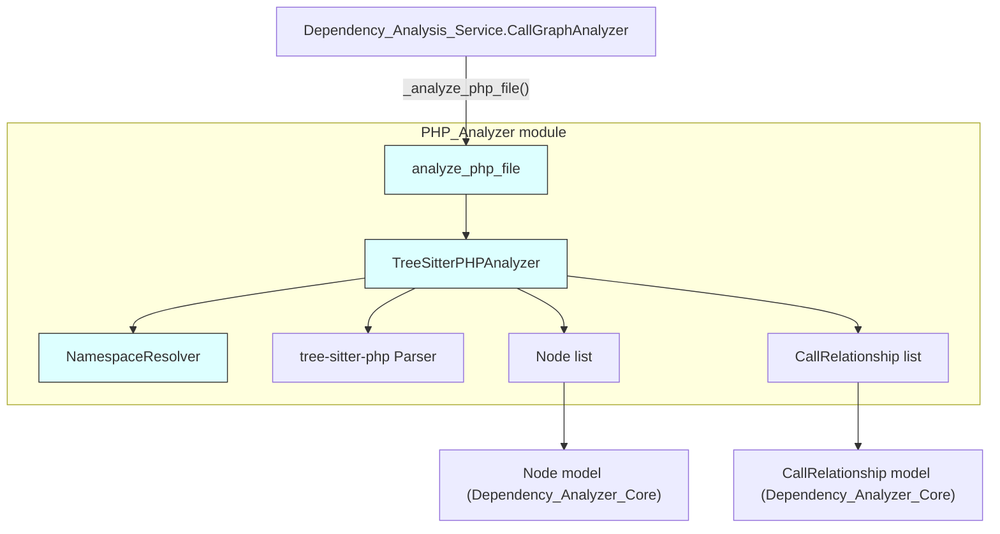
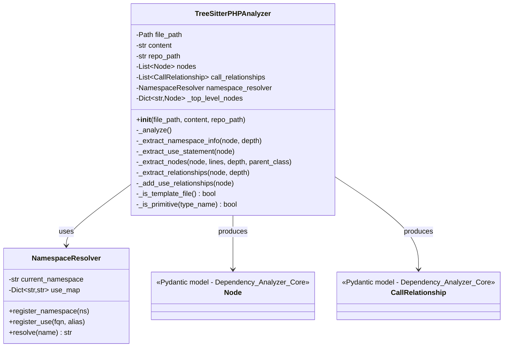
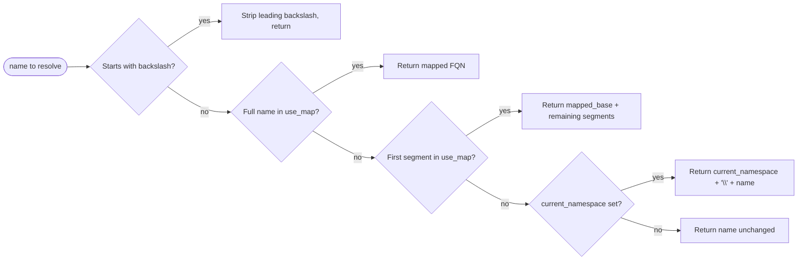
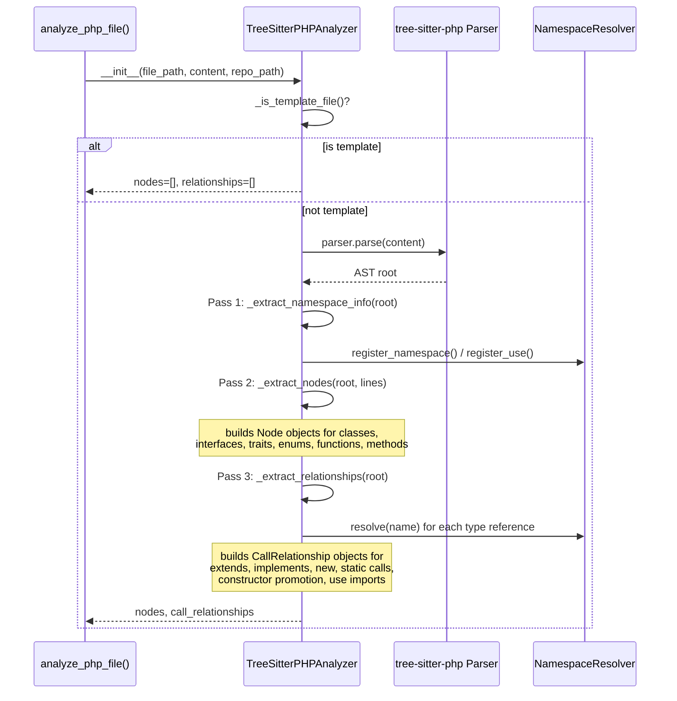

# PHP Analyzer

## Introduction

The **PHP Analyzer** module is a language-specific static analysis component within the [Language_Analyzers](Language_Analyzers.md) family. It is responsible for parsing PHP source files, extracting structural code entities (classes, interfaces, traits, enums, functions, and methods), and identifying dependency relationships between them (inheritance, interface implementation, object instantiation, static calls, and constructor property promotion).

The module is invoked by the [Dependency_Analysis_Service](Dependency_Analysis_Service.md)'s `CallGraphAnalyzer` whenever a `.php` (or `.phtml`/`.inc`) file is encountered during repository analysis, and its output feeds directly into the [Dependency_Analyzer_Core](Dependency_Analyzer_Core.md) data models (`Node`, `CallRelationship`) that power the rest of the CodeWiki documentation-generation pipeline.

It consists of two core components defined in `codewiki/src/be/dependency_analyzer/analyzers/php.py`:

| Component | Responsibility |
|---|---|
| `NamespaceResolver` | Tracks PHP `namespace` declarations and `use` statements to resolve short/aliased class names to fully-qualified names (FQNs). |
| `TreeSitterPHPAnalyzer` | Drives a `tree-sitter-php` parse of a single file, walking the AST to build `Node` and `CallRelationship` objects. |

A module-level convenience function, `analyze_php_file(file_path, content, repo_path)`, wraps the analyzer class and is the single entry point used by the rest of the system.

---

## Architecture Overview

The PHP Analyzer follows the same "parse → extract nodes → extract relationships" pattern used by its sibling language analyzers (see [C-Family_Tree-sitter_Analyzers](C-Family_Tree-sitter_Analyzers.md), [JavaScript_TypeScript_Analyzers](JavaScript_TypeScript_Analyzers.md), and [Python_Analyzer](Python_Analyzer.md)), but is tailored to PHP-specific syntax such as namespaces, traits, enums, and constructor property promotion.

### Component Relationships

---

## Core Components

### `NamespaceResolver`

PHP allows classes to be referenced by short names, aliases, or fully-qualified names depending on the current `namespace` and any `use` import statements in scope. `NamespaceResolver` centralizes this logic so the analyzer can always emit a consistent, fully-qualified dependency target.

**Responsibilities:**
- `register_namespace(ns)` — records the file's current namespace (from a `namespace_definition` AST node).
- `register_use(fqn, alias=None)` — records an imported class, keyed by its alias (or its own short name if no alias is given). Supports both simple (`use App\User;`) and grouped (`use App\{User, Post};`) use-statement forms.
- `resolve(name)` — given any class-name reference encountered in the code, returns its fully-qualified form by:
  1. Returning as-is if already fully qualified (leading `\`).
  2. Looking up the exact name in the alias map.
  3. Looking up the first namespace segment in the alias map (for partially-qualified names).
  4. Falling back to prefixing with the current namespace.
  5. Returning the name unchanged if no namespace context exists.

### `TreeSitterPHPAnalyzer`

The main analyzer class. It wraps `tree_sitter_php.language_php()` (the mixed PHP/HTML grammar, chosen because it is the most common real-world case) and performs a three-pass analysis of the file's AST.

**Constructor behavior (`__init__`)**
- Stores `file_path`, `content`, and `repo_path`.
- Initializes empty `nodes`, `call_relationships`, a fresh `NamespaceResolver`, and a `_top_level_nodes` lookup dict.
- Checks `_is_template_file()` — if the file matches known template patterns/directories (`.blade.php`, `.phtml`, `.twig.php`, or paths containing `views`/`templates`/`resources/views`), analysis is skipped entirely (templates are typically embedded HTML+PHP with little structural code value).
- Otherwise calls `_analyze()`.

**`_analyze()` — three-pass pipeline**

1. **Namespace/Use extraction (`_extract_namespace_info`)** — recursively walks the tree looking for `namespace_definition` and `namespace_use_declaration` nodes, populating the `NamespaceResolver` before any name resolution is needed.

2. **Node extraction (`_extract_nodes`)** — recursively walks the tree recognizing these AST node types and mapping them to a `component_type`:

   | AST node type | component_type | Notes |
   |---|---|---|
   | `class_declaration` | `class` or `abstract class` | Detects `abstract` modifier |
   | `interface_declaration` | `interface` | |
   | `trait_declaration` | `trait` | |
   | `enum_declaration` | `enum` | |
   | `function_definition` | `function` | Top-level function |
   | `method_declaration` | `method` | Name qualified as `ClassName.methodName` |

   For each recognized node it builds a `Node` (from [Dependency_Analyzer_Core](Dependency_Analyzer_Core.md)) populated with: `id`/`component_id` (computed via `_get_component_id`, format `relative/path.php::Name` or `relative/path.php::Class.method`), `source_code` slice, `start_line`/`end_line`, PHPDoc `docstring` (via `_get_preceding_docstring`), `parameters` (via `_extract_parameters`), and `base_classes` (via `_extract_base_classes`). The current enclosing class name is threaded through recursion via the `parent_class` argument so that methods are correctly attributed and named.

3. **Relationship extraction (`_extract_relationships`)** — a second recursive walk that emits `CallRelationship` objects for the following dependency kinds:

   | Trigger AST node | Relationship meaning | Notes |
   |---|---|---|
   | `namespace_use_declaration` | file → imported class | via `_add_use_relationships`, caller is the file's relative path |
   | `class_declaration` with `base_clause` | class → parent class (`extends`) | |
   | `class_declaration` / `enum_declaration` with `class_interface_clause` | class/enum → interface (`implements`) | |
   | `object_creation_expression` | containing class → instantiated type (`new`) | |
   | `scoped_call_expression` | containing class → target class (`::` static call) | |
   | `property_promotion_parameter` | containing class → promoted property's type (PHP 8+ constructor promotion) | |

   Every extracted type name is passed through `NamespaceResolver.resolve()` and filtered via `_is_primitive()` (which excludes PHP scalar types and common built-ins such as `Exception`, `Closure`, `DateTime`, etc., listed in `PHP_PRIMITIVES`). Resolved names have their namespace separator (`\`) converted to `.` to match the dotted component-ID convention used elsewhere in the system. All relationships are emitted with `is_resolved=False`; final resolution to actual component IDs happens later in `CallGraphAnalyzer._resolve_call_relationships` (see [Dependency_Analysis_Service](Dependency_Analysis_Service.md)).

**Supporting helpers**
- `_get_module_path` / `_get_relative_path` / `_get_component_id` — compute file-relative paths and component identifiers, stripping `.php`/`.phtml`/`.inc` extensions.
- `_find_child_by_type`, `_get_name_from_node`, `_get_type_from_clause`, `_extract_type_name`, `_find_containing_class_name` — low-level tree-sitter node traversal utilities.
- `_get_preceding_docstring` — scans backward from a node for a `/** ... */` PHPDoc block, either via `prev_named_sibling` or raw line scanning.
- `_extract_parameters` — pulls parameter names (and types, if annotated) from `formal_parameters`, supporting simple, promoted, and variadic parameters.
- `_extract_base_classes` — collects both `extends` and `implements` targets into a single list for the `Node.base_classes` field.
- `MAX_RECURSION_DEPTH` (100) guards all recursive walks against pathological/deeply nested ASTs, raising a caught `RecursionError` if exceeded.

### `analyze_php_file(file_path, content, repo_path=None)`

The public functional entry point. Instantiates `TreeSitterPHPAnalyzer` and returns `(analyzer.nodes, analyzer.call_relationships)`. This is the exact signature expected by `CallGraphAnalyzer._analyze_php_file` in the [Dependency_Analysis_Service](Dependency_Analysis_Service.md).

---

## Integration with the Wider System

```mermaid
graph LR
    subgraph "Repository Analysis Pipeline"
        RA["RepoAnalyzer<br/>(file discovery)"] --> CGA["CallGraphAnalyzer<br/>(Dependency_Analysis_Service)"]
        CGA -->|".php files"| PHP["PHP_Analyzer<br/>analyze_php_file()"]
        CGA -->|".py files"| PY["Python_Analyzer"]
        CGA -->|".ts/.js files"| TS["JavaScript_TypeScript_Analyzers"]
        CGA -->|".c/.cpp/.java/.cs/.kt files"| CF["C-Family_Tree-sitter_Analyzers"]
        PHP --> NODES["Node & CallRelationship objects"]
        PY --> NODES
        TS --> NODES
        CF --> NODES
        NODES --> RESOLVE["_resolve_call_relationships()<br/>cross-language callee resolution"]
        RESOLVE --> DPB["DependencyGraphBuilder<br/>(Dependency_Analyzer_Core)"]
        DPB --> DOC["DocumentationGenerator<br/>(Backend_LLM_&_Documentation_Services)"]
    end
```

1. **Discovery**: `RepoAnalyzer` (in [Dependency_Analysis_Service](Dependency_Analysis_Service.md)) walks the repository and classifies `.php`/`.phtml`/`.inc` files by extension via `CODE_EXTENSIONS`.
2. **Dispatch**: `CallGraphAnalyzer.analyze_code_files` calls `_analyze_code_file`, which routes PHP files to `_analyze_php_file`, which in turn calls `analyze_php_file` from this module.
3. **Aggregation**: The returned `Node` objects are merged into `CallGraphAnalyzer.functions` (keyed by component ID) and `CallRelationship` objects appended to `CallGraphAnalyzer.call_relationships`.
4. **Cross-file/cross-language resolution**: `CallGraphAnalyzer._resolve_call_relationships` attempts to resolve each unresolved `CallRelationship.callee` (still expressed as a dotted/short type name from this analyzer) against the global and per-language indexes of all discovered components, marking matches `is_resolved=True` and rewriting `callee` to the actual component ID. Unresolved relationships pointing to external/library symbols are filtered out.
5. **Graph construction**: `DependencyParser` (in [Dependency_Analyzer_Core](Dependency_Analyzer_Core.md)) consumes the final function/relationship lists to build the `Node.depends_on` sets used throughout the rest of the documentation pipeline (module grouping, dependency graphs, LLM context assembly).
6. **Documentation generation**: Ultimately this structural/dependency data is consumed by [Backend_LLM_&_Documentation_Services](Backend_LLM_&_Documentation_Services.md) to generate human-readable module documentation — the same kind of document you are reading now.

---

## Data Model Reference

The PHP Analyzer produces instances of two Pydantic models owned by [Dependency_Analyzer_Core](Dependency_Analyzer_Core.md):

- **`Node`** — represents a single extracted PHP entity (class, interface, trait, enum, function, or method) with fields such as `id`, `name`, `component_type`, `file_path`, `relative_path`, `source_code`, `start_line`/`end_line`, `docstring`, `parameters`, `base_classes`, `class_name`, and `display_name`.
- **`CallRelationship`** — represents a directed dependency edge (`caller` → `callee`) with an optional `call_line` and an `is_resolved` flag indicating whether `callee` has been matched to a concrete component ID.

Refer to [Dependency_Analyzer_Core](Dependency_Analyzer_Core.md) for the full model definitions and how they are consumed downstream (dependency graph building, analysis result serialization).

---

## Key Design Notes

- **Template file skipping**: Files matching Blade/Twig/`.phtml` patterns or living in `views`/`templates`/`resources/views` directories are skipped entirely (`_is_template_file`), since these typically mix large amounts of HTML with minimal reusable PHP logic and would otherwise pollute the dependency graph.
- **Mixed PHP/HTML grammar**: The analyzer deliberately uses `tree_sitter_php.language_php()` rather than the pure-PHP grammar, since most real-world PHP files (including non-template ones) may contain embedded HTML.
- **Primitive/built-in filtering**: `PHP_PRIMITIVES` prevents noise from scalar types (`string`, `int`, etc.) and ubiquitous SPL/core classes (`Exception`, `Closure`, `DateTime`, etc.) from appearing as false dependency edges.
- **Namespace-aware resolution**: Unlike simpler language analyzers, PHP's namespace/use-import system requires the dedicated `NamespaceResolver` to correctly disambiguate short class names — this is unique among the analyzers in [Language_Analyzers](Language_Analyzers.md).
- **Deferred resolution**: Consistent with all other analyzers, this module does not resolve relationships to final component IDs itself — it only produces best-effort namespace-qualified names; the heavy lifting of matching across the whole repository is delegated to `CallGraphAnalyzer` in [Dependency_Analysis_Service](Dependency_Analysis_Service.md).
