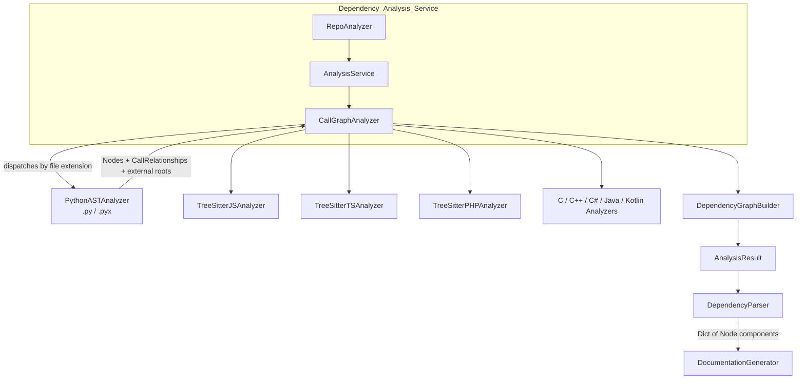
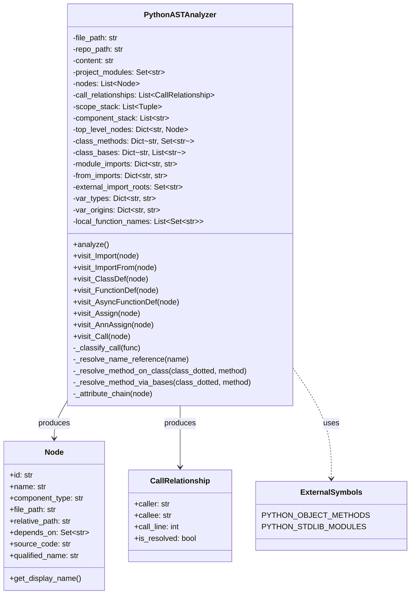
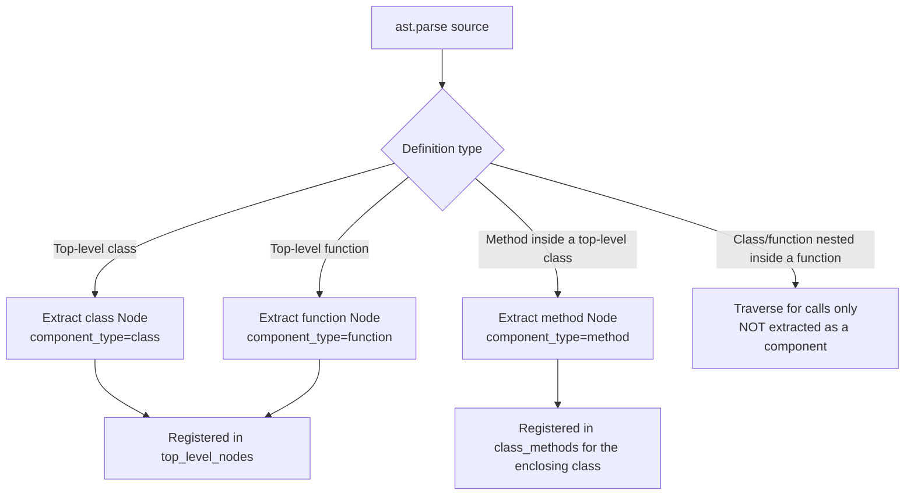
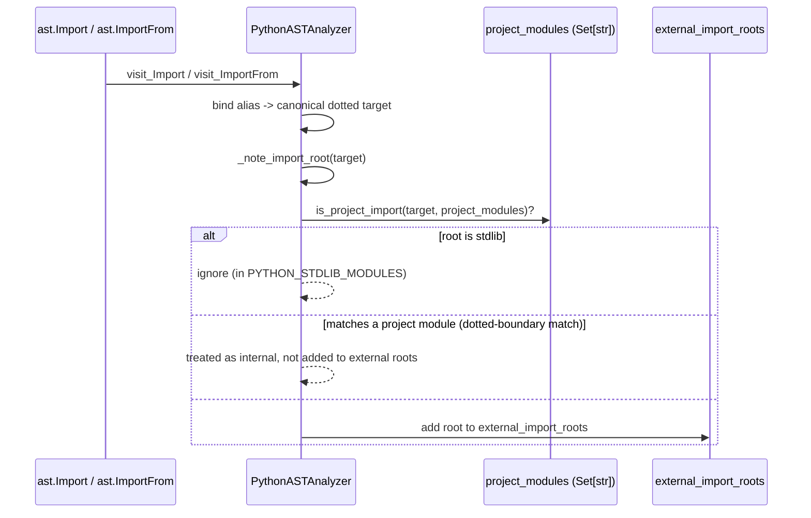
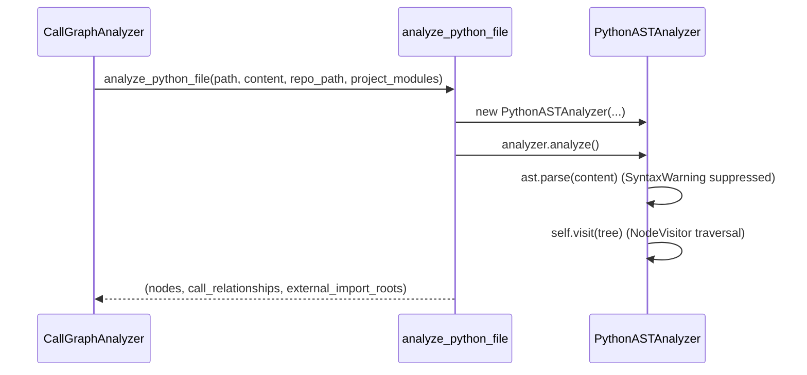
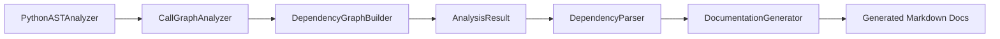

# Python Analyzer

## Introduction

The **Python Analyzer** is the language-specific static analysis engine responsible for extracting structural components (classes, functions, methods) and call/dependency relationships from Python source files. It is one of several per-language analyzers plugged into the [Dependency_Analyzer_Core](Dependency_Analyzer_Core.md) pipeline (alongside the [C-Family Tree-sitter Analyzers](C-Family_Tree-sitter_Analyzers.md), [JavaScript/TypeScript Analyzers](JavaScript_TypeScript_Analyzers.md), and [PHP Analyzer](PHP_Analyzer.md)), and its output feeds the repository-wide dependency graph that ultimately powers documentation generation in [Backend_LLM_&_Documentation_Services](Backend_LLM_%26_Documentation_Services.md).

Unlike the other language analyzers, which are built on `tree-sitter` grammars, the Python analyzer is implemented directly on top of Python's native `ast` module (`ast.NodeVisitor`), giving it precise, first-party access to the language's semantics (scopes, imports, class hierarchies, etc.) without an external parsing dependency.

Its single entry point, `analyze_python_file`, is called once per `.py`/`.pyx` file discovered during repository analysis and returns:

1. A list of extracted **`Node`** components (classes, functions, methods).
2. A list of **`CallRelationship`** edges (calls, inheritance, imports) between components.
3. The set of third-party (non-project) import roots observed in the file, used elsewhere to build a picture of external dependencies.

---

## Purpose & Responsibilities

| Responsibility | Description |
|---|---|
| **Component extraction** | Walks the AST to identify top-level classes, top-level functions, and methods, producing a `Node` for each with metadata (docstring, parameters, source snippet, line ranges, qualified name). |
| **Scope tracking** | Maintains a scope stack (`class`/`function`) to distinguish top-level definitions from nested/local ones, so that functions nested inside functions are treated as implementation detail rather than independent components. |
| **Import resolution** | Tracks `import` and `from ... import` statements, mapping local aliases to canonical dotted module paths, and classifies each import root as project-internal or external/third-party. |
| **Call resolution** | Analyzes `ast.Call` nodes to determine, wherever possible, which component a call target refers to — resolving `self`/`cls`/`super()` calls, calls on typed variables, calls on known same-file classes, and calls through imported names. |
| **Inheritance resolution** | Extracts base classes for each class and attempts to resolve inherited methods (including across `super()` chains) so that overridden/inherited method calls still map to the correct defining class when possible. |
| **Shallow type inference** | Performs a light "receiver knowledge" pass on simple assignments (`x = SomeClass()`, `x = module.factory()`) so that later attribute calls on `x` can be attributed to the right class or import origin. |

---

## Architecture

### Position in the Dependency Analysis Pipeline

See [Dependency_Analysis_Service](Dependency_Analysis_Service.md) for the orchestration layer (`AnalysisService`, `CallGraphAnalyzer`, `RepoAnalyzer`) that discovers files, dispatches them to the correct language analyzer, and aggregates results. See [Dependency_Analyzer_Core](Dependency_Analyzer_Core.md) for the `DependencyParser`, `DependencyGraphBuilder`, and shared models (`Node`, `CallRelationship`, `AnalysisResult`) that this module produces and consumes.

### Internal Class Structure

`Node` and `CallRelationship` are shared Pydantic models defined in [Dependency_Analyzer_Core](Dependency_Analyzer_Core.md) (`codewiki/src/be/dependency_analyzer/models/core.py`) and used identically by every language analyzer, which keeps downstream consumers (graph builder, documentation generator) language-agnostic.

---

## Component Extraction Model

The analyzer distinguishes three kinds of definitions and only promotes two of them to first-class components:

Key rules:
- **Component ID** format: `"{relative_path}::{dotted_name}"`, e.g. `services/user.py::UserService.create`.
- **Qualified name** format: dotted-module style, e.g. `services.user.UserService.create`, used for cross-file/global resolution by the graph builder.
- Functions whose bare name starts with `_test_` are filtered out (`_should_include_function`), avoiding noise from ad-hoc test helpers.
- Nested functions/classes (defined inside another function) are **not** extracted as separate nodes — calls made from within them are attributed to the enclosing extracted component via `component_stack`, and their names are recorded in `local_function_names` to avoid misclassifying self-recursive/local calls as external references.

---

## Import & Third-Party Classification

- `project_modules` is a set of dotted module paths for every Python file in the repository, supplied by the caller (`analyze_python_file`) so the analyzer can tell project-internal imports apart from third-party packages even in **src-layout** repos (e.g. import `pkg.util` matching project module `src.pkg.util`) via `_dotted_contains`.
- `PYTHON_STDLIB_MODULES` and `PYTHON_OBJECT_METHODS` come from `codewiki/src/be/dependency_analyzer/utils/external_symbols.py` and are used to filter out standard-library imports and built-in object methods (e.g. `__init__`, `append`) that should never resolve to project components.
- The returned `external_import_roots` set is aggregated across files by the [Dependency_Analysis_Service](Dependency_Analysis_Service.md) to characterize the repository's third-party footprint.

---

## Call Resolution Logic

Call resolution is the most intricate part of the analyzer. `visit_Call` delegates to `_classify_call`, which decides how confidently a call target can be tied to a project component.

```mermaid
flowchart TD
    Start[ast.Call node.func] --> IsName{Is ast.Name?}
    IsName -->|Yes| ResolveName[_resolve_name_reference]
    IsName -->|No, is ast.Attribute| Chain[_attribute_chain]

    Chain --> Composite{Chain resolvable<br/>to simple name path?}
    Composite -->|No - composite receiver| ObjMethod{attr in<br/>PYTHON_OBJECT_METHODS?}
    ObjMethod -->|Yes| Drop[No relationship emitted]
    ObjMethod -->|No| Unresolved1["(attr, False) unresolved"]

    Composite -->|Yes| Root{Root of chain}
    Root -->|self / cls + 1 attr| SelfMethod[_resolve_method_on_class<br/>on current class]
    Root -->|super&#40;&#41; + 1 attr| SuperMethod[_resolve_method_via_bases]
    Root -->|typed variable var_types| VarMethod[_resolve_method_on_class<br/>on inferred class]
    Root -->|known same-file class| ClassMethod[_resolve_method_on_class]
    Root -->|from_imports / module_imports| ImportedDotted["(imported.dotted.path, False)"]
    Root -->|var_origins tracked| OriginDotted["(origin.dotted.path, False)"]
    Root -->|none of the above| RawDotted["(full dotted chain, False)"]

    ResolveName --> NameLocal{Shadowed by<br/>local_function_names?}
    NameLocal -->|Yes| Drop
    NameLocal -->|No| NameLookup{In top_level_nodes?}
    NameLookup -->|Yes| Resolved["(file::name, True) RESOLVED"]
    NameLookup -->|No, in imports| ImportedName["(imported.dotted.path, False)"]
    NameLookup -->|No| RawName["(name, False)"]
```

### Resolution Confidence: `is_resolved`

- **`is_resolved=True`** — the callee is a definitively known component in the *same file* (top-level function/class, `self`/`cls` method match, or inherited method found via same-file base classes). The callee id is a full component id: `"{relative_path}::{dotted_name}"`.
- **`is_resolved=False`** — the callee is expressed as a best-effort dotted/qualified name (e.g. `module.Class.method` or a bare unqualified name). These are resolved later — at the repository level — by matching against `qualified_name` across all files, which is why every `Node` also carries a `qualified_name`.

### Inheritance-Aware Method Resolution

`_resolve_method_via_bases` performs a breadth-first search over `class_bases` (populated during `visit_ClassDef`) to find which ancestor class actually defines a method being called via `self.method()`, `cls.method()`, or `super().method()`. If a base class is itself defined in the same file, the search continues transitively; if a base is external/imported, the analyzer emits an unresolved dotted callee (`imported.Base.method`) so the global resolver has a chance to match it against another file's qualified name.

---

## Shallow Type Inference for Attribute Calls

To resolve calls like `service.do_work()` where `service` is a local variable, the analyzer performs a lightweight, single-assignment type inference:

```mermaid
flowchart LR
    A["x = SomeClass()"] -->|root is a same-file class,<br/>no further attrs| B[var_types&#91;x&#93; = SomeClass]
    C["x = module.factory()"] -->|root is an import| D[var_origins&#91;x&#93; = module.factory]
    B --> E["x.method&#40;&#41; resolves via<br/>_resolve_method_on_class&#40;SomeClass, method&#41;"]
    D --> F["x.method&#40;&#41; resolves to<br/>module.factory.method &#40;unresolved&#41;"]
```

This tracking is intentionally shallow: it only considers single-target `Name = Call(...)` assignments (including annotated assignments), and only the most recent assignment to a name is remembered (no flow-sensitive reassignment tracking, no branch merging).

---

## Public API

### `analyze_python_file(file_path, content, repo_path=None, project_modules=None) -> Tuple[List[Node], List[CallRelationship], Set[str]]`

The single function other modules should call. It instantiates `PythonASTAnalyzer`, runs `.analyze()`, and returns the accumulated nodes, relationships, and external import roots. This is invoked by the `CallGraphAnalyzer` in [Dependency_Analysis_Service](Dependency_Analysis_Service.md) as part of the multi-language repository scan orchestrated by `AnalysisService` and `RepoAnalyzer`.

`analyze()` guards parsing with `warnings.catch_warnings()` to suppress `SyntaxWarning`s from regex-like escape sequences in analyzed source, and catches `SyntaxError`/generic exceptions so a single unparsable file does not abort the whole repository scan (logged and skipped instead).

---

## Downstream Consumption

The `(nodes, call_relationships, external_import_roots)` tuple produced per file is merged by the `CallGraphAnalyzer` with the results of all other language analyzers into a single repository-wide call graph. This flows into:

- **`DependencyGraphBuilder`** / **`DependencyParser`** (see [Dependency_Analyzer_Core](Dependency_Analyzer_Core.md)) — builds the final `depends_on` edges on each `Node` by matching unresolved `CallRelationship.callee` dotted names against every node's `qualified_name`, and resolved callees directly by component id.
- **`AnalysisResult`** — the top-level result object consumed by the [Backend_LLM_&_Documentation_Services](Backend_LLM_%26_Documentation_Services.md) module (`DocumentationGenerator`, `PydanticAIBackend`, etc.) to generate per-module and per-component documentation, including dependency-aware context for LLM prompts.

---

## Related Modules

| Module | Relationship |
|---|---|
| [Dependency_Analysis_Service](Dependency_Analysis_Service.md) | Orchestrates repository scanning and dispatches files to `PythonASTAnalyzer` (and sibling analyzers). |
| [Dependency_Analyzer_Core](Dependency_Analyzer_Core.md) | Defines the shared `Node`/`CallRelationship`/`AnalysisResult` models this analyzer emits, and builds the final dependency graph. |
| [C-Family_Tree-sitter_Analyzers](C-Family_Tree-sitter_Analyzers.md), [JavaScript_TypeScript_Analyzers](JavaScript_TypeScript_Analyzers.md), [PHP_Analyzer](PHP_Analyzer.md) | Sibling language analyzers producing the same `Node`/`CallRelationship` contract using tree-sitter grammars instead of Python's native `ast`. |
| [Backend_LLM_&_Documentation_Services](Backend_LLM_%26_Documentation_Services.md) | Consumes the aggregated dependency graph to generate documentation for each analyzed component. |
