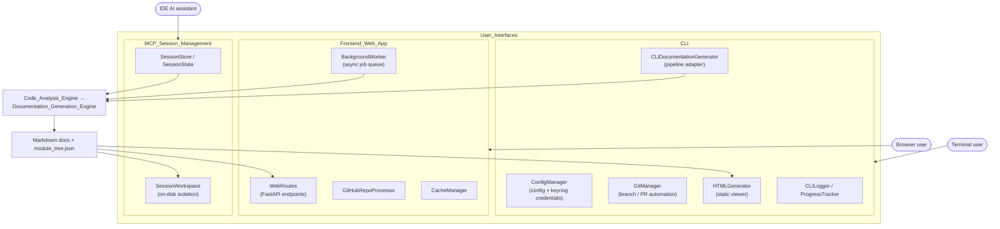

# User Interfaces

## Purpose

The **User_Interfaces** subsystem is the set of interchangeable front-ends through which users drive CodeWiki. All three converge on the same underlying pipeline — [Code_Analysis_Engine](Code_Analysis_Engine.md) followed by [Documentation_Generation_Engine](Documentation_Generation_Engine.md) — but serve different workflows:

1. **[CLI](CLI.md)** — the `codewiki` command-line tool for local, one-shot repository documentation: interactive configuration and credential management, incremental updates (`--update` / `--compare-to`), git branch/PR automation, static HTML viewer generation for GitHub Pages, and terminal progress UX.
2. **[Frontend_Web_App](Frontend_Web_App.md)** — a FastAPI web service that accepts GitHub repository URLs, clones and processes them asynchronously through a background worker with job tracking and caching, and serves the generated documentation as browsable HTML.
3. **[MCP_Session_Management](MCP_Session_Management.md)** — stateful session and on-disk workspace management for CodeWiki's MCP server, which exposes analysis and documentation tools to IDE-integrated AI assistants over the Model Context Protocol for interactive, multi-step workflows.

## Architecture

Key design decisions:

* **Thin front-ends, shared backend.** Each interface only handles its own input/output concerns (argument parsing, HTTP, MCP protocol); documentation work is always delegated to the shared pipeline, so behavior stays consistent across entry points.
* **Different execution models.** The CLI runs synchronously in-process with terminal progress bars; the web app decouples request handling from processing via `BackgroundWorker` and job-status polling; the MCP server holds long-lived sessions whose state and artifacts live in isolated on-disk workspaces.
* **Output tailored per audience.** The CLI can emit a self-contained GitHub Pages viewer (`index.html`), the web app renders docs server-side for browsing, and the MCP server returns structured results for agent consumption.

## Modules

| Module | Responsibility | Documentation |
|---|---|---|
| **CLI** | Local command-line generation: configuration, git integration, HTML viewer, terminal UX | [CLI.md](CLI.md) |
| **Frontend_Web_App** | FastAPI service: GitHub repo submission, async job processing, caching, HTML rendering | [Frontend_Web_App.md](Frontend_Web_App.md) |
| **MCP_Session_Management** | Stateful sessions and workspaces for the MCP server / IDE agents | [MCP_Session_Management.md](MCP_Session_Management.md) |

## Related Modules

* [Documentation_Generation_Engine](Documentation_Generation_Engine.md) — the pipeline these interfaces invoke and whose output they present.
* [Code_Analysis_Engine](Code_Analysis_Engine.md) — the static-analysis stage triggered at the start of every run.
* [Core_Config_&_Utils](Core_Config_&_Utils.md) — the shared `Config` object each front-end constructs from its own input format.
