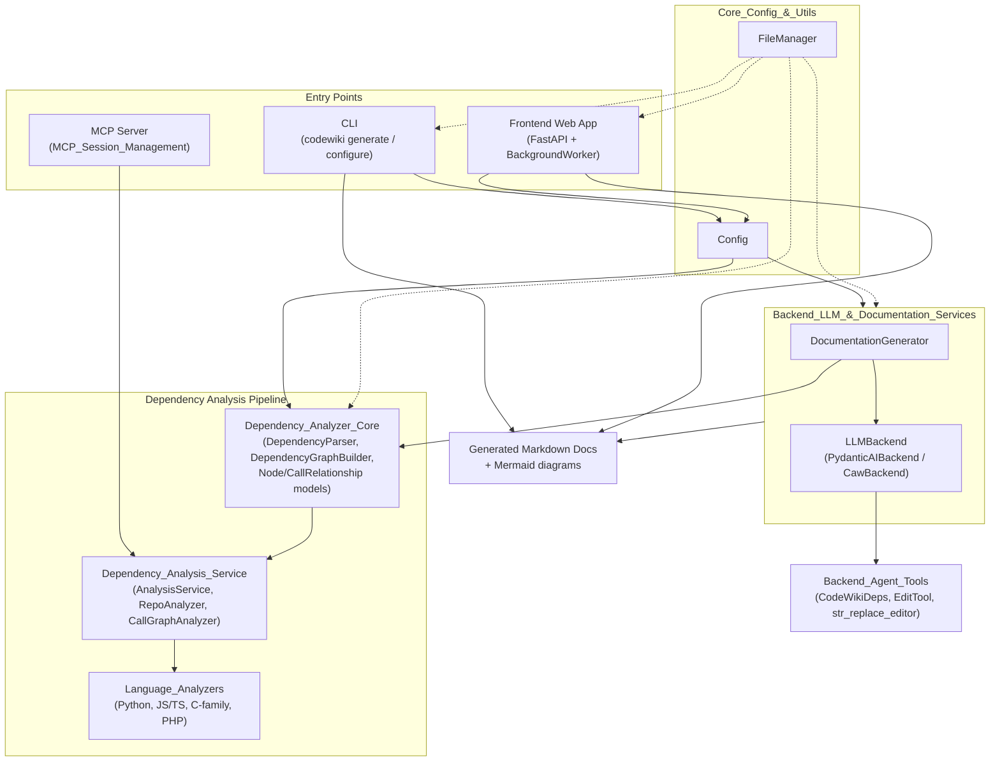
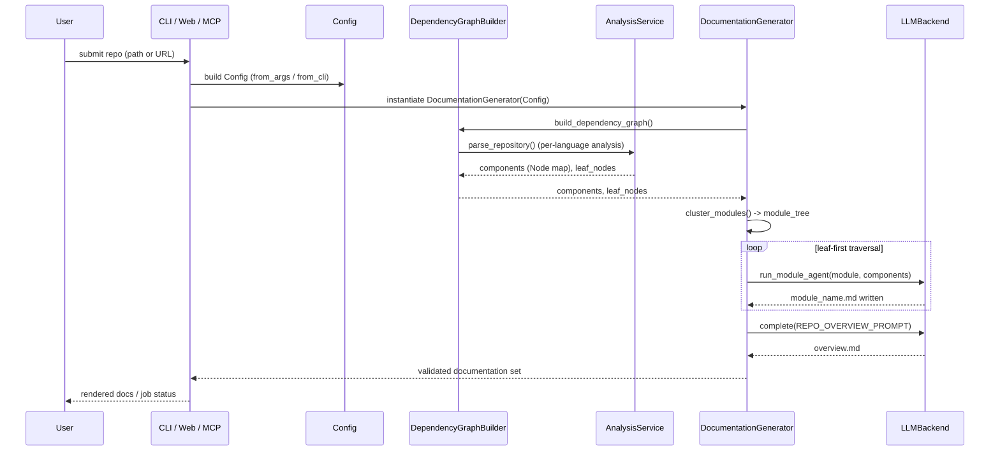

# CodeWiki

## Overview

**CodeWiki** is an AI-powered documentation generation system that analyzes source code repositories across multiple programming languages and automatically produces structured, hierarchical, human-readable documentation. It combines static dependency analysis (via `tree-sitter` grammars and Python's native `ast`) with LLM-driven agents to understand code architecture, cluster related components into logical modules, and generate Markdown documentation — complete with Mermaid diagrams — bottom-up from leaf components to a full repository overview.

CodeWiki exposes three interchangeable front-ends to the same underlying pipeline:

- **CLI** — a command-line tool for local, one-shot repository documentation with optional git-branch/PR automation.
- **Frontend Web App** — a FastAPI-based web service that accepts GitHub repository URLs, processes them asynchronously, and serves the results as browsable HTML.
- **MCP Server** (via MCP Session Management) — exposes CodeWiki's analysis and documentation tools to IDE-integrated AI assistants over the Model Context Protocol, with stateful sessions for interactive, multi-step workflows.

All three front-ends converge on a shared backend: dependency analysis → module clustering → LLM-driven per-module documentation → validated output.

## End-to-End Architecture

### Documentation Generation Flow

## Subsystems & Core Modules

The system is organized into three architectural subsystems plus a shared foundation:

### [Code_Analysis_Engine](Code_Analysis_Engine.md)

The LLM-free static-analysis front half: turns a source repository into a fully-resolved dependency graph.

| Module | Description |
|---|---|
| [Dependency_Analyzer_Core](Dependency_Analyzer_Core.md) | Shared data models (`Node`, `CallRelationship`, `Repository`, `AnalysisResult`) and the graph-building/leaf-selection logic. |
| [Dependency_Analysis_Service](Dependency_Analysis_Service.md) | Orchestrates repository cloning/discovery, per-language call-graph construction, and cross-file symbol resolution. |
| [Language_Analyzers](Language_Analyzers.md) | Per-language static analyzers (Python AST, tree-sitter for JS/TS, C-family, PHP) extracting components and relationships. |

### [Documentation_Generation_Engine](Documentation_Generation_Engine.md)

The LLM-driven back half: clusters components into a module hierarchy and generates the documentation set bottom-up.

| Module | Description |
|---|---|
| [Backend_LLM_&_Documentation_Services](Backend_LLM_&_Documentation_Services.md) | The orchestration engine: LLM backend abstraction (API-key and subscription-based) and the `DocumentationGenerator` that drives end-to-end doc generation. |
| [Backend_Agent_Tools](Backend_Agent_Tools.md) | Sandboxed agent-facing tools (file viewer/editor with Mermaid validation) and the shared `CodeWikiDeps` context object. |

### [User_Interfaces](User_Interfaces.md)

The interchangeable front-ends that drive the shared pipeline.

| Module | Description |
|---|---|
| [CLI](CLI.md) | Command-line entry point: configuration management, git integration, static HTML viewer generation, and terminal UX utilities driving the backend pipeline. |
| [Frontend_Web_App](Frontend_Web_App.md) | FastAPI web application for submitting GitHub repos, background job processing, caching, and rendering documentation as HTML. |
| [MCP_Session_Management](MCP_Session_Management.md) | Stateful session and on-disk workspace management for the MCP server, enabling interactive IDE-agent workflows. |

### Shared foundation

| Module | Description |
|---|---|
| [Core_Config_&_Utils](Core_Config_&_Utils.md) | Foundational, dependency-free configuration (`Config`) and file I/O (`FileManager`) utilities used throughout the system. |