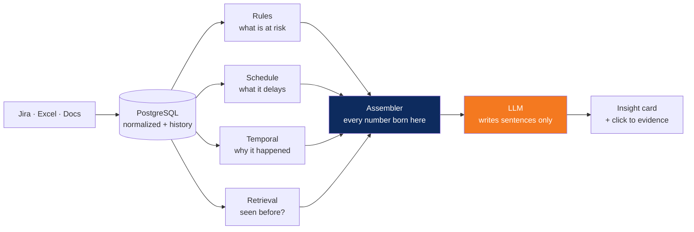
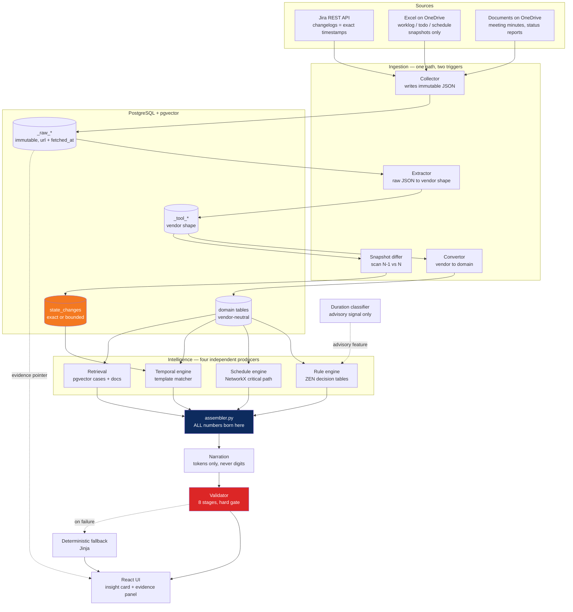

# ProjectPulseAI — System Architecture & Application Structure

> Companion to `ProjectPulseAI_Product_Design_v2.md`. That document says **what** the
> product is and **why**. This one says **how it is built**: layers, schema, contracts,
> repository structure, and the build sequence to the PiMSathon round-1 gate.
>
> **Status:** design of record, v1. Written 2026-09-06.
> **Constraints this design is built against:** one developer, round-1 code submission
> Fri 2026-09-11 with live evaluation Sat 2026-09-12 (~30 min per team, judges *run* and
> *read* the code), round 2 ≈2 weeks later, October final judged on PM capability and
> presentation as much as on the system.

---

## 0. At a glance



Read left to right, the product is one sentence: **collect the data, compute the
finding four ways, then let a language model put it into words it is not allowed to
change.**

The two coloured boxes are the whole thesis. Everything left of **Assembler** is
deterministic — rules, graph traversal, arithmetic — and produces every number and
date in the product. The **LLM** receives those findings and writes prose around them;
it cannot introduce a figure, because figures reach it as placeholders that the server
fills in afterwards. Reverse that order and this becomes a chatbot with a database.

| The four producers | Answers | How |
|---|---|---|
| Rules | *What is at risk?* | editable decision tables, with a trace of what fired |
| Schedule | *What will it impact?* | critical-path math over the task graph |
| Temporal | *Why is it happening?* | ordered state changes, only where time permits the claim |
| Retrieval | *Has this happened before?* | similar past cases and cited documents |

---

## 1. Purpose and the one governing rule

Everything in this document is downstream of a single rule, restated from design §6:

> **Deterministic where possible, generative only for explanation.**
> Anything a rule or a graph traversal can decide, it decides.
> The model's job is to make that decision readable, not to make it.

Three corollaries drive nearly every structural decision below, and each should be
readable directly off the code:

1. **Numbers and dates are born in exactly one place** — `intelligence/assembler.py`.
   The language model never emits a digit (§10).
2. **Every displayed finding resolves to a source record** — enforced by carrying a raw-data
   pointer through every layer (§4), not by convention or by asking the model to cite.
3. **A claim the data cannot support is dropped, not hedged.** In particular, a causal
   ordering we cannot prove is removed from the output rather than shown with a caveat (§6).

If a future change violates one of these, it is a change to the product thesis, not an
implementation detail.

---

## 2. System context



**Trust boundary.** The React app is served from Cloudflare Pages; the API is reached over a
Cloudflare Tunnel to the host running Postgres and FastAPI. These are different origins, so
CORS is a day-one configuration item, not an afterthought (§15).

---

## 3. The three physical layers

Ported from Apache DevLake, which is reference-only here — we run no Go. The Python
plugin framework `pydevlake` is a closer template than the Go core and is worth reading
before writing `app/models/base.py`.

| Layer | Table naming | Content | Mutability |
|---|---|---|---|
| **Raw** | `_raw_<source>_<endpoint>` | The API response fragment or spreadsheet row exactly as received, plus `url`, `params`, `input`, `fetched_at` | **Immutable, append-only** |
| **Tool** | `_tool_<source>_<entity>` | Parsed into the vendor's own shape, natural composite PKs | Upserted |
| **Domain** | `projects`, `issues`, `milestones`, … | Vendor-neutral model, single string PK | Upserted |

Reference implementations:

- `devlake/backend/helpers/pluginhelper/api/api_rawdata.go:30-38` — the raw row struct.
- `devlake/backend/python/pydevlake/pydevlake/model.py:102-108` — the same thing in Python
  (`RawModel`: `id, params, data, url, input, created_at`), which is what we copy.
- `devlake/backend/python/pydevlake/pydevlake/model.py:111-127` — `RawDataOrigin` with
  `set_raw_origin()` / `set_tool_origin()`, the exact provenance-propagation methods we need.

**Why three layers and not two.** Re-normalising after a schema change must not require
re-fetching from Jira, and — more important for this product — the evidence panel shows the
*original record*, which only exists if something kept it. Skipping the tool layer is
tempting for speed but it is the layer that makes an Excel column rename survivable; keep
all three, they are cheap.

**Rule: fake the collector, never the raw table.** The round-1 demo uses a `jira_replay`
collector that writes pre-generated Jira-shaped JSON straight into `_raw_jira_issues`.
Everything downstream is the identical code path that a live connection would use. This is
an honest boundary and it is defensible under questioning; seeding domain rows directly
would not be.

---

## 4. Identity, audit columns, and the evidence pointer

### Deterministic string primary keys

Every domain row's PK is a pure function of its origin:

```
"<source>:<Entity>:<connection_id>:<pk0>[:<pk1>…]"
```

e.g. `jira:Issue:1:10023`, `excel:Task:2:WBS-114`, `jira:Milestone:1:8`.

Port of `devlake/backend/core/models/domainlayer/didgen/domain_id_generator.go:52`, and of
`pydevlake/model.py:148` (`ToolModel.domain_id()`).

This buys three things at once, which is why it is worth the ugliness:

- **Idempotent re-runs** — the same source record always regenerates the same id, so every
  write is an upsert and pressing "Update now" twice is a no-op. This will be demonstrated live.
- **Collision-free multi-source** — a Jira issue and an Excel task never fight over a key.
- **Evidence resolution without a join table** — the id names its own source system.

### The six audit columns

Every tool and domain table carries these via a mixin
(`pydevlake/model.py:111-140` is the template):

| Column | Meaning |
|---|---|
| `created_at` | first insert |
| `updated_at` | last upsert — the incremental-conversion watermark |
| `_raw_data_table` | which raw table this derives from, e.g. `_raw_jira_issues` |
| `_raw_data_params` | the scope slice, e.g. `{"connection_id":1,"board_id":8}` — **indexed**; the delete key for a full refresh |
| `_raw_data_id` | FK-by-convention to `_raw_*.id` — **the evidence pointer** |
| `_raw_data_remark` | debugging breadcrumb (row index, sheet name) |

`_raw_data_id` is copied unchanged raw → tool → domain. The convertor must **not** re-derive it.

### The evidence panel query

This is the click-through that makes the product credible, and it is one join:

```sql
SELECT r.url, r.data, r.created_at AS fetched_at, r.params
FROM   issues i
JOIN   _raw_jira_issues r ON r.id = i._raw_data_id
WHERE  i.id = 'jira:Issue:1:10023';
```

Because `_raw_data_table` is stored per row, `api/routers/evidence.py` dispatches on it
generically rather than hardcoding one source.

**Known limitation, stated deliberately:** provenance is at *record* granularity, not field
granularity — one `_raw_data_id` per row. If the evidence panel later needs "which API call
produced this specific field", that needs per-field evidence rows. DevLake does not do this
either. Out of scope for round 1; note it rather than discover it later.

---

## 5. Data model

### 5.1 Entities we inherit from DevLake's domain layer

Shape ported (not the code) from `devlake/backend/core/models/domainlayer/ticket/`:
`issues`, `issue_changelogs`, `issue_comments`, `issue_labels`, `issue_assignees`,
`issue_relationships`, `boards`, `sprints`, `worklogs`, `accounts`, `users`.

Two conventions from there worth keeping verbatim:

- **`X` + `original_X` pairs** on every enum-mapped field (`status` / `original_status`).
  Never discard the vendor's raw value — the evidence panel shows the original, the rules
  read the normalized one.
- **Changelogs are one row per (event, field)**, with an id/label pair on each side
  (`from_value` / `original_from_value`).

### 5.2 Entities that are ours to build

DevLake has no equivalent of these. They are the delivery-management half of the model and
they are where the product lives:

```sql
CREATE TABLE programs (
    id              varchar(255) PRIMARY KEY,
    name            text NOT NULL,
    owner           text,
    status          varchar(50),
    start_date      date,
    end_date        date,
    description     text
    -- + 6 audit columns
);

CREATE TABLE projects (
    id              varchar(255) PRIMARY KEY,
    program_id      varchar(255) REFERENCES programs(id),
    name            text NOT NULL,
    project_manager text,
    phase           varchar(50),
    status          varchar(50),
    health_score    numeric(5,2),
    last_updated    timestamptz
);

CREATE TABLE milestones (
    id              varchar(255) PRIMARY KEY,
    project_id      varchar(255) REFERENCES projects(id),
    name            text NOT NULL,
    planned_date    date,
    baseline_date   date,          -- for schedule variance
    actual_date     date,
    status          varchar(50)
);

CREATE TABLE tasks (
    id              varchar(255) PRIMARY KEY,
    project_id      varchar(255) REFERENCES projects(id),
    milestone_id    varchar(255) REFERENCES milestones(id),
    title           text,
    status          varchar(50),
    original_status varchar(100),
    assignee        text,
    start_date      date,
    due_date        date,
    baseline_end    date,
    progress        numeric(5,2),
    duration_days   numeric(6,2)
);

-- The DAG the schedule engine traverses. See §5.4 — nothing populates this today.
CREATE TABLE dependencies (
    id              varchar(255) PRIMARY KEY,
    project_id      varchar(255) REFERENCES projects(id),
    predecessor_id  varchar(255) NOT NULL,
    successor_id    varchar(255) NOT NULL,
    dep_type        varchar(20) DEFAULT 'FS',   -- FS | SS | FF | SF
    lag_days        integer DEFAULT 0,
    source          varchar(50),                -- 'excel_predecessor' | 'jira_issuelink' | 'wbs_implicit'
    UNIQUE (predecessor_id, successor_id)
);

CREATE TABLE risks (
    id              varchar(255) PRIMARY KEY,
    project_id      varchar(255) REFERENCES projects(id),
    title           text, category varchar(50),
    severity        varchar(20), probability varchar(20), impact varchar(20),
    status          varchar(20), source varchar(50),
    detected_at     timestamptz,
    is_ai_detected  boolean DEFAULT false
);

CREATE TABLE resources (
    id                 varchar(255) PRIMARY KEY,
    project_id         varchar(255) REFERENCES projects(id),
    resource_name      text, role text,
    allocation_percent numeric(5,2),
    availability       numeric(5,2),
    period_start       date, period_end date
);

CREATE TABLE qa_items (
    id          varchar(255) PRIMARY KEY,
    project_id  varchar(255) REFERENCES projects(id),
    test_case   text, status varchar(50), priority varchar(20),
    blocked_by  varchar(255), aging_days integer
);

CREATE TABLE action_items (
    id          varchar(255) PRIMARY KEY,
    project_id  varchar(255) REFERENCES projects(id),
    insight_id  varchar(255),
    title       text, owner text, due_date date,
    priority    varchar(20), status varchar(20)
);

CREATE TABLE historical_cases (
    id           varchar(255) PRIMARY KEY,
    project_type varchar(50), issue_type varchar(50),
    root_cause   text, actions_taken text, outcome text,
    tags         text[],
    embedding    vector(768)
);
```

### 5.3 Analysis and operational tables

```sql
CREATE TABLE insights (
    id            varchar(255) PRIMARY KEY,
    project_id    varchar(255) REFERENCES projects(id),
    risk_type     varchar(50), severity varchar(20),
    as_of         timestamptz NOT NULL,
    bundle        jsonb NOT NULL,     -- the frozen InsightBundle
    narration     jsonb,              -- validated model output, tokens substituted
    narration_src varchar(20),        -- 'llm' | 'fallback'
    confidence    varchar(10),        -- HIGH | MEDIUM | LOW
    created_at    timestamptz DEFAULT now()
);

CREATE TABLE insight_evidence (
    insight_id     varchar(255) REFERENCES insights(id),
    evidence_ref   varchar(64),       -- 'ev_1' as used inside the bundle
    entity_table   varchar(64),
    entity_id      varchar(255),
    raw_data_table varchar(255),
    raw_data_id    bigint,
    PRIMARY KEY (insight_id, evidence_ref)
);

CREATE TABLE rule_traces (
    id          varchar(255) PRIMARY KEY,
    insight_id  varchar(255) REFERENCES insights(id),
    table_name  varchar(100),         -- which decision table
    table_hash  varchar(64),          -- so a trace is replayable against the exact rules
    context     jsonb,                -- the flat RuleContext fed to ZEN
    trace       jsonb,                -- ZEN's node-by-node trace
    fired       jsonb                 -- [{rule_id, condition, output}]
);

CREATE TABLE insight_feedback (
    id         bigserial PRIMARY KEY,
    insight_id varchar(255) REFERENCES insights(id),
    verdict    varchar(20),           -- accepted | rejected | edited
    edited     jsonb, note text,
    created_at timestamptz DEFAULT now()
);

CREATE TABLE project_health_snapshot (
    project_id   varchar(255) REFERENCES projects(id),
    as_of        date,
    health_score numeric(5,2),
    schedule     numeric(5,2), quality numeric(5,2),
    resource     numeric(5,2), risk numeric(5,2),
    PRIMARY KEY (project_id, as_of)
);

-- Per-(task, scope) watermark. Port of devlake/backend/core/models/subtask_state.go
CREATE TABLE sync_state (
    task            varchar(100),
    scope           varchar(255),      -- json params identifying the slice
    prev_started_at timestamptz,
    prev_config     text,              -- hash; a change forces a full sync
    last_success_at timestamptz,
    PRIMARY KEY (task, scope)
);

CREATE TABLE sync_runs (
    id           bigserial PRIMARY KEY,
    source       varchar(50),
    trigger      varchar(20),          -- 'scheduled' | 'manual'  <- the ONLY difference
    started_at   timestamptz, finished_at timestamptz,
    status       varchar(20),          -- running | success | failed
    rows_ok      integer, rows_rejected integer,
    error        text
);

CREATE TABLE sheet_scans (
    id         bigserial PRIMARY KEY,
    source     varchar(50),
    file_path  text, sheet_name text,
    sha256     varchar(64),
    scanned_at timestamptz NOT NULL,
    row_count  integer
);

CREATE TABLE raw_rejects (
    id         bigserial PRIMARY KEY,
    sync_run_id bigint REFERENCES sync_runs(id),
    file_path  text, sheet_name text, row_index integer,
    raw_row    jsonb, reason text
);
```

`raw_rejects` is not bookkeeping — it is a product feature. A PM must see
*"12 rows in Team A's worklog did not parse"* rather than silently receive a health score
computed on 60% of the data.

### 5.4 The dependency-edge gap — decide this on day 1

**No source we have today contains dependency edges.** Verified:

- `Layout/fpt-pm-project-schedule.html` `ACTIVITIES[]` — `{name, phase, start, baseline, planned, done, playing}`, no `deps`.
- `Layout/fpt-pm-schedule.html` `PROJECTS[].milestones` — a name→`{status,date}` map, no edges.
- GPT2SP CSVs — `issuekey,title,description,storypoint,split_mark` only.
- Jira `issuelinks` exists but is sparsely populated in most enterprise projects.

Critical-path math needs a DAG. Without one, "impact analysis" collapses to *"this task is
late, therefore its milestone is late"* — true, but thin, and it hollows out one of the four
product pillars. Resolution, in priority order:

1. **Add a `Predecessor` column to the Excel schedule template.** We own that template; this
   is the cheapest real fix and it is available immediately.
2. **Derive implicit finish-to-start edges from WBS sequence** where the template has no
   predecessor — the project-schedule mockup already encodes this (each activity's `start`
   equals the previous activity's baseline end). Mark these `source='wbs_implicit'` so the
   evidence panel can be honest about where the edge came from.
3. **Ingest Jira `issuelinks`** where present — a bonus, never the primary source.

---

## 6. `state_changes` and the precision model

This is the correctness core of the root-cause feature and the most defensible engineering
in the system. It exists because our two source classes carry fundamentally different time
information.

| | Jira | Excel |
|---|---|---|
| What a sync yields | a **changelog** — each transition with its own timestamp | a **snapshot** — only what is true now |
| `state_changes` come from | collection (free) | **diffing scan N against scan N-1** |
| Timing | exact | *"sometime since the last scan"* — an interval |

```sql
CREATE TABLE state_changes (
    id                  varchar(255) PRIMARY KEY,
    entity_type         varchar(50)  NOT NULL,   -- task | milestone | qa_item | resource | risk
    entity_id           varchar(255) NOT NULL,
    field               varchar(100) NOT NULL,
    old_value           text,
    new_value           text,

    -- Bi-temporality. Read the CHECKs before touching these.
    occurred_at         timestamptz NOT NULL,    -- UPPER bound of when it happened
    occurred_at_lower   timestamptz NOT NULL,    -- LOWER bound
    precision           varchar(10) NOT NULL,    -- 'exact' | 'bounded'
    ingested_at         timestamptz NOT NULL DEFAULT now(),

    scan_id             bigint REFERENCES sheet_scans(id),
    identity_confidence varchar(10) DEFAULT 'high',  -- high | low  (see §7.3)
    source_ref          varchar(255),

    CONSTRAINT ck_interval CHECK (occurred_at_lower <= occurred_at),
    CONSTRAINT ck_exact    CHECK (precision <> 'exact' OR occurred_at_lower = occurred_at)
);
CREATE INDEX ix_sc_entity ON state_changes (entity_type, entity_id, occurred_at);
```

**The convention, stated once so two readings are impossible:**

- `precision='exact'` (Jira changelog) → `occurred_at_lower = occurred_at`, the real timestamp.
- `precision='bounded'` (Excel diff) → `occurred_at` is the **observing scan's** time,
  `occurred_at_lower` is the **previous scan's** time. The change happened somewhere in between.

### The ordering guard

```python
def provably_before(a: Event, b: Event) -> bool:
    """a's LATEST possible time must precede b's EARLIEST possible time."""
    return a.occurred_at < b.occurred_at_lower
```

Three points that are easy to get wrong and expensive to get wrong:

1. **It is interval arithmetic, never a `scan_id` comparison.** Sync windows deliberately
   overlap (§7.2), so two bounded events from *different* scans can still have overlapping
   intervals. Comparing scan ids would wrongly admit them.
2. **`precision='exact'` gets no special case.** A Jira event at 14:00 on day 2 and an Excel
   event bounded across days 1–3 are *not* orderable. The formula above already handles this
   correctly; an "optimisation" that short-circuits on exact events reintroduces the bug.
3. **Unprovable links are dropped, not downgraded.** `chains.py` emits
   `ordering_basis ∈ {'exact', 'bounded_disjoint'}` and discards anything else *before* the
   bundle is assembled. The model never sees an unprovable link, because if it sees one it
   will narrate it.

Property test (`tests/test_ordering.py`, Hypothesis): for any two events sharing a `scan_id`,
`provably_before` returns `False` in **both** directions.

**Why this matters commercially, not just technically.** Design §4.3's entire claim is about
ordering — *"the environment delay preceded the QA backlog growth."* A system that asserts
that ordering from two spreadsheet snapshots taken at the same moment is guessing. Saying
"we only claim causality where the timestamps permit it" is the single strongest answer
available to a judge asking how this differs from an LLM wrapper.

---

## 7. Ingestion

### 7.1 One path, two triggers

```python
def run_sync(source_id: str, trigger: Literal['scheduled', 'manual']) -> int:
    """Returns sync_run id. Identical work regardless of trigger."""
```

The scheduled 2-hourly job and the "Update now" button call the *same function*. `trigger`
is written to `sync_runs` and changes nothing else. Two code paths would drift, and drift
breaks the idempotency guarantee that design §13.1 requires.

**Concurrency.** A Postgres advisory lock per source:

```python
locked = session.execute(
    text("SELECT pg_try_advisory_lock(hashtext(:s))"), {"s": source_id}
).scalar()
if not locked:
    return existing_running_run_id(source_id)   # join it, do not start a second
```

The button then reports *"sync already running"* rather than launching a second writer
against the same rows.

**Long syncs and the tunnel.** `POST /sync/run` returns **202 + `job_id`** immediately and the
client polls `GET /sync/status/{job_id}`. A full sync will exceed the Cloudflare proxy
timeout, and a button that appears broken during a live demo is an avoidable loss.

### 7.2 Incremental watermarks

Ported from `devlake/backend/core/models/subtask_state.go` and its manager:

- State is keyed `(task, scope)`, so board 8 and board 9 advance independently.
- A **full sync** is forced when: the user asks, the task has never run, or `prev_config`
  changed. Config is hashed — a threshold or column-map change must not be applied to a
  partial dataset.
- `since = prev_started_at` (the *start* of the last successful run, not its end). The window
  deliberately overlaps; upserts absorb the duplicates.
- **The watermark advances only on success.** Any exception aborts before the commit, so the
  next run re-processes the same window. At-least-once plus idempotent writes is the whole
  safety argument.

### 7.3 Excel — the risk is identity, not diffing

Diffing two dataframes is an afternoon. The real hazard: hand-maintained sheets have no
stable key. Rows get reordered, inserted and renamed, and **a renamed task looks like
delete + insert, which manufactures a false state change, which can manufacture a false
causal chain.** That single bug would discredit the entire root-cause feature.

Mitigations, in order:

1. **Require a `Task ID` column** in the template we control. A sheet without it is rejected
   with a *visible* sync error — never silently fallback-matched.
2. **Fallback fuzzy matcher writes `identity_confidence='low'`**, and `chains.py` excludes
   low-confidence changes from causal chains entirely. They still appear on the timeline;
   they never become a causal link.
3. **Per-sheet sha256** in `sheet_scans`; unchanged sheets skip parsing. This is what makes
   2-hourly polling free, and most scans will find nothing changed.
4. **Pinned `column_map` per scope config**; unknown headers fail loudly. Header drift with
   hand-maintained files is a certainty, not a risk.
5. **Parse by header name, never column index.** Include a `_schema_version` cell.

### 7.4 OneDrive access

```
FileSource (ABC)
├── LocalFolderSource   # OneDrive sync client on the host; read the folder
└── GraphDriveSource    # MS Graph /drives/{id}/root/delta
```

Graph's **delta endpoint** returns only what changed since the last token — exactly the
2-hourly poll done cheaply — and gives stable item ids so renames don't create duplicates.
The risk is that registering an Azure AD app in the FPT tenant needs **admin consent**, which
can outlast the competition. `LocalFolderSource` needs zero auth, works immediately, and
uses content-hash + path as identity. Build both behind the interface; demo whichever clears.

---

## 8. Intelligence layer

Four producers, each independently inspectable, each emitting structured findings — never prose.

### 8.1 Rule engine (GoRules ZEN)

**`intelligence/rules/engine.py` is the only module in the codebase that imports `zen`.**
That is deliberate: if the wheel spike fails, the fallback is ~150 lines implementing our own
JSON condition schema emitting the same trace shape — a file swap, not a rewrite.
*Timebox the spike to 2 hours on day 1:* install `zen-engine`, evaluate one table, dump a
trace, confirm it carries node ids, inputs and outputs.

**Shape mismatch to plan around.** ZEN decision tables evaluate **one flat record**. Several
of our rules are aggregates (*"QA backlog grew 40% in 14 days"*). All aggregation happens in
`intelligence/context.py`, which produces a flat `RuleContext` of ~30 scalars; ZEN decides
only on scalars. Fighting ZEN to aggregate costs a day and yields nothing.

Decision tables live in `intelligence/rules/tables/*.json` — `schedule_risk`, `qa_risk`,
`resource_risk`, `dependency_risk` — and are editable without a deploy, which is design §19's
mitigation for the opaque-health-score risk.

### 8.2 Schedule engine

`schedule/graph.py` builds a NetworkX `DiGraph` from `tasks` + `dependencies` + `milestones`;
`critical_path.py` runs the forward/backward pass for total float; `impact.py` emits
`delay_days`, `affected_milestones`, `critical_path_tasks`.

**Every date and day-count in the product originates here or in §8.3 — never in §9.**

### 8.3 Temporal engine — a template matcher, not a causal discoverer

The failure mode is not difficulty, it is scope creep into general causal discovery, which
cannot be finished in five days and cannot be defended in thirty minutes.

`temporal/templates.py` declares ~6 named hypotheses, each
`(cause_selector, effect_selector, min_lag_hours, max_lag_days)`:

| Template | Cause | Effect |
|---|---|---|
| `env_delay_blocks_qa` | environment/infra milestone slip | blocked QA count growth |
| `dependency_slip_hits_milestone` | predecessor task slip | successor milestone at risk |
| `capacity_drop_slows_velocity` | allocation drop | throughput decline |
| `scope_add_drifts_delivery` | task count growth after baseline | scope drift |
| `blocker_aging_grows_backlog` | blocker aging past threshold | test backlog growth |
| `defect_spike_delays_uat` | defect count spike | UAT milestone slip |

`chains.py` finds event pairs matching a template, verifies ordering with §6's guard, and
emits the chain with its `ordering_basis`. Two days of work, and far more defensible than a
general engine: *"we assert only the causal patterns a PM told us to look for, and only where
the timestamps permit the claim."*

### 8.4 Retrieval

pgvector cosine over `historical_cases.embedding` and document chunks. If it slips, **do not
fake it with hardcoded "3 similar cases"** — drop `precedent` from the confidence computation
and render the band as coverage × freshness with precedent shown as *"no precedent data yet."*
An honestly two-input band is stronger than a third input a judge discovers is a constant.
Thirty hand-authored `historical_cases` rows is half a day and is genuinely real.

### 8.5 The ML signal — advisory only

`intelligence/signals/duration_classifier.py` loads
`omaradly/jira-task-duration-classifier` — a ~950 KB scikit-learn TF-IDF + LogisticRegression
joblib (MIT), predicting three ordinal buckets (≤3d / 3–15d / >15d) at 0.80 accuracy
(long-running F1 0.74). It loads in-process; no model server, no GPU, no torch.

It returns `{bucket, ordinal, model_version}` — **never a probability, never a day count.**

**Three known distortions**, all planned around rather than hidden:

1. Trained on Apache public Jira, so its features include `votes_votes` /
   `watches_watch_count` / `project_category_name`, which enterprise Jira and Redmine do not
   have. Those arrive as zeros — a silent distribution shift, not an error.
2. Trained on an artificially balanced set (33,857 per class), so the class priors are wrong
   for a real portfolio. Usable for *ranking*, not as a percentage shown to a PM.
3. `created_year` / `created_month` are input features and 2026 is outside the training range.
   Verify this early; it skews every prediction quietly.

**Structural barrier, enforced not merely agreed:** `intelligence/schedule/` must not import
`signals/`. `tests/test_import_boundaries.py` asserts it. Its only legitimate use is as a
boolean feature inside a rule — `predicted_bucket == 'long' AND remaining_days < 5` → estimate
risk — with the trace displaying *"ML signal (advisory; 0.80 acc; uncalibrated; trained on
balanced Apache-Jira data)."* If a single delay-day ever traces back to it, the "the model
never produces a number" claim collapses.

The mitigation for all three distortions is the same, and it is design §18.4's argument
rather than a violation of it: **refitting TF-IDF + LogisticRegression on a client's own Jira
takes minutes on a CPU.** The thing §18.4 warns about — a model that will not transfer
between organisations — is cheap to retrain here.

### 8.6 Confidence

`coverage × freshness × precedent → HIGH | MEDIUM | LOW`, with all three inputs shown on hover.

- **coverage** — rules fired ÷ rules evaluated (from the trace)
- **freshness** — hours since the oldest contributing source's last success, read from `sync_state`
- **precedent** — count and top similarity of matched historical cases

A band, never a percentage. Design §10 already establishes why: a model-produced number is
uncalibrated and PMs anchor on it hard.

---

## 9. The `InsightBundle` contract

**Freeze this on day 1**, as a Pydantic model in `app/api/schemas/insight.py` with a
hand-authored fixture at `tests/fixtures/bundle_env_delay.json`. Even working solo this is
the highest-leverage half hour in the plan: it lets the React screen and the narration layer
be finished and tested before a single real row exists, and it turns a five-day serial build
into something with slack in it.

```json
{
  "insight_id": "ins_01J7X...",
  "project": {"id": "jira:Board:1:HRMS", "name": "HRMS Portal V2", "phase": "Development"},
  "as_of": "2026-09-06T08:00:00Z",
  "finding": {"risk_type": "SCHEDULE", "severity": "HIGH"},

  "rules_fired": [
    {"rule_id": "schedule.milestone_slip", "table": "schedule_risk.json",
     "condition": "days_late > 10",
     "inputs": {"days_late": 12, "milestone": "Environment Setup"},
     "output": {"severity": "HIGH"},
     "evidence_ids": ["ev_1", "ev_2"]}
  ],

  "causal_chain": [
    {"step": 1, "event_id": "sc_881",
     "label": "Environment Setup milestone moved 2026-03-04 to 2026-03-16",
     "occurred_at": "2026-03-04T09:12:00Z", "occurred_at_lower": "2026-03-04T09:12:00Z",
     "precision": "exact", "ordering_basis": "exact", "evidence_ids": ["ev_1"]},
    {"step": 2, "event_id": "sc_902",
     "label": "QA blocked test count rose 4 to 17",
     "occurred_at": "2026-03-18T00:00:00Z", "occurred_at_lower": "2026-03-16T00:00:00Z",
     "precision": "bounded", "ordering_basis": "bounded_disjoint", "evidence_ids": ["ev_3"]}
  ],

  "computed_impact": {
    "delay_days": 12,
    "affected_milestones": [
      {"name": "UAT", "planned_date": "2026-05-14", "projected_date": "2026-05-26"}
    ],
    "critical_path_tasks": ["excel:Task:2:WBS-114", "excel:Task:2:WBS-118"],
    "blocked_task_count": 17
  },

  "precedent": [
    {"case_id": "hc_12", "title": "UAT env unavailable, Q3 2025",
     "similarity": 0.81, "actions_taken": ["escalated infra owner", "added QA capacity"],
     "outcome": "recovered 8 of 14 days"}
  ],

  "confidence": {
    "band": "HIGH",
    "coverage":  {"rules_fired": 4, "rules_evaluated": 5},
    "freshness": {"oldest_source": "excel_worklog", "hours_since_sync": 6},
    "precedent": {"matches": 3, "top_similarity": 0.81}
  },

  "allowed_numbers":  [12, 17, 4, 5, 3],
  "allowed_dates":    ["2026-03-04", "2026-03-16", "2026-05-14", "2026-05-26"],
  "allowed_entities": ["Environment Setup", "UAT", "HRMS Portal V2", "QA"],
  "vocabulary": {
    "delay_days":     "{{delay_days}}",
    "uat_projected":  "{{affected_milestones.0.projected_date}}",
    "blocked_tasks":  "{{blocked_task_count}}"
  }
}
```

**Invariant:** `intelligence/assembler.py` is the single place numbers are born, and
`narration/` never touches the database.

---

## 10. Narration contract

### Input

The bundle above, and nothing else. It **never** receives raw Jira JSON, raw Excel rows, free
text beyond `label`, un-fired rules, any numeric without a `vocabulary` token, or — critically
— any causal link with an unprovable ordering. Send one and the model will narrate it.

### Output — strict JSON, one object

```json
{
  "headline": "<=90 chars",
  "root_cause": "2-4 sentences",
  "impact_summary": "2-3 sentences",
  "qualitative_impacts": [
    {"dimension": "quality|cost|stakeholder_confidence", "statement": "...", "label": "judgement"}
  ],
  "recommended_actions": [
    {"rank": 1, "action": "...", "owner_role": "...", "rationale_ref": "schedule.milestone_slip"}
  ],
  "uncertainty_note": "string|null"
}
```

### Prohibitions — enforced, not requested

1. **No literal digits in prose.** Numbers appear only as `{{token}}` from `vocabulary`; the
   server substitutes *after* validation. This is the highest-leverage rule in the design: it
   makes a wrong number **structurally impossible** rather than merely detectable.
2. **No dates in any form** — ISO, month names, "mid-May", "next quarter", "Q2".
3. **No entity names** outside `allowed_entities`.
4. **No causal claim** between events that are not an adjacent pair in `causal_chain`.
5. **No probability or confidence language** — confidence is the computed band.
6. **No claim of writing to a source system** ("I've updated the Jira ticket").
7. **No adding a step** to the chain.

### Validator — `narration/validator.py`, a hard gate before display

| Stage | Check | On fail |
|---|---|---|
| `v1_schema` | parses against the Pydantic model | reject |
| `v2_no_digits` | `re.search(r'\d', prose)` after stripping `{{…}}` | reject |
| `v3_no_dates` | ISO / month-name / `Q[1-4]` / relative-time regex | reject |
| `v4_tokens` | every `{{token}}` exists in `vocabulary` | reject |
| `v5_entities` | capitalised multiword spans ∉ `allowed_entities` ∪ stopword allowlist | reject |
| `v6_causal_edges` | causal connectives ("because", "led to", "caused by", "as a result of") join only adjacent chain pairs | reject |
| `v7_refs` | every `rationale_ref` resolves to a real `rule_id` / `event_id` | reject |
| `v8_substitute` | substitute tokens, then **re-run v3 on the substituted text** | reject |

On failure: one repair retry with the violation list appended. On second failure, render
`narration/fallback.py` — a Jinja template over the same bundle producing flat, plain,
correct prose. Log the bundle and the rejected output either way.

**Build `fallback.py` before `client.py`.** It is the safety net, it is the offline
insurance if the venue network dies mid-demo, and it makes the LLM an enhancement rather
than a dependency. That is a real consideration on a competition day, not a theoretical one.

**Second guard, at the display layer:** the React insight card renders numbers from
`computed_impact` into their own components, never by parsing the narrated string. A
validator bug still cannot put a fabricated number into a number slot.

---

## 11. Frontend architecture

**Vite + React + TypeScript.** Scoped honestly for a solo build: a React port of all six
mockups is ~2–3 weeks (they are ~3,500 lines of ES5 across two independently-authored code
lineages) and cannot coexist with building the backend in five days.

**Round 1 ships one real route** — the insight/evidence screen. It is the only screen the
judges have not already seen in the pitch deck, and the only one that demonstrates the
thesis. The other five mockups are served as static HTML alongside and are ported in round 2.

### Token reconciliation — step zero

The mockups contain **two conflicting design systems** and a merge without this step
breaks pages:

| Token | Family A (`home`, `programs`, `dashboard`) | Family B (`risk`, `schedule`, `project-schedule`) |
|---|---|---|
| `--text` | `#1A2B42` | `#1A1F36` |
| `--muted` | `#64748B` | `#6B7280` |
| `--light` | `#94A3B8` | `#9CA3AF` |
| `--border` | `#E3E8EF` | `#E5E7EB` |
| `--bg` | `#F5F7FA` | `#F8F9FB` / `#F3F5F7` |
| `--red` | `#DC2626` | `#DC2626` / `#EF4444` |
| `--amber` | `#D97706` | `#F59E0B` / `#D97706` |

Family A is Tailwind **slate**, Family B is **gray**. Constant across all six and therefore
safe: `--navy:#0D2B5E`, `--blue:#1565C0`, `--orange:#F47920`, `--green:#16A34A`, Inter at 14px.

There are also **selector collisions with different meanings** — `.mode-toggle`, `.toolbar`,
`.tb-btn`, `.section-head`, `.field-row`, `.toggle`, `.table-footer`, `.modal` — and
`fpt-pm-dashboard.html:186` references `var(--red)` which that file never declares, so the
rule silently no-ops. CSS Modules per component avoids the collisions structurally.

### Structure

```
frontend/
├── index.html
├── vite.config.ts                 proxy /api -> tunnel origin in dev
├── src/
│   ├── main.tsx                   router
│   ├── styles/
│   │   ├── tokens.css             the reconciled :root — single source of colour truth
│   │   └── globals.css            reset, Inter, scrollbar rules
│   ├── api/
│   │   ├── client.ts              fetch wrapper, base URL from import.meta.env
│   │   └── types.ts               generated from the FastAPI OpenAPI schema
│   ├── components/
│   │   ├── AppShell.tsx           sidebar variant (iconOnly | withLabels) + topbar (search | breadcrumb) as props
│   │   ├── Pill.tsx               replaces SIX independent pill implementations
│   │   ├── DataTable.tsx  Drawer.tsx  Modal.tsx  ContextMenu.tsx
│   │   ├── Toolbar.tsx    Tabs.tsx    SegmentedToggle.tsx  Toggle.tsx
│   │   └── Toast.tsx      EmptyState.tsx  Field.tsx
│   └── features/insight/
│       ├── InsightPage.tsx        the round-1 route
│       ├── InsightCard.tsx        headline, severity, confidence band
│       ├── CausalChain.tsx        ordered steps; renders precision as a visible property
│       ├── ComputedImpact.tsx     delay days + affected milestones, from computed_impact ONLY
│       ├── RecommendedActions.tsx
│       ├── EvidencePanel.tsx      click a step -> raw JSON + url + fetched_at
│       ├── RuleTrace.tsx          which rules fired on which records
│       └── ConfidenceBand.tsx     band + the three inputs on hover
└── public/legacy/                 the 5 un-ported mockups, served as-is
```

**Design note for `CausalChain.tsx`:** render `precision` and `ordering_basis` as visible UI,
not debug output. *"Environment Setup slipped (exact, from Jira changelog) → QA backlog grew
(observed between Mar 16 and Mar 18, from worklog snapshot)"* is the most differentiating
sentence the product can put on screen, and it is a competitive advantage rather than a
disclaimer.

The mockups are desktop-fixed-width with **no media queries at all**. Round 1 matches that;
responsive is a round-2 decision.

---

## 12. Repository structure

```
projectpulse/
├── docker-compose.yml             postgres+pgvector, api, frontend — the judged artifact
├── Dockerfile
├── pyproject.toml
├── alembic.ini
├── alembic/versions/              migrations; the DDL frozen day 1
├── app/
│   ├── main.py                    FastAPI factory, routers, CORS for the Pages origin
│   ├── config.py                  pydantic-settings: DB URL, LLM key, source creds, poll interval
│   ├── db.py                      engine, session dependency, pgvector registration
│   ├── ids.py                     domain_id(source, entity, connection_id, *pks) — the didgen port
│   ├── api/
│   │   ├── routers/
│   │   │   ├── projects.py        GET /projects, /projects/{id}/health
│   │   │   ├── insights.py        GET /projects/{id}/insights, GET /insights/{id}
│   │   │   ├── evidence.py        GET /evidence/{ref} -> raw JSON + url + fetched_at
│   │   │   ├── rules.py           GET/PUT decision tables, GET /traces/{id}
│   │   │   ├── sync.py            POST /sync/run (202 + job_id), GET /sync/status/{id}
│   │   │   └── feedback.py        POST /insights/{id}/feedback
│   │   └── schemas/
│   │       ├── insight.py         InsightBundle & friends — FROZEN DAY 1
│   │       └── evidence.py
│   ├── models/
│   │   ├── base.py                Base + RawDataOrigin mixin (the six audit columns)
│   │   ├── raw.py                 _raw_* table factory
│   │   ├── tool/                  jira.py  excel.py  onedrive.py
│   │   ├── domain/                program.py project.py milestone.py task.py dependency.py
│   │   │                          issue.py risk.py resource.py qa_item.py action_item.py
│   │   │                          state_change.py historical_case.py document.py
│   │   ├── analysis/              insight.py rule_trace.py health_snapshot.py feedback.py
│   │   └── sync_state.py
│   ├── ingest/
│   │   ├── runner.py              run_sync(); advisory lock; watermark advanced ONLY on success
│   │   ├── scheduler.py           APScheduler 2h -> run_sync(trigger='scheduled')
│   │   ├── base.py                Collector / Extractor / Convertor ABCs
│   │   └── sources/
│   │       ├── jira/              collector.py extractor.py convertor.py replay.py
│   │       ├── excel/             reader.py  snapshot_diff.py  identity.py     ** HIGH RISK **
│   │       └── onedrive/          client.py  local.py  graph.py  documents.py
│   ├── intelligence/
│   │   ├── context.py             build_rule_context() -> ~30 flat scalars
│   │   ├── rules/                 engine.py (ONLY zen importer)  trace.py  tables/*.json
│   │   ├── schedule/              graph.py  critical_path.py  impact.py
│   │   ├── temporal/              events.py  ordering.py  templates.py  chains.py  ** HIGH RISK **
│   │   ├── retrieval/             embeddings.py  cases.py  documents.py
│   │   ├── signals/               duration_classifier.py   (advisory only)
│   │   ├── confidence.py
│   │   └── assembler.py           ALL numbers born here
│   └── narration/
│       ├── prompt.py              system prompt + bundle serialiser
│       ├── client.py              LLM call, structured output
│       ├── validator.py           the 8 stages                     ** HARD GATE **
│       └── fallback.py            Jinja renderer — BUILD THIS FIRST
├── models/                        duration_logistic_regression_classifier.joblib
├── scripts/
│   ├── gen_demo_portfolio.py      simulator -> raw-layer artifacts
│   ├── sample_gpt2sp_text.py      issue-text corpus
│   └── load_tawos.py              round 2
├── tests/
│   ├── test_ordering.py           property: same-scan bounded pairs are never ordered
│   ├── test_snapshot_diff.py      rename/reorder/insert must not manufacture changes
│   ├── test_validator.py          golden bundles + adversarial model outputs
│   ├── test_ids.py                re-run idempotency
│   └── test_import_boundaries.py  schedule/ must not import signals/
├── frontend/                      see §11
└── cloudflared/config.yml
```

---

## 13. Demo data

**Primary: a simulator. GPT2SP for issue *text* only. TAWOS in round 2.**

`scripts/gen_demo_portfolio.py` walks a virtual clock day by day over 18 months across
1 program / 4 projects (reusing the mockups' names — Example Project, SAIN, HRMS Portal V2,
Cloud Migration Wave 2 — so the existing pages stay coherent), ~250 tasks, ~40 milestones,
applying scripted perturbations: Environment Setup slips 12 days on 2026-03-04, blocked-test
count climbs, one engineer's allocation drops to 40%.

**The decisive design detail:** it emits *the artifacts a real source would emit* —
Jira-shaped changelog JSON into `_raw_jira_*`, and a series of dated `.xlsx` files consumed by
the real reader — **not** seeded domain rows. The real pipeline then runs over them. Nobody
can claim the answer is hardcoded, and the Excel differ, the sha256 skip, the identity
resolver and the bounded-precision path all get genuinely exercised.

**Why not GPT2SP as the dataset.** Its 16 CSVs (23,313 rows) are exactly
`issuekey,title,description,storypoint,split_mark` — zero timestamps, zero status, zero
assignee, zero links. It cannot produce a single `state_changes` row, therefore it cannot
drive the rule engine, the temporal engine, or the schedule engine. Two legitimate uses:
realistic issue titles and descriptions so the demo does not read "Task 1, Task 2", and input
text for the duration classifier.

**Why not TAWOS first.** Right shape — it has the changelogs — but it is a MySQL dump not yet
downloaded (half a day to a day before the first row lands), its 44 open-source projects have
no milestones, no PM, no phases and no resource allocation, and critically **no
hand-maintained Excel**, so the entire bounded-precision half of the architecture would have
nothing to ingest. Worst of all, a demo needs a *specific* narrative, and finding a project
among 509,000 issues that happens to exhibit a rule's exact firing pattern is an
unschedulable search sitting on the critical path. TAWOS lands in round 2 as a second
connection to answer *"does it work on data you didn't author"* — a credibility exercise that
belongs after the slice works.

**Licensing:** TAWOS is research-use-only and GPT2SP repackages public Jira data. Fine for
prototyping and internal demonstration. Use synthetic text for any recorded demo or
screenshot, and replace both before any commercial deployment.

---

## 14. The scenario the demo tells

One project, one insight, end to end:

> Environment Setup milestone slipped 12 days (**Jira changelog — exact timestamp**) →
> QA blocked-test count rose 4 → 17 (**Excel worklog snapshot — bounded interval**) →
> UAT projected 2026-05-14 → 2026-05-26 (**NetworkX critical path**).

Chosen deliberately: it forces one exact-precision and one bounded-precision event into the
same chain, so §6 — the most defensible engineering in the system — is *visible on screen*
rather than buried in a table. The demo click path is: insight card → causal chain → click
step 2 → evidence panel showing the actual spreadsheet row, its file, and its scan time →
rule trace showing which rule fired on which record.

---

## 15. Deployment

**Two topologies, both needed.**

**A. `docker compose up` — the judged artifact.** Judges run and read the code in ~30 minutes.
One command must bring up Postgres+pgvector, run migrations, seed the simulator, and serve
the API and UI. A README with a single command and a 60-second walkthrough is worth more
than any extra feature built on day 5.

**B. Cloudflare — the live demo.** Workers cannot host this (sklearn + a Postgres pool is not
a Workers workload). What the owned domain actually buys:

- **`cloudflared` Tunnel** — the demo runs on a laptop or VM behind FPT's NAT but is publicly
  reachable over HTTPS with no port forwarding and no firewall ticket. The highest-value use.
- **Cloudflare Pages** — the React build, on the CDN, API proxied to the tunnel.
- **Cloudflare Access** — gate it to judges' emails if any real project data is present.

**Two details that each cost an afternoon if unhandled:** Pages and the tunnel are different
origins, so CORS must be set on day 1; and `POST /sync/run` must be 202 + poll, because a full
sync will exceed the proxy timeout and the "Update now" button will look broken.

---

## 16. Build sequence (solo, to 2026-09-11)

**Day 1 — contracts and skeleton.** DDL + Alembic migration. `models/base.py` mixin.
`ids.py`. **Freeze `InsightBundle`** + the fixture. `docker-compose.yml` up and green. ZEN
spike (2h, timeboxed). **Decide the dependency-edge source** (§5.4) — the schedule engine
cannot be specified until this is settled.

**Day 2 — data in.** `gen_demo_portfolio.py` emitting raw artifacts. `jira_replay` collector +
extractor + convertor. Excel reader + `snapshot_diff.py` + `identity.py` → `state_changes`
with correct precision. `runner.py` with the lock and watermark. *Gate: `state_changes` holds
both exact and bounded rows with valid intervals.*

**Day 3 — deterministic intelligence.** `context.py` → flat scalars. `rules/engine.py` +
tables + `trace.py`. `schedule/` graph, critical path, impact. *Gate: a rule fires with a
persisted trace, and `delay_days` is computed from the graph.*

**Day 4 — causality and language.** `temporal/ordering.py` with the property test *first*.
`templates.py` + `chains.py`. `assembler.py` → a real bundle. `narration/fallback.py`, then
`validator.py`, then `client.py` — **in that order**. *Gate: a validated insight renders from
real data with the LLM switched off.*

**Day 5 — surface and submit.** Vite + React scaffold, `tokens.css`, `AppShell`,
`InsightPage` and its components against the live API. Evidence panel click-through. README +
one-command runbook. Rehearse the walkthrough twice.

**Cut order if a day slips** (decide now, not at 2am on day 5): retrieval/precedent →
the LLM (ship fallback prose) → the rule-table editor (show tables read-only) → Excel
identity fuzzy-matching (require `Task ID`). **Never cut** the evidence panel, the precision
model, or the trace — they are the product.

**Round 2 (≈2 weeks):** port the five remaining mockups to React; TAWOS as a second
connection; APScheduler; Graph API if consent clears; the GoRules JDM editor for live
threshold tuning; the feedback loop writing to `historical_cases`.

**October final:** judged on PM capability and presentation as much as the system. The
engineering work is largely done by then; the work is the narrative — why deterministic-first
is the right architecture for PM trust, and what the rejected-rule feedback loop means for
an organisation adopting it.

---

## 17. Risk register

Supersedes design §19.

| Risk | Likelihood | Mitigation |
|---|---|---|
| **Causal engine scope-creeps into general discovery** | High | Ship ~6 named templates, not an engine. Two days, bounded, and more defensible under questioning. |
| **Excel row identity churn manufactures false state changes** | High | Require `Task ID`; fuzzy matches get `identity_confidence='low'` and are excluded from causal chains; sha256 skip; pinned column map. |
| **No dependency edges exist in any source** | Certain | Add `Predecessor` to the template we own; derive WBS-implicit edges; Jira `issuelinks` as bonus. Decide day 1. |
| **ZEN wheel/aggregation shape mismatch** | Medium | 2h day-1 spike; aggregate in `context.py`; `engine.py` is the only importer, so the fallback is a file swap. |
| **Narration contradicts computed values** | Medium | Model emits tokens, never digits; 8-stage validator; server-side substitution; numbers rendered in their own components. |
| **Classifier miscalibration is taken for a real probability** | Medium | Advisory only; buckets not probabilities; import barrier tested; caveats shown in the trace. |
| **Solo build overruns the 5 days** | High | Pre-committed cut order (§16). Fallback prose before LLM. One React route, not six. |
| **Venue network fails during the demo** | Medium | `fallback.py` means the product works with the LLM off; `docker compose up` runs entirely locally. |
| **PMs distrust an opaque health score** | Medium | Trace on every score, rules visible from day one, evidence click-through on every claim. |
| **Second system of record emerges** | Low | Read-mostly. Write back only PM-confirmed actions; never overwrite the source tool. |

---

## 18. Why there is no temporal graph database here

Design v2 named **Graphiti** for the bi-temporal event graph. This architecture drops it, and
the reasoning belongs on the record because it will be asked.

Graphiti is an **LLM-driven** graph builder: it uses a model to extract entities and edges
from text and to assign the temporal validity intervals on those edges. Those intervals *are*
dates produced by a language model — which is precisely what design §4.4 forbids
(*"Never let the model produce a date"*) and what §6's governing rule exists to prevent. It
also requires operating Neo4j or FalkorDB alongside Postgres.

`state_changes` plus NetworkX already **is** a bi-temporal event graph: it is deterministic,
it is replayable, every edge traces to a source record, and it can be defended line by line.
Design §19 listed "graph ingestion LLM cost scales with portfolio size" as a risk to be
mitigated by restricting Graphiti to flagged projects; that cost is really a symptom, and the
correct mitigation is not to adopt it.

This is a strength to state out loud in the pitch, not an omission to explain away.
