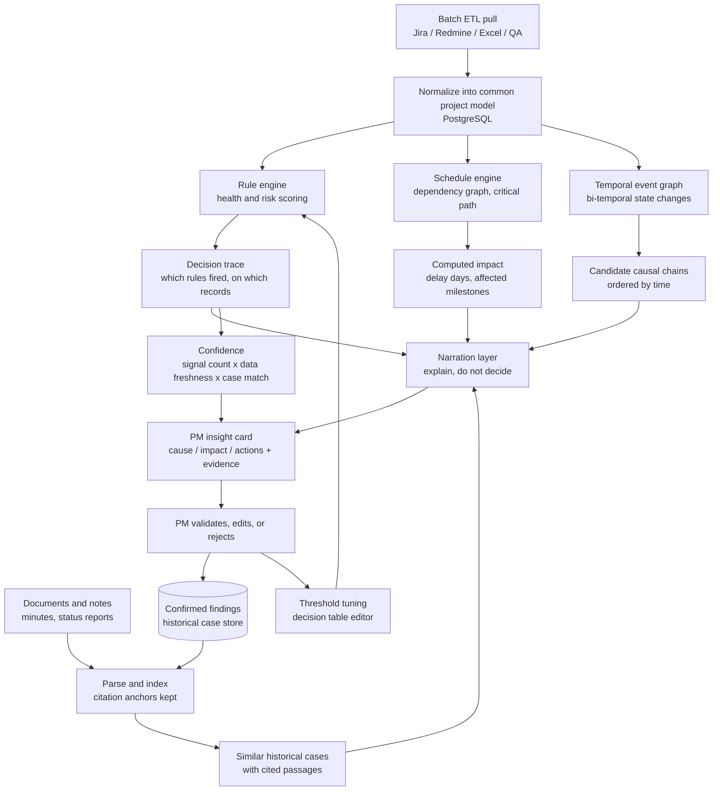

# ProjectPulseAI — Product Design Brief (v2)

> **v2 changes:** named open-source components for every commodity layer;
> separated deterministic computation from LLM narration; redefined the
> confidence score; split ingestion into batch ETL vs. agent-time access;
> added a cold-start data strategy, a build-vs-adopt table, a reference-repository
> survey, and the evidence for why no trained model appears in the architecture.
>
> **v2.1 revision (2026-09-06)** — reconciled against the implementation design.
> Graphiti dropped (it is LLM-driven and would have the model produce dates, which
> §4.4 forbids); the `StateChange` entity gained a precision model because Excel
> snapshots cannot carry exact timestamps; the raw/tool/domain layering and its
> provenance chain added to §8 and §12; the duration classifier corrected — it is a
> scikit-learn pipeline, not a transformer — and demoted to an advisory signal; demo
> data strategy revised; deployment added as §21.
>
> **Companion document:** `ProjectPulseAI_Architecture.md` holds the schema, contracts,
> repository structure and build sequence. This document remains the product narrative.

---

## 1. Product positioning

This is not a generic management dashboard.

This is an AI-powered delivery intelligence platform for project managers, project leaders, and delivery managers.

The product helps teams answer four key questions:
- What is at risk?
- Why is it happening?
- What will it impact?
- What should we do next?

The goal is to move from reactive reporting to proactive decision-making.

---

## 2. Problem statement

Project data is fragmented across many systems:
- Jira / Redmine
- Excel / status reports
- risk logs
- QA and defect data
- schedule and WBS data
- resource plans
- meeting notes and emails
- Git / release and deployment signals

PMs must manually read and connect these signals to understand:
- whether a project is healthy
- what is behind schedule slippage
- what risks are increasing
- what issues deserve attention today
- what similar situations happened before
- what the next best action is

Current tools mostly show data; they do not explain cause, impact, and next action.

---

## 3. Core user groups

### Primary users
- Project Manager (PM)
- Project Leader (PL)
- Delivery Manager (DM)

### Secondary users
- Program managers
- Portfolio leads
- Team leads
- Business stakeholders

---

## 4. Core functions

### 4.1 Project and program overview
- list of programs and projects
- overall program health
- project health by status and phase
- risk summary by project / program
- status overview for delivery, quality, schedule, and resource

### 4.2 AI risk detection
- detect schedule risk
- detect QA / defect risk
- detect resource overload or conflict
- detect dependency and milestone risk
- detect scope drift or delivery risk
- detect cross-project risk within a program
- assign severity, probability, and confidence score

**Implementation note.** Detection is rule-based, not generative. Rules live in
editable JSON decision tables (see §15) so a PM can change a threshold without a
code deploy, and every evaluation emits a replayable trace of which rules fired
on which records. That trace is the evidence panel for this half of the product.

### 4.3 Root cause analysis
- connect multiple signals into a single explanation
- examples:
  - environment delay + blocked QA + resource overload
  - unresolved dependency + late milestone + poor readiness
- output: "This is likely why the project is deteriorating"

**Implementation note.** Causal explanation is a *temporal* problem before it is a
language problem. "The environment delay preceded the QA backlog growth" is a
claim about ordering, and it must be answered from timestamped state changes, not
from a snapshot of what is true today. The system therefore maintains a
bi-temporal event graph (when the event occurred vs. when it was ingested) and
proposes causal chains only where the ordering supports them. The LLM narrates
the chain; it does not invent it.

**The precision problem, and why it is the hardest part.** Our two source classes
carry different time information. A Jira changelog gives an *exact* timestamp per
transition. A hand-maintained Excel sheet gives only a *snapshot* — so a change
detected by diffing two scans happened "sometime between them", a bounded interval
rather than a point. If the engine does not know which kind it holds, it will
confidently assert orderings the data cannot support, which is the fastest way to
lose the PM trust §19 is about. Every state change therefore records both bounds
and its precision, and the ordering test is interval arithmetic: *a* precedes *b*
only if a's latest possible time is before b's earliest possible time. Chains that
fail the test are **dropped, not hedged** — and saying so is the strongest answer
available to "how is this different from an LLM wrapper?"

**Causal chains come from a fixed set of named hypotheses** (environment delay →
QA blocked, dependency slip → milestone risk, capacity drop → velocity drop, and
similar), not from general causal discovery. We assert only the patterns a PM told
us to look for, and only where the timestamps permit the claim.

### 4.4 Impact analysis
- show downstream impact on:
  - delivery date
  - release milestone
  - quality
  - cost
  - stakeholder confidence
  - dependency chain
- help PM understand what will happen if no action is taken

**Implementation note.** Split this into two classes:

| Impact type | How it is produced |
|---|---|
| Delay days, affected milestones, dependency chain | **Computed** — graph traversal over `dependency_ids` plus critical-path math on the schedule |
| Quality, cost, stakeholder confidence | **Narrated** — LLM, qualitative, explicitly labelled as judgement |

Never let the model produce a date. A wrong date delivered confidently is the
single fastest way to lose PM trust in the product.

### 4.5 Recommended action engine
- suggest prioritized actions
- recommend owners and next steps
- propose mitigation strategies
- highlight the most critical issue to tackle today

### 4.6 Similar historical case retrieval
- search and retrieve historical similar project situations
- surface patterns from previous projects
- reuse lessons learned and mitigation strategies

### 4.7 PM reporting
- management brief
- program summary
- risk register
- action tracker
- health snapshot over time

---

## 5. Product promise

The product should help PMs move from:
- "What is happening?"

to:
- "Why is it happening?"
- "What will it impact?"
- "What should I do next?"

This is the central differentiator.

---

## 6. Product principle

This is not another dashboard.

This is an AI delivery intelligence layer.

It should provide:
- evidence-backed insight
- risk detection
- root-cause explanation
- impact reasoning
- recommended actions
- historical learning

**Governing rule:** deterministic where possible, generative only for
explanation. Anything a rule or a graph traversal can decide, it decides. The
model's job is to make that decision readable, not to make it.

---

## 7. Business value

### For PMs
- see risk earlier
- understand the real cause
- prioritize work effectively
- reduce manual data synthesis

### For program leaders
- see cross-project risk patterns
- track portfolio health
- identify strategic constraints
- manage delivery risk at scale

### For delivery managers
- catch bottlenecks early
- understand resource pressure
- coordinate action across teams

---

## 8. Functional architecture

### Data ingestion layer

Two separate paths, deliberately not merged:

**Path A — scheduled batch ETL (the default).**
Pulls operational records into the normalized store on a daily or intra-day
cadence. Plain API clients or connector frameworks; deterministic, cheap,
resumable, and safe to re-run.
- Jira / Redmine
- Excel / CSV files
- QA and defect systems
- project schedule tools
- issue and risk logs

**Path B — agent-time access (MCP).**
Used only when a PM asks a live question that the batch snapshot cannot answer,
or to fetch a single record on demand. Not used for bulk refresh.

**Path C — document parsing.**
Meeting notes, status reports, documentation repositories, scanned material.
Parsed, chunked and indexed for retrieval with citation anchors preserved.

### Normalization layer
Convert raw data into a standardized project model:
- project
- program
- phase
- milestone
- task
- dependency
- issue
- risk
- resource
- QA item
- owner
- due date
- status

This layer is proprietary and is the main engineering investment. Everything
above and below it is replaceable.

**Three physical layers, not one.** Normalization is staged, following the pattern
Apache DevLake established:

| Layer | Content | Mutability |
|---|---|---|
| `_raw_<source>_<endpoint>` | the API response fragment or spreadsheet row exactly as received, plus its URL and fetch time | **immutable, append-only** |
| `_tool_<source>_<entity>` | parsed into the vendor's own shape | upserted |
| domain tables | the vendor-neutral model above | upserted |

Two things depend on keeping all three. Re-normalizing after a schema change must
not require re-fetching from Jira. And **the evidence panel shows the original
record**, which only exists if something kept it: every domain row carries a
pointer back to the exact raw fragment it came from, copied unchanged through each
layer. That pointer is what makes "evidence-backed insight" a property of the
schema rather than a promise about prompting.

Domain keys are deterministic — `<source>:<Entity>:<connection>:<pk>` — so every
write is an idempotent upsert, re-running a sync is a no-op, and records from
different source systems never collide.

### Intelligence layer
Four parallel producers, each independently inspectable:

1. **Rule engine** — health and risk scoring from editable decision tables; emits a decision trace.
2. **Schedule engine** — dependency traversal and critical-path math; emits delay days and affected milestones.
3. **Temporal event graph** — bi-temporal record of state changes; emits time-ordered candidate causal chains, each carrying the basis on which its ordering was established.
4. **Retrieval** — historical cases and documents; emits matched passages with citations.

A fifth, deliberately subordinate input: a **duration classifier** (§18.2) contributes
one ordinal bucket per task as an advisory feature the rule engine may read. It is
architecturally barred from the schedule math and never contributes a number to any
output.

### Narration layer
A single LLM pass that consumes all four outputs and writes the explanation,
impact summary and recommended actions. It receives no raw data it can
misinterpret, and it is prompted to explain the supplied findings rather than
to reach its own conclusions.

**The model never writes a number or a date.** It emits placeholder tokens —
`{{delay_days}}`, `{{uat_projected}}` — and the server substitutes the computed
values after validation. This is the difference between a wrong figure being
*detectable* and being *impossible*, and it is the mechanism behind §19's
"narration contradicts computed values" mitigation. Output then passes a
validation gate (no digits, no dates, no entity outside the supplied set, no
causal claim between non-adjacent chain steps) before display. If it fails twice,
a deterministic template renders the same findings as plain prose — which also
means the product still works with the language model switched off.

### Output layer
Generate:
- health score
- risk summary
- root cause narrative
- impact assessment
- recommended action list
- evidence links to the source records

---

## 9. Simple logic flow

Key idea:
- data in
- **compute first, narrate second**
- insight out with evidence
- action tracked
- learning stored, thresholds tuned

---

## 10. Example PM workflow

### Example scenario
A project is showing schedule delay and low QA readiness.

### System behavior
1. Reads schedule status, QA backlog, resource utilization, and open issues from the normalized store
2. Rule engine fires schedule-risk and quality-risk rules; records the trace
3. Event graph orders the state changes and proposes a causal chain
4. Schedule engine computes delay days and the affected milestone set
5. Retrieval finds similar historical cases from past projects
6. Narration layer writes the explanation and ranks recommended actions
7. UI shows evidence links and the derived confidence

### PM sees
- risk level: High
- confidence: High (4 of 5 signals fired; data refreshed 6h ago; 3 close historical matches)
- likely cause: environment delay + blocked QA + limited capacity
- downstream impact: release at risk, test cycle delayed, dependent features blocked
- recommended next actions:
  - escalate infra owner
  - add QA capacity
  - re-sequence task dependency
  - review milestone plan

### On the confidence score
The v1 draft showed a single percentage (`89%`). Do not let a model produce that
number — LLM self-reported confidence is poorly calibrated, and PMs anchor on it
hard. Derive it instead from three things the system actually knows:

- **coverage** — how many independent rules fired for this finding
- **freshness** — how old the underlying records are
- **precedent** — how closely historical cases match

Display it as a band (High / Medium / Low) with the three inputs shown on hover.
A defensible qualitative band beats an indefensible number.

---

## 11. Data model

### Core entities

#### Program
- id
- name
- owner
- status
- start_date
- end_date
- description

#### Project
- id
- program_id
- name
- project_manager
- phase
- status
- health_score
- last_updated

#### Milestone
- id
- project_id
- name
- planned_date
- actual_date
- status

#### Task
- id
- project_id
- title
- status
- assignee
- due_date
- progress
- dependency_ids

#### Risk
- id
- project_id
- title
- category
- severity
- probability
- impact
- status
- source
- evidence_ref
- detected_at

#### Issue
- id
- project_id
- title
- status
- owner
- priority
- affected_area

#### Resource
- id
- project_id
- resource_name
- role
- allocation_percent
- availability

#### QA item
- id
- project_id
- test_case
- status
- priority
- blocked_by
- aging_days

#### ActionItem
- id
- project_id
- title
- owner
- due_date
- priority
- status

#### HistoricalCase
- id
- project_type
- issue_type
- root_cause
- actions_taken
- outcome
- tags

#### StateChange *(new in v2, revised v2.1)*
Required for §4.3. Without an append-only change log there is no basis for any
causal claim.
- id
- entity_type
- entity_id
- field
- old_value
- new_value
- `occurred_at` — **upper** bound of when the change happened
- `occurred_at_lower` — **lower** bound
- `precision` — `exact` | `bounded`
- `ingested_at`
- `scan_id` — which scan observed it
- `identity_confidence` — `high` | `low`, see below
- source_ref

For a Jira changelog, `precision = exact` and the two bounds are equal. For an
Excel diff, `precision = bounded`: `occurred_at` is the observing scan and
`occurred_at_lower` the previous one. `identity_confidence` guards a subtle
failure — in a hand-maintained sheet, a renamed task looks like a delete plus an
insert, which would manufacture a state change that never happened. Rows matched
by anything weaker than a stable `Task ID` are marked `low` and excluded from
causal chains, though they still appear on the timeline.

#### Entities with no equivalent in existing tooling
`Program`, `Milestone`, `Risk`, `Resource` and `ActionItem` have no counterpart in
DevLake's domain layer (which is engineering-centric: issues, boards, sprints,
commits, deployments). They are the delivery-management half of the model, they are
ours to build, and together with the rule content they are the moat described in §17.

---

## 12. Database design recommendation

### Recommended stack
- Relational database: PostgreSQL
- Vector database: pgvector or Qdrant
- Object storage: for raw documents and attachments

Start with pgvector. Move to Qdrant only when retrieval volume actually justifies
a second system to operate.

### Why this combination works
- structured operational data belongs in relational DB
- project memory, notes, historical artifacts, and documents fit better in vector storage

### Core tables

**Domain layer** (vendor-neutral, the model in §11):
- programs
- projects
- milestones
- tasks
- **dependencies** — the DAG the schedule engine traverses; see the caveat below
- issues
- risks
- resources
- qa_items
- action_items
- project_health_snapshot
- state_changes
- historical_cases
- users
- documents

**Staging layers** (§8): `_raw_<source>_<endpoint>` and `_tool_<source>_<entity>`.

**Analysis and operational tables:**
- `insights` — the assembled finding plus its validated narration
- `insight_evidence` — resolves each cited claim to a source record
- `rule_traces` — which rules fired, on which inputs, against which version of the table
- `insight_feedback` — PM accept / reject / edit, feeding §13.4
- `sync_state` — per-(task, scope) incremental watermark
- `sync_runs` — one row per sync, carrying the trigger and the reject count
- `sheet_scans` — per-sheet hash and scan time; the basis for `state_changes.scan_id`
- `raw_rejects` — quarantined unparseable rows

`raw_rejects` is a product feature, not bookkeeping. A PM must see "12 rows in Team
A's worklog did not parse" rather than silently receive a health score computed on
60% of the data.

> **Open dependency:** no source we have today contains dependency edges — not the
> Excel schedule template, not the mockups' activity lists, and Jira `issuelinks` is
> sparsely populated in practice. Critical-path math needs a DAG, so `dependencies`
> must be populated from a `Predecessor` column added to the schedule template we
> control, supplemented by edges implied by WBS sequence. Until that is settled,
> impact analysis degrades to "this task is late, so its milestone is late".

---

## 13. How updates work

### 13.1 Scheduled refresh
Batch ETL (Path A) pulls new operational data:
- every ~2 hours, or on demand
- write state deltas into `state_changes`
- recalculate health score
- update risk list
- refresh alerts and highlights

This path must be deterministic and idempotent. Do not route it through an agent.

**One path, two triggers.** The scheduled poll and the PM's "Update now" button call
the same function; the trigger is recorded as a column and changes nothing else. Two
code paths would drift, and drift is exactly what breaks the idempotency this section
requires. Three supporting rules:

- **A lock per source.** If the button is pressed mid-poll, it joins the running sync
  and reports so, rather than starting a second writer against the same rows.
- **The watermark advances only on success**, and sync windows deliberately overlap —
  duplicates are absorbed by upsert. At-least-once plus idempotent writes is the whole
  safety argument.
- **Unchanged files are skipped by content hash**, so most 2-hourly scans cost nothing.

Sync is asynchronous: the request returns a job id immediately and the UI polls for
completion. A full refresh takes longer than any reasonable HTTP timeout.

### 13.2 On-demand analysis
When a user asks a question or opens a project:
- read the current normalized snapshot
- retrieve relevant historical cases
- run the narration pass
- generate answer with evidence

### 13.3 Manual validation
PMs can confirm or edit AI-generated output:
- accepted risk
- rejected risk
- refined root cause
- approved action plan

### 13.4 Learning loop
Confirmed findings are stored into historical memory so the system improves over
time. Rejections are equally valuable: a repeatedly rejected rule is a threshold
that needs tuning, and that feedback should surface in the decision-table editor.

Important principle:
AI should suggest, not silently overwrite system truth.

---

## 14. MVP scope

For a first version, the product should include:
- program overview
- project health score
- AI risk summary
- root cause analysis
- impact analysis
- recommended actions
- historical similar cases
- evidence panel

### Later phases

> **2026-09-10 update:** the first two rows below shipped this session — a
> Program → Project widget canvas (drag/resize, AI-built or template-built,
> plus custom user-data tiles) and a real cross-program portfolio view, both
> ahead of the MVP list above rather than after it. See `CLAUDE.md` §0
> (2026-09-10) for what was built and what is still open. Left here, struck
> through in spirit rather than deleted, so the record of what "later" meant
> at the time stays legible.

- ~~drag-and-drop custom dashboard~~ — done: `/programs/dashboard`, `/project/dashboard`
- ~~cross-program portfolio view~~ — done: `GET /api/programs/{id}` (ranked projects, cross-project risk, resource conflicts)
- alerting and notifications
- custom workflows
- role-based permissions
- advanced forecasting

---

## 15. Recommended technical stack for MVP

### Frontend
- React + TypeScript, built with Vite
- dashboard pages
- project detail pages
- AI insight panels — insight card, causal chain, computed impact, evidence panel, confidence band
- embedded decision-table editor (GoRules JDM Editor, React, open source)

Six static HTML mockups already exist and define the visual language. They are
desktop-only, carry two divergent colour-token sets that must be reconciled before
any shared stylesheet, and — importantly — contain **no screen for any of the AI
surfaces above**. The insight and evidence screens are new design work, and they are
the only screens that show the differentiator.

### Backend
- FastAPI
- service-based architecture

### Ingestion
| Source | Batch (Path A) | Agent-time (Path B) |
|---|---|---|
| Jira | `jira` Python client / Airbyte connector | `sooperset/mcp-atlassian`, or the official `atlassian/atlassian-mcp-server` (also exposes linked PRs, builds, deployments) |
| Redmine | `python-redmine` | `runekaagaard/mcp-redmine` (near-full API coverage) or `jztan/redmine-mcp-server` (OAuth2, pagination) |
| Excel / CSV | pandas / openpyxl | — |
| OneDrive files | MS Graph `/drive/root/delta` (incremental), with a local synced-folder reader as fallback | — |
| Documents | RAGFlow ingestion | — |

The OneDrive fallback is not laziness. Registering an Azure AD app in a corporate
tenant needs admin consent, which can take longer than the project; reading a synced
folder needs no auth and works immediately. Both sit behind one interface.

### Intelligence
| Concern | Component | Why |
|---|---|---|
| Health / risk rules | **GoRules ZEN** | JSON decision tables, microsecond evaluation, Python bindings, embeddable React editor, replayable traces |
| Schedule / impact math | Own code (NetworkX) | Small, deterministic, no dependency worth taking |
| Temporal causal engine | Own code over `state_changes` | See §18.5 — no third-party engine can be used without violating §6 |
| Task duration signal | `omaradly/jira-task-duration-classifier` | ~950 KB scikit-learn joblib, loads in-process; advisory only (§18.2) |
| Document RAG + citations | **RAGFlow** | Handles Word, Excel, slides, scans; traceable citations; chunk visualization for human correction |
| Alternative RAG | R2R | If a REST API is preferred over a full application |
| Narration | Small hosted or local LLM | Constrained input, structured output |

Aggregation happens in our code *before* the rule engine. ZEN evaluates one flat
record, so a rule like "QA backlog grew 40% in 14 days" arrives as a pre-computed
scalar. Only one module imports ZEN, which keeps it replaceable.

### Storage
- PostgreSQL for structured project data
- pgvector for vector retrieval
- file storage for notes and attachments

---

## 16. PM-friendly product description

"We are building a delivery intelligence layer for project and program
management. The system aggregates operational signals from multiple sources,
detects risk early, explains why a project is drifting, estimates impact, and
recommends actions. The goal is to help PMs and delivery leaders make faster,
evidence-based decisions rather than manually interpreting fragmented data."

---

## 17. Build vs. adopt

| Layer | Decision | Rationale |
|---|---|---|
| Source connectors | **Adopt** | Mature, maintained, zero differentiation |
| Normalization layer | **Build, or adopt DevLake** | Encodes how *this* organization runs projects. Apache DevLake already publishes a platform-independent domain layer over Jira, GitLab, Jenkins, SonarQube and others — adopt the schema at minimum, the whole platform if operating Go + Docker Compose + Grafana is acceptable |
| Rule engine core | **Adopt** | ZEN |
| Rule content | **Build** | The risk rules themselves are the second half of the moat |
| Schedule / critical-path math | **Build** | Small and specific |
| Temporal causal engine | **Build** | Every candidate is LLM-driven and would have a model assign the timestamps (§18.5) |
| Document RAG | **Adopt** | RAGFlow |
| Insight UI / evidence panel | **Build** | This is the product surface users judge |
| Vector store, object storage | **Adopt** | Commodity |

Rough split: the "Build" rows in the middle — normalization, rule content, schedule
math and the temporal engine — are where the engineering time should go. Everything
else is integration.

---

## 18. Cold-start data and prior art *(new in v2)*

### 18.1 Evaluation data

The product cannot be validated without project data, and client data will not be
available at prototype stage. Use public research data to build and demonstrate
against.

- **TAWOS** (`SOLAR-group/TAWOS`) — primary. ~509,000 issues across 44 projects
  from 13 public Jira repositories, with change logs, sprints, versions,
  components and story points, plus a published ER diagram. The change-log tables
  map directly onto the `state_changes` entity, which makes it usable for
  exercising the causal-chain logic, not just the dashboards. Roughly 20× the
  size of the older benchmark sets.
- **Choetkiertikul et al. datasets** (mirrored at
  `jai2shukla/JIRA-Estimation-Prediction`) — three sets: delayed issues,
  delivery capability in iterative development, and story point estimation. The
  first two are closer to this product's task than anything newer. Dated 2015–17
  but still the reference benchmark in 2026 papers.
- **GPT2SP dataset** (`awsm-research/gpt2sp`, under `sp_dataset/marked_data`) —
  a cleaner repackaging of the above; what recent papers actually load.
- **Montgomery et al. public Jira dataset** (arXiv 2201.08368) — alternative
  corpus if broader coverage is needed.

Licensing: TAWOS is released for research use only. Fine for prototype,
benchmarking and internal demonstration; must be replaced with real or synthetic
project data before any commercial deployment.

Suggested use:
1. Replay historical issue streams through the rule engine to tune thresholds.
2. Hold out known late projects and check whether risk fires before the slip.
3. Use as the demo dataset so no confidential project data appears in a demo.

### 18.1a What the public datasets cannot do *(v2.1)*

The v2 draft over-credited these corpora. Checked against the actual files:

**GPT2SP is not usable as a demo dataset.** Its 16 CSVs carry exactly
`issuekey, title, description, storypoint, split_mark` — no timestamps, no status,
no assignee, no links. It cannot produce a single `state_changes` row, and therefore
cannot drive the rule engine, the temporal engine or the schedule engine. It has two
honest uses: a corpus of realistic issue text so demo screens do not read "Task 1,
Task 2", and input text for the duration classifier.

**TAWOS is the right shape but the wrong first move.** It has the change logs, and it
remains the correct choice for the §18.1 holdout evaluation. But its 44 open-source
projects have no milestones, no PM, no phases and no resource allocation — and, most
importantly, **no hand-maintained Excel**, so the bounded-precision half of the
architecture would have nothing to ingest. A demo also needs a *specific* narrative,
and searching 509,000 issues for a project that happens to exhibit a given rule's
firing pattern is not a schedulable task.

**The primary demo dataset is therefore a simulator**, which walks a virtual clock
over 18 months across one program and four projects and applies scripted
perturbations. The decisive detail: it emits *the artifacts a real source would emit*
— Jira-shaped changelog JSON and a series of dated spreadsheets — rather than seeded
database rows. The real pipeline then runs over them, which exercises the differ, the
hash-skip, the identity resolver and the precision model, and means no one can claim
the answer was hardcoded. **No public dataset can do this, because none contains
hand-maintained Excel snapshots.**

TAWOS then arrives as a second connection, to answer "does it work on data you didn't
author" — a credibility exercise that belongs after the system works, not before.

### 18.2 Reference repositories

| Repo | Use |
|---|---|
| `apache/devlake` | Ingestion + normalization + domain layer schema. Read the schema regardless of adoption decision. Its Python framework `pydevlake` is the closer port target for a FastAPI stack than the Go core |
| `gorules/zen` | Rule engine and embeddable decision-table editor |
| `infiniflow/ragflow` | Document parsing with citation anchors (phase 2) |
| `awsm-research/gpt2sp` | Issue-text corpus only — see §18.1a |
| `omaradly/jira-task-duration-classifier` (HuggingFace) | Ordinal duration classifier — short / standard / long-running. See the correction below |

**Correction on the duration classifier.** It is **not** a transformer. It is a
scikit-learn pipeline — TF-IDF (10k features, 1–2 grams) + one-hot + standard scaler
→ logistic regression — shipped as a single ~950 KB `joblib`, MIT licensed, with its
own FastAPI server. Three consequences:

- **Good:** it loads in-process. No GPU, no torch, no model server, no second deploy.
  Its three ordinal buckets (≤3d / 3–15d / >15d) also mean it *structurally cannot*
  produce a date, which is what makes it compatible with §4.4 at all.
- **Careful:** 0.80 overall accuracy, but the long-running class — the one we care
  about — is the weakest at F1 0.74. It is a ranking signal, not a verdict.
- **Watch for:** it was trained on Apache public Jira, so its features include votes
  and watcher counts that enterprise Jira does not have (they arrive as zeros — a
  silent shift, not an error); it was trained on an artificially balanced set, so its
  probabilities are miscalibrated for a real portfolio; and `created_year` is an input
  feature whose training range predates 2026.

The mitigation for all three is the same, and it is §18.4's own argument rather than
an exception to it: refitting TF-IDF + logistic regression on a client's own Jira takes
minutes on a CPU. The thing that fails to generalize is cheap to retrain here.

### 18.3 What does not exist

A survey of the open-source landscape found no implementation of the middle
layer this product targets: multiple signals connected into a causal explanation
with evidence links back to source records. The published work splits into three
groups — ML papers predicting a single number per ticket, analytics platforms
rendering charts, and small demo applications wiring a classifier to a dashboard.

This is a positive signal for the product thesis and a negative one for delivery
schedule: there is no reference implementation of the causal-ordering logic to
copy from.

### 18.4 Why there is no trained model in this architecture

This question will be asked. The record on learned models for this task:

- Deep-SE (Choetkiertikul et al., IEEE TSE 2019) outperformed classical baselines
  on issue text.
- GPT2SP (Fu and Tantithamthavorn, IEEE TSE 2022) reported 6–47% MAE improvement
  within-project and 3–46% cross-project over Deep-SE.
- Tawosi, Moussa and Sarro attempted to reproduce GPT2SP using the authors'
  published source code and could not; their replication (arXiv 2209.00437)
  issued corrected findings.
- A further replication using ~32,000 additional TAWOS issues found Deep-SE beat
  the median baseline and a TF/IDF-SVM method in very few cases with statistical
  significance.
- A 2026 systematic mapping study across 395 primary studies and 85 software
  engineering tasks found only two concerning effort estimation, indicating
  limited practical adoption of LLMs for it.

The consistent finding across this literature is a marked accuracy drop in
cross-project evaluation, because effort and process conventions are
project-specific. A model that does not transfer between two open-source Jira
projects will not transfer between two clients.

That is the argument for editable per-organization rules over a learned model:
not that machine learning cannot work here, but that the thing which fails to
generalize is exactly the thing a PM can correct in a decision table in thirty
seconds.

### 18.4a Then why ship a classifier at all? *(v2.1)*

§18.2 adds a learned model to a design section that argues against learned models.
That is a deliberate distinction, not a contradiction, and it will be asked about:

| What §18.4 rejects | What §18.2 ships |
|---|---|
| A model producing the estimate a PM acts on | A model producing one advisory ordinal bucket among ~30 rule inputs |
| A model whose output is a number | A model architecturally barred from contributing any number to any output |
| A model expensive to retrain, so it stays stale and non-transferable | A model refittable per organization in minutes on a CPU |
| Opaque | Displayed in the trace with its accuracy, its calibration caveat, and its training provenance |

The barrier is enforced in code, not by convention: the schedule engine cannot import
the classifier, and a test asserts it. If a single delay-day figure ever traced back
to the model, the claim that the model never produces a number would collapse — and
that claim is doing real work in §6.

### 18.5 Why there is no temporal graph database *(v2.1)*

The v2 draft named **Graphiti** for the bi-temporal event graph. That is now dropped,
and the reasoning belongs on the record.

Graphiti is an **LLM-driven** graph builder: it uses a model to extract entities and
edges from text, and to assign the temporal validity intervals on those edges. Those
intervals *are* dates produced by a language model — precisely what §4.4 forbids and
what §6's governing rule exists to prevent. It also requires operating Neo4j or
FalkorDB alongside PostgreSQL.

The `state_changes` table plus a graph traversal already **is** a bi-temporal event
graph: deterministic, replayable, every edge traceable to a source record, and
defensible line by line. §19's original entry — "graph ingestion LLM cost scales with
portfolio size" — treated a symptom; the correct mitigation was not to adopt it.

This is a strength to state out loud rather than an omission to explain away. It also
sharpens §18.3: not only does no reference implementation of the causal-ordering
middle layer exist, but the nearest available component would have compromised the
product's central claim.

---

## 19. Open risks

| Risk | Mitigation |
|---|---|
| **No dependency edges exist in any source** | Add a `Predecessor` column to the schedule template we control; derive finish-to-start edges implied by WBS sequence; treat Jira `issuelinks` as a bonus. Without this, impact analysis is thin (§12) |
| **Excel row identity churn manufactures false state changes** | A renamed task looks like delete + insert. Require a stable `Task ID`; anything matched more weakly is flagged `low` confidence and excluded from causal chains |
| **The causal engine scope-creeps into general causal discovery** | Ship a fixed set of named hypotheses, not an engine. "We assert only the patterns a PM asked us to look for" is both finishable and more defensible |
| **Aggregate rules do not fit the rule engine's evaluation shape** | Aggregate in our own code first; the engine sees only flat scalars. Confine the dependency to one module so it stays replaceable |
| **Classifier miscalibration is read as a real probability** | Buckets, never probabilities; advisory only; caveats displayed in the trace (§18.2) |
| PMs distrust an opaque health score | Decision-table editor + trace on every score; make the rules visible from day one; evidence click-through on every claim |
| Narration contradicts computed values | Structured input only; the model emits tokens rather than figures and the server substitutes after validation, so a wrong number is impossible rather than merely detectable (§8) |
| Second system of record emerges | Read-mostly; write back only PM-confirmed actions, never overwrite the source tool |
| Data freshness varies by source | Surface per-source last-sync time in the evidence panel; feed freshness into the confidence band |
| The language model is unavailable when it is needed | A deterministic template renders the same findings as plain prose; the product works with the model switched off |

---

## 20. Closing summary

The real value is not in another project dashboard.

The value is in turning disconnected operational data into trusted decision
support for PMs.

The strongest product direction is:
- risk detection
- root cause analysis
- impact analysis
- next-best-action recommendation
- historical learning
- evidence-backed AI output

The v2 refinement: this is not a "small model + RAG" system. It is a
**deterministic analysis system with a language interface**. RAG supplies
precedent and documents; rules and graph math supply the findings; the model
supplies the sentence. Getting that ordering right is what separates a product
PMs act on from a product they stop opening.

The v2.1 refinement: that ordering is not a policy anyone has to remember — it is
built into the schema. Numbers originate in one module. The model receives tokens
where figures would go. Causal claims the timestamps cannot support are discarded
before anything sees them. Every displayed finding carries a pointer to the record
it came from. Each of those is a structural property, which is why the product's
central promise survives contact with a language model.

---

## 21. Deployment and demo topology *(new in v2.1)*

Two topologies, both required.

**A. Self-contained container stack.** One command brings up PostgreSQL with pgvector,
runs migrations, seeds the simulated portfolio, and serves the API and UI. This is what
gets handed to anyone who needs to run or review the system, and it must work with no
network access — which the deterministic narration fallback (§8) makes possible.

**B. Public demo over Cloudflare.** The intelligence layer is Python with a
scikit-learn model and a live database connection, so it cannot run on edge workers.
What the owned domain provides instead:

- **Tunnel** — the system runs on a laptop or an internal VM behind corporate NAT and
  is still publicly reachable over HTTPS, with no port forwarding and no firewall
  request. This is the highest-value piece.
- **Pages** — the frontend build served from the CDN, with API calls proxied to the tunnel.
- **Access** — restrict the demo to named viewers, which matters as soon as any real
  project data is present.

Two consequences worth designing for rather than discovering: the frontend and the API
are served from different origins, so cross-origin access must be configured from the
start; and a full sync outlives any proxy timeout, so the "Update now" button must
return immediately and report progress by polling (§13.1).
