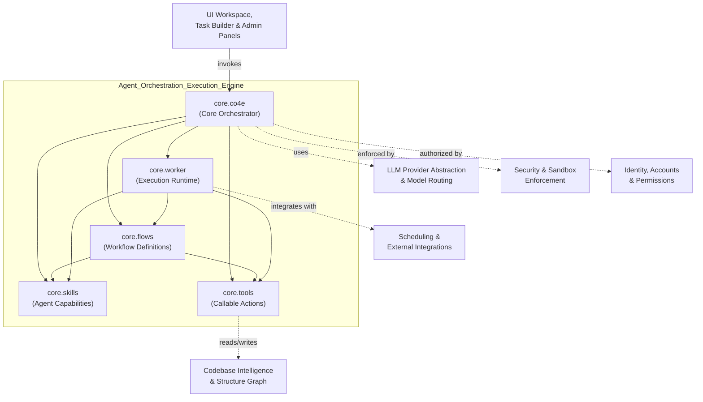
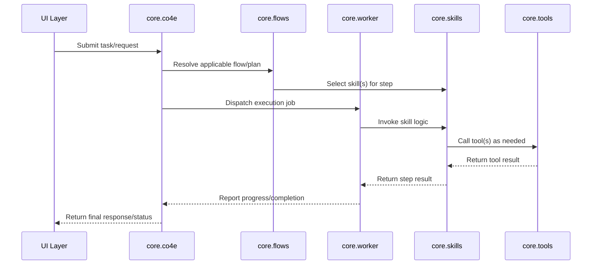

# Agent Orchestration & Execution Engine

## Purpose

The **Agent Orchestration & Execution Engine** is the core runtime module responsible for defining, coordinating, and executing autonomous agent behavior within the system. It provides the foundational building blocks that transform declarative agent definitions and workflow specifications into concrete, executable actions.

This module answers the central question: *"How does an agent actually do work?"* It ties together:

- **Skills** — reusable units of agent capability/behavior
- **Tools** — external or internal functions agents can invoke to interact with the environment
- **Flows** — multi-step orchestrations that sequence skills, tools, and decision logic into coherent workflows
- **Worker** — the execution runtime that drives agents/flows forward, manages task lifecycles, and processes work asynchronously
- **CO4E (Core Orchestration Engine)** — the top-level orchestrator that ties skills, tools, flows, and workers together to resolve requests into agent actions and responses

Together, these components form the "brain and hands" of the system: they interpret a task or user request, plan/select the appropriate skills and tools, execute steps (potentially across multiple turns or asynchronous jobs), and return results — while relying on other modules (Identity & Permissions, Security Sandbox, LLM Routing, Scheduling & Integrations) for supporting concerns like authorization, safe execution, model access, and external connectivity.

## Architecture

The module is organized around a central orchestration engine (`co4e`) that composes flows, skills, and tools, and delegates actual execution to a worker runtime.

### Execution Flow

The typical lifecycle of a request as it moves through the module:

## Core Components

| Component | File | Responsibility |
|---|---|---|
| **core.co4e** | `core\co4e.py` | Central orchestration engine; coordinates flows, skills, tools, and workers to fulfill agent requests end-to-end. |
| **core.flows** | `core\flows.py` | Defines and manages multi-step workflows that sequence skills and tools, including branching/decision logic for complex agent tasks. |
| **core.worker** | `core\worker.py` | Execution runtime that drives task/job processing, manages asynchronous execution and lifecycle state of agent work. |
| **core.skills** | `core\skills.py` | Defines reusable agent capabilities (skills) that encapsulate specific behaviors invocable by flows or the orchestrator. |
| **core.tools** | `core\tools.py` | Provides the concrete callable actions (tools) that skills and flows use to interact with external systems, data, or the environment. |

## Relationships to Other Modules

- **Identity, Accounts & Permissions**: Supplies authorization context so the orchestrator can verify agents/users are permitted to invoke specific skills/tools.
- **Security & Sandbox Enforcement**: Enforces safe execution boundaries around tool invocations and worker-driven actions.
- **LLM Provider Abstraction & Model Routing**: Supplies the underlying language model calls that power skill reasoning and decision-making within flows.
- **Scheduling & External Integrations**: Enables the worker to trigger or be triggered by scheduled jobs and external connectors (e.g., calendars, MS365).
- **Codebase Intelligence & Structure Graph**: Consumed by tools/skills that need code-aware context for development-related tasks.
- **UI Workflow & Task Builder / UI Workspace**: Front-end surfaces that construct flow definitions and submit tasks that this module executes.