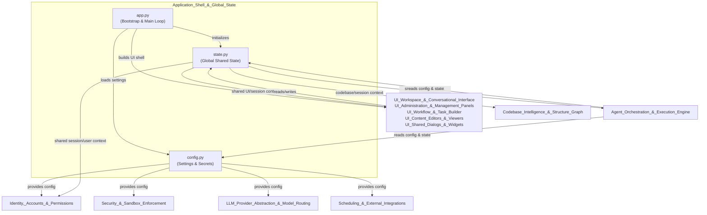
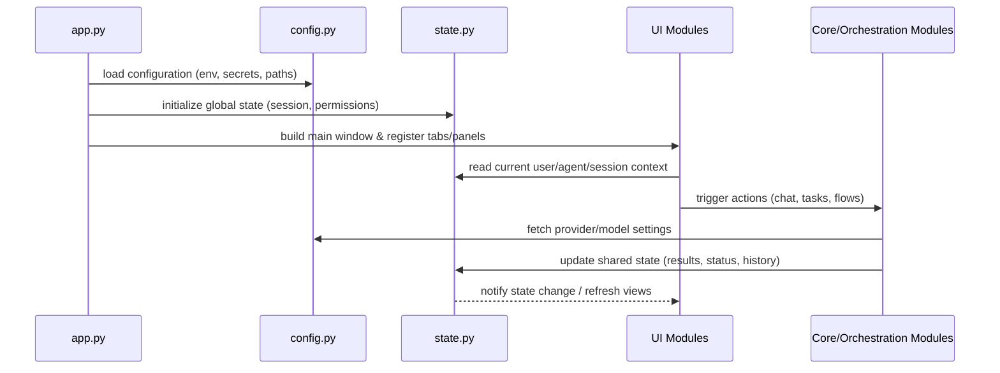

# Application Shell & Global State

## Purpose

The **Application_Shell_&_Global_State** module is the entry point and backbone of the application. It is responsible for:

- **Bootstrapping the application**: initializing the runtime environment, wiring together core services, and launching the main UI shell (`app.py`).
- **Centralized configuration management**: loading, validating, and exposing environment/deployment settings such as API keys, file paths, feature flags, and provider credentials (`config.py`).
- **Global application state**: maintaining a single, shared source of truth for session-level data — current user/agent context, active permissions, open tabs/panels, conversation history, and other cross-cutting runtime state (`state.py`) that all other modules read from and mutate.

This module sits at the top of the dependency graph: nearly every other module (UI panels, orchestration engine, security layer, providers, integrations) depends on it for configuration values and shared state, but it does not depend on them. It effectively acts as the "kernel" that assembles the application and keeps its moving parts synchronized.

## Responsibilities

| Component | File | Responsibility |
|---|---|---|
| **Application Bootstrap** | `app.py` | Application entry point; initializes the main window/shell, wires up UI tabs/panels, starts background services, and manages the top-level event loop. |
| **Configuration** | `config.py` | Loads settings from environment variables/config files, provides typed accessors for paths, secrets, provider endpoints, and feature toggles used across the codebase. |
| **Global State** | `state.py` | Defines and manages shared, mutable application state (current user/session, active agent, permissions cache, UI state, etc.), typically exposed as a singleton or context object consumed by other modules. |

## Architecture

## Key Interactions

- **`app.py`** is the orchestration point at startup: it reads configuration via `config.py`, seeds the global state via `state.py`, and then constructs the UI shell (tabs, sidebar, dialogs) defined in the various UI modules.
- **`config.py`** acts as the single source of configuration truth, consumed by security, identity, provider routing, and scheduling/integration modules to obtain credentials, endpoints, and feature flags.
- **`state.py`** provides the shared, mutable runtime context (current user, active agent, permissions, UI navigation state, conversation/session data) that flows across the UI layer and the agent orchestration engine, enabling consistent behavior across otherwise independent modules.

## Related Modules

- [Identity, Accounts & Permissions](../Identity,_Accounts_&_Permissions) — consumes global state/config for authentication and authorization context.
- [Security & Sandbox Enforcement](../Security_&_Sandbox_Enforcement) — relies on configuration for sandbox policies and secrets.
- [Agent_Orchestration_&_Execution_Engine](../Agent_Orchestration_&_Execution_Engine) — reads/writes global state during task and flow execution.
- [LLM_Provider_Abstraction_&_Model_Routing](../LLM_Provider_Abstraction_&_Model_Routing) — obtains provider credentials and routing settings from configuration.
- [Scheduling_&_External_Integrations](../Scheduling_&_External_Integrations) — uses configuration for external service connectivity.
- [UI_Workspace_&_Conversational_Interface](../UI_Workspace_&_Conversational_Interface), [UI_Administration_&_Management_Panels](../UI_Administration_&_Management_Panels), [UI_Workflow_&_Task_Builder](../UI_Workflow_&_Task_Builder), [UI_Content_Editors_&_Viewers](../UI_Content_Editors_&_Viewers), and [UI_Shared_Dialogs_&_Widgets](../UI_Shared_Dialogs_&_Widgets) — all built and hosted by the shell defined in `app.py`, and all interact with the global state maintained here.