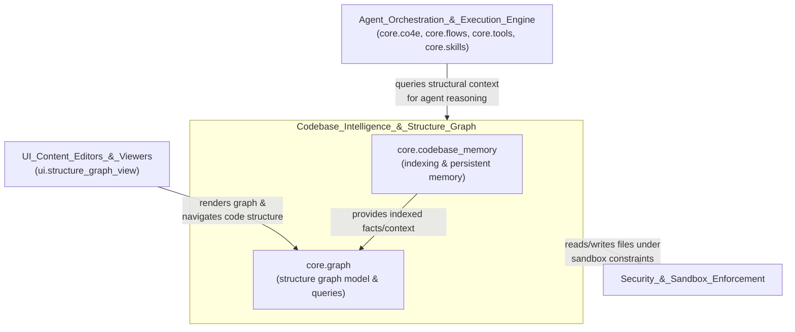
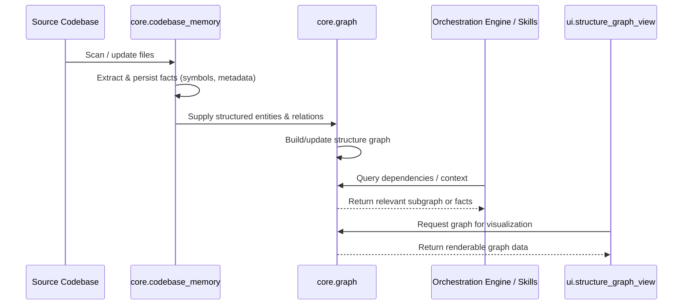

# Codebase_Intelligence_&_Structure_Graph

## Purpose

The `Codebase_Intelligence_&_Structure_Graph` module is responsible for building and maintaining the system's understanding of the codebase it operates on. It acts as the "knowledge layer" that other parts of the platform (agents, orchestration engine, UI visualizations) rely on to reason about code structure, relationships, and history.

Concretely, this module is expected to:

- **Ingest and index source code** into a persistent, queryable memory (`core.codebase_memory`), enabling agents and tools to recall facts about files, symbols, and past analyses without re-scanning the entire repository on every request.
- **Construct and maintain a structure graph** (`core.graph`) that models the codebase as a graph of entities (files, modules, classes, functions) and their relationships (imports, calls, containment, dependencies).
- **Expose query and traversal capabilities** so that downstream consumers — such as the `Agent_Orchestration_&_Execution_Engine`, coding-related skills/tools, and the `ui.structure_graph_view` UI component — can retrieve structural context (e.g., "what depends on this function", "what files belong to this module") efficiently.
- **Support incremental updates**, keeping the memory and graph representations in sync as the underlying codebase changes over time, avoiding costly full re-indexing.

This module sits at the intersection of static analysis and long-term memory: it gives agents a durable, structured view of "what the codebase looks like" that complements the LLM's own context window, and it powers visual and navigational tooling in the UI layer.

## Architecture

The module is composed of two tightly coupled submodules: a memory/indexing layer and a graph modeling layer. The memory layer typically owns the raw ingestion and storage of codebase facts, while the graph layer builds a higher-level relational structure on top of (or alongside) that memory, which is then consumed by other parts of the system.

## Core Components

- **`core.codebase_memory`** — Handles ingestion, persistence, and retrieval of codebase-derived knowledge (indexed facts, metadata, and memory used by agents to reason about code without re-parsing it each time). *(No detailed component documentation available; refer to source at `core` for implementation specifics.)*

- **`core.graph`** — Builds and maintains the structural graph representation of the codebase (entities and their relationships), and exposes it for querying and visualization. *(No detailed component documentation available; refer to source at `core` for implementation specifics.)*

## Relationship to Other Modules

- Consumed by **`Agent_Orchestration_&_Execution_Engine`** to give agents structural awareness of the codebase during task execution.
- Rendered by **`ui.structure_graph_view`** (part of `UI_Content_Editors_&_Viewers`) to provide users with a visual, navigable representation of code structure.
- Operates within the constraints enforced by **`Security_&_Sandbox_Enforcement`** when reading from or writing to the file system during indexing.