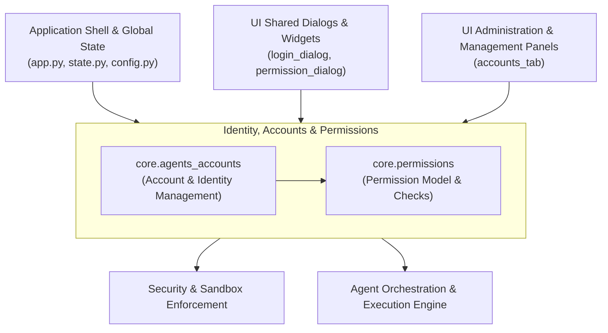
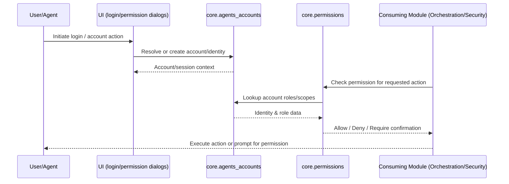

# Identity, Accounts & Permissions

## Purpose

The **Identity, Accounts & Permissions** module is responsible for managing the identity layer of the application — encompassing user and agent accounts, authentication state, and the permission model that governs what actions accounts and agents are authorized to perform. It acts as the trust and access-control backbone for the rest of the system, ensuring that every operation executed by a user or an autonomous agent is validated against a well-defined set of permissions before being allowed to proceed.

This module is foundational infrastructure consumed by many other parts of the application:
- The **Application Shell & Global State** relies on it to establish the current logged-in identity and propagate account context across the app.
- The **Agent Orchestration & Execution Engine** and **Security & Sandbox Enforcement** modules consult permissions before executing tools, skills, or flows on behalf of an agent or user.
- The **UI Administration & Management Panels** (e.g., accounts management screens) and **UI Shared Dialogs & Widgets** (e.g., login and permission dialogs) provide the front-end surfaces for account creation, login, and permission approval/consent flows.

## Core Responsibilities

- **Account Management** — Creation, storage, and retrieval of user and agent accounts, including their metadata and associated credentials/state.
- **Identity Resolution** — Determining "who" (user or agent) is performing an action, so downstream modules can attribute and authorize operations correctly.
- **Permission Modeling & Enforcement** — Defining a permission schema (roles, scopes, or capability grants) and providing the mechanisms to check, grant, deny, or request escalation of permissions.
- **Cross-Module Authorization Gateway** — Serving as the single source of truth that other modules (security sandboxing, orchestration, UI panels) query before allowing sensitive or privileged actions.

## Architecture

## Core Components

- **`core.agents_accounts`** — Manages the lifecycle of user and agent accounts, including identity records and account-related state used throughout the application. *(Detailed component documentation not available.)*
- **`core.permissions`** (`core/permissions.py`) — Implements the permission model and the logic for evaluating, granting, and enforcing access rights tied to accounts and agents. *(Detailed component documentation not available.)*

> Note: Dedicated documentation files for the individual sub-components (`core.agents_accounts`, `core.permissions`) were not available at generation time. This overview is derived from the module's structural role within the overall system architecture.