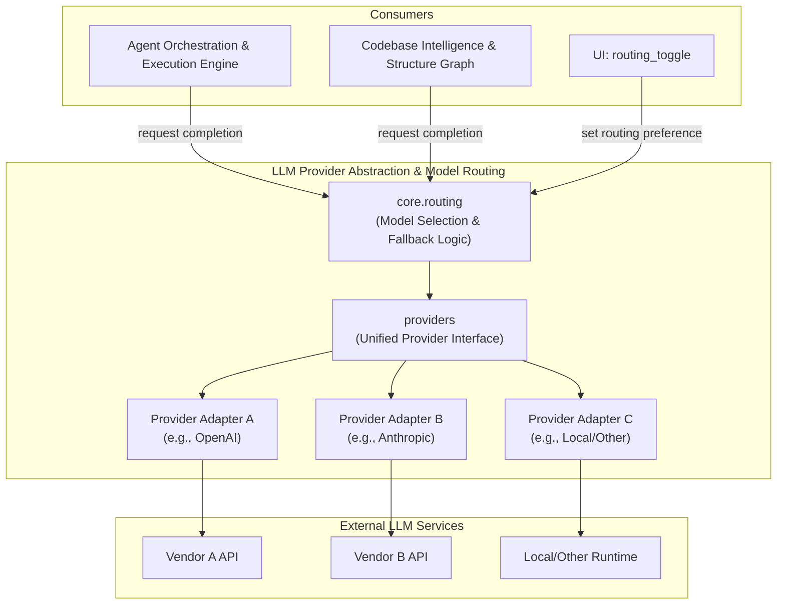
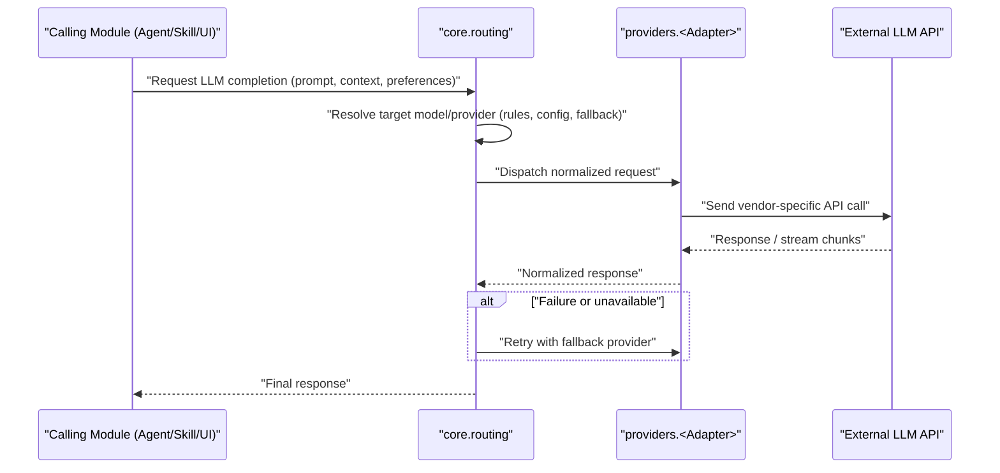

# LLM Provider Abstraction & Model Routing

## Purpose

The `LLM_Provider_Abstraction_&_Model_Routing` module provides a unified interface for interacting with multiple Large Language Model (LLM) providers (e.g., OpenAI, Anthropic, local models, etc.) and intelligently routes requests to the appropriate model based on configuration, task requirements, cost, availability, or user/agent preferences.

This module decouples the rest of the application (agent orchestration, skills, tools, UI) from the specifics of any single LLM vendor's API. It exposes a consistent contract for sending prompts, streaming responses, handling function/tool calls, and managing provider-specific quirks (authentication, rate limits, token counting, error handling), while a routing layer decides *which* provider/model should service a given request.

Key responsibilities:
- **Provider Abstraction**: Normalize differences between LLM vendor SDKs/APIs (request/response formats, streaming protocols, tool-calling conventions, error semantics) behind a common interface.
- **Model Routing**: Select the optimal model/provider for a given request based on rules such as task type, cost constraints, latency requirements, fallback chains, or explicit user/agent selection (e.g., via the routing toggle UI).
- **Extensibility**: Allow new providers to be added with minimal changes to consuming code, by implementing the shared provider interface.
- **Resilience**: Support fallback and retry strategies across providers/models when a primary choice fails or is unavailable.

This module sits at a foundational layer of the application, consumed heavily by the `Agent_Orchestration_&_Execution_Engine` (for agent reasoning/completions), `Codebase_Intelligence_&_Structure_Graph` (for code-related LLM tasks), and surfaced to end-users through UI components such as `ui.routing_toggle`.

## Architecture

The module is composed of two primary layers:

- **`providers`**: Contains the concrete implementations/adapters for each supported LLM backend, each conforming to a shared abstract interface (e.g., chat completion, streaming, embeddings, tool/function calling).
- **`core.routing`**: Contains the routing logic that decides which provider/model to invoke for a given request, encapsulating strategies like priority ordering, fallback chains, cost/latency-aware selection, and configuration-driven overrides.

### Request Flow

## Core Components

- **`providers`** — Implements the adapters for individual LLM vendors/backends, exposing a common interface for chat completions, streaming, tool/function calling, and embeddings. Each adapter encapsulates vendor-specific authentication, request formatting, and error translation.
- **`core.routing`** — Implements the model/provider selection logic, including configuration-driven routing rules, fallback and retry chains, and integration points for user- or agent-driven overrides (e.g., surfaced via `ui.routing_toggle`).

*(Detailed component-level documentation for `providers` and `core.routing` was not available at generation time; refer to the source code in `providers/` and `core/routing/` for implementation specifics.)*