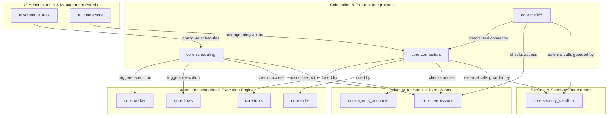
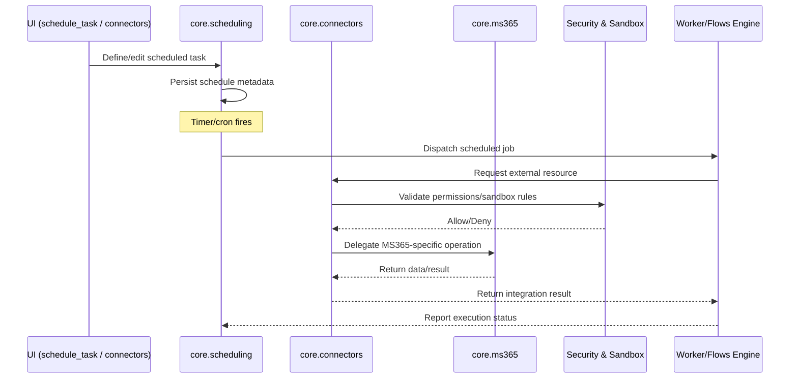

# Scheduling & External Integrations

## Purpose

The `Scheduling_&_External_Integrations` module is responsible for extending the platform's agent execution capabilities beyond the local runtime, enabling time-based automation and connectivity with third-party services and enterprise ecosystems. It consists of three closely related sub-areas:

- **`core.scheduling`** — Provides the scheduling engine that allows tasks, flows, and agent jobs to be triggered on a recurring or time-based basis (e.g., cron-like schedules, one-off delayed executions), decoupling task definition from immediate, user-initiated execution.
- **`core.connectors`** — Implements a generic connector framework for integrating with external systems and services (e.g., file storage, communication tools, APIs), giving agents and skills a uniform way to read from and write to outside data sources.
- **`core.ms365`** — Supplies a dedicated integration layer for Microsoft 365 services (such as Outlook, Calendar, OneDrive/SharePoint, and Teams), handling authentication and data exchange specific to the Microsoft ecosystem.

Together, these components allow the system to act autonomously on a schedule and to reach beyond its own sandboxed environment to interact with external platforms, while keeping this integration logic isolated from the core orchestration and execution engine.

## Architecture

The module sits alongside the Agent Orchestration & Execution Engine, providing it with triggers (via scheduling) and external I/O capabilities (via connectors and MS365 integration). It is consumed by the UI layer (for schedule/task configuration and connector management) and by core orchestration components (for executing scheduled or externally-sourced work).

### Interaction Flow

## Core Components

- **`core.scheduling`** — Task/flow scheduling engine responsible for defining, persisting, and triggering time-based or recurring executions, handing off actual work to the [Agent_Orchestration_&_Execution_Engine](../Agent_Orchestration_%26_Execution_Engine).
- **`core.connectors`** — Generic external system connector framework, providing a common interface for skills/tools to interact with outside data sources and services.
- **`core.ms365`** — Microsoft 365-specific integration built on top of (or alongside) the connector framework, handling authentication and data exchange with Outlook, Calendar, and related Microsoft services.

### Related Modules

- [Agent_Orchestration_&_Execution_Engine](../Agent_Orchestration_%26_Execution_Engine) — consumes scheduled triggers and executes flows/tasks that rely on connectors.
- [Identity,_Accounts_&_Permissions](../Identity%2C_Accounts_%26_Permissions) — governs which accounts/agents may configure schedules or access specific external connectors.
- [Security_&_Sandbox_Enforcement](../Security_%26_Sandbox_Enforcement) — enforces sandboxing rules when connectors and MS365 integrations reach outside the local environment.
- [UI_Administration_&_Management_Panels](../UI_Administration_%26_Management_Panels) — provides `ui.schedule_task` and `ui.connectors` panels for configuring schedules and external integrations.