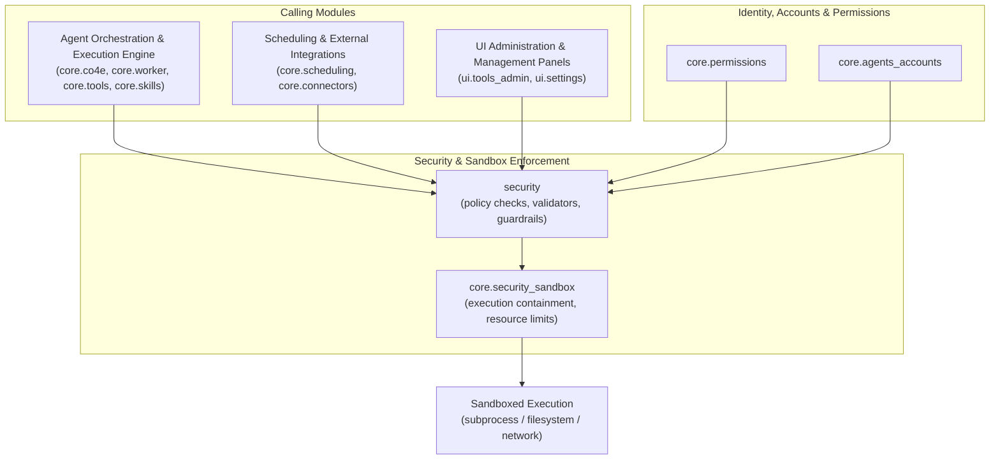
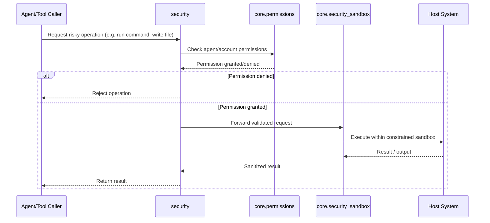

# Security & Sandbox Enforcement

## Purpose

The `Security_&_Sandbox_Enforcement` module is the guardian layer of the application, responsible for enforcing safe execution boundaries around agent actions, tool invocations, and code execution. It centralizes the logic that determines *what* an agent or user is allowed to do, and *how* potentially risky operations (such as running code, executing shell commands, or accessing the filesystem/network) are contained and audited.

This module works closely with `Identity,_Accounts_&_Permissions` (which defines *who* has *what* permissions) and `Agent_Orchestration_&_Execution_Engine` (which drives the actual execution of agent skills and tools), acting as the enforcement checkpoint between permission decisions and real-world side effects. Its core responsibilities include:

- **Sandboxing execution**: Isolating agent/tool code execution (e.g., subprocess, filesystem, network access) to prevent unauthorized or unintended actions from affecting the host system.
- **Policy enforcement**: Applying security policies and guardrails before allowing sensitive operations to proceed.
- **Auditing & safety checks**: Validating commands, paths, and resource usage against allow/deny lists or resource constraints.
- **Bridging permissions to runtime enforcement**: Translating declarative permission rules (from `core.permissions`) into concrete runtime restrictions applied at execution time.

## Architecture

The module is composed of two cooperating components:

- **`core.security_sandbox`** — Core sandboxing logic embedded in the backend (`core` package). It provides the low-level mechanisms for constraining and validating execution (e.g., wrapping subprocess calls, restricting file/network access, enforcing timeouts and resource limits).
- **`security`** — A dedicated `security` package that houses higher-level security policies, validators, and utilities used across the application to check permissions, sanitize inputs, and gate risky operations before they reach the sandbox layer.

Together, these components form a layered defense: the `security` package performs pre-execution policy checks and validation, while `core.security_sandbox` enforces containment during actual execution.

## Core Components

- **`core.security_sandbox`** (`core/`): Implements the runtime sandboxing mechanisms — constraining subprocess execution, filesystem access, network calls, and resource usage for agent- and tool-driven code execution.
- **`security`** (`security/`): Provides the policy, validation, and guardrail layer that inspects requested operations against security rules before they are handed off to the sandbox for execution.

> Note: Detailed component-level documentation files were not available at generation time; this overview reflects the module's structural role and responsibilities based on its position within the overall architecture.

## Related Modules

- **`Identity,_Accounts_&_Permissions`**: Supplies the permission model (`core.permissions`) that this module enforces at runtime.
- **`Agent_Orchestration_&_Execution_Engine`**: The primary consumer of sandboxing services, routing tool/skill executions through this module's enforcement layer.
- **`Scheduling_&_External_Integrations`** and **`UI_Administration_&_Management_Panels`**: Additional callers that rely on security checks before performing external or administrative actions.