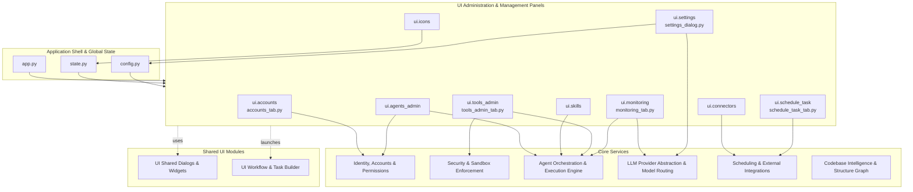
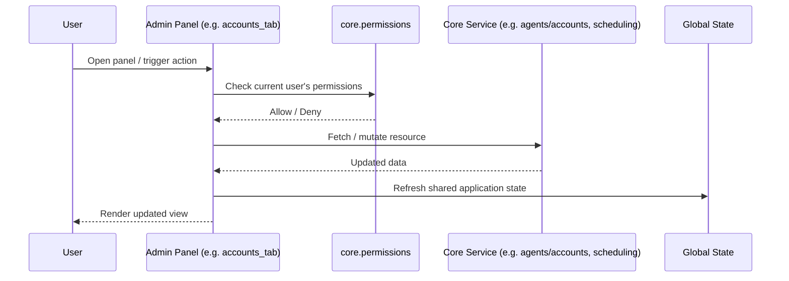

# UI Administration & Management Panels

## Purpose

The `UI_Administration_&_Management_Panels` module provides the collection of administrative surfaces exposed to operators and privileged users for managing the platform's core resources. It groups together the Qt-based tabs and dialogs that let administrators:

- Manage user **accounts** and their access rights
- Configure and oversee **agents** (creation, editing, lifecycle)
- Curate the library of **skills** available to agents
- Administer **tools** that agents and flows can invoke
- Manage **icons/assets** used across the UI
- Configure **connectors** to external systems and services
- Create and manage **scheduled tasks**
- Adjust global **application settings**
- Observe system health and activity via the **monitoring** dashboard

Rather than implementing business logic itself, this module acts as the presentation and interaction layer for administrative operations, delegating actual state changes, validation, and persistence to the underlying core services (identity/permissions, security sandboxing, agent orchestration, scheduling/connectors, and LLM routing).

## Architecture

The module is composed of a set of independent, purpose-specific tabs/dialogs that are hosted by the application shell and mounted into the main window's admin area (typically as tabs or menu-launched dialogs). Each panel talks to the relevant core subsystem to read and mutate state, and relies on shared UI primitives (dialogs, widgets, permission checks) from sibling UI modules.

### Interaction Flow (typical admin action)

## Component Summary

| Component | File | Responsibility |
|---|---|---|
| `ui.accounts` | `ui/accounts_tab.py` | UI for creating, editing, and managing user accounts and their roles/permissions |
| `ui.agents_admin` | `ui` | Administrative interface for configuring agents (identity, behavior, lifecycle) |
| `ui.skills` | `ui` | Panel for browsing, adding, and editing agent skills |
| `ui.tools_admin` | `ui/tools_admin_tab.py` | Administration of tools available to agents/flows, including registration and access control |
| `ui.icons` | `ui` | Management of icon/asset resources used throughout the UI |
| `ui.connectors` | `ui` | Configuration UI for external system connectors (e.g., integrations) |
| `ui.schedule_task` | `ui/schedule_task_tab.py` | Interface for defining and managing scheduled tasks |
| `ui.settings` | `ui/settings_dialog.py` | Global application settings dialog (preferences, provider/routing configuration, etc.) |
| `ui.monitoring` | `ui/monitoring_tab.py` | Dashboard for observing system/agent activity and health |

## References to Core Components

This module depends heavily on backend/core subsystems documented elsewhere:

- **Identity, Accounts & Permissions** (`core.agents_accounts`, `core.permissions`) — backs `ui.accounts` and `ui.agents_admin` for identity data and permission checks that gate access to administrative actions.
- **Security & Sandbox Enforcement** (`core.security_sandbox`, `security`) — enforces execution boundaries surfaced/configured through `ui.tools_admin`.
- **Agent Orchestration & Execution Engine** (`core.co4e`, `core.flows`, `core.worker`, `core.skills`, `core.tools`) — provides the agent, skill, and tool definitions managed by `ui.agents_admin`, `ui.skills`, and `ui.tools_admin`.
- **LLM Provider Abstraction & Model Routing** (`providers`, `core.routing`) — configured via `ui.settings` for provider/model selection and routing behavior.
- **Scheduling & External Integrations** (`core.scheduling`, `core.connectors`, `core.ms365`) — powers `ui.schedule_task` and `ui.connectors`.
- **Application Shell & Global State** (`app.py`, `config.py`, `state.py`) — hosts these panels within the main application window and supplies shared configuration/state.

The panels also rely on shared presentation elements from **UI Shared Dialogs & Widgets** (e.g., permission prompts, common widgets) and may launch views from **UI Workflow & Task Builder** when administrators need to inspect or edit underlying flows and tasks.