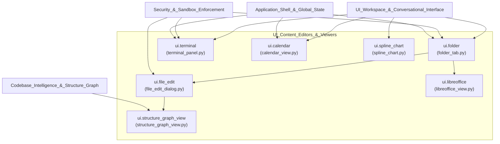
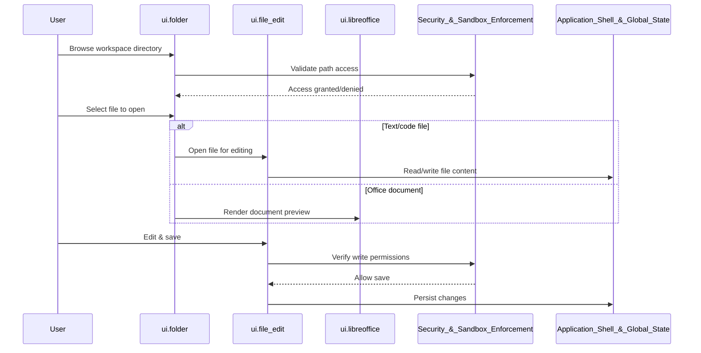

# UI_Content_Editors_&_Viewers

## Purpose

The `UI_Content_Editors_&_Viewers` module provides the collection of specialized, self-contained UI components responsible for **viewing and editing content artifacts** within the application. Unlike the conversational or administrative UI modules, this module focuses on rich, content-specific widgets that let users browse the filesystem, edit and preview files, interact with embedded office documents, run a terminal session, explore codebase structure graphs, and visualize calendar and chart data.

These components are typically embedded as tabs, panels, or dialogs inside the broader workspace UI (see `UI_Workspace_&_Conversational_Interface`), and they rely on core services such as security sandboxing, codebase intelligence, and application state to operate safely and consistently.

Key responsibilities:
- **Filesystem navigation and file editing** — browsing folders and editing text/code files in-place.
- **Document previewing** — rendering office documents (e.g., via LibreOffice integration) without leaving the app.
- **Interactive terminal access** — providing a sandboxed command-line panel for agent/user interaction.
- **Codebase structure visualization** — rendering graph-based views of code structure for exploration.
- **Data visualization** — presenting calendar-based schedules and spline/line charts for reporting and monitoring.

## Components

| Component | File | Responsibility |
|---|---|---|
| `ui.folder` | `ui/folder_tab.py` | Folder/file browser tab for navigating the workspace filesystem |
| `ui.file_edit` | `ui/file_edit_dialog.py` | Dialog for opening, editing, and saving individual files |
| `ui.libreoffice` | `ui/libreoffice_view.py` | Embedded viewer/editor for office documents via LibreOffice |
| `ui.terminal` | `ui/terminal_panel.py` | Interactive terminal panel for command execution |
| `ui.structure_graph_view` | `ui/structure_graph_view.py` | Visual graph representation of codebase structure |
| `ui.calendar` | `ui/calendar_view.py` | Calendar widget for displaying scheduled items/events |
| `ui.spline_chart` | `ui/spline_chart.py` | Spline/line chart widget for data visualization |

## Architecture

## Interaction Flow

## References

- **`Application_Shell_&_Global_State`** — supplies shared application state and configuration used by editors and viewers (e.g., current session/workspace context).
- **`Security_&_Sandbox_Enforcement`** — enforces access control and sandboxing for filesystem operations and terminal command execution.
- **`Codebase_Intelligence_&_Structure_Graph`** — provides the underlying graph data consumed by `ui.structure_graph_view` for codebase visualization.
- **`UI_Workspace_&_Conversational_Interface`** — hosts these editor/viewer components as tabs and panels within the main workspace UI.
- **`UI_Workflow_&_Task_Builder`** and **`UI_Administration_&_Management_Panels`** — may embed or link to these viewers/editors (e.g., file editing, calendar views) as part of broader workflows and admin tasks.