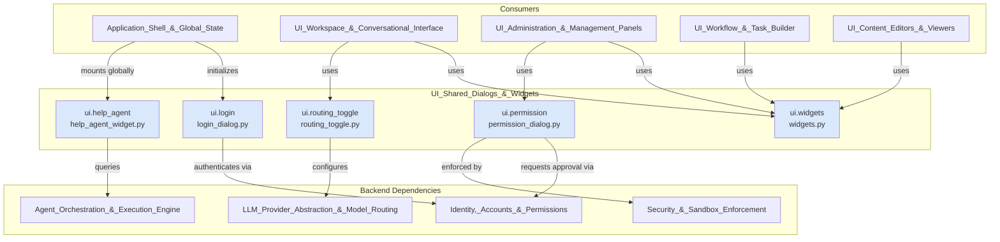
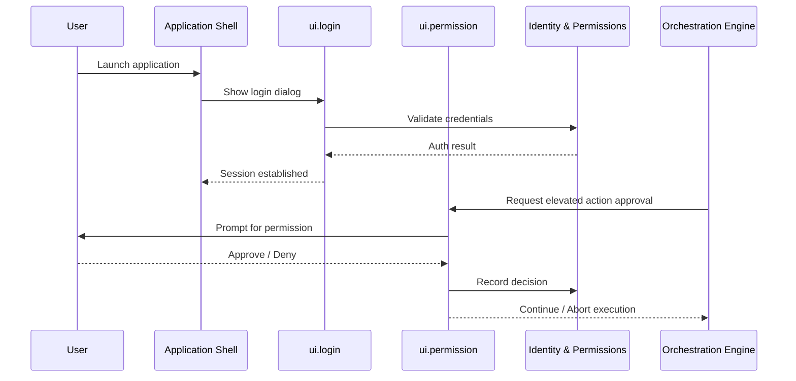

# UI_Shared_Dialogs_&_Widgets

## Purpose

The `UI_Shared_Dialogs_&_Widgets` module provides a collection of reusable, cross-cutting UI components that are consumed by multiple feature areas of the application rather than being tied to a single tab or workflow. It centralizes common interaction patterns — user authentication, permission prompts, contextual help, LLM routing controls, and generic widget building blocks — so that other UI modules (such as `UI_Workspace_&_Conversational_Interface`, `UI_Administration_&_Management_Panels`, and `UI_Workflow_&_Task_Builder`) can compose consistent, DRY user interfaces without duplicating dialog or widget logic.

Key responsibilities:
- **Authentication UX**: Presenting login prompts and capturing credentials (`ui.login`).
- **Authorization UX**: Surfacing permission requests/approvals originating from agent or tool execution (`ui.permission`), tying into `Identity,_Accounts_&_Permissions`.
- **In-app Assistance**: Providing a lightweight, embeddable help/agent widget for contextual guidance (`ui.help_agent`).
- **Model Routing Controls**: Exposing a toggle/control surface for switching or configuring LLM routing behavior (`ui.routing_toggle`), integrating with `LLM_Provider_Abstraction_&_Model_Routing`.
- **Generic Widget Library**: Supplying common, reusable UI building blocks (buttons, cards, indicators, form helpers, etc.) used throughout the application (`ui.widgets`).

This module acts as a shared UI toolkit layer sitting beneath the feature-specific UI modules, promoting consistency in look, feel, and behavior across dialogs and widgets application-wide.

## Architecture

## Component Overview

| Component | File | Responsibility |
|---|---|---|
| `ui.login` | `ui/login_dialog.py` | Modal dialog for user login/authentication, invoked at application startup or session expiry. |
| `ui.permission` | `ui/permission_dialog.py` | Modal dialog for confirming/approving sensitive or gated actions requested by agents, tools, or flows. |
| `ui.help_agent` | `ui/help_agent_widget.py` | Embeddable widget offering contextual, agent-powered help/assistance within the UI. |
| `ui.routing_toggle` | `ui/routing_toggle.py` | Control widget for toggling/configuring LLM provider routing behavior directly from the UI. |
| `ui.widgets` | `ui/widgets.py` | Library of generic, reusable UI widgets and helper components shared across all UI modules. |

## References to Core Components

- **[Application_Shell_&_Global_State](#)** — bootstraps the application and typically triggers `ui.login` and mounts `ui.help_agent` as part of global UI initialization.
- **[Identity,_Accounts_&_Permissions](#)** — backs the authentication logic behind `ui.login` and the authorization checks surfaced by `ui.permission`.
- **[Security_&_Sandbox_Enforcement](#)** — collaborates with `ui.permission` to enforce sandboxing decisions and gate risky operations.
- **[Agent_Orchestration_&_Execution_Engine](#)** — supplies the underlying agent capabilities exposed through `ui.help_agent` and raises permission requests handled by `ui.permission`.
- **[LLM_Provider_Abstraction_&_Model_Routing](#)** — configured/controlled via `ui.routing_toggle`.
- **[UI_Workspace_&_Conversational_Interface](#)**, **[UI_Administration_&_Management_Panels](#)**, **[UI_Workflow_&_Task_Builder](#)**, **[UI_Content_Editors_&_Viewers](#)** — all consume `ui.widgets` and other shared dialogs to maintain consistent UI patterns across the application.