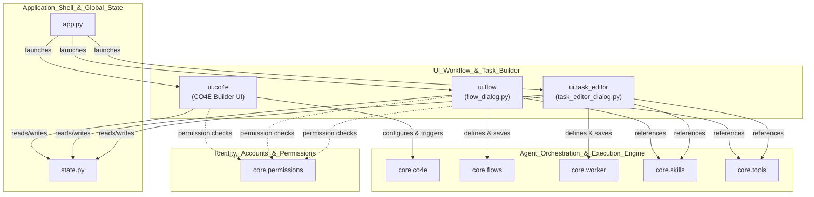
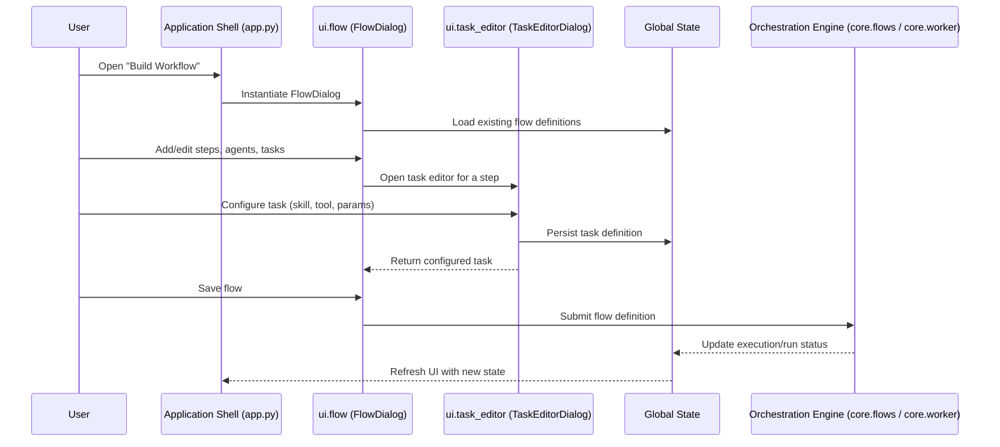

# UI_Workflow_&_Task_Builder

## Purpose

The `UI_Workflow_&_Task_Builder` module provides the graphical front-end for designing, editing, and orchestrating automated work in the application. It exposes the visual tooling that lets users:

- Build and configure **CO4E** ("Chain of 4 Experts" / multi-agent collaboration) sessions through a dedicated builder UI (`ui.co4e`).
- Construct and edit **flows** — multi-step, node-based automation pipelines — via a dedicated dialog (`ui.flow`, backed by `ui/flow_dialog.py`).
- Create and modify individual **tasks** that agents or flows execute, using a focused task editor dialog (`ui.task_editor`, backed by `ui/task_editor_dialog.py`).

In essence, this module is the visual authoring layer that sits directly on top of the orchestration and execution primitives defined in the `Agent_Orchestration_&_Execution_Engine` module (`core.co4e`, `core.flows`, `core.worker`, `core.skills`, `core.tools`). It translates user intent expressed through dialogs and forms into the structured configuration objects (flow definitions, task specifications, agent chains) that the execution engine consumes at runtime.

This module is typically invoked from the broader UI shell (`Application_Shell_&_Global_State`) and works alongside the workspace/conversational surfaces (`UI_Workspace_&_Conversational_Interface`) and administration panels (`UI_Administration_&_Management_Panels`) to give users a complete authoring-to-execution experience.

## Architecture

### Component Composition

### Typical Interaction Flow

## Core Components

| Component | Location | Responsibility |
|-----------|----------|-----------------|
| `ui.co4e` | `ui/` | Builder interface for configuring CO4E multi-agent collaboration sessions; bridges user configuration to `core.co4e`. |
| `ui.flow` | `ui/flow_dialog.py` | Dialog for creating and editing multi-step flows (automation pipelines), integrating with `core.flows`, `core.skills`, and `core.tools`. |
| `ui.task_editor` | `ui/task_editor_dialog.py` | Dialog for defining and editing individual tasks (execution units), feeding definitions into `core.worker` and related execution components. |

## Related Modules

- **Agent_Orchestration_&_Execution_Engine** — Consumes the flow and task definitions authored here; provides the runtime (`core.co4e`, `core.flows`, `core.worker`, `core.skills`, `core.tools`) that actually executes what is built in this module.
- **Application_Shell_&_Global_State** — Hosts and launches these dialogs, and provides shared application state (`state.py`) that the builder dialogs read from and write to.
- **Identity,_Accounts_&_Permissions** — Enforces permission checks (`core.permissions`) controlling who may create, edit, or run workflows and tasks.
- **UI_Workspace_&_Conversational_Interface** and **UI_Administration_&_Management_Panels** — Surround this module in the broader UI, providing entry points (e.g., from the workspace or admin tabs) into the workflow/task building dialogs.