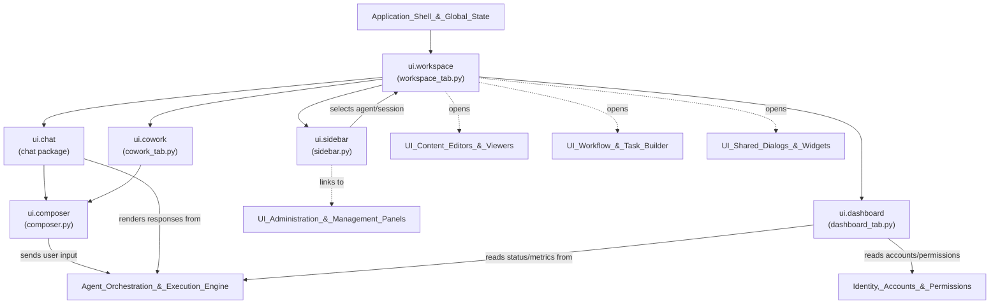
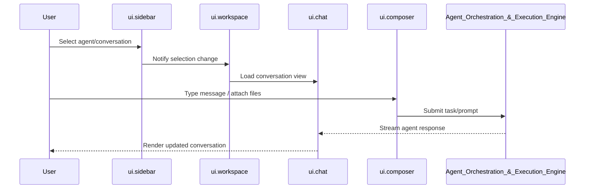

# UI Workspace & Conversational Interface

## Purpose

The `UI_Workspace_&_Conversational_Interface` module forms the primary interactive surface of the application. It provides the main workspace layout where users navigate between agents/sessions, converse with AI agents, and collaborate on tasks in real time. This module ties together the sidebar navigation, the chat/conversational engine, the message composer, the dashboard overview, and the collaborative "cowork" workspace into a cohesive front-end experience.

Its core responsibilities include:

- **Workspace orchestration**: Hosting and coordinating the various tabs/panels (dashboard, chat, cowork) that make up the primary user workspace.
- **Navigation**: Providing a sidebar for switching between agents, conversations, sessions, and other workspace contexts.
- **Conversational interface**: Rendering chat history, streaming agent responses, and managing the message composer for user input (text, attachments, commands).
- **Dashboard summary**: Surfacing high-level status, metrics, and quick-access entry points for the user's agents and ongoing work.
- **Collaborative "cowork" sessions**: Supporting multi-agent or multi-user collaborative work sessions distinct from a simple 1:1 chat.

This module sits at the top of the UI layer, consuming state and services from the `Application_Shell_&_Global_State` module, and delegating to `Agent_Orchestration_&_Execution_Engine` for actual task/agent execution, while remaining decoupled from administrative and content-editing concerns (handled by sibling UI modules).

## Architecture

## Component Overview

| Component | File | Responsibility |
|---|---|---|
| `ui.workspace` | `ui\workspace_tab.py` | Top-level workspace container that composes the dashboard, chat, and cowork tabs into the main working area; manages tab lifecycle and layout. |
| `ui.sidebar` | `ui\sidebar.py` | Navigation panel for browsing agents, conversations, and workspace sections; drives context switching within the workspace. |
| `ui.dashboard` | `ui\dashboard_tab.py` | Landing/overview tab presenting summarized status, recent activity, and quick links into agents and tasks. |
| `ui.chat` | `ui` (chat package) | Core conversational rendering logic: message history display, streaming updates, and interaction with the orchestration engine. |
| `ui.composer` | `ui\composer.py` | Input component for composing and submitting user messages, prompts, attachments, and commands to agents. |
| `ui.cowork` | `ui\cowork_tab.py` | Collaborative workspace tab enabling multi-agent or shared work sessions beyond a simple linear chat. |

## References to Core Component Documentation

This module builds upon and interacts with several other documented modules in the system:

- **`Application_Shell_&_Global_State`** — supplies the global application state, configuration, and shell context consumed by the workspace and its tabs.
- **`Agent_Orchestration_&_Execution_Engine`** — executes tasks and generates agent responses that the chat and composer components render and submit to.
- **`Identity,_Accounts_&_Permissions`** — provides account/agent identity and permission context surfaced in the sidebar and dashboard.
- **`UI_Administration_&_Management_Panels`** — administrative panels reachable from the sidebar/workspace for managing agents, tools, and accounts.
- **`UI_Workflow_&_Task_Builder`** — workflow/task editing dialogs invoked from the workspace for building agent flows.
- **`UI_Content_Editors_&_Viewers`** — content viewers/editors (files, terminal, structure graph, calendar) launched from within the workspace context.
- **`UI_Shared_Dialogs_&_Widgets`** — shared dialogs and widgets (login, permissions, help agent) used throughout the conversational interface.