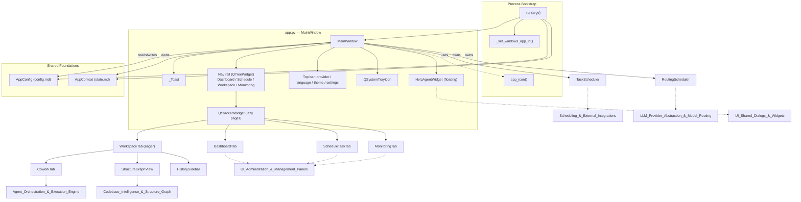
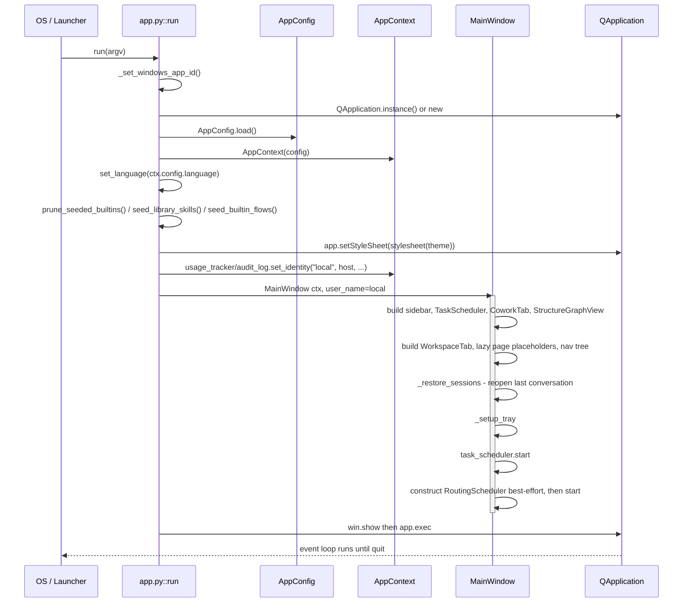
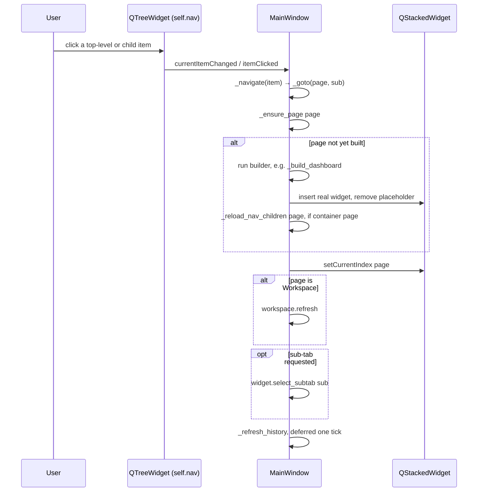
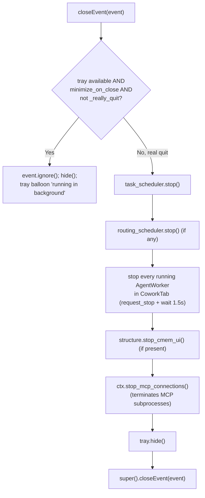

# App — Application Shell (Main Window & Bootstrap)

## Introduction

The **App** module (`app.py`) is the visual and procedural entry point of the desktop application. It defines the `MainWindow` — the single `QMainWindow` that hosts every page (Dashboard, Schedule, Workspace, Monitoring), the collapsible navigation rail, the top bar (provider/language/theme switches), the system tray, the floating Help assistant, and toast notifications (`_Toast`) — and the `run()` function that boots the Qt application, constructs the shared [`AppContext`](state.md), seeds built-in content, and starts the Qt event loop.

This module is the *composition root* of the whole desktop shell: it does not itself implement business logic (chat, sandboxing, routing, scheduling) but wires together the modules that do, using [`AppConfig`](config.md) for persisted settings and [`AppContext`](state.md) for shared runtime state. It is a sibling of `config.py` and `state.py` inside the parent **Application_Shell_&_Global_State** package; see that package's own composition notes for how the three files relate as a unit.

## Responsibilities at a Glance

| Component | Responsibility |
|---|---|
| `run(argv)` | Process bootstrap: creates the `QApplication`, loads `AppConfig`, builds `AppContext`, seeds built-in skills/flows, applies theme/language, constructs `MainWindow`, starts the Qt event loop. |
| `app_icon()` | Loads the shared window/taskbar/tray icon from `assets/`. |
| `_set_windows_app_id()` | Sets the Windows AppUserModelID so the taskbar shows this app's icon instead of `python.exe`'s. |
| `_Toast` | Small auto-hiding top-left notification label used for task-completion/error popups. |
| `MainWindow` | Top-level window: nav rail, lazy page stack, top bar, system tray, session restore, background service lifecycle (task scheduler, routing scheduler, MCP connections), Help assistant. |

## Capabilities

### Process bootstrap & lifecycle
- A caller can start the whole desktop application from a single function call: `run(argv)` creates/reuses the `QApplication`, loads configuration, and enters the Qt event loop (`app.py::run`).
- The app sets its Windows taskbar identity so the icon shown is the app's own icon rather than the Python interpreter's, implemented by `app.py::_set_windows_app_id` (guarded to no-op off Windows).
- The app loads the persisted icon (`.ico` first, then `.png` for crisp large sizes) for use as window icon, taskbar icon, and tray icon, via `app.py::app_icon`.
- On startup the app loads persisted configuration through `AppConfig.load()` (see [config.md](config.md)) and builds the single shared `AppContext` (see [state.md](state.md)) that every other module reads/writes.
- The app applies the user's saved UI language before any window is shown, via `set_language(ctx.config.language)` (delegates to the i18n subsystem, not detailed here).
- The app removes stale copies of bundled built-in skills left by older versions so they don't clutter the Skill Manager, via `core.skills.prune_seeded_builtins()` (see [Agent_Orchestration_&_Execution_Engine](Agent_Orchestration_&_Execution_Engine.md)).
- The app seeds the bundled skill library and built-in Co4E flow into the user's editable stores exactly once per content version, and never re-seeds anything the user deliberately deleted, via `core.skills.seed_library_skills()` / `core.co4e_builtins.seed_builtin_flows()`, persisting the seeded tags back into `AppConfig.seeded_library_skills` / `seeded_builtin_flows`.
- The app applies the persisted theme stylesheet at launch and again automatically whenever the OS light/dark scheme changes, provided the user's theme choice is "system" (`run()`'s `_reapply_system_theme` handler wired to `QApplication.styleHints().colorSchemeChanged`).
- The app records a fixed local identity ("local" user, machine hostname) into the audit/usage subsystems at startup via `core.audit_log.set_identity` / `core.usage_tracker.set_identity` — the app currently ships with no interactive login flow wired into `run()` (a `LoginDialog` exists in [UI_Shared_Dialogs_&_Widgets](UI_Shared_Dialogs_&_Widgets.md) but is not invoked here).

### Main window shell & navigation
- A user can browse the app through a single accordion-style left navigation rail whose top-level rows are Dashboard, Schedule, Workspace, and Monitoring, backed by a `QTreeWidget` built in `MainWindow.__init__` (`self.nav`, `self._nav_defs`).
- A user can expand Workspace or Monitoring to reveal their sub-views (e.g. Cowork, GraphRAG, sub-tabs) as nested nav children, implemented by `MainWindow._reload_nav_children`, `_on_nav_click`, `_on_nav_expanded`, driven by each container widget's own `nav_subtabs()` and `select_subtab()` contract.
- A user can collapse the whole nav rail to an icon-only strip (54px) and expand it back (150px), implemented by `MainWindow._toggle_nav` and `_apply_nav_labels`, resizing the `QSplitter` between the rail and content area accordingly.
- The app builds Dashboard, Schedule, and Monitoring pages **lazily** on first navigation to them (keeping startup light) while Workspace is built eagerly as the landing page, implemented by `MainWindow._build_dashboard`, `_build_schedule`, `_build_monitoring`, and the placeholder-swap logic in `_ensure_page`.
- A user can navigate directly to a page and optional sub-tab (e.g. from a notification or restored session) via `MainWindow._goto(page, sub)`, which ensures the page is built, switches the `QStackedWidget`, and refreshes History.
- The window auto-sizes itself to fit the available screen on launch (never larger than the monitor, with a safe minimum for small laptops), implemented by `MainWindow._fit_to_screen`.

### Top bar controls
- A user can switch the active LLM provider from a dropdown in the top bar; switching refreshes the Cowork header/agent list and the Workspace's AI-model pickers, implemented by `MainWindow._build_topbar` + `_on_provider_changed`, backed by `AppConfig.active_provider` (see [LLM_Provider_Abstraction_&_Model_Routing](LLM_Provider_Abstraction_&_Model_Routing.md)).
- A user can switch the UI language from a dropdown showing short codes with full-name tooltips; the choice is persisted and broadcast to every registered widget, implemented by `MainWindow._on_language_changed`, backed by `AppConfig.language` and the i18n `set_language`/`on_language_changed` hooks.
- A user can pick System/Dark/Light theme from a single icon button with a popup menu, applied immediately with no dialog round-trip, implemented by `MainWindow._build_theme_button` + `_set_theme`, persisted via `AppConfig.theme`.
- A user can open a full Settings dialog to change provider/theme/language/attachment/tray options in one place; on accept, the main window re-syncs every top-bar control and dependent tabs, implemented by `MainWindow._open_settings` calling into `ui.settings_dialog.SettingsDialog` (see [UI_Shared_Dialogs_&_Widgets](UI_Shared_Dialogs_&_Widgets.md)/[UI_Administration_&_Management_Panels](UI_Administration_&_Management_Panels.md)).
- The top bar shows an optional custom brand logo image (e.g. `fpt_logo.png`) dropped into the assets folder, scaled to top-bar height, implemented by `MainWindow._brand_logo_pixmap`, falling back to text-only branding when no file is present — **this is an asset/config-driven capability**, not code-driven behaviour (the presence of a file in `assets/` toggles it).

### Notifications & background-task feedback
- The app shows a small, colored, auto-hiding popup at the window's top-left for success/error feedback, implemented by `_Toast.show_message` (green `#1f9d63` for success, red `#e5484d` for failure, auto-hides after ~4.5s).
- The app raises a desktop tray balloon notification when a scheduled task finishes **and** the window is not currently focused, implemented by `MainWindow._on_scheduled_task_done`, gated by `AppConfig.data["tray"]["notify_on_done"]`.
- The app raises an in-app toast (always) and a tray balloon (only when unfocused and no more queued stages) whenever an interactive Cowork/Co4E turn finishes or errors, implemented by `MainWindow._notify_task`, skipping notification while `tab.composer.has_queue()` is true (a flow/queue is still running).
- The app maintains a system tray icon with "Open"/"Quit" actions and single-click-to-restore behaviour, implemented by `MainWindow._setup_tray`, `_show_window`, `_quit_app` (silently disabled when the OS reports no tray support).

### Session & history continuity
- The app reopens the most recently open Cowork conversation on startup (crash/abrupt-exit recovery), implemented by `MainWindow._restore_sessions`, using `core.history.load_conversation` and re-selecting the conversation's project in the Workspace tab (skipping the reopen if that project was since deleted).
- The app keeps the History sidebar's current-item highlight and "running" markers in sync with whichever conversation is active across both interactive chat and scheduled task runs, implemented by `MainWindow._refresh_history` and `_running_session_ids` (unions `CoworkTab.running_session_ids()` and `TaskScheduler.running_session_ids()`), deferred one event-loop tick to avoid mutating the sidebar tree mid-click.
- The app re-lists projects and refreshes dependent widgets (History grouping, Cowork's output-folder label, GraphRAG's project-lock combo) whenever the project set changes, implemented by `MainWindow._on_projects_changed`.

### Background services owned by the shell
- The app runs a background `TaskScheduler` (see [Scheduling_&_External_Integrations](Scheduling_&_External_Integrations.md)) for the whole app lifetime regardless of whether its Kanban UI (`ScheduleTaskTab`) has ever been opened, started in `MainWindow.__init__` via `self.task_scheduler.start()` after every other UI piece exists (so overdue tasks are caught up immediately, in-line, on the first tick).
- The app runs a background `RoutingScheduler` (see [LLM_Provider_Abstraction_&_Model_Routing](LLM_Provider_Abstraction_&_Model_Routing.md)) that periodically reassesses model choices and expires pending switches, constructed defensively so a routing failure can never block app startup (`try/except` around `RoutingScheduler` construction in `MainWindow.__init__`).
- The app hosts a floating, always-on-top Help assistant widget pinned to the bottom-right corner of every screen, repositioned on resize/show events, implemented by `MainWindow.resizeEvent`/`showEvent` and `ui.help_agent_widget.HelpAgentWidget` (see [UI_Shared_Dialogs_&_Widgets](UI_Shared_Dialogs_&_Widgets.md)).
- On real shutdown, the app stops the task scheduler, stops the routing scheduler, requests every running `AgentWorker` (see [Agent_Orchestration_&_Execution_Engine](Agent_Orchestration_&_Execution_Engine.md)) in the Cowork tab to stop and waits up to 1.5s, stops the Codebase-Memory UI server if running, and terminates any connected MCP-server subprocesses, all implemented in `MainWindow.closeEvent`.
- Closing the window normally minimizes it to the system tray and keeps every background service (scheduled tasks, autosave) running, unless the tray is unavailable or the user explicitly chose Quit, implemented by the `keep`/`_really_quit` branch in `MainWindow.closeEvent`, gated by `AppConfig.data["tray"]["minimize_on_close"]`.

## Architecture

## Startup Sequence

## Navigation & Lazy Page Build

## Shutdown & Background-Service Lifecycle

## Key Relationships

- **[config.md](config.md)** (`AppConfig`) — `MainWindow` reads and writes settings directly (`ctx.config.theme`, `ctx.config.active_provider`, `ctx.config.language`, `ctx.config.data["tray"]`, etc.) and calls `ctx.save()`/`ctx.config.save()` after every change; `run()` loads it once at boot via `AppConfig.load()`.
- **[state.md](state.md)** (`AppContext`) — `MainWindow` is constructed with a single `AppContext` instance and passes it down to every tab/panel it builds (`CoworkTab`, `WorkspaceTab`, `DashboardTab`, `ScheduleTaskTab`, `MonitoringTab`, `StructureGraphView`, `HistorySidebar`, `HelpAgentWidget`); this is the shared object that ties the whole shell together.
- **[UI_Workspace_&_Conversational_Interface](UI_Workspace_&_Conversational_Interface.md)** — `WorkspaceTab`, `CoworkTab`, and `HistorySidebar` are built and owned by `MainWindow` as the eager landing page.
- **[UI_Administration_&_Management_Panels](UI_Administration_&_Management_Panels.md)** — `DashboardTab`, `ScheduleTaskTab`, `MonitoringTab`, and `SettingsDialog` are lazily constructed pages/dialogs launched from the shell.
- **[Agent_Orchestration_&_Execution_Engine](Agent_Orchestration_&_Execution_Engine.md)** — `MainWindow` stops `AgentWorker` instances on shutdown and reacts to `CoworkTab.turn_finished` to drive toast/tray notifications; built-in skill/flow seeding at boot comes from this module's `core.skills` / `core.co4e_builtins`.
- **[Scheduling_&_External_Integrations](Scheduling_&_External_Integrations.md)** — the shell owns and starts/stops the single app-wide `TaskScheduler`, and loads task metadata (`core.tasks.load_task`) to compose completion notifications.
- **[LLM_Provider_Abstraction_&_Model_Routing](LLM_Provider_Abstraction_&_Model_Routing.md)** — the top bar's provider dropdown selects `AppConfig.active_provider`; the shell owns and starts/stops the app-wide `RoutingScheduler`.
- **[Codebase_Intelligence_&_Structure_Graph](Codebase_Intelligence_&_Structure_Graph.md)** — `StructureGraphView` (GraphRAG) is built by the shell and wired to `CoworkTab.output_changed` so file edits trigger a rescan; its background UI server is stopped on shutdown.
- **[Security_&_Sandbox_Enforcement](Security_&_Sandbox_Enforcement.md)** — not directly referenced by `app.py`, but the shell's tool-executing tabs (Cowork, Co4E) run through the sandbox policy declared in `config/security_sandbox.yaml`, which fixes the sandbox backend, per-risk-level routing, and hard limits (e.g. `max_actions_per_task: 10`, `max_runtime_sec: 300`) enforced deeper in the stack — this is a **configuration-declared** capability, not code in `app.py`.
- **[Identity,_Accounts_&_Permissions](Identity,_Accounts_&_Permissions.md)** — `run()` sets a fixed `"local"`/`"admin"` identity for audit/usage tracking; `AppContext.role` always returns `"admin"` (no authentication gate is wired into this shell today, though `LoginDialog` exists as a UI component elsewhere).

## Notable Design Notes

- **Lazy page construction**: only `WorkspaceTab` is built eagerly; `DashboardTab`, `ScheduleTaskTab`, and `MonitoringTab` are placeholders (`QWidget()`) until first navigated to (`MainWindow._ensure_page`), keeping cold-start time low.
- **Container/child nav accordion**: Workspace and Monitoring are "parent" nav rows whose sub-views are dynamically pulled from each widget's `nav_subtabs()`/`select_subtab()` contract rather than hard-coded, so adding a sub-tab to those pages automatically surfaces it in the nav rail.
- **Deferred history refresh**: `_refresh_history` always defers via `QTimer.singleShot(0, ...)` because it is frequently invoked from within the sidebar's own click handler, where an immediate tree rebuild would delete the very item Qt is still processing the click for.
- **Fail-soft background services**: both the `RoutingScheduler` construction and the built-in skill/flow seeding are wrapped in broad `except Exception` blocks with an explicit comment that these must never block application startup.
